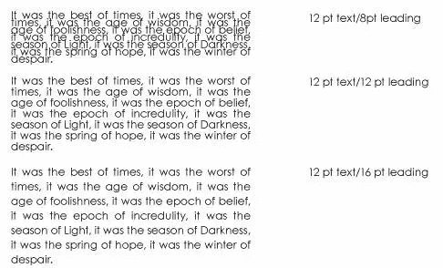
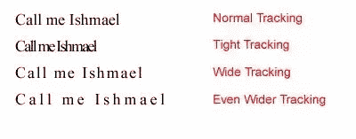
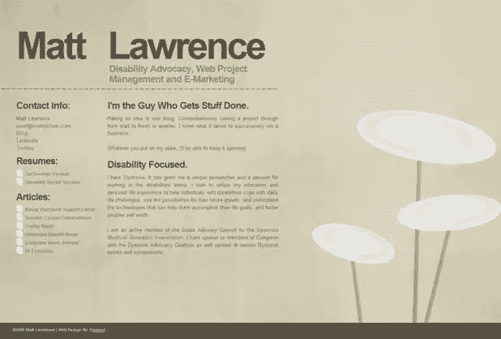
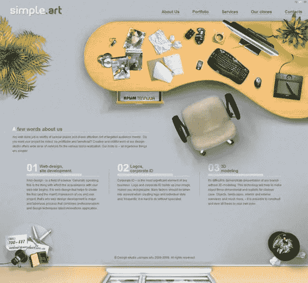
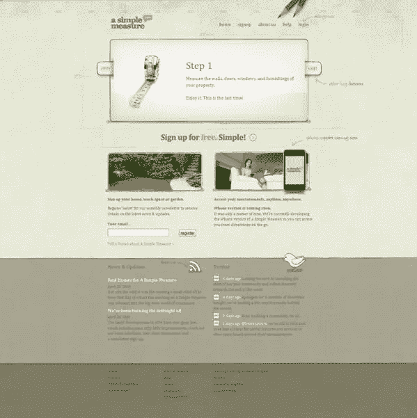
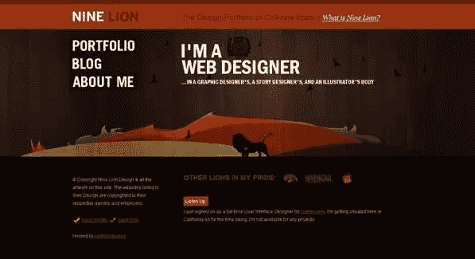

# 关注排版，第 4 部分:空间

> 原文：<https://www.sitepoint.com/focus-on-typography-part-4-space/>

看了一下[对比度](https://www.sitepoint.com/focus-on-typography-part-1-contrast/)、[层次](https://www.sitepoint.com/focus-on-typography-part-2-hierarchy/)和[大小](https://www.sitepoint.com/focus-on-typography-part-3-size/)，在我们关注排版的最后部分，我们正在看**空间**。

有很多方法可以给你的体型增加呼吸空间。空白或负空格有助于将注意力集中在单词上，而行距和字母间距有助于使文本更具可读性。让我们来看看每一个。

#### 空格

空白是页面上图形、文本元素和列之间的空间。这是布局和设计中最重要的原则之一。重要的是不要认为你的文字(或图形)周围的空间只是空白。空间实际上是一个独立的设计元素，用来创造一个经典或优雅的外观，正如我之前提到的，这是你作为设计师需要做出的决定。不要让你的页面一起掉下来。

一个空白空间很少的网页可能会显得过于繁忙，难以阅读和集中注意力。然而，一些简单的方法来增加你的类型周围的空白量，是使用

*   带项目符号的项目
*   标题和副标题
*   图像周围的填充
*   利润

#### 行距(行距)

通过改变行与行之间的间距，可以增加一段文字的可读性。如果行距太紧，分隔单词会变得很困难，而且看起来很累。在下面的示例中，您可以看到一段 12 磅的文本。随着行间距的增加，文本变得更容易阅读，并获得了良好的通风效果。

根据经验，您可能需要**增加**行间距:

*   如果你选择的字体有一个大的 x 高度，这是许多三衬线字体
*   如果你把字体反过来，例如深蓝色背景上的浅蓝色字体。

如果你的字体有一个非常小的 **x 高度**，你可能需要**减少**行距，因为这将自然地在行间创造更多的空间(x 高度是一行字体的基线和小写字母主体顶部之间的距离)。

来自维基共享资源

#### 字母间距(跟踪)

有些字体的连接字母设计得非常紧密。您可以设定字母之间的间距(传统上称为字距),使文本更具可读性。如果你使用“网页安全”字体，乔治亚，Verdana，Arial 等，你的正文，你通常可以保持字母间距不变。然而，你可能想改变标题和副标题之间的字母间距，以达到轻盈的感觉，并在不失真的情况下延长文本的长度。

谈到字母间距，没有硬性规定。你真的需要相信你的眼睛和自己的判断。如果字母看起来靠得太近，很可能就是这样。

#### 字距调整

字距调整有时会与字距调整混淆。它指调整两个特定字符的间距，以纠正视觉上不均匀的间距。这主要用于印刷设计。

让我们来看看一些网站的例子，它们很好地利用空间来创建干净、易读的设计。

马特·劳伦斯的博客主要以文本为主，但仍然通过使用大标题、小标题和大行距的正文来达到一种空灵感。右手边的背景图片与页面融为一体，增加了空间感。

Simpleart 在页面上的主图像周围留出足够的空间，并用装订线分隔三列文本。三根柱子下面的大空间给人一种很好的印象(在这种情况下)。

[日常沐浴&身体](http://www.dailybathandbody.com/)简单、干净、优雅。在标题的标志周围，在主图片和标题“每日纵情”之间有很多空间。标题本身使用宽跟踪，而正文易于阅读，具有良好的行距。

[一个简单的衡量标准](http://www.asimplemeasure.com/)是一个比这里显示的其他网站稍微繁忙的网站，但是它在一个页面上放置了大量的信息，同时保持了它的易读性和吸引力。页面的每一部分都可以自由呼吸，要么使用大的页边距，要么使用简单的图形，比如导航区的铅笔。

最后，为了表明空白不一定是白色的， [Nine Lion](http://www.nineliondesign.com/) 结合了彩色图形和大标题字体。使用边距将小正文与图形清晰地分开。

这就结束了我们对在你的网站上使用排版的四个基本原则的研究。我希望你已经发现它是有用的，并且可以看到通过使用几个，如果不是所有这些概念，你可以创建有吸引力的，易读的页面。

我想看看你的一些链接，这些链接指向你喜欢使用空白作为设计元素的页面。

**相关阅读:**

*   [关注排版，第一部分:对比](https://www.sitepoint.com/focus-on-typography-part-1-contrast/)
*   [关注排版，第二部分:层次结构](https://www.sitepoint.com/focus-on-typography-part-2-hierarchy/)
*   [关注排版，第三部分:尺寸](https://www.sitepoint.com/focus-on-typography-part-3-size/)

## 分享这篇文章