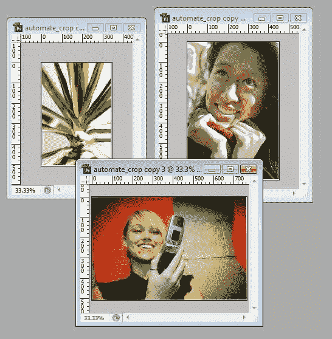

# 使用 Photoshop 中的“裁剪和拉直”命令加快工作流程

> 原文：<https://www.sitepoint.com/speed-up-your-workflow-with-the-crop-and-straighten-command-in-photoshop/>

Photoshop 附带了许多自动化流程，有助于加快繁重的工作。一个这样的命令是裁剪和拉直。比方说，你正在做一个设计项目，其中涉及到扫描几个项目，如照片，文件，纸片或其他物体。您可以将多个对象放在扫描仪上，而不是单独扫描每一个对象，Photoshop 会对每个对象进行裁剪、拉直，然后将它们分离成单独的图像。

此命令最适用于统一背景上的图像(如果您正在扫描，这不是问题),以及轮廓清晰的图像。所以下面是如何做到这一点:

1.打开包含要分离的图像的扫描文件。对于这个例子，我有一个展平的图像，上面有三张图片。你可以看到照片有些倾斜。

2.选择包含图像的图层。

3.(这是一个可选步骤)如果您不想处理扫描文件中的所有图像，请仅在您想要处理的图像周围绘制选区。

4.选择**文件>自动>裁剪和拉直**。Photoshop 发挥了它的魔力，在几秒钟内就产生了三个新的经过裁剪和拉直的图像。每个图像将在自己的窗口中打开。您的原始图像保持不变。

你可以想象，这是一个主要的时间节省。

**故障排除**
如果您发现裁剪和拉直命令错误地分割了您的一幅图像，请返回到您的原始扫描，并在图像和一些背景周围选择边框，然后在选择命令时按住 **Alt / Option** 。

这将告诉 Photoshop，只有一个图像应该从背景中分离出来，并防止分裂。

我经常使用这个命令，并发现它大大减少了我在裁剪、拉直和建立新文件上花费的时间。你在 Photoshop 中使用这个或任何其他自动命令吗？你会推荐其他什么人吗？

## 分享这篇文章