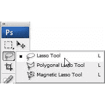
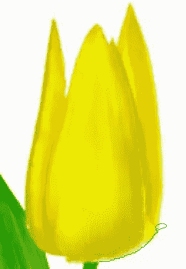
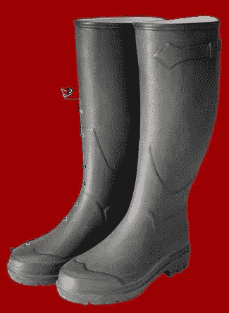

# Photoshop 中的选区，第 2 部分:手绘工具

> 原文：<https://www.sitepoint.com/selections-in-photoshop-freehand-tools/>

继续我们在 Photoshop 系列中的*选择，今天我们来看看**手绘**选择工具。这些工具可以让你做出比我们在本系列的上一篇文章《Photoshop 中的[选区，第一部分:几何工具](https://www.sitepoint.com/photoshop-selections-geometric-tools)中介绍的基本几何工具更复杂、更精确的选区。*

#### 套索工具

套索工具*是真正的*徒手工具，在进行快速、松散的选择时非常有用。如果你的手很稳，你也可以用它来做更复杂的选择。您可以在某个区域周围拖动套索工具()来描绘手绘选区，就像用铅笔绘图一样。

1.  在工具箱中选择套索工具或者按键盘上的 **L** 。
2.  在您想要选择的对象周围单击并拖动指针，就像您在用铅笔画线一样。
3.  完成你开始的那一行，放开鼠标。你的选择会生效。

#### 多边形套索工具

多边形套索工具()，设置锚点并创建直边选区。

1.  单击工具栏中的工具或按下 **Shift L** 来循环使用每个套索工具，直到你找到多边形套索。
2.  要绘制直线段，请在想要开始的位置单击一次，然后将指针移动到想要第一条直线段结束的位置，然后单击。以这种方式继续点击并移动物体，直到到达起点。

#### 工具组合

多边形套索工具的优点是你可以得到一些可爱的直线段。缺点是你*只有*得到直段！您可以通过使用快捷键在两者之间跳转来改进您的选择。这项技术需要一点实践来掌握，但是为了加快你的工作流程和改进你的选择，学习如何做是值得的。

注意:不要忘记在选择的时候放大，这样你可以清楚地看到你在做什么。按住 *Ctrl* 键(Windows)或 *Cmd* 键(Mac)并按+或–放大和缩小您的文档。

1.  Select the Lasso tool (). Starting on the yellow part of the flower, I’m going to drag the lasso, freehand, around the curve, tracing the edge as closely as possible. **Do not release the mouse button.**

    

2.  按住 **Alt** (Windows)或**选项** (Mac)，然后松开鼠标按钮，这样套索指针就会变成多边形套索形状()。**不要松开 Alt 或 Option 键。**
3.  Clicking along the right side of the flower to place anchor points, follow the contours of the flower. Be sure to keep the **Alt** or **Option** key held down as long as you want the Polygonal Lasso.

    选区边框像锚点之间的橡皮筋一样向外延伸。

4.  当您到达花的弯曲边缘时，按住鼠标按钮，然后释放 Alt 或 Option 键。指针再次显示为套索图标。
5.  继续绕着花走，直到你回到起点，在套索和多边形套索之间交替。

#### 磁性套索工具

磁性套索工具()几乎就像是其他两种套索工具的组合，当您想要选择的区域与其周围的区域之间有良好的对比度时效果最佳。

当您使用磁性套索工具绘图时，边框会自动与对比区域之间的边框对齐。您也可以通过偶尔单击鼠标在选区边框中放置锚点来控制选区路径。

1.  选择磁性套索工具()，隐藏在套索工具()下面。
2.  Click once along the edge of the object, and begin tracing the outline by moving the magnetic lasso pointer around the edge, staying fairly close to the edge as you move. Do not hold down the mouse button.

    接下来是真正酷的部分。尽管你可能无法 100%精确地追踪，磁性工具*会将*吸附到对象的边缘，并自动添加紧固点。

    

3.  如果您认为工具没有足够紧密地跟随边缘，您可以通过单击鼠标按钮在边框中添加您自己的紧固点。您可以根据需要添加任意数量的额外紧固点。您也可以通过对每个要删除的锚点按 Delete 键来删除最近的紧固点。然后，将鼠标移回最后一个剩余的紧固点，并继续选择。
4.  当您再次到达起始点时，双击鼠标按钮使磁性套索工具关闭选区。或者，将磁性套索移到起点上并单击一次。

这是 Photoshop 中套索工具的概述。如你所见，它们各有各的用途，也可以结合起来有效使用。

你以前试过套索和多边形工具组合吗？你使用套索工具进行大部分的选区工作吗？还是你更喜欢用其他工具在 Photoshop 中进行选择？接下来，我们将看看魔杖和它的朋友们。

#### 相关阅读:

*   [Photoshop 中的选区，第 1 部分:几何工具](https://www.sitepoint.com/photoshop-selections-geometric-tools)
*   【Photoshop 入门

## 分享这篇文章