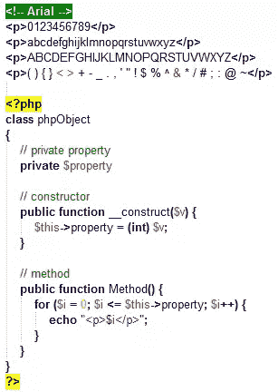
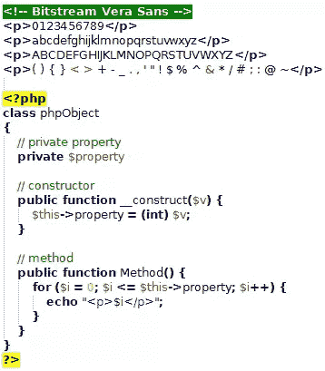
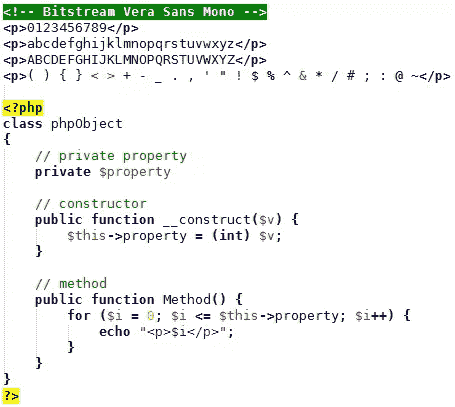
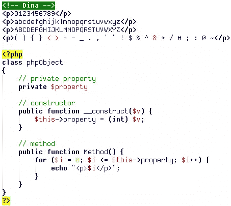
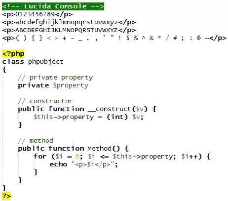
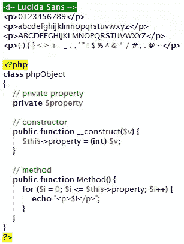
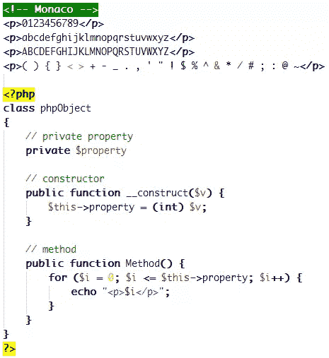
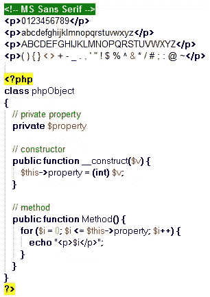
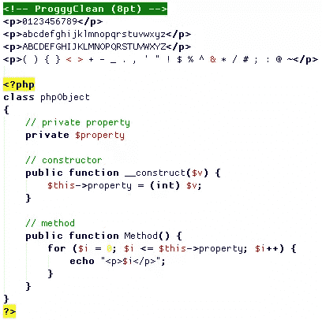

# 10 种最佳编程字体

> 原文：<https://www.sitepoint.com/top-10-programming-fonts/>

这篇文章写于 2009 年，至今仍是我们最受欢迎的帖子之一。如果你热衷于学习更多关于字体的知识，你可能会发现这篇关于 IcoMoon 的文章非常有趣。

许多程序员对他们的文本编辑器充满热情。他们花在选择最佳字体和配色方案上的时间比装饰房子的时间还要长。编辑字体是一个非常个人化的选择，考虑到花在屏幕上的时间，它需要是程序员感到舒服的东西。没有硬性规定，但是:

*   位图/光栅字体往往在屏幕上呈现得更好
*   等宽字体通常提供更好的字符识别，但是
*   比例字体占用更少的屏幕空间，对眼睛来说更舒服一些。

(给 SciTE 用户的提示:按 Ctrl+F11 在比例字体和等宽字体之间切换。我希望更多的编辑提供这种便利。)

对于那些坚决拒绝相信 Courier New 之外的任何东西的人，这里有一个伟大的程序员字体列表。除了一个例子之外，所有的例子都使用 10 磅的文本，但是它们在其他尺寸下可能看起来更好。

## 1.天线

作为 Windows 的核心字体之一，Arial 经常被忽视，但它是一种清晰易读的字体。区分大写字母 i /小写字母 L 和嵌套的单引号/双引号有点困难，但许多比例字体都是如此。大多数系统都安装了它，但是 SourceForge 也提供了 Arial。

## 2.Bitstream 将在没有

Bitstream Vera 是为 GNOME 项目开发的免费字体，但也可以在其他平台上使用([下载 Bitstream Vera](http://ftp.gnome.org/pub/GNOME/sources/ttf-bitstream-vera/1.10/) )。

这是一个很好看的字体，就我个人而言，我更喜欢它…

## 3.Bitstream Vera 不带 Mono

这是一个等宽版本的比特流 Vera Sans，许多程序员会喜欢它。我觉得有点宽，但是字符肯定更容易识别。它可以在比特流 Vera Sans 下载上面。

作为一种选择，你可能更喜欢德雅武无单色；它基于比特流 Vera，但提供了更广泛的角色范围。

## 4.控制台(s)

Consolas 是一种相对较新的微软字体，安装在 Vista 或[中，可以单独下载](http://www.microsoft.com/DOWNLOADS/details.aspx?familyid=22E69AE4-7E40-4807-8A86-B3D36FAB68D3&displaylang=en)。这是一种非常清晰紧凑的等宽字体，正被越来越多的开发者使用。

## 5 .新浪

Dina 是我最喜欢的等宽字体，为了清晰起见，它很难被击败([下载 Dina](http://www.donationcoder.com/Software/Jibz/Dina/) )。它有 8、9 和 10 磅的文本大小，在任何系统上看起来都很棒。

## 6.Lucida 控制台

微软喜欢 Lucida 控制台:是记事本的首选字体，是死亡蓝屏！它让我想起了 Courier New 的无衬线版本，但看起来肯定更好。

## 7.露茜达·桑

如果 Lucida 控制台对您的口味来说有点太粗，请尝试 Lucida Sans。该字体已随 Microsoft Windows 和 Office 提供多年，是一种紧凑、实用的字体，看起来非常有吸引力。

## 8.摩纳哥

Monaco 在 Mac 上诞生，是该平台上最受欢迎的字体之一。我发现它在 Windows 上有点太花哨了，但许多开发人员不会同意。

## 9.无衬线女士

也许这有点争议，但这是我默认选择的字体。MS Sans Serif 是在 Windows 1.0 中引入的，以前被称为“阖闾”。这是默认的微软系统字体，直到他们在 Windows 2000 中用 Tahoma 取代了它。这种字体也用于早期的 MS Office VBA 环境中，这也是我对它过于熟悉的地方！

字体类似于 Arial，也有同样的问题，但我觉得它更清晰一些。虽然我几次试图离开无衬线女士，但最终我总是会回来。

## 10.Proggy 字体

Proggy 集合包含小的等宽位图字体，使您可以在屏幕上查看的代码量最大化([下载 Proggy](http://www.proggyfonts.com/index.php?menu=download) )。它是为程序员设计的，所以不会出现其他字体的字符问题。对于记事本的粉丝来说，还有一个版本在字体本身中提供了粗体标点和括号。

我是否列出或错过了您选择的编程字体？你坚持用 6pt Wingdings 编程吗？欢迎所有评论！

对本文的评论已经关闭。有关于编程的问题吗？为什么不在我们的[论坛](https://www.sitepoint.com/community)上问呢？

## 分享这篇文章