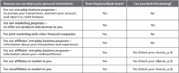

# 建立更好的隐私政策

> 原文：<https://www.sitepoint.com/build-a-better-privacy-policy/>

您会阅读*您使用的*网站的*的*隐私政策吗？我会和盘托出，承认我有时会略读。根据卡内基梅隆大学的一个团队的研究，一个普通网站的隐私政策，被一个普通阅读速度的人阅读，大约需要 10 分钟。通过考虑普通人访问网站的数量，他们得出结论:*如果*你要完整阅读每一条隐私政策，你每天将花费 30-50 分钟——或者每年 181-304 小时。*什么？！*

考虑到您的身份可能面临的风险，了解网站的隐私政策及其对您的影响无疑是非常重要的，尤其是如果这是一个存储您的真实姓名、地址或信用卡的网站，但是谁有那么多时间呢？最终用户许可协议(EULAs)或担保怎么样？

卡内基梅隆大学的研究人员建议，如果用户发现浏览政策并挑出最有用的部分更容易，那会更好——这样人们可能会获得更多信息，至少有机会了解正在发生的事情。我们如何实现这一目标？嗯，本周公布的另一项研究结果表明，改变我们展示信息的方式可能就足够了。代表美国联邦贸易委员会的研究人员测试了一家银行的个人信息共享政策的各种不同布局，即详细说明他们如何以及为什么可能选择与第三方共享您的详细信息的文件，并发现展示这些信息的最佳方式是以表格的形式，清楚地列出在什么情况下发生了什么样的信息共享。当信息以这种方式表达时，读者更有可能正确回答关于每家银行政策内容的问题。亲自查看该研究( [PDF](http://www.ftc.gov/privacy/privacyinitiatives/Levy-Hastak-Report.pdf) )。

这看起来很明显，对吧？我们多年前就已经知道，在网络上，人们发现可扫描的文本最容易阅读——也就是说，文本被分成小块，易于管理，在必要的地方加上标题或要点。然而，当涉及到一大堆法律术语时，这个好建议似乎就飞出了窗外。公平地说，我们不愿意改变我们的律师朋友告诉我们放在那里的东西，但我们把所有重要信息隐藏在一大堆厚得不合理的文本中，这对我们自己*和*我们的用户是一种伤害。为什么我们仍然让隐私政策如此难以使用？

所以这是我对自己的挑战，我希望你能加入我:下一次我需要编辑或创建一个新的隐私政策，EULA 或一些其他类型的密集法律术语，我会尽我所能以一种更有用、更可读的方式格式化那个政策。现在是我们都努力明确我们用户的权利和义务的时候了，他们不应该花费大量时间来了解我们计划如何处理他们的个人信息。

你注重你的法律文本的可用性吗？你要做些什么来帮助用户更好地理解？

## 分享这篇文章