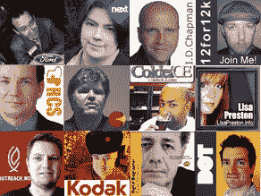

# 如何为你和你的品牌创造合适的形象

> 原文：<https://www.sitepoint.com/branding-twitter-avatars/>

与公司或企业的头像相比，个人头像很简单:裁剪一张你喜欢的照片，就这样。人家喜不喜欢不重要。那个头像代表你是谁，既然你不那么在乎品牌，你就不需要担心你正在使用的社交网络中与你的名字相关联的那张小图片里有什么。此外，如果你只是出于个人原因使用社交网络，不时更换头像会很有趣，也会吸引你的追随者的注意。

然而，公司的虚拟形象在某种程度上更加复杂。我总是建议**反对**使用标志作为头像。他们很冷漠，暗示使用他们的人不是来交流的，而是来销售的。

社交网络中的人们对人脸的反应比对图标头像的反应更好。比起企业标志，更信任企业背后的面孔是人之常情。更有甚者:统计数据显示，相比其他任何东西，人们更倾向于点击描绘人脸的横幅。如果横幅广告是这样，那么社交网络在逻辑上也是这样，对吗？(参见"[网络品牌的五大黄金法则](http://www.dynamiclogic.com/DL_5gold_rules.pdf)"–pdf)

那么，如果你的关注点不完全是个人的，你应该用什么作为你的头像呢？公司标志是一个很好的品牌工具，但在社交网络上，比如 Twitter，它就不合适。说到品牌,“消费者”只是更想知道他们在和谁说话。

在企业品牌形象中展示自己的理想方式是将人脸和企业标志结合起来，但你必须做得正确。例如，[@ Women Council](http://twitter.com/WomensCouncil)有一个带有人脸和标志的公司头像，但妇女委员会房地产经纪人背后的人是谁仍然是个谜。

##### 面孔和标志——一种理想的方法

幸运的是，有一些很好的例子来说明如何使用人脸和标志的组合来创建一个好的、品牌一致的和可识别的头像。

首先，、[贡纳·斯凯德](http://twitter.com/JesusTweeter)、[高德·维斯弗洛克](http://twitter.com/GordWeisflock)、[大卫·佩特里克](http://twitter.com/clarocada)、[圆点设计](http://twitter.com/dot_design)(谁没有名字，但至少他有脸)。当然还有很多，但我花了一个多小时才找到这些，所以如果你找到了，请随意分享。至于我自己的头像…今天得换一个，才不会显得虚伪。:)

这个故事的寓意是:在各种网络上制作社交档案的公司中，没有多少知道如何在社交媒体中进行品牌推广(我这里指的不仅仅是 Twitter，我只是把它作为一个例子)。传统的展示商标和希望最好的方法不会吸引追随者。人们厌倦了信托公司和大公司不停地推销它们。如果有什么不同的话，他们希望与能够回答真实问题的真实公司员工联系，就 Twitter 而言，是实时联系。不知何故，没人能想象耐克的标志会如此生动或温暖，以至于能引发一场对话或倾听一次抱怨。

## 分享这篇文章