# 用 OXID eShop 开始网上销售的六个简单步骤

> 原文：<https://www.sitepoint.com/six-steps-start-selling-online/>

 ****##### 一键购物** 

在过去的几年里，网上购物越来越受全世界消费者的欢迎。原因很容易理解:电子商店容易进入，24/7 开放，通常比实体商店提供更低的价格(和更多种类的商品)，并有额外的奖励，如个性化推荐、慷慨的退货政策和安全购物保证。这种受欢迎程度得到了统计数据的证实:美国人口普查局估计，2008 年第三季度，电子商务的零售额为 344 亿美元，高于 2006 年的 275 亿美元。

随着电子商务多年来的发展，寻求建立网上业务的商家可用的工具也在不断发展。现代电子商务解决方案如此复杂，以至于设置它们最多需要几次点击和一些后端数据输入；通常这个软件可以(并且将会)为你做所有其他的事情。这种易用性对中小型商家来说是一个福音，他们中的许多人都是第一次进入网上市场，并且正在寻找一个简单的系统，使他们能够以最少的麻烦建立和经营一个网上商店。

如果你是这些商人中的一员——个人，小企业，甚至大企业——并且你一直在考虑通过互联网把你的产品带给新的客户和市场，那么这篇文章就是为你准备的。在这篇文章中，我将讨论如何使用一种新型的电子商务解决方案快速、轻松地建立您的在线商店:一种开源的、社区驱动的购物车系统，称为 OXID eShop。进来吧，让我们开始吧！

##### 介绍 OXID eShop

让我们从基础开始——到底什么是 OXID eShop？

OXID eShop，用其官方网站的话说，是一个“模块化的、最先进的、基于标准的”在线商店购物车系统。它使用 PHP 和 MySQL 编写，为店主创建和维护基于网络的商店提供了一个框架，允许他们定义产品目录、设置价格和支付方式、管理库存和响应订单。OXID eShop 在为各种规模的企业提供服务方面也有着悠久的历史，因此久经考验，功能丰富。

以下是主要特性的快速列表:

*   自定义付款和运输方式:OXID eShop 允许在确定付款和运输方式时进行大量微调。商店管理员可以轻松支持各种支付选项(包括信用卡、货到付款和 PayPal)，允许或禁止每个国家或用户组的支付条件，并定义运费计算的自定义规则。
*   促销和折扣:OXID 商店管理系统包括在特定时间段(例如圣诞节销售)以及特定用户组(例如 VIP 会员)设置折扣的功能。也支持折扣券。点评:秉承 Amazon.com 等网站的精神，OXID eShop 通过允许用户对他们购买的产品发表评论来利用社区的智慧。这为其他用户以及产品制造商提供了有用的反馈。
*   客户沟通:良好的沟通是客户忠诚度的关键，OXID eShop 包括许多工具来协助这一过程。店主可以通过选择加入的简讯让用户了解新产品，允许用户在留言簿上评论服务和产品，或者在主店面页面上显示商店新闻。还有一个价格提醒机制，允许商店在价格低于特定限制时通知用户。

同样值得注意的是，OXID eShop 有三种版本:企业版、专业版和社区版。本文中使用的社区版是根据 GNU 通用公共许可证免费提供给用户的。另外两个版本是用于关键任务的商业软件包；它们提供额外的功能，包括供应商支持、担保、赔偿和更多商业利益。

##### 安装和配置软件

要开始使用 OXID eShop，您需要首先确保您拥有成功安装该产品所需的一切。您需要一个带 PHP 的 Apache web 服务器和一个 MySQL 数据库服务器。

您可以在 OXID 网站上找到完整的需求列表，包括所需 PHP 扩展列表。一旦你确认你的主机满足所有安装要求，从[官方网站](http://www.oxid-esales.com/)下载一份 OXID eShop 社区版。将文件传输到服务器上 web 服务器根目录下的某个位置，方法是上传包，然后在服务器上将其解包，或者先解包，然后再上传所有单个文件。

下一步是创建一个 MySQL 数据库来存储所有应用程序信息和一个数据库用户帐户，该帐户将用于访问 OXID eShop 数据库。如果您有权访问命令行，则可以在服务器上运行以下 SQL 命令；或者你可以使用一个工具来运行它们，比如 web 主机通常提供的[phpMyAdmin](http://www.phpmyadmin.net/)；否则，您的 web 主机提供的管理面板应该包含适当的控件。

要创建数据库运行:

```
CREATE DATABASE oxid;
```

创建一个 MySQL 用户帐户，并授予仅访问该数据库的权限，这是一种安全预防措施，可以确保系统上的其他 MySQL 数据库保持安全，即使您的 OXID 系统的安全性受到损害。以下命令将创建一个名为“`oxid`”的用户，密码为“`sh0pp3r`”:

```
GRANT ALL ON oxid.* TO oxid@localhost IDENTIFIED BY 'sh0pp3r';
```

创建了数据库和用户帐户后，就可以设置所有需要的表了。这比听起来简单 OXID eShop 安装程序将为您完成所有工作。你所需要做的就是打开你的网络浏览器并导航到你的 OXID 安装的根文件夹。您应该会看到这样一个页面:

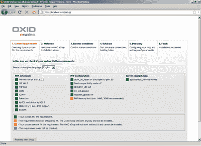

假设您的系统满足所有要求，安装是一个点击过程。点击**继续设置**按钮继续。下一步，选择您的国家并点击**开始安装**按钮:

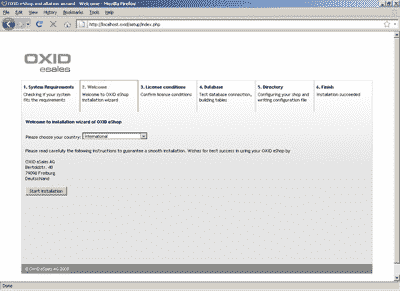

然后您将被要求接受 OXID 许可的条款。完成后，系统将提示您输入数据库连接信息。输入您的 MySQL 服务器的值，以及之前创建的用户凭证，但是确保您选择了选项**不要安装 demodata** 。这阻止了安装程序在系统中安装测试数据——我们很快就会添加我们自己的测试数据！

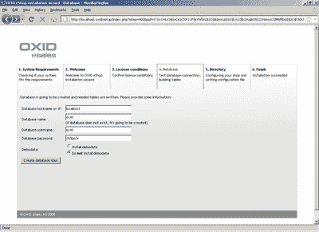

单击 Create database now 按钮，OXID 安装程序将开始创建必要的数据库表。在最后一步中，指定您的 OXID 安装的 HTTP 和文件路径(这些应该已经为您填写好了):

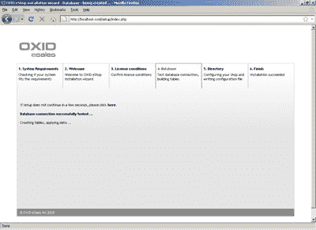

确保您选择了**安装后删除安装目录**选项，以便安装程序删除安装文件，因为这可以防止未经授权的用户在以后重置您的辛苦工作。此外，在提交表单之前，请确保指定的临时目录存在并且可由您的 web 服务器写入，或者使用必要的权限创建它。不这样做将会产生安装错误。有很多方法可以做到这一点，这取决于你的主机环境是如何设置的；请咨询您的托管服务提供商，或者访问 G-Loaded 网站了解[各种方法的概述](http://www.g-loaded.eu/2008/12/09/making-a-directory-writable-by-the-webserver/)。点击**保存并继续**按钮继续。

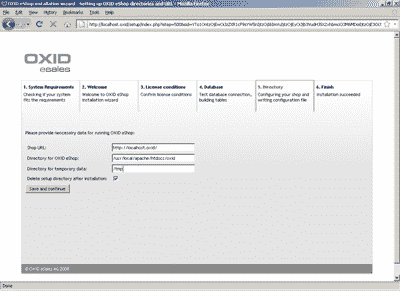

最后，如果已经成功安装和配置了 OXID eShop，您应该会看到与此类似的图像:

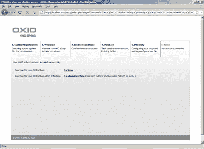

就这样，你完成了！接下来，我们将了解如何开始设置产品列表。

##### 创建 eShop 产品类别

在大多数网上商店里，产品被分类排列，这样购物者可以很容易地找到它们。OXID eShop 也支持这种分类。在这一步中，您将学习如何定义产品类别，作为实际列出销售产品的前奏。

首先，访问位于`http://yourservername/admin`的 OXID eShop 管理面板(假设您已将 OXID 安装到您的 web 服务器的文档根目录下)，并以管理员身份登录。在上面的最终配置屏幕上，还有一个到管理面板的链接。

您将看到一个登录表单；以管理员身份登录，密码为 admin，您应该会看到类似下图的屏幕:

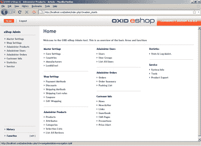

选择**eShop Admin>Administer Products>Categories**菜单，会出现一个定义产品类别的表单，如下图所示:

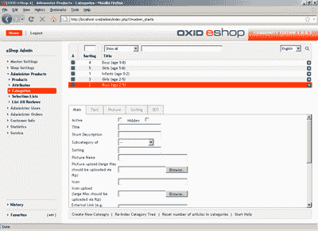

比方说，我们的商店将出售各种各样的儿童玩具，它们将按年龄适宜性进行分类。因此，我们的产品可以分为以下几类:

*   婴儿(0-2 岁)
*   男孩(2-5 岁)
*   女孩(2-5 岁)
*   男孩(5-8 岁)
*   女孩(5-8 岁)
*   诸如此类…

在我们添加任何内容之前，请确保在右上角将语言设置为英语。要定义这些类别，请为每个类别设置一个标题并将其标记为活动。您也可以添加可选的描述。一旦类别被定义，它将出现在页面的顶部。要创建新类别，请使用页面底部的**创建新类别**链接。

定义类别时的一些有用提示:

*   您可以通过将每个新类别分配给父类别来创建子类别。但是要注意不要创建太大的类别树，因为你的访问者会发现它令人困惑并且难以浏览。
*   您可以使用每个类别的“图片”选项卡将图像或图标附加到每个类别。这有助于让你的商店更具视觉吸引力。
*   您可以通过设置排序字段的值来定义类别的显示顺序。较小的值首先排序。

关于如何处理产品类别的更多[信息可在 OXID 手册中找到。](http://www.oxid-esales.com/resources/help-faq/eshop-manual/primary-settings-categories)

##### 添加待售产品

一旦定义了产品类别，下一步就是用实际的产品填充它们。这是通过使用 eShop**Admin>Administer Products>Products menu**来完成的，它提供了一个选项卡式表单来输入产品记录。

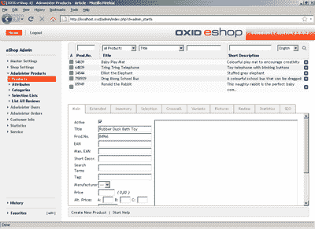

在显示的各种选项卡中，四个最重要的选项卡如下:

*   **Main**: allows you to set basic information for each product, such as name in the product catalogue, the internal product number (SKU), search tags, the price, and both short and extended descriptions. You can also specify which category this product should appear in.

    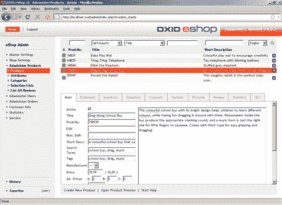

*   **Extended**: lets you define product attributes, including its dimensions and weight. You can also specify whether the product is eligible for free shipping, and define an external URL (such as the manufacturer’s web site) for the product.

    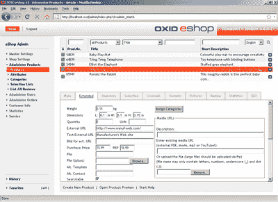

*   **Inventory**: enables you to specify how many units of the item are available in stock, and define an email alert when inventory falls to a particular limit. You can also specify volume discounts for the products, either in absolute or percentage terms.

    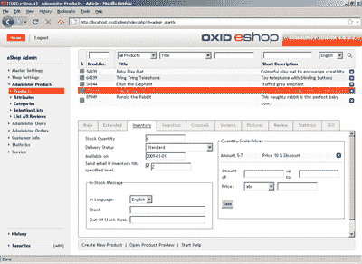

*   **Pictures**: lets you upload pictures of the product. This is a key tab, as users will rely on these pictures when deciding whether or not the product fits their needs. OXID eShop allows you to upload thumbnail images, regular product pictures, and magnified (zoomed) product images, so you can give customers as much visual information as possible.

    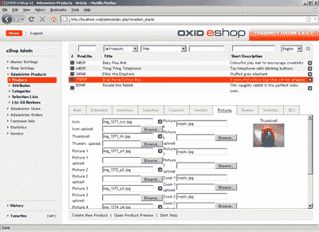

一旦您完成保存产品，它将出现在页面的顶部。您可以通过页面底部的**创建新产品**链接创建新产品列表。要查看结果，请访问商店主页，选择适当的类别，然后选择产品。

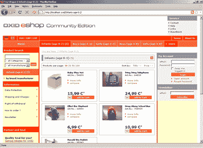

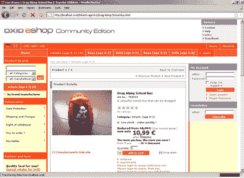

使用产品时的一些有用提示:

*   确保您的产品分类正确，并为每个产品输入一些搜索词，以便客户可以轻松找到它们。您还应该利用 OXID 的多类别系统，它允许您在多个类别中列出一个产品。
*   上传尽可能多的产品图片，让顾客清楚地知道他们要买什么。
*   使用“交叉销售”选项卡将两个或多个产品链接在一起，并使用“统计”选项卡查看特定产品的销售情况。

关于产品管理的更多[信息，请参见 OXID 手册。](http://www.oxid-esales.com/resources/help-faq/eshop-manual/primary-settings-products)

##### 定义付款和运输选项

定义好产品后，您还需要设置付款和运输方式。在**网店管理>店铺设置>支付方式**下查找，你会发现一个预定义支付方式的列表。

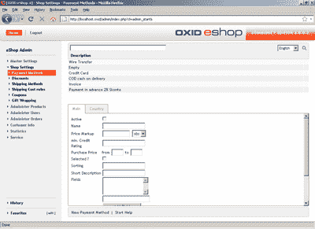

您可以选择其中任何一个并移除**活动**标志以禁止它。要设置新的支付方式，选择页面底部的**新支付方式**选项，显示输入表单。通过指定名称来添加新的付款方式，并指明使用此方式时是否应加价以及加价多少。

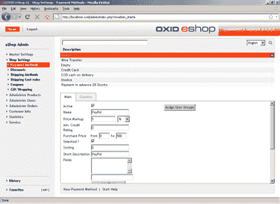

还可以指定这种付款方式适用的购买金额，例如，您可能希望仅允许电汇作为超过 250 个货币单位的付款方式，还可以定义排序顺序和默认付款方式。

您还必须指定该支付方式适用的用户组和国家。这可以通过在**分配用户组和国家**选项卡中选择它们来完成。如果您的国家未列出，请访问**网店管理员>主设置>国家**进行配置。

接下来，您需要访问**网店管理>店铺设置>运费规则**下的管理页面，配置用于计算运费的规则。要设置新的运输成本规则，选择页面底部的**创建新的运输成本规则**选项以显示输入表单。通过指定描述性名称和激活此规则的条件(例如，重量超过 2 千克)以及此条件的装运数量来添加新规则。您还可以指定此成本规则是适用于每个购物车还是每个产品。

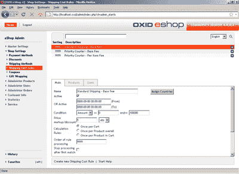

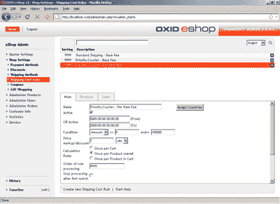

运费规则也可以分配给特定的类别、产品或用户组。因此，举例来说，你可以对婴儿类的商品降低运费，或者对经常购物的顾客降低运费。这些特殊规则可以在**运费规则**表单的**产品和用户**选项卡中设置。

定义完运输规则后，最后一步是将这些规则附加到运输方式上。访问**网店管理>店铺设置>送货方式**下的管理页面，选择页面底部的**创建新的送货方式**选项显示输入表单，设置您的送货方式。

请注意，为了让使用者可以使用运送方式，必须指定至少一个运送成本规则、至少一个国家，以及至少一种付款方式。

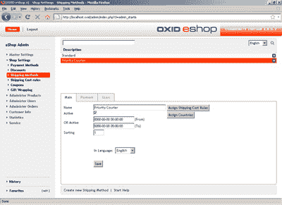

OXID 对运输和支付方式的实施是基于规则的，需要通读手册才能完全理解。鉴于它的配置相当强大和灵活，请准备好花几个小时让它按照您想要的方式工作。幸运的是，OXID 手册中有很多例子可以帮助你——看看[运费基础知识](http://www.oxid-esales.com/de/resources/help-faq/eshop-manual/shipping-costs-basics)和[付款方式基础知识](http://www.oxid-esales.com/en/resources/help-faq/eshop-manual/payment-methods-basics)了解更多信息。

##### 定义全局 eShop 设置

你快完成了！现在剩下的就是为你的网店定义一些全局设置。这些可以在**网店管理>主设置>核心设置**下找到。此页面上的每个选项卡都允许您控制系统的不同方面。虽然大多数项目可以保留默认值，但您可能需要特别注意**主**选项卡，它允许您输入在线商店的基本信息:商店名称、地址和联系信息、电子邮件信息参数以及银行路由信息。

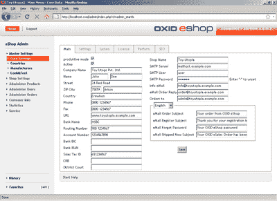

在**设置**选项卡中是全局商店设置，例如每页显示的产品数量、产品搜索算法、商店默认语言、产品图像尺寸和其他界面元素。除了设置默认的商店语言(在**设置>语言**中)和添加或更改你的商店可以接受的默认货币设置(在**设置- >其他设置**中)之外，你可能应该让这些都保持原样。

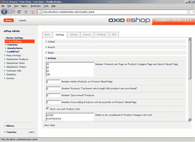

最后，访问 **SEO** 标签，为你的店铺设置一个标题。通常，这将是您的商店的名称，以及非常简短的描述。这些信息有助于使你的商店在各种网络搜索引擎上可见。

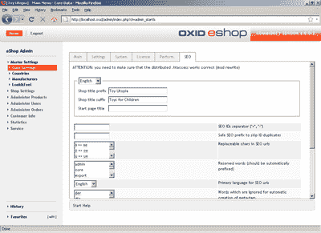

每个在线商店在数据保护、退货、运费和安全方面都有不同的政策。考虑到这一点，OXID eShop 允许您定制其部分页面，以便您可以清楚地陈述您商店的在线政策。为此，请访问**网店管理>客户信息> CMS 页面**选项卡，在这里您会看到静态模板列表。

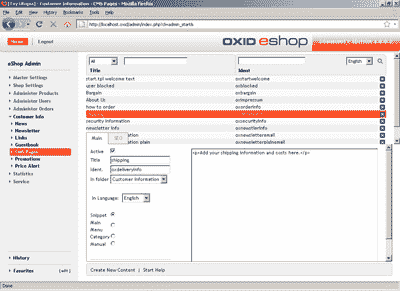

每个页面模板的标题都是不言自明的:选择它可以使用在线编辑器定制页面上的文本。您的更改将立即反映在商店主页上。您还可以通过移除特定模板的**活动**标志来禁用它们。关于[改变静态页面模板](http://www.oxid-esales.com/en/resources/help-faq/eshop-manual/cms-pages-basics)的更多信息可以在 OXID 手册中找到。

##### 处理订单

此时，您的商店已经完全配置好，可以为顾客服务了。但是还有最后一点你应该知道，也可能是最重要的一点:处理订单！OXID eShop 的管理面板包括一个功能齐全的订单处理系统，可以在 **eShop 管理>管理订单>订单汇总**下找到。

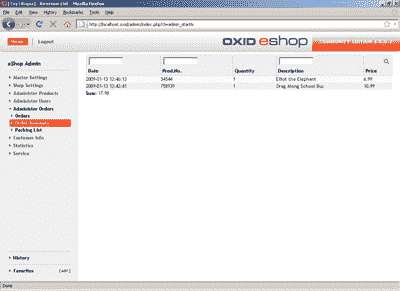

选择任何订单都会弹出购买请求的详细信息，包括价格、送货和账单地址以及产品详细信息。选择 **Ship Now** 命令更改订单状态(可选地向客户发送电子邮件)，同时使用 **Create PDF** 命令生成订单的 PDF 版本，可以打印并随货物一起发送(也支持 XML 导出)。

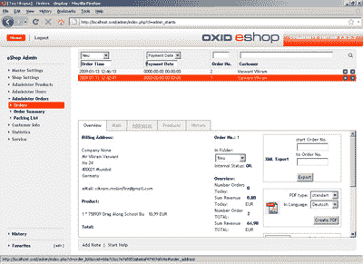

订单管理模块还可以帮助打印装箱单:使用**网店管理员>管理订单>装箱单**命令为未结订单自动生成可打印的装箱单。

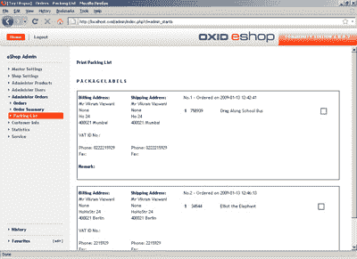

正如本文所展示的，OXID eShop Community Edition 提供了一个健壮的框架，您可以在这个框架上建立自己的在线商店。最精彩的部分？免费的！你还在等什么？

## 分享这篇文章**