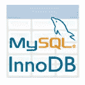

# MySQL:InnoDB 表的利与弊

> 原文：<https://www.sitepoint.com/mysql-innodb-table-pros-cons/>

在我们查看了 [MyISAM 表](https://www.sitepoint.com/mysql-myisam-table-pros-con/)之后，今天我们来看看 InnoDB 表。

InnoDB 不如默认的 MyISAM 表类型出名。但是，有几个原因可以解释为什么它是您的 web 应用程序的更好选择。

**1。数据完整性和外键约束**
外键在一个表中的列和另一个表中的列之间建立关系。例如，您可以创建一个图书馆应用程序，在其中可以将图书借给成员。外键约束将确保在图书被签出之前成员已经存在。类似地，除非用户的所有书籍都被归还，否则无法删除用户。

有关外键和自动化数据库的更多信息，请参考[如何使用 MySQL 外键加快数据库开发](https://www.sitepoint.com/mysql-foreign-keys-quicker-database-development/)。

**2。事务**
InnoDB 表支持事务。事务允许将多个 SQL 命令视为一个可靠的单元。

考虑一个银行应用程序，您要将资金从一个帐户转移到另一个帐户。只有当两个账户都被成功修改时，交易才会被提交。如果有任何失败，数据库将回滚到以前的状态。

此外，InnoDB 表可以很好地从崩溃中恢复。MySQL 将分析日志文件，以确保数据是准确的，因此没有必要修复表。

**3。行级锁定**
InnoDB 使用行级锁定，而不是表级锁定。如果插入、更新或删除某一行，则只有对同一行的更改会被挂起，直到该请求完成。使用 InnoDB，接收更新多于选择的表可能会更快。

## InnoDB 表的缺点

在很多情况下，InnoDB 可能并不合适。

**1。复杂性增加**
创建 InnoDB 表并不比 MyISAM 更复杂，例如

```
 CREATE TABLE employee ( 
id smallint(5) unsigned NOT NULL, 
firstname varchar(30), 
lastname varchar(30), 
PRIMARY KEY (id)
) ENGINE=InnoDB; 
```

然而，设计具有外键关系的数据库确实需要更多的工作。数据库新手会发现 MyISAM 更容易，因为它的特性更少。

**2。无全文搜索**
InnoDB 表不支持全文搜索；针对多个列匹配一个或多个关键字并不容易。

**3。性能较慢**
如果您的应用程序主要是选择数据，并且性能是优先考虑的，那么 MyISAM 表通常会更快，并且使用更少的系统资源。

## 应该用 InnoDB 吗？

如果您需要创建一个可靠的数据驱动的 web 应用程序，InnoDB 是最佳选择。在许多方面，InnoDB 是比 MyISAM 更好的默认选择:

1.  除非您有一个非常大或非常常用的系统，否则速度差异可能可以忽略不计
2.  全文搜索可以通过其他方式实现，例如更复杂的 SQL 或服务器端搜索算法。

InnoDB 无疑是网上商店、金融应用或任何数据完整性至关重要的项目的最佳选择。定义表更加复杂，但是您的应用程序将更加健壮，并且可能需要更少的服务器端代码。

注意，您可以在同一个数据库中混合使用不同的表类型。实际上，如果坚持使用单一的表类型，可能会减少开发人员的困惑。

另请参见:

*   MySQL:MyISAM 表的利与弊
*   [如何安装 Apache](https://www.sitepoint.com/how-to-install-apache-on-windows/)
*   [如何安装 PHP](https://www.sitepoint.com/how-to-install-php-on-windows/)
*   [如何安装 MySQL](https://www.sitepoint.com/how-to-install-mysql/)
*   [如何使用 MySQL 外键加快数据库开发](https://www.sitepoint.com/mysql-foreign-keys-quicker-database-development/)

您会考虑在下一个应用中使用 InnoDB 表格吗？

## 分享这篇文章