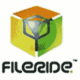
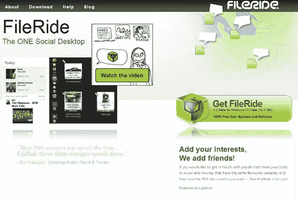
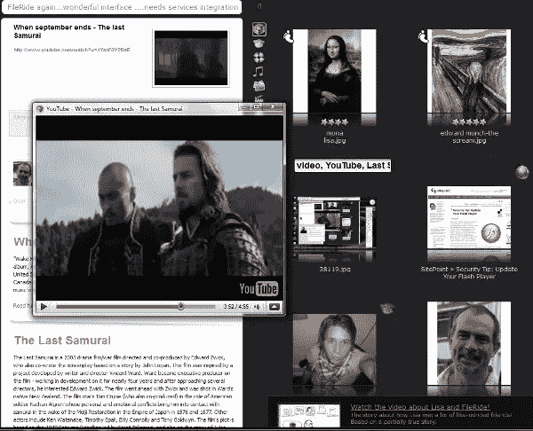
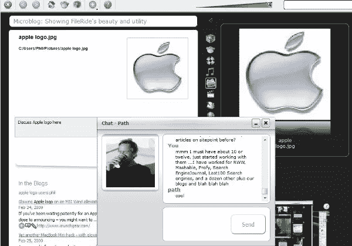
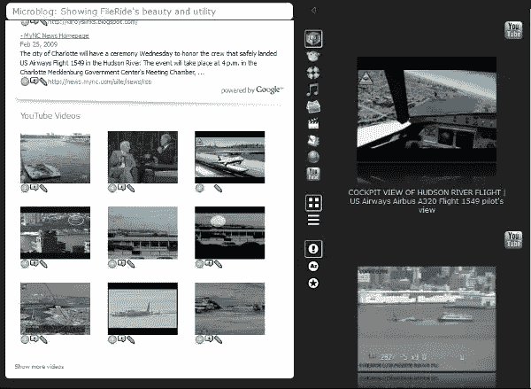
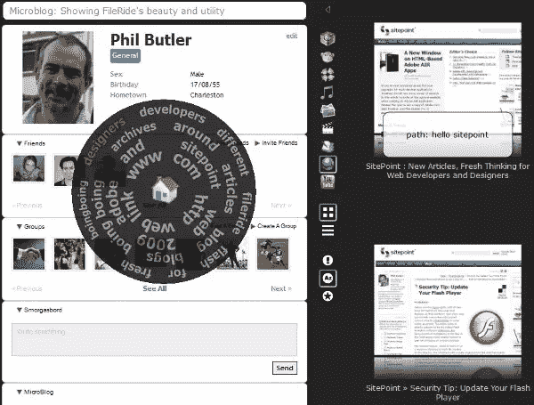

# 兜风——野外炉边

> 原文：<https://www.sitepoint.com/take-a-ride-a-wild-fileride/>

 [FileRide](http://www.fileride.com/) 是一个运行在用户桌面上的创业社交平台。基于 Stockholm 的开发本质上是围绕你电脑上已经存在的文件和你从云中保存的项目创建一个社交网络。以一种非常真实的方式，FileRide 是云计算的反向，因为用户不是文件“共享”，而是文件(兴趣)交互。例如，两个 FileRide 用户在他们的 PC 上存储了相同的照片，使用该平台，这些用户现在可以通过 IM 交流、分组或评论他们存储的数据。读者可能会认为这是一种“超级安全”的快速社交聚合器，集成了即时消息。

FileRide 是一个美学上非常漂亮的开发，用户界面是非常好的考虑和逻辑。在开发过程中，美学常常被忽视，而倾向于实用性，反之亦然。FileRide 的情况并非如此，因为该网站展示了图形设计和功能是如何紧密结合的。今天我和创始人 Patrik Hedmalm 进行了一次长时间的即时通讯聊天，他帮我介绍了一些功能。他带领我参观了一段时间以来我所见过的最独特的开发项目之一。

FileRide 登录页面

##### 建造正确

FileRide 客户端建立在 Qt(Trolltech/诺基亚)框架之上。这种配置允许 Windows、Mac 和 Linux 用户轻松参与。虽然 FileRide 目前只适用于 Windows XP 和 Vista，以及 OS X，移动版本已经在开发中。Patrik 进一步赞扬了他们对当前框架的决定，他说:“就支持、界面设计、生产力和结构而言，这也证明是一个伟大的决定。”在服务器端，FileRide 是用干净的面向对象的 PHP 实现的，根据 Patrik 的说法，它提供了良好的可伸缩性和稳定性。至于引人注目的设计，Partik 告诉我他自己完成了大部分，而 Klokie Grossfeld 帮助设计了网络界面。

显示多种功能的界面；视频浏览，左右窗格

##### 一些特征

像许多深层应用一样，FileRide 既不容易描述，也不容易列出特性。界面是相当多余的顶部和中间导航元素。从个人资料的创建和定制到即时消息，即使在这个早期阶段也没有遗漏太多内容。用户特性的简短列表(有一个巨大的版本)如下:

*   使用标签来整理和导航电脑上的媒体、书签和社交网络。
*   快速方便地存储您喜欢的网站的书签，然后标记并与他人共享或保留它们的隐私。
*   找到并讨论您电脑上的媒体文件和文档，其他志同道合的人会觉得它们很有价值。
*   找出你最喜欢的链接、音乐和视频中最受欢迎的，并加入关于它们的实时讨论。
*   根据您选择的标签和评级，与分享您的一般兴趣模式和媒体偏好的新朋友会面和聊天。
*   与朋友、客户和同事私下会面，在私人聊天频道或论坛中讨论演示文稿、合同、电子表格、照片和视频。
*   在您的私人组织内轻松安全地共享文档和信息。
*   创建包含链接、视频和照片的个人资料页面，并与您的朋友和同事分享。
*   通过微博快速轻松地更新您的 Twitter 状态。
*   直接从软件发行商或拥有完全相同文件的其他用户那里获得计算机帮助。
*   发现和购买与您的特定兴趣和偏好相关的新媒体和产品。
*   同时浏览维基百科、YouTube 和网络上与你的兴趣直接相关的文章、视频、音乐和链接。
*   在网页浏览器之外的可拖动播放器中观看 YouTube 上的视频。
*   基于您收藏的音乐文件创建自定义 Last.fm 广播电台

##### 一些很酷的东西

除了 FileRide 平台已经具备的数百个特性方面，还有几个非常有趣的微妙之处。首先，FileRide 在后台运行，并在用户每次复制 Url、文件或图像时进行记录，然后通知程序会询问用户是否要将其发送到 FileRide。用户可以在 FileRide 中将 MP3 和其他文件拖放到桌面上进行分类等。最后，如下图所示，用户可以添加图片，查看关于该项目的博客帖子的上下文链接，实时聊天，评论，发微博，同时执行一系列其他功能。尽管还没有完全完善，这个 UI 有非常强大的潜力。然而，很遗憾地说，为了获得这种体验，你必须看到和使用它。

苹果标志通过滑动条扩展，链接到博客参考，通过微博评论，通过即时消息聊天。

##### 实际共享–实时

许多方面使 FileRide 成为一个独特的开发，但实时讨论使它与众不同。社会化书签和聚合服务一直都需要这种实时协作。至于操作的安全性和速度，我的小四核“围墙花园”的性质实际上确保了这个用户的安全性和速度。在下面的屏幕中，我试图展示 YouTube 视频是如何被分享和讨论的。一些视频下方的绿点，表示用户的在线状态，而评论和分享选项则分别出现。

实时讨论界面选项

##### 摘要

FileRide 已经在其他地方讨论过了[，但只是浅尝辄止。即使这篇颇有深度的文章也不能对当前的平台或其潜在的公正做出评价。Mac 版以及 iPhone 和 lite Web access 即将推出，还有大量的 UI 改进。至于消极方面，需要补充一些改进。通知工具需要更多的功能，文件的组织不是很好，除了标记之外，还需要面向对象的分类。根据 Patrik 的说法，更多的服务正在进行中，但目前只有 YouTube、Twitter 和 Wikipedia 受到支持。](http://www.readwriteweb.com/archives/fileride_social_network_around.php)

对一些人来说，FileRide 的新奇之处可能在于它的社会化方法。这一点非常特别，因为哲学是相反的。不是朋友分享链接和其他数据，共同的兴趣导致友好的互动，并通过用户存储的兴趣找到朋友。然而，对我来说，卓越的设计、理念和对开发细节的关注构成了一流的开发。

差点忘了标签轮-测试时关闭

## 分享这篇文章