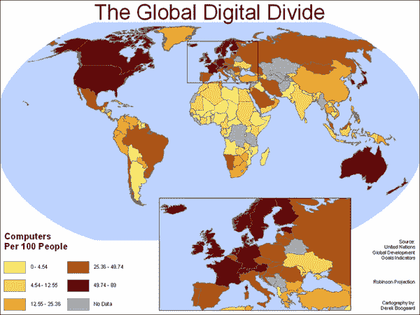

# 弥合数字鸿沟需要的不仅仅是接入

> 原文：<https://www.sitepoint.com/bridging-the-digital-divide-takes-more-than-just-access/>

最近，我们报道了全球互联网人口已经[超过 10 亿人](https://www.sitepoint.com/comscore-web-audience-now-tops-1-billion/)。这很好，但这一消息伴随着一个严峻的现实，即机会并不平等。在大多数西方国家和一些亚洲国家，接入普及率在 70%以上至 90%以上。在其他地区——如中国农村和非洲，能上网的人口比例降至个位数。

这就是所谓的数字鸿沟(更广泛地指的是对计算机和信息技术的访问，但我们在这里更关心的是网络访问)。虽然越来越多的用户继续上网，但实际上有上网者和无上网者之间的鸿沟越来越大。虽然越来越多的中产阶级和上层阶级用户开始上网，但那些生活在贫困中的人却越来越落后。

但是仅仅提供访问只是解决问题的一小部分。例如，在英国，通信办公室(Ofcom)的首席执行官斯蒂芬·卡特今天要求到 2012 年英国的每个家庭都要有宽带。这项任务旨在缩小数字鸿沟，在这方面肯定会有所帮助，但使接入成为可能只是解决办法的一部分。

在已经接入宽带但没有连接的 39%的英国家庭中，84%要么负担不起，要么由于与可用性无关的技术障碍(如没有安装固定电话)而无法接入。此外，英国 30%的家庭没有个人电脑，这意味着除了每月宽带接入费用之外，还有购买上网设备的前期技术成本。

仅仅实现接入显然不足以消除数字鸿沟。需要降低服务和技术价格，或者为那些负担不起的人提供接入补贴。

另一个障碍是教育。“真正的挑战，”宽带比较服务 Simplifydigital 的首席执行官查理·庞森比说。"让弱势家庭学会使用互联网."

在英国有 1700 万成年人很少或没有使用个人电脑或互联网的经验。“对这些家庭来说，挑战更多的是训练他们看到好处并使用互联网，而不是宽带连接本身，”庞森比说。为了真正消除数字鸿沟，还没有上网的家庭需要接受培训，以便“赶上”更富裕的用户，因为对他们来说，计算机和互联网技能已经成为第二天性。

我主要关注英国——它实际上是世界上连接程度较高的国家之一，60%的人口使用宽带(接近 70%的人口上网)——只是因为今天 Ofcom 的报告中我碰巧有英国的统计数据。然而，这里提出的想法可以很容易地应用于世界上任何贫困人口。

## 分享这篇文章