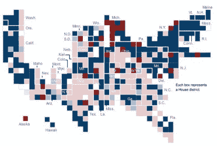

# 纽约时报发布另一个 API

> 原文：<https://www.sitepoint.com/new-york-times-releases-another-api/>

作为美国历史最悠久、最受尊敬的无生气报纸之一，纽约时报(纽约时报)可能会面临破产(T4)，但他们实际上已经用他们和其他人多年来收集的数据做了很多很酷的事情。该报发布的第一个 API 为开发者提供了竞选 FEC 财务数据，并于去年 10 月[公之于众](http://open.blogs.nytimes.com/2008/10/14/announcing-the-new-york-times-campaign-finance-api/)。今天,*时报*宣布[发布国会 API](http://open.blogs.nytimes.com/2009/01/08/introducing-the-congress-api/) 。

国会 API 使用 Hpricot 和 Ruby on Rails 来提供对直接从美国众议院和参议院网站获取的数据的访问。在第一次发布中，有四种类型的数据被公开:“给定国会和众议院的成员列表，特定唱名表决的细节，关于特定国会成员的传记和角色信息，以及成员在唱名表决中的最新立场。”API 还与 GovTrack 联系在一起，gov track 是一个独立的、无党派的国会跟踪网站。

API 有一个追溯到 1991 年的众议院投票和追溯到 1989 年的参议院投票的数据库，以及分别追溯到 1983 年和 1947 年的成员信息。

无论你是否对更容易获得国会跟踪数据感兴趣，这些 API 和其他印刷报纸(如路透社的 Calais 不是报纸，而是旧媒体新闻服务)的类似项目的发布表明，一些出版物正在认真采取必要措施，以适应新媒体格局并保持相关性。在过去的两年里,《纽约时报》已经慢慢接受了新媒体。

2006 年，他们推出了自己的 RSS 阅读器。2007 年，他们创建了一个脸书应用程序，并做出了惊人的决定，将用户评论放在网站的主页上。2008 年，他们开始整合博客网站的内容，并开始发布数据 API。他们也在很大程度上接受了博客，在 [Techmeme](http://techmeme.com/lb) 和 [Memeorandum](http://www.memeorandum.com/lb) 上都有多个排名前 100 的来源。

API 是论文的逻辑步骤。通过向开发者公开他们的数据，这将允许《纽约时报》在网络上传播他们的品牌，并再次成为媒体领域的重要组成部分。这些新的 API 将启用 mashups，以新的有趣的方式展示《T2 时报》的内容，最终将为网站带来更多的流量和读者，并提高品牌认知度。对于读者来说，这是出于同样的原因:开发人员将有希望基于 API 创建一些真正有趣和有用的混搭，丰富每个人的 web 体验。

(读写网的 Marshall Kirkpatrick [几个月前有一些好的想法](http://www.readwriteweb.com/archives/the_first_new_york_times_api_i.php)关于为什么该报的第一个 API 发布如此重要。)

我们希望世界各地的其他报纸也会这样做。如果你知道任何有趣的印刷媒体遇到新媒体项目，请在评论中告诉我们。此外，让我们知道你希望基于*Times*API 看到什么类型的混搭。

## 分享这篇文章