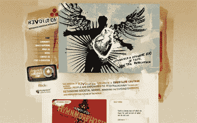

# 设计在现代教堂营销中的作用

> 原文：<https://www.sitepoint.com/design-modern-church-marketing/>

任何订阅了 [CSS Mania](http://cssmania.com/bm/mt-search.cgi?IncludeBlogs=1&search=church&submit.x=0&submit.y=0&submit=Search) 或 [Best Web Gallery](http://bestwebgallery.com/?s=church&x=0&y=0) 的网页设计师都可以证明，最近流行的高质量教会网站正在崛起。一个不去教堂的设计师可能会想，礼拜场所如何融入软件创业公司和尖端企业；然而，这些教堂被打上了与任何商业一样强烈的烙印，并得到了精明的网络教堂营销社区的支持。

我采访了一些业内顶尖的教堂设计师和营销人员，以了解设计如何帮助沟通精神生活。

##### 近代史

在 20 世纪 60 年代和 70 年代，许多基督教会公开努力吸引更年轻和更多样化的会众。基督教摇滚音乐和大型户外节日的出现使得去教堂的经历更容易被年轻人接受。在整个 20 世纪 80 年代和 90 年代，青年教会活动变得更大，更引人注目，也更反文化，至少在美学上是如此。他们的传单和营销材料开始反映通常为世俗摇滚乐队保留的坚韧不拔和不敬的形象。

在过去的十年里，越来越多的教堂通过与设计和媒体公司合作，进一步提高了他们的知名度。许多人组建了自己的内部营销团队，他们与外部设计师合作，制作出现代而独特的教堂品牌。像[马克·德里斯科尔](http://townhall.com/Columnists/ThorTolo/2008/03/06/the_gospel_according_to_mark_driscoll)这样的新一代牧师和像 [Relevant](http://www.relevantmagazine.com/misc_beliefs.php) 这样的杂志已经取得了流行文化的成功，强调年轻、可见性和精心设计的公众形象。

##### 垃圾基督教

然而，最近教堂的形象改造对一些人来说并不令人愉快。2006 年，[牧师约翰·麦克阿瑟](http://www.gracechurch.org/home/ministrystaff.asp?ministry_id=1)发表了一篇广受欢迎的文章，谴责现代教会用圣洁来换取“文化相关性”麦克阿瑟和他的支持者不同意[所谓的](http://sheepfodder.wordpress.com/2008/07/25/pragmatism-trend-or-trap/) [实用主义者](http://www.biblebb.com/files/MAC/pragmatism.htm)寻求更大、更世俗的集会。GodBit.com 反驳道:“如果我们试图采取孤立主义的方法，那我们就太天真了。上帝希望与每个人建立直接的关系，所以我们作为这一召唤的推动者，必须通过人们所知道的来认识他们，如果这是流行文化，那就这样吧。”

从设计的角度来看，将流行文化的味道应用到一个礼拜场所可以意味着很多事情，但归结起来就是在一个教堂一个教堂的基础上做什么是合适的。克里斯·梅里特( [Pixel Light Creative](http://pixelightcreative.com/) )说，“如果教堂是一个传统的保守教堂，那么我可能不会使用大量的垃圾笔刷和粗糙的纹理。每隔一段时间，就会有一个教会想要推出一个新形象，并把网站作为一个跳板。即使在这种情况下，适度也很重要；否则，你最终可能会疏远那些对原有形象感到满意的人。”

那么，围绕着粗糙、黑暗、不对称的元素设计的众多近期教会网站又是怎么回事呢——这传达了教会什么信息？有多少教会认同黑暗、粗糙的意象？

达斯汀·斯特曼( [Church Plant Media](http://www.churchplantmedia.com/) )说，这种流行的风格是教堂要求的，它们有一种更“前卫的崇拜风格”，意在吸引“20 多岁的年轻人和/或他们的艺术文化”纳森·史密斯同意这是一个积极的趋势，但他警告说，过度的设计“让这个地方感觉就像是高速公路的地下通道，充满了污垢和涂鸦。一个人应该努力尊重设计的方法，促进教会工作人员的愿望，但也帮助他们意识到他们所传递的信息。”

在一个教堂网站上看到低劣的设计元素可能会让一个不经常去教堂的人感到惊讶，但是教堂就像企业一样容易受市场变化的影响。而且，对于设计师来说，有机的手工风格可能非常有趣。“垃圾音乐可能是我们现在的专长，”马特·亚当斯说。“我非常喜欢我们在这些项目中投入的工作。有时我们会在阳光下老化我们自己的纸张，或者撕掉一些纸板，生锈一些钉子和订书钉……我们真的在这些项目上度过了一段美好的时光。难的是，教会只是在寻求潮流，而不是展示他们真正的文化。”

詹姆斯·达尔曼([教会沟通专家](http://www.churchcommunicationspro.com/))对通过设计准确传达教会文化有着同样的担忧。“通常会有很大的脱节。许多教堂描绘的是他们想要成为什么样的人，而不是他们真实的样子。”达尔曼说，这也是一个自我的问题——一些寻求形象改造的教堂“只是想看起来很酷，或者比隔壁的家伙更好。”

##### 为身份而斗争

接受采访的每一位设计师都一再承认教堂在寻求能见度时面临的压力。具有讽刺意味的是，许多教堂砸钱建立一个独特的图形身份，只是要求他们的设计师跟随最新的趋势。马特·亚当斯表达了对教堂的失望，“那些声称他们‘想成为独一无二的，就像 x 一样’，这太可怕了。如此多的年轻牧师想要立即获得成功，并依赖于从其他牧师那里窃取或借用，或者尽可能多地将流行/科技文化放入他们的网站和教堂。就在几天前，我偶然发现一个教堂网站在他们的教堂标语中宣传 Wi-Fi 接入。

就像与世俗企业合作一样，为教堂设计需要深入挖掘组织的精神，以帮助找到他们的身份。“对一个教堂合适的东西对另一个教堂可能完全不同，”纳森·史密斯说，“作为设计师，你有责任帮助他们辨别他们的动机。他们是想创新，还是只是想打破常规，就像其他人一样？”

史密斯还表示，教会应该避免简单地混合营销元素或孤立自己。“每次我看到盗用某个流行品牌名称的 t 恤，我都会想，唉，他们就是不明白。他们试图通过重复广告牌上的广告来挽回营销策略，但没有成功。一个基督教版本的产品 XYZ 是免费的，就像一个基督徒专用的[脸书](http://www.facebook.com/)，或者一些社会营销的神奇工具。我们需要基督徒成为他们的同伴，他们可以在那里依靠，而不是躲在某个沾沾自喜的有围墙的花园里。”

达斯汀·斯特曼承认，尽管初衷是好的，但有些教堂在表达自己的观点时做得太过了。谈到设计和新媒体，斯特曼说，“教会应该最大限度地挑战极限”，以接触到他们的追随者。马特·亚当斯称，相反，太多的人把它推向了错误的方向。“总的来说，我看到教堂试图彼此超越……谁可以更性感或更大胆。当然，它开始很小，但经常导致一个教会在新闻上捍卫他们的圣经立场。这个夏天有一连串这样的故事，通常与性或金钱的布道主题有关。虽然他们可能在圣经上是正确的，但对那些守旧派教会、甚至反教会的人来说，这看起来相当糟糕。”

##### 不断变化的市场

近几十年来，教会在市场营销上走得太远可能会对某些人产生与预期相反的效果。[研究显示](http://citeseerx.ist.psu.edu/viewdoc/summary?doi=10.1.1.25.1397)“没有宗教偏好的美国人的比例在 20 世纪 90 年代翻了一番，从 7%增加到 14%。”在英国，从 1979 年到 2005 年，有一半的基督徒不再在周日去教堂。这种激进、尖锐的教会营销方式是否意味着迫切需要重新招募成员？

“营销不仅仅是数字，否则我们就完全没有抓住重点，”纳森·史密斯说。“我认为我们的设计必须不仅仅描绘*食物、人们和乐趣*,因为我们作为一个教堂，不仅仅是一个免下车服务。”克里斯·梅里特补充说，尽管面临着与更大、更显眼的教堂竞争的压力，但设计体验必须——最重要的是——保持真实。“这意味着没有库存照片。这也意味着撰写不那么正式、更像真人与你交谈的网络文稿。”

马特·亚当斯指出，“如此多的美国人被教会烧死，或者被教会抛弃。有时候，一个人停止去教堂的原因是如此之小，以至于经常向他们传达这个特定的教堂是如何不同才是关键的主题。”

##### 设计教堂体验

很明显，追逐设计潮流来捕捉教堂的真正灵性最终将是徒劳的。为一座教堂找出合适的设计感觉可能还需要更多细致入微的推理。纳森·史密斯为“相信宿命论的教会，以及那些相信人天生可以选择或拒绝上帝的教会”做了设计。根据我的经验，前者倾向于通过圣经学习、研讨会、静修等方式，专注于牧养家庭羊群。所以，像这样的教堂设计会让人感觉舒适，给老成员一个了解最新动态的地方。后者在本质上更倾向于福音主义，因此他们的设计往往被视为更前卫，试图触及那些可能有非基督教背景的人。

那么，如果教堂网站希望传达实体教堂本身的精神，那么当 1000 英里外的远程设计团队必须为一座看不见的教堂设计时，会发生什么呢？大多数被采访的设计师简单地回答，“很多很多电话咨询。”詹姆斯·达尔曼说，他花了 15 年时间来磨练自己的品牌策略:问正确的问题，鼓励正确的答案。达斯汀·斯特曼要求他的客户“列出一系列形容词”,并结合他所知道的颜色和字体。通常需要即兴创作，以及与一些教会部署的内部媒体团队合作。

为一个教会网站建立完美的感觉取决于你想要讲述的故事，形象地说。主要的设计元素(字体、颜色、图片、文字)不仅仅是为了销售，就像一个公司网站一样。达斯汀·斯特曼说，用设计传达灵性应该是一种平衡，一种“形式和功能的完美融合”，以及“一种情绪化的艺术过程”

##### 作为商业的教会

但实际上，正如几位设计师所说，教堂确实“出售一种生活方式”，使用设计和媒体来传达这种生活方式对教堂的成功至关重要，无论是经济上还是其他方面。《福布斯》在线版有一个名为“基督教资本主义”的新闻类别，报道了“[大教堂、大企业](http://www.forbes.com/2003/09/17/cz_lk_0917megachurch_print.html)”和“[精神上有利可图的游戏](http://www.forbes.com/2003/09/16/cx_el_0916gaming.html)”等故事 [*《商业周刊》*也报道了](http://www.businessweek.com/magazine/content/05_21/b3934001_mz001.htm)价值数百万美元的教会咨询服务的增长。正如 [*教会营销烂*指出的](http://www.churchmarketingsucks.com/archives/2004/09/is_marketing_a.html)，营销简单来说就是“推销、销售和分配商品或服务的过程”。尽管我们对将布道比作推销颇为恼火，但还是有某些相似之处。”

受访的设计师不同意将教堂比作商业有任何冲突，因为他们都觉得最终目标仍然是真实性。*营销*不一定是一个脏字。克里斯·梅里特说:“企业希望传达一种信息和一种身份，就像教堂一样。信息大相径庭，但两者在传达信息时都采用了相同的最佳实践。”达斯汀·斯特曼承认“仅仅作为另一个试图出售某种东西的组织出现和试图使用传统营销技术将福音信息传达给人们之间的细微差别。”

为世俗企业设计不可避免地意味着讨论如何比竞争对手看起来更好。受访的设计师认为设计不仅仅是让 X 教堂的体验比 Y 教堂更好的工具，尽管偶尔会有这样做的压力。和商业一样，教堂设计需要克制。马特·亚当斯说:“当我看到教会真的大力推行牧师和校园设施时，我开始担心。我们尽量小心选择图像。伟大的摄影可以走很长的路，在快乐的人和正常放松的面孔之间保持坚实的平衡。”

##### 一流的设计，二流的价值

教堂设计师似乎面临着一个巨大的挑战:创造美丽、精致的互动体验，既保持谦逊，又传达灵性，所有这些都不显得做作。降低自我的角色是几乎所有宗教的标准做法，然而具有讽刺意味的是，今天的许多教会比以往任何时候都更需要宣传自己，因为他们寻求更多的人数和知名度。教堂设计者是否感到矛盾，试图传达核心价值，同时又用华而不实、昂贵的设计包装它们？

马特·亚当斯提倡一种温和的方法，设计师可以“在技术进步与好的内容和更中庸的设计之间取得平衡”。一个过度展示技术进步的教堂网站很快会给一些人留下自私自利的印象。

客户拒绝更吸引眼球的商业外观的频率有多高？亚当斯引用了 marshill.org 和 savannahcanvas.com 的例子，在这些例子中，安静的极简主义是“他们营销策略和吸引力的一部分”达斯汀·斯特曼说，大约 25%的客户要求简约的设计风格。“许多人对他们过去见过的油滑的笑脸感到厌恶。他们想要一个能和他们所在的地方的人交流的网站，而不是看起来像是由完美的人制作的。”

纳森·史密斯承认他“最近在教堂网页设计中越来越少看到谦逊的尝试。比起自负的自我吹捧，我认为教会意识到稍微展开翅膀是可以的。”设计师声称在风格上“圆滑”是没有好处的。史密斯暗示，人性真实的不完美实际上赋予了设计力量，正如当前的垃圾潮流所反映的那样。毕竟，他说，“我们都是有缺陷的人，试图寻求上帝的意志来变得完整。“在设计中看到这一点时不时会让人耳目一新。”

##### 结论

人们的共识是，商业策略可以和平地存在于教会文化中，而不会损害核心价值或玷污设计师的角色。正如所有设计师所表达的，第一要务是真实性——诚实地反映教会价值观，这种价值观不仅仅是为了时髦而时髦。

正如他们的设计所反映的那样，过去几十年中，许多基督教堂正在成为多样化的、不断发展的组织，他们看到了保持现状的巨大价值。目前还不确定尖端设计在多大程度上影响了会众的规模，但现有的会众有一个全新的华丽、功能丰富的网站将他们与他们的社区联系起来。

## 分享这篇文章