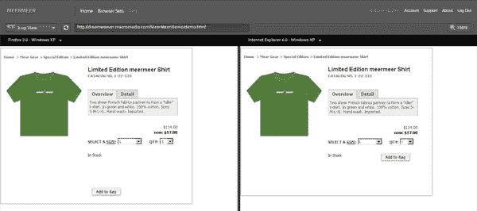
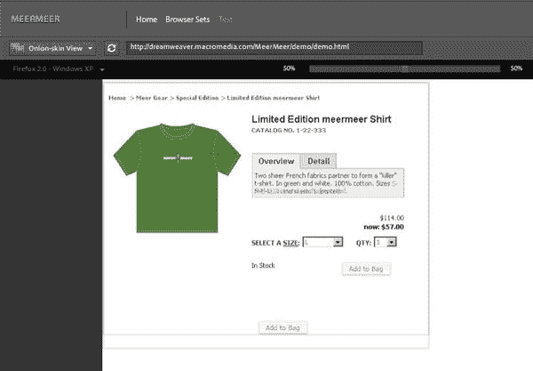

# Adobe Meermeer 将改变您测试网站的方式

> 原文：<https://www.sitepoint.com/adobe-meermeer-will-change-the-way-you-test-web-sites/>

每年在年度 MAX 活动中，Adobe 都会在“Sneaks”主题演讲中展示一些最引人注目的项目。在 2007 年的会议上，谈论最多的潜行是“热”，最近正式成为[闪光催化剂](https://www.sitepoint.com/adobe-debuts-flash-catalyst-at-max-conference/)。今年，Adobe 即将推出的最酷项目的荣誉可能会授予 Meermeer，这是一款新的跨浏览器测试工具，它将彻底淘汰 Browsershots.org T4。

Meermeer 将于明年某个时候作为在线服务和 Dreamweaver CS4 扩展在 Adobe Labs 上首次亮相，它是一个跨浏览器网站测试工具，将作为一项服务提供。我今天从 Adobe 高级产品经理 Devin Fernandez 和产品经理 Scott Fegette 那里获得了 Meermeer 的演示。

Fegette 告诉我，当 Adobe 要求开发人员说出开发网站时最大的痛点时，绝大多数受访者告诉他们跨浏览器测试是一个令人头疼的问题。对于大多数开发人员来说，测试跨浏览器和操作系统是一个笨拙的过程，涉及多台机器、朋友拍摄的截图和电子邮件，以及在 Browsershots.org 这样的慢速网站上等待。

这些方法通常要求开发人员实际发布一个网页，然后将一个服务(或朋友)指向动态页面，以便在各种浏览器中进行测试。Meermeer 简化了这一过程，它允许开发人员将本地代码发送到 Meermeer 服务器，并几乎立即收到在不同浏览器和不同操作系统上呈现的页面截图，而无需使用代码。代码可以设置为从 Dreamweaver 自动发送(类似于浏览器视图中的预览), Meermeer 可以与最新版本的代码保持同步，因此您可以在修改代码时获得跨浏览器的持续更新。

与 Browsershots.org 不同，米尔梅尔不使用批处理方法来提供截图。相反，通过部署更多的虚拟机来拍摄站点屏幕快照，站点可以根据需要进行扩展，这意味着接收测试结果不会需要很长的等待时间，并且添加额外的浏览器和操作系统也很简单。在发布时，该服务将支持基于网络终端用户最常用浏览器的“核心”浏览器集，包括 Windows 上的 Internet Explorer 6 和 7、Firefox 2 和 3，以及 Mac 上的 Firefox 3 和 Safari。

Meermeer 增加的另一个有用的创新是通过多个视图查看浏览器测试的能力。除了标准的 1-up 和 2-up(并排)视图，Meermeer 还有一个“洋葱皮”视图，可以将一个浏览器屏幕截图叠加在另一个之上。开发人员可以用滑块调整每个镜头的不透明度，这样他们就可以确定点的差异。正如你在上面的截图中看到的，这可能是历史上第一次 IE 比 Firefox 更正确地渲染页面(费格特的玩笑，不是我的！).

Fegette 告诉我，开发人员已经在使用手动创建的截图和 Photoshop 测试洋葱皮类型的叠加视图。因此，向 Meermeer 添加该功能是很自然的，并且简化了开发人员的流程。

目前，Adobe 正致力于将 Meermeer 作为一项网络服务推出，并伴随 Dreamweaver 扩展。最终，该公司可能会考虑为该服务提供一个 API，以便其他应用程序可以添加 Meermeer 测试功能，但目前还没有具体的计划。费尔南德斯告诉我，没有什么能阻止他们走这条路，我们不应该排除这种可能性。

当我问“Meermeer”这个相当不寻常的名字来自哪里时，费尔南德斯告诉我，这款应用程序的原名是“Mirror Mirror”，意思是“镜子，墙上的镜子”，但在反复说了一遍之后，它最终被缩短了，猫鼬成为了这款应用程序的非官方吉祥物。因此，米尔梅尔。

## 分享这篇文章