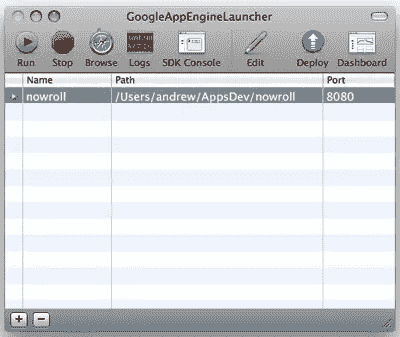
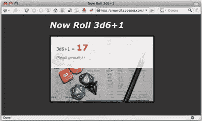

# 80 年代风格的谷歌应用引擎

> 原文：<https://www.sitepoint.com/rollin-with-google-appengine-80s-style/>

 **使用 Google App Engine 构建 web 应用程序既快速又简单，您还可以使用 Google 分布式内容交付网络和“大表”数据库。那它有什么好处呢？**

当我 14 岁的时候，我爸爸买了一个 64 代的准将。我翻遍了手册，自学了 C64 BASIC，买了 C64 编程杂志，并制作了一叠装满未完成项目的录音带。能够创造声音并让事情在屏幕上发生是一件非常有趣的事情。

大约 2 年后，我发现了女孩，并在几年内不再对技术感兴趣。我经常想，如果我继续致力于科技而不是荧光色衬衫、紧身领带和蓝光迪斯科，我是否能达到比尔·盖茨那样的高度。

Dave Winer 说，由于 Google App Engine，“Python 是新的基础”。我对 App Engine 第一次体验确实产生了与 C64 BASIC 在我尴尬的过去一样的乐趣。凭借零 Python 经验和仅有的应用引擎[留言簿教程](http://code.google.com/appengine/docs/gettingstarted/)，我设法构建了一个功能性的(尽管完全没有意义)，有点有趣的 web 服务，名为“ [Now Roll…](http://nowroll.appspot.com/) ”。现在开始..模拟龙与地下城风格的骰子滚动。它简单明了，易于创建——我说的是简单的按钮。谷歌应用引擎是我的新准将 64。


那么 Google App Engine 到底是什么？嗯，它包括了创建 web 应用程序通常需要组装的大部分组件。它有一个称为“webapp”的简单框架组件、一个称为“datastore”的数据库和一个部署系统。一旦完成，您就可以部署您的 web 应用程序在 Google 的基础设施上运行。它还有一个功能齐全的本地开发环境，是真实环境的副本。

一旦你[下载了](http://code.google.com/appengine/downloads.html)并安装了 SDK，你就可以马上开始在本地开发环境中练习，但是要部署一个应用程序，你必须先用你的谷歌账户注册你的应用程序。其中包括通过 SMS 的帐户确认。免费账户也仅限于 3 个应用程序——我想是为了避免 500 万个“你好，世界！”正在部署。但是这种限制可能只存在于预览版发布期间。

我有两个给初学者的大提示:完成[入门](http://code.google.com/appengine/docs/gettingstarted/)教程，并使用 Launcher 应用程序(与 SDK 捆绑在一起)来构建你的第一个项目。当您使用 Launcher 应用程序添加新的 web 应用程序时，它会为您生成一个应用程序外壳，这是一个基本 web 应用程序所需的所有文件，您可以直接运行它。它只输出“Hello world！”，但是很管用。一旦你有了壳，你就可以开始玩了！



一个基本的 GAE 应用程序包含以下组件:

*   一个名为`app.yaml`的应用程序配置文件，您可以在其中指定路径(或 URL 模式)和 python 脚本文件，如果请求的 URL 与模式匹配，将执行该脚本文件。
*   一个或多个脚本文件(在`app.yaml`文件中指定),每个文件指定一个 URL 模式列表和负责处理 URL 的 Python 类。
*   一个或多个请求处理类，它们定义了一个`get`和/或一个`post`方法，以便能够处理对指定 URL 模式的 HTTP GET 或 POST 请求。它们读取请求并组成响应，为此您可以使用一个模板引擎。
*   (可选)一个或多个模型类，用于定义要存储在数据存储中的实体的数据结构。

app.yaml 文件允许您指定称为“处理程序”的路由(或 URL 模式):您将 URL 模式与 python 脚本文件匹配，如果请求的 URL 与该模式匹配，将执行该脚本文件。默认应用程序包含一个处理程序:

```
handlers:
- url: .*
  script: main.py
```

这个默认配置指定 GAE 将为所有请求 URL 执行`main.py`文件。如果你像我一样，只想一头扎进去，就用这个默认设置，对于一个简单的应用程序来说就很好了。你也可以指定静态路径到 CSS 文件，这在入门教程中有解释。

main.py 脚本文件在一个名为`main`的函数中创建一个`webapp.WSGIApplication`类的实例，然后调用这个函数。这都是自动为您生成的样板代码。它看起来是这样的:

```
def main():
  application = webapp.WSGIApplication([('/', MainHandler)],
                                       debug=True)
  wsgiref.handlers.CGIHandler().run(application)

if __name__ == '__main__':
  main()
```

对象的创建包括两个参数:一个请求处理程序列表和一个标志。`debug`标志，如果`True`，将导致 GAE 输出运行时错误的堆栈跟踪到浏览器。每个请求处理程序都是一个 Python 元组，它将一个 URL 模式(一个正则表达式)与一个 Python 类相匹配。默认设置的根 URL `'/'`与`MainHandler`类匹配。您可以用这种方式指定多个处理程序。对于我的 Now Roll…应用程序，我需要三个处理程序:

```
application = webapp.WSGIApplication([('/', MainHandler),
                                      ('/rolls/(.*)', ArchivedRoll),
                                      ('/(.*)', RollHandler)],
                                     debug=True)
```

一个用于主页的处理器`('/', MainHandler)`，一个用于存档骰子滚动的永久链接`('/rolls/(.*)', ArchivedRoll)`，一个用于骰子滚动功能`('/(.*)', RollHandler)`。您必须按照从最具体到最不具体的顺序列出它们，因为第一个匹配的模式是要执行的模式。指定的 python 类必须是`webapp.RequestHandler`类的子类，并且需要定义一个`get`和/或`post`方法，以便能够处理对指定 URL 模式的 HTTP GET 或 POST 请求。默认的`MainHandler`类如下所示:

```
class MainHandler(webapp.RequestHandler):

  def get(self):
    self.response.out.write('Hello world!')
```

我还在正则表达式中包含了组，例如`'/rolls/(.*)'`。这些匹配的片段被方便地作为参数传递给处理类的`get`和`post` 方法。我的`ArchivedRoll`类使用这个特性来轻松访问存档卷的键值:

```
class ArchivedRoll(webapp.RequestHandler):
  def get(self,key):
    # retrieve roll from datastore using the key value...
    # return the roll data to the browser using a template...
```

要使用 GAE 数据存储，您需要一个或多个模型类。GAE 数据存储中没有表，您的 python 模型类定义了数据结构，数据存储自动处理存储、检索和索引生成。数据存储中的项目称为“实体”。您需要导入 Google db 模块:`from google.appengine.ext import db`并且您的模型类必须是`db.Model`的子类。

在我的 Now Roll…应用程序中，我想存储每一次掷骰子，为此我使用了这个`DiceRoll`类:

```
class DiceRoll(db.Model):
  roll = db.StringProperty()
  results = db.ListProperty(int)
  outcome = db.IntegerProperty()
  date = db.DateTimeProperty(auto_now_add=True)
```

一个模型类非常简单；它提供了一个类型名(GAE 术语中的“种类”):`DiceRoll`，以及一个为每个实体存储的命名属性列表。要存储一个实体，您需要创建一个模型类的新实例，设置属性值，然后调用对象的`put`方法。

```
dr = DiceRoll()
dr.roll = '2d6'
dr.results = [1,2]
dr.outcome = 3
dr.put()
```

该实体现在位于数据库中。所有实体都会自动接收一个惟一的标识符，您可以使用对象的`key()`方法来检索这个标识符，如下所示:

```
key = dr.key()
```

您可以使用关键字从数据存储中检索特定的实体，如下所示:

```
roll = db.get(key)
```

您可以使用 API 或 GQL(Google 的类似 SQL 的查询语言)来运行数据存储查询。如果我想在我的 Now Roll…应用程序中添加一个功能，以日期倒序列出最近 10 次掷骰子的结果，使用 API 的查询如下所示:

```
rolls_query = DiceRoll.all().order('-date')
rolls = rolls_query.fetch(10)
```

使用 GQL 的等效查询是:

```
rolls = db.GqlQuery("SELECT * FROM DiceRoll "
                    "ORDER BY date DESC LIMIT 10")
```

这一切都非常简单明了。对于更复杂的关系，您可以将一个实体定义为一个或多个其他实体的父实体，然后在查询中使用该关系。

一旦你的类方法处理了请求，它就可以输出一个响应。`self.response.out.write`方法只是输出提供给它的字符串参数。响应的内容类型是`text/html`，除非您在任何输出前使用`self.response.headers["Content-Type"] = *'type'*`指定一个不同的值。

另一种(也是首选的)输出方法是使用模板。与 GAE SDK 捆绑在一起的模板模块使用 Django 的模板引擎。要使用它，您需要从 Python 标准库`import os`中导入`template`模块:`from google.appengine.ext.webapp import template`和`os`模块。以下是模板文件的摘录，其中显示了存档的掷骰子:

```
<h1 id="page_title">Now Roll {{ roll.roll }}</h1>
<div id="roll_info">
  <div id="outcome">{{ roll.roll }} = <span id="result">{{ roll.outcome }}</span>
    <p id="permalink">(<a href="/rolls/{{ id }}">Result permalink</a>)</p>
  </div>
</div>
```

`{{...}}`标记是数据的占位符，可以由请求处理程序类的响应插入，如下所示:

```
roll = db.get(key)
template_values = {
  'roll': roll,
  'id': roll.key(),
}
path = os.path.join(os.path.dirname(__file__), 'archive.html')
self.response.out.write(template.render(path, template_values))
```

上面的`template_values`数组中的`roll`值是`DiceRoll`模型类的一个实例，该类的所有属性都在模板中可用。所以模板中的`{{ roll.outcome }}`将被`roll`对象的`outcome`属性值替换。



通过使用模板，创建 Now Roll… API 的工作变得非常简单。掷骰子结果的网页版本和 XML 版本之间的唯一区别是用于呈现响应和响应`Content-Type`值的模板文件。

如果您使用 Google App Engine Launcher 客户端，部署到 Google 服务器实际上只需单击标记为“Deploy”的按钮。这不需要任何设置；部署完成后，您的应用就可以实时发布了。

简而言之，这就是谷歌应用引擎。有一些其他的应用引擎模块你可以利用，比如图像处理，缓存和用户 API 来整合谷歌账户。

尽管 GAE 有一系列有用的库，但它明显缺少一个测试框架。像 Rails 这样的框架已经为推广自动化单元测试的使用做了很多工作，所以它的缺失可能会把一些开发人员拒之门外。拥有一次点击单元测试来匹配一次点击部署特性的便利性将是一个很好的特性。

Kevin 之前提到过，虽然它对初学者很友好，但是应用程序需要专门为 GAE 编写，这可能会阻止一些开发人员使用该平台。虽然我认为有可能编写一个单独的模块来连接您现有的应用程序和 Google 框架，但我想知道，如果您已经有了一个商业应用程序和一个开发团队，是否值得您花时间将其移植到 GAE。

数据存储也可能会让一些开发人员在处理它的非关系特性时出错。例如，对数据存储中的记录进行计数的[问题已经在 GAE 论坛上出现。你不能简单地做一个`COUNT()`。但是，我希望随着越来越多的开发者注册这个平台，更多的使用模式将被开发和测试，并且](http://groups.google.com/group/google-appengine/browse_thread/thread/d1260a3deb31dbf7)[最佳实践使用模式](http://blog.appenginefan.com/2008/06/efficient-global-counters.html)将最终上升到顶端。

我预测 GAE 将会成为一个优秀的平台，那就是专用 web 服务。我说的不是掷骰子这种无聊的事情，而是一些有用的东西，比如数据收集服务或图像处理服务。一种小型通用组件，可用于较大的应用程序中，但被分离出来并托管在 GAE 上，以节省应用程序资源。一个很好的例子就是这个 [OpenID Provider](http://appgallery.appspot.com/about_app?app_id=agphcHBnYWxsZXJ5chMLEgxBcHBsaWNhdGlvbnMYrwIM) 应用程序，它可以让你使用你的谷歌账户凭证登录任何支持 OpenID 的网站。

GAE 的一个方面，我还没有看到在其他地方提到过，那就是它为你的领域集成了谷歌应用程序。当您创建一个 GAE 应用程序时，您可以限制对您的注册域用户的访问:hello company intranet！有了 GAE，GAfYD 成为组织，尤其是分布式组织的完整软件解决方案。我可以预见，如果一家公司能够避免购买服务器和带宽以及自托管内部网的持续管理成本，将会节省大量成本。

然而对我来说，除了平凡的商业方面，谷歌应用引擎代表了类似 Commodore 64 的东西。你知道一台个人电脑，它本身做不了多少事情，但却是灵活的、可编程的、鼓舞人心的和有趣的。你用它来修补东西，发现东西是如何工作的，尝试新发明的想法，以及构建定制工具。它体现了 80 年代个人电脑的精神(但没有糟糕的时尚感)。

## 分享这篇文章