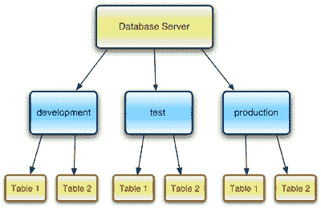
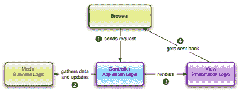
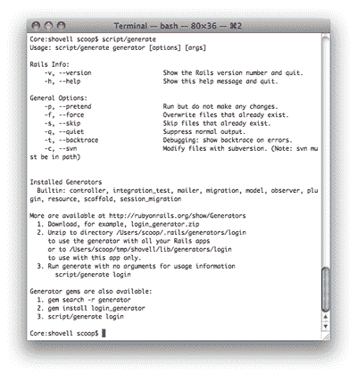

# 适用于初学者的 Rails:您需要知道的一切！

> 原文：<https://www.sitepoint.com/rails-for-beginners/>

**如果你曾经读过任何关于 Ruby on Rails 的[初学者文章，你会知道在组成 Rails 框架的代码库中已经投入了相当多的思想。随着时间的推移，许多内部结构已经被重写，这提高了它们的速度和效率，并允许实现额外的功能，但原始的架构在很大程度上保持不变。](https://www.sitepoint.com/article/learn-ruby-on-rails-1/)**

在本文中，我将通过研究 Rails 的内部工作方式来帮助初学者迈出下一步。如果你还没有尝试过 Rails，我建议你下载我的新书的免费预览版， *[简单来说就是 Rails 2](https://www.sitepoint.com/books/rails2)* ，其中摘录了一些信息。这里介绍的这一章给出了 Ruby on Rails 框架的表层之旅，并为读者构建一个 digg-clone 做好了准备，我们将它命名为(有点厚脸皮地)sleaglel。如果您需要安装和其他设置说明，[下载样本 PDF](https://www.sitepoint.com/books/rails2/) ，其中包含第 1 章到第 4 章。

##### 三种环境

Rails 鼓励在应用程序生命周期的每个阶段——开发、测试和生产——使用不同的环境。如果您已经开发 web 应用程序有一段时间了，这可能就是您的操作方式；Rails 只是形式化了这些环境。

***发展***

在开发环境中，对应用程序源代码的更改可以立即看到；我们需要做的就是在网络浏览器中重新加载相应的页面。在这种环境下，速度不是关键因素。相反，重点是为开发人员提供尽可能多的关于负责显示每个页面的组件的信息。当开发环境中出现错误时，我们一眼就能看出哪一行代码对错误负责，以及那一行代码是如何被调用的。这个功能是由**堆栈跟踪**(导致错误的所有方法调用的综合列表)提供的，当出现意外错误时会显示出来。

***测试***

在测试中，我们通常在每次重复测试时用虚拟数据的基线刷新数据库:这一步确保测试的结果是一致的，并且行为是可重复的。Rails 中的单元和功能测试过程是完全自动化的。

当我们测试一个 Rails 应用程序时，我们不会使用传统的 web 浏览器来查看它。相反，测试是从命令行调用的，并且可以作为后台进程运行。测试环境为这些流程的运行提供了一个专用空间。

***生产***

当您的应用程序最终上线时，它应该已经过充分的测试，所有的——或者至少大部分的——错误都已经被消除了。因此，对代码库的更新应该是不频繁的，这意味着生产环境可以被优化以关注性能。在这个阶段，为调试目的编写大量日志之类的任务应该是不必要的。此外，如果确实发生了错误，您不希望用一个神秘的堆栈跟踪吓跑您的访问者；这最好留给开发环境。

由于这三种环境的需求各不相同，Rails 将每种环境的数据存储在完全独立的数据库中。所以在任何时候，你都可能:

*   真实用户在生产环境中与之交互的实时数据
*   您用来在开发环境中调试错误或开发新功能的实时数据的部分副本
*   一组不断被重新加载到测试环境中的测试数据

让我们看看如何为每种环境配置数据库。

##### 数据库配置

为 Rails 应用程序配置数据库非常容易。所有关键信息都包含在一个文件中。我们将仔细查看这个数据库配置文件，然后创建一些数据库供我们的应用程序使用。

***数据库配置文件***

环境的分离反映在 Rails 数据库配置文件`database.yml`中。我们在第 1 章看到了这个文件的一个例子，事实上，当我们使用`rails`命令时，我们在第 2 章创建了自己的配置文件。去看看吧——它位于我们的 Shovell 应用程序的`config`子目录中。

删除注释后，文件应该如下所示:

例 4.1。`01-database.yml`

```
development:
  adapter: sqlite3
  database: db/development.sqlite3
  timeout: 5000

test:
  adapter: sqlite3
  database: db/test.sqlite3
  timeout: 5000

production:
  adapter: sqlite3
  database: db/production.sqlite3
  timeout: 5000
```

该文件列出了连接到每个环境(开发、测试和生产)的数据库服务器所需的最少信息。对于我们在第 2 章中安装的 SQLite 的默认设置，每个环境都被分配了它自己的物理上独立的数据库文件，该文件称为`db`子目录 home。

参数数据库设置将在每个环境中使用的数据库的名称。正如配置文件所建议的，Rails 可以并行支持多个数据库(甚至不同类型的数据库引擎，比如用于生产的 MySQL 和用于开发的 SQLite)。请注意，我们这里实际上讨论的是不同的数据库，而不仅仅是不同的表——每个数据库可以并行托管任意数量的不同的表。

图 1 显示了这种架构的图形表示。



然而，我们当前的配置中缺少一个令人吃惊的方面:查看`db`子目录，我们的配置文件中引用的数据库还不存在！不用担心，Rails 会在需要的时候自动创建它们。就他们而言，我们不需要做什么。

##### 模型-视图-控制器体系结构

我们在第一章中第一次遇到的模型-视图-控制器(MVC)架构并不是 Rails 独有的。事实上，它比 Rails 和 Ruby 语言早很多年。然而，Rails 确实将应用程序的数据、用户界面和控制逻辑分离到了一个全新的层次。

让我们看看使用 MVC 架构构建应用程序背后的概念。一旦我们有了合适的理论，我们将看到它如何转化为我们的 Rails 代码。

***理论上的 MVC***

MVC 是软件应用程序架构的一种模式。它将应用程序分为以下三个部分:

*   **型号:**
    用于处理数据和业务逻辑
*   **控制器**
    用于处理用户界面和应用逻辑
*   **视图**
    用于处理图形用户界面对象和呈现逻辑

这种分离导致用户请求被如下处理:

1.  客户端上的浏览器向服务器上的控制器发送页面请求。
2.  控制器从模型中检索它需要的数据，以便响应请求。
3.  控制器将检索到的数据传递给视图。
4.  视图被呈现并发送回客户机供浏览器显示。

这个过程如图 2 所示。



将软件应用程序分成这三个不同的组件是一个好主意，原因有很多，包括:

它提高了可伸缩性(应用程序增长的能力)。

例如，如果您的应用程序由于数据库访问缓慢而开始遇到性能问题，您可以升级运行数据库的硬件，而不会影响其他组件。

这使得维护更加容易。

由于组件之间的依赖性很低，所以对一个组件进行更改(修复错误或更改功能)不会影响另一个组件。

它促进了重用。

一个模型可以被多个视图重用，反之亦然。

如果你还没有完全理解 MVC 的概念，不要担心。现在，重要的是记住您的 Rails 应用程序被分成三个不同的组件。如果您稍后需要参考它，请跳回到图 2。

***MVC 轨方式***

Rails 提倡模型、视图和控制器应该通过将每个元素的代码作为单独的文件存储在单独的目录中来保持完全分离的概念。

这就是我们在第 2 章中创建的 Rails 目录结构发挥作用的地方。现在是我们在这个结构中探索一下的时候了。如果您查看一下 app 目录，如图 3 所示，您会看到一些文件夹，它们的名称可能听起来很熟悉。


正如您所看到的，模型-视图-控制器架构的每个组件在`app`子目录中都有自己的位置——分别是`models`、`views`和`controllers`子目录。(我们将在第六章讨论那个`helpers`目录。)

这种分离在组成框架本身的代码中继续存在。构成 Rails 核心功能的类位于以下模块中:

**T2`ActiveRecord`**

`ActiveRecord`是处理业务逻辑和数据库通信的模块。它在我们的 MVC 架构中起着模型的作用。

(虽然`ActiveRecord`的名字中没有“模型”这个词可能有点奇怪，但这是有原因的:活动记录也是一个著名的设计模式的名字——这个组件实现这个模式是为了在 MVC 世界中扮演它的角色。此外，如果它被称为`ActionModel`，那么它听起来更像是一个高薪的好莱坞明星，而不是一个软件组件……)

`ActionController`是处理浏览器请求并促进模型和视图之间通信的组件。您的控制器将从该类继承。它构成了`ActionPack`库的一部分，这个库是 Rails 组件的集合，我们将在第 5 章深入探讨。

**T2`ActionView`**

`ActionView`是处理返回给客户端的页面表示的组件。视图继承自这个类，它也是`ActionPack`库的一部分。

让我们依次仔细看看这些组件。

***`ActiveRecord`(示范)***

`ActiveRecord`旨在处理与数据库相关的所有应用任务，包括:

*   建立与数据库服务器的连接
*   从表中检索数据
*   在数据库中存储新数据

也有一些其他巧妙的技巧。现在让我们来看看其中的一些。

**数据库抽象**

`ActiveRecord`附带数据库适配器，可连接 SQLite、MySQL 和 PostgreSQL。大量的适配器也可以通过 RubyGems 系统用于其他流行的数据库服务器包，比如 Oracle、DB2 和 Microsoft SQL Server。

`ActiveRecord`模块基于数据库抽象的概念。正如我们在第一章中提到的，数据库抽象是一种编写应用程序的方式，因此它不依赖于任何一个数据库。特定于特定数据库服务器的代码被安全地隐藏在`ActiveRecord`中，并在需要时被调用。结果是，Rails 应用程序没有绑定到任何特定的数据库服务器软件。如果以后需要更改底层数据库服务器，应该不需要对应用程序代码进行任何更改。

不同供应商的代码差异很大，而`ActiveRecord`对这些代码进行了抽象，包括:

*   登录到数据库服务器的过程
*   日期计算
*   布尔(`true` / `false`)数据的处理
*   数据库结构的演变

不过，在我向你展示`ActiveRecord`的神奇之处之前，我们需要做一点家务。

**数据库表**

**表**是数据库中以结构化方式存储数据的容器，它们由行和列组成。行映射到单个对象，列映射到这些对象的属性。数据库中所有表的集合，以及这些表之间的关系，被称为数据库**模式**。

图 4 显示了一个表格示例。


在 Rails 中，Ruby 类和数据库表的命名遵循一种直观的模式:如果我们有一个名为`stories`的包含 5 行的表，这个表将存储 5 个`Story`对象的数据。关于类和表之间的映射，最好的事情是你不需要写代码来实现它——映射就这样发生了，因为`ActiveRecord`从类名中推断出表名。

注意，我们在 Ruby 中的类名是单数名词(`Story`)，而表名是复数(`stories`)。仔细想想，这种关系是有意义的:当我们在 Ruby 中引用一个`Story`对象时，我们是在处理一个单独的故事。但是 SQL 表保存了大量的故事，所以它的名字应该是复数。虽然您可以忽略这些约定——在处理遗留数据库时有时是必要的——但是遵守它们要容易得多。

表和对象之间的密切关系甚至更进一步:如果我们的`stories`表有一个`link`列，如图 4 中的例子所示，这个列中的数据将自动映射到一个`Story`对象中的`link`属性。向表中添加新列会导致同名属性在该表的所有对应对象中可用。

因此，让我们创建一些表来保存我们创建的故事。

目前，我们将使用在 SQLite 控制台中输入 SQL 的老式方法来创建一个表。您可以输入以下 SQL 命令，尽管输入 SQL 并不有趣。相反，我建议您从代码归档中下载以下脚本，并将其直接复制并粘贴到您通过应用程序目录中的以下命令调用的 SQLite 控制台中:

```
$ sqlite3 db/development.sqlite3
```

启动 SQLite 控制台后，粘贴以下内容:

例 4.2。`02-create-stories-table.sql`

```
CREATE TABLE stories (
 "id" INTEGER PRIMARY KEY AUTOINCREMENT NOT NULL,
 "name" varchar(255) DEFAULT NULL,
 "link" varchar(255) DEFAULT NULL,
 "created_at" datetime DEFAULT NULL,
 "updated_at" datetime DEFAULT NULL
);
```

您不必担心记住这些 SQL 命令以便在自己的项目中使用；相反，鼓起勇气，我们将在第 5 章中讨论**迁移**。迁移是特殊的 Ruby 类，我们可以编写它来为我们的应用程序创建数据库表，而根本不用使用任何 SQL。

**使用 Rails 控制台**

现在我们已经有了 stories 表，让我们退出 SQLite 控制台(只需键入`.quit`)并打开一个 Rails 控制台。Rails 控制台就像我们在第 3 章中使用的交互式 Ruby 控制台(`irb`)，但是有一个关键的区别。在 Rails 控制台中，您可以访问应用程序运行时可用的所有环境变量和类。这些在标准的`irb`控制台中是不可用的。

要进入 Rails 控制台，切换到您的`shovell`文件夹，并输入命令`ruby script/console`，如下所示。`>>`提示符准备接受您的命令:

```
$ cd shovell
$ ruby script/console
Loading development environment (Rails 2.0.2)
>>
```

***保存对象***

要开始使用`ActiveRecord`，只需定义一个继承自`ActiveRecord::Base`类的类。(我们在第 3 章非常简要地提到了`::`操作符，我们提到它是一种在对象上调用类方法的方式。它也可以用来引用存在于一个模块中的类，这就是我们在这里所做的。)如果你需要继承方面的复习，请翻回到第 3 章中关于面向对象编程的章节。

考虑下面的代码片段:

```
class Story < ActiveRecord::Base
end
```

这两行代码定义了一个名为`Story`的看似空的类。然而，这个类并不是空的，我们很快就会看到。

从 Rails 控制台，让我们通过输入以下命令来创建这个`Story`类和一个名为`story`的类实例:

```
>> **class Story < ActiveRecord::Base; end**   

=> nil   

>> **story = Story.new**   

=> #<Story id: nil, name: nil, url: nil, created_at: nil,   

       updated_at: nil>   

>> **story.class**   

=> Story(id: integer, name: string, link: string,   

       created_at: datetime, updated_at: datetime)
```

正如你所看到的，创建一个新的`ActiveRecord`对象的语法和我们在[第 3 章](https://www.sitepoint.com/article/learn-ruby-on-rails-3)中创建其他 Ruby 对象的语法是一样的。此时，我们已经创建了一个新的`Story`对象。然而，这个对象只存在于内存中——我们还没有将它存储在数据库中。

我们可以通过检查`new_record?`方法的返回值来确认我们的故事对象还没有被保存:

```
>> **story.new_record?**   

=> true
```

由于对象尚未保存，当我们退出 Rails 控制台时，它将会丢失。为了将它保存到数据库，我们需要调用对象的`save`方法:

```
>> **story.save**   

=> true
```

现在我们已经保存了我们的对象(返回值`true`表示`save`方法成功了)，我们的故事不再是一个新的记录。它甚至被分配了一个唯一的 ID，如下所示:

```
>> **story.new_record?**   

=> false   

>> **story.id**   

=> 1
```

**定义对象之间的关系**

除了我们刚刚看到的基本功能，`ActiveRecord`还使定义对象间关系(或关联)的过程变得尽可能简单。当然，有些数据库服务器可以完全在数据库模式中定义这种关系。然而，为了测试`ActiveRecord`,让我们看看它在 Rails 中定义这些关系的方式。

对象关系可以用多种方式定义；这些关系之间的主要区别在于关系中指定的记录数量。数据库关联的主要类型有:

*   一对一的关联
*   一对多关联
*   多对多关联

让我们来看看这些关联的一些例子。出于练习的目的，如果您愿意，可以随意将它们键入 Rails 控制台。请记住，您的类定义不会被保存——稍后我将向您展示如何在文件中定义关联。

假设我们的应用程序具有以下关联:

*一个`Author`可以有一个`Weblog` :*

```
class Author < ActiveRecord::Base
  has_one :weblog
end
```

*一个`Author`可以提交多个`Stories` :*

```
class Author < ActiveRecord::Base
  has_many :stories
end
```

*一个`Story`属于一个`Author` :*

```
class Story < ActiveRecord::Base
  belongs_to :author
end
```

*一个`Story`拥有并属于许多不同的`Topic` s:*

```
class Story < ActiveRecord::Base
  has_and_belongs_to_many :topics
end
class Topic < ActiveRecord::Base
  has_and_belongs_to_many :stories
end
```

毫无疑问，您已经厌倦了在控制台中输入类定义，但是当您退出控制台时，它们就消失了。出于这个原因，我们不会进一步讨论对象之间的关联——我们将在第 5 章更详细地研究 Rails `ActiveRecord`模块。

**`ActionPack`模块**

`ActionPack`是包含 MVC 架构的视图和控制器部分的库的名称。与`ActiveRecord`模块不同，这些模块的命名更直观一些:`ActionController`和`ActionView`。

在命令行上探索应用程序逻辑和表示逻辑没有太大的意义；毕竟，视图和控制器*是为与网络浏览器交互而设计的*！相反，我将只给你一个`ActionPack`组件的简要概述，我们将在第 5 章中讨论实际操作的内容。

**`ActionController`(控制器)**

控制器处理程序的应用程序逻辑，充当应用程序数据、表示层和 web 浏览器之间的粘合剂。在这个角色中，管制员执行许多任务，包括:

*   决定如何处理特定的请求(例如，是呈现整个页面还是只呈现其中的一部分)
*   从模型中检索要传递给视图的数据
*   从浏览器请求中收集信息，并使用它来创建或更新模型中的数据

当我们在本章前面介绍图 2 中的 MVC 图时，您可能没有想到 Rails 应用程序可以由许多不同的控制器组成。嗯，可以！每个控制器负责应用程序的特定部分。

对于我们的 Shovell 应用程序，我们将创建:

*   一个用于显示故事链接的控制器，我们将其命名为 StoriesController
*   另一个用于处理用户身份验证的控制器，称为 SessionsController
*   显示用户页面的控制器，名为 UsersController
*   最后，第四个控制器处理故事投票，称为 VotesController

所有控制器都将从`ActionController::Base class`继承，但是它们将具有不同的功能，作为实例方法实现。(这个类和`ActionController::Base`类之间实际上会有一个中间类；我们将在第 5 章更详细地讨论 StoriesController 类的创建。然而，这并不能改变一个事实，即`ActionController::Base`是每个控制器继承的基类。)

下面是`StoriesController`类的一个示例类定义:

```
class StoriesController < ActionController::Base    

  def index    

  end    

  def show    

  end    

end
```

这个简单的类定义用两个空方法设置了我们的`StoriesController`:方法`index`和显示`method`。我们将在后面的章节中详述这两种方法。

每个控制器驻留在自己的 Ruby 文件中(扩展名为`.rb`),该文件位于`app/controllers`目录中。例如，我们刚刚定义的`StoriesController`类将驻留在文件`app/controllers/stories_controller.rb`中。

*命名类和文件*

您现在应该已经注意到，类和文件的名称遵循不同的约定:

*   类名用**字母大写**书写(每个单词以大写字母开头，单词之间没有空格)。CamelCase 实际上有两种变体:一种首字母大写(也称为 PascalCase)，另一种首字母小写。Ruby 对类名的约定要求首字母大写。
*   文件名用小写字母书写，用下划线分隔每个单词。

这是一个重要的细节！如果不遵守这个约定，Rails 将很难找到您的文件。幸运的是，你不需要经常手动命名你的文件，如果有的话，当我们在第 5 章看生成的代码时你会看到。

**`ActionView`(视图)**

正如我们之前讨论的，MVC 的原则之一是视图应该只包含**表示逻辑**。这个原则认为，视图中的代码应该只执行与应用程序中显示页面相关的操作——视图中的任何代码都不应该执行任何复杂的应用程序逻辑，也不应该从数据库中存储或检索任何数据。在 Rails 中，发送到 web 浏览器的所有内容都由视图处理。

可以预见，视图存储在我们应用程序的`app/views`文件夹中。

一个视图实际上不需要包含任何 Ruby 代码——可能你的一个视图是一个简单的 HTML 文件。然而，更有可能的是，您的视图将包含 HTML 和 Ruby 代码的组合，使页面更加动态。Ruby 代码使用**嵌入式 Ruby** (ERb)语法嵌入到 HTML 中。

ERb 类似于 PHP 或 JSP，它通过将服务器端代码封装在特殊的标签中，允许服务器端代码分散在整个 HTML 文件中。例如，在 PHP 中，您可以编写如下代码:

```
<strong><?php echo 'Hello World from PHP!' ?></strong>
```

ERb 中的等效代码如下:

```
<strong><%= 'Hello World from Ruby!' %></strong>
```

ERb 标记对有两种形式:一种包括等号，另一种不包括等号:

**T2`<%= ... %>`**

这个标记对用于常规输出。这些标记之间的 Ruby 表达式的输出将显示在浏览器中。

**T2`<% ... %>`**

此标记对用于不打算显示的代码，如计算、循环或变量赋值。

每个 ERb 标签的示例如下所示:

```
<%= 'This line is displayed in the browser' %>    

<% 'This line executes silently, without displaying any output' %>
```

您可以在这些标签之间放置任何 Ruby 代码，无论是简单的还是复杂的。

创建一个视图的实例与创建一个模型或控制器的实例略有不同。虽然`ActionView::Base`(所有视图的父类)是 Rails 中视图的基类之一，但是视图的实例化完全由`ActionView`模块处理。Rails 开发人员唯一需要修改的文件是**模板**，它是包含视图表示代码的文件。正如你可能已经猜到的，这些模板存储在`app/views`文件夹中。

和其他 Rails 一样，模板文件的命名和存储有严格的约定:

*   模板与控制器的动作(方法)有一对一的映射。模板文件的名称与其映射到的操作的名称相匹配。
*   存储模板的文件夹以控制器命名。
*   The extension of the template file is twofold and varies depending on the template’s type and the actual language in which a template is written. By default there are three types of extensions in Rails:

    `html.erb`

    这是对散布着 ERb 标签的标准 HTML 模板的扩展。

    `xml.builder`

    这个扩展用于输出 XML 的模板(例如，为您的应用程序生成 RSS 提要)。

    `js.rjs`

    这个扩展用于返回 JavaScript 指令的模板。例如，这种类型的模板可能用于修改现有页面(通过 Ajax)来更新`<div>`标签的内容。

这个约定听起来可能很复杂，但实际上很直观。例如，考虑前面定义的`StoriesController`类。默认情况下，调用这个控制器的 show 方法会试图显示位于`app/views/stories`目录中的`ActionView`模板。假设这个页面是一个标准的 HTML 页面(包含一些 ERb 代码)，这个模板的名称应该是`show.html.erb`。

Rails 还附带了特殊的模板，比如**布局**和**局部**。布局是控制应用程序全局布局的模板，例如在页面之间保持不变的结构(例如主导航菜单)。部分是特殊的子模板(模板被分割成单独文件的结果，如二级导航菜单或表单)，可以在应用程序中多次使用。我们将在第 7 章讨论布局和局部。

控制器和视图之间的通信是通过从控制器的动作中填充的实例变量进行的。让我们扩展我们的示例 StoriesController 类来说明这一点(现在还不需要键入任何内容):

```
class StoriesController < ActionController::Base    

  def index    

    **@variable = 'Value being passed to a view'**    

  end    

end
```

如您所见，在控制器的动作中，实例变量@variable 被赋予了一个字符串值。通过`ActionView`的魔力，现在可以从相应的视图中直接引用这个变量，如下面的代码所示:

```
<p>The instance variable @variable contains: <%= @variable %></p>
```

这种方法允许在视图之外执行更复杂的计算——记住，它应该只包含表示逻辑——并允许视图只显示计算的最终结果。

Rails 还提供对特殊容器的访问，比如`params`和`session`散列。它们包含当前页面请求和用户会话等信息。我们将在接下来的章节中利用这些散列。

***其余的***

当我在第 1 章介绍 Rails 时，我提到了相当多的通用开发原则和最佳实践，Rails 团队建议您在自己的项目中采用。到目前为止，我一直保守的一个概念是 RESTful 风格的开发，或者说以资源为中心的开发。对于作为 Rails 应用程序主要构件的模型和控制器的新知识，REST 会更有意义。

**理论上**

**REST** 代表*Re*presentation*S*tate*T*transfer，源自 Roy Fielding 的[博士论文，Roy Fielding](http://www.ics.uci.edu/~fielding/pubs/dissertation/top.htm)是 Apache 软件基金会的联合创始人之一，也是 HTTP 规范的作者之一。

根据该理论，REST 并不局限于万维网。以资源为中心的方法的基础源于这样一个事实，即使用基于网络的应用程序所花费的大部分时间可以被描述为客户端或用户与不同的资源进行交互。例如，在电子商务应用程序中，一本书和一个购物车是客户与之交互的独立资源。

应用程序中的每个资源都需要用一个唯一的统一标识符来标识。在 web 应用程序的世界中，惟一标识符是可以用来访问资源的 URL。在我们的 sleaglel 应用程序中，每个提交的故事都可以在一个唯一的 URL 上查看。

应用程序中的潜在交互被定义为可以用给定资源执行的一组操作(或动词)。最常见的动词有 *c* reate、 *r* ead、 *u* pdate、 *d* elete，通常统称为“ *CRUD* operations”如果你将它与我们的 sleaglel 应用程序联系起来，你会看到它涵盖了大多数与 sleaglel 故事可能的交互:一个用户将创建一个故事，另一个用户将阅读这个故事，这个故事也可以被更新或删除。

为了成功实现 REST 架构风格，客户端和服务器必须通过相同的语言(或协议)进行通信。这个协议还要求**无状态**、**可缓存**、**分层**。

这里，无状态意味着从客户端到服务器的每个信息请求都需要完全独立于之前或未来的请求。每个请求都需要包含服务器理解请求并提供适当答案所需的所有内容。

可缓存和分层是在不影响通信协议的情况下改进客户机和服务器之间的通信的体系结构属性。

**休息和网页**

如前一节所述，REST 作为一种设计模式可以用于任何应用程序领域。但是 Web 可能是最常实现 REST 的领域。由于这是一本论述构建 web 应用的书，我们最好特别看一下 RESTful 风格开发在 web 应用中的实现细节。

**HTTP** (超文本传输协议:网络上使用的通信协议)，正如敏锐的读者所知，在其日常运作中也大量使用动词。当你的浏览器从任何给定的网络服务器请求一个网页时，它会发出一个所谓的`GET`请求。如果您提交一个 web 页面表单，您的浏览器将使用一个`POST`-请求来这样做(说实话，并不总是这样，但 99%的情况下都是这样)。

除了`GET`和`POST`之外，HTTP 还定义了另外两个 web 浏览器不常用的动词。(事实上，广泛使用的浏览器中没有一个真正实现它们。)这些动词是`PUT`和`DELETE`。如果将 HTTP 动词列表与上一节中的 CRUD 动词进行比较，它们排列得相当好，如表 1 所示。

*表 1。HTTP 动词与 CRUD 动词*

| create, read, update, and delete | 超文本传送协议 |
| 创造 | 邮政 |
| 阅读 | 得到 |
| 更新 | 放 |
| 删除 | 删除 |

客户端(浏览器)和服务器(web 服务器)相互对话的语言显然是 HTTP。根据定义，HTTP 是无状态的。这意味着，一旦浏览器下载了服务器作为对浏览器请求的回复而提供的所有信息，连接就被关闭，两者可能再也不会说话了。或者浏览器可以在几毫秒后发送另一个请求，要求提供更多信息。每个请求都包含服务器做出适当响应的所有必要信息，包括潜在的 cookies、格式和浏览器期望服务器回复的语言。

HTTP 也是分层的和可缓存的，这两者都是 REST 定义所期望的口语协议的属性。路由器、代理服务器和防火墙只是在 HTTP 之上实现分层和缓存的架构组件的三个(非常常见的)例子。

**在轨道上休息**

REST 和 Rails 不仅都以字母 R 开头，它们还有相当深的关系。Rails 附带了一个资源生成器(请参阅“代码生成”一节中关于这个主题的介绍),它提供了各种各样的帮助来轻松构建访问资源的统一地址。

Rails 对 MVC 架构的关注(我们将在第 5 章接触到)也是 RESTful 风格开发的完美伴侣。模型类似于资源本身，而控制器提供对资源的访问，并允许基于上面列出的交互动词进行交互。

我在上一节提到，市场上的大多数浏览器都没有实现这两个动词。为了支持动词`PUT`和`DELETE`，Rails 使用了带有一点附加魔法的`POST`请求来为用户和 Rails 应用程序开发人员透明地模拟`PUT`和`DELETE`动词。很漂亮，不是吗？

在接下来的实践章节中，我们将逐步开始实现我们的 sleaglel 应用程序并与资源进行交互，所以现在让我们继续讨论组成 Rails 框架的另一批组件。

##### 代码生成

Rails 让我们能够相当轻松地生成应用程序的基本结构，而不是让我们从头开始创建所有的应用程序代码。就像我们创建应用程序的整个目录结构一样，我们可以使用一个命令创建新的模型、控制器和视图。

为了在 Rails 中生成代码，我们使用了位于`script`文件夹中的`generate`脚本。现在试一试:键入没有任何命令参数的`ruby script/generate`。Rails 显示了该命令可用参数的概述，并列出可供我们选择的生成器，如图 5 所示。



Rails 可以生成不同复杂度的代码。最简单的方法是，创建一个新的控制器会将一个模板文件放在应用程序的适当子目录中。模板本身主要由一个空的类定义组成，类似于我们在本章前面看到的`Story`和`Author`类。

然而，代码生成对于自动化复杂的、重复的任务也是一个非常强大的工具；例如，您可能会生成一个用于处理用户身份验证的基础。当我们开始生成模型和控制器时，我们将在第 5 章直接进入代码生成。

另一个例子是为模型生成一个基本的基于 web 的界面，称为**脚手架**。我们也将在第 5 章中看到脚手架，因为我们开始构建我们的视图。

##### `ActionMailer`

虽然严格来说不是网络的一部分，但电子邮件是我们在线体验的重要组成部分，Rails 对电子邮件的集成支持值得一提。Web 应用程序经常使用电子邮件来完成诸如向新用户发送注册确认和重置用户密码之类的任务。

是 Rails 的一个组件，它可以很容易地将电子邮件的发送和接收集成到您的应用程序中。`ActionMailer`的结构与`ActionPack`相似，由控制器和带有模板的动作组成。

虽然创建电子邮件和处理收到的电子邮件是复杂的任务，`ActionMailer`隐藏了这些复杂性并为您处理这些任务。这意味着创建一封外发邮件只需使用模板和一点 Ruby 代码提供邮件的主题、正文和收件人。同样，`ActionMailer`为您处理收到的电子邮件，为您提供一个 Ruby 对象，以一种易于访问的方式封装整个消息。

给 web 应用程序添加电子邮件功能超出了本书的范围，但是你可以在 [Ruby on Rails wiki](http://wiki.rubyonrails.com/rails/pages/ActionMailer) 上阅读更多关于`ActionMailer`的内容。

##### 测试和调试

正如在第一章中提到的，自动化测试框架已经内置到 Ruby on Rails 中。它还提供了一个完整的错误堆栈跟踪来帮助调试，这非常有用。

***检测***

Rails 支持许多不同类型的测试，包括自动化测试和集成测试。

**自动化测试**

自动化测试的概念对于传统软件开发来说并不新鲜，但是在 web 应用程序开发中却很少见。虽然大多数基于 Java 的 web 应用程序利用了全面的测试工具，但是大量的 PHP 和 Perl web 应用程序在只执行了一些手动测试之后就投入使用了(有时甚至根本没有任何测试！).尽管执行自动化测试是可选的，但是开发人员可能会因为从任务的复杂性到时间限制等各种原因而决定不使用这个选项。

我们在第一章中简单地提到了这一点，但是值得再次强调:Rails 内置了全面的自动化测试，并且非常容易实现，这意味着您是否应该测试您的应用程序不再是一个问题。去做吧！

我们刚才介绍的`generate`命令可以自动创建测试模板，您可以将其用于您的控制器、视图和模型。(请注意，Rails 只是协助您完成工作，它不会取代您——目前还不会！)

您想要实现自动化测试的程度取决于您自己。等到出现问题，然后编写一个测试来证明问题的存在，这可能符合您的需要。一旦你解决了问题，测试不再失败，你就再也不会得到那个特定问题的错误报告了。

另一方面，如果您想完全接受自动化测试，您甚至可以编写测试来确保特定的 HTML 标记存在于页面的层次结构文档对象模型(DOM)中的精确位置。是的，自动化测试*可以*那么精确。

**集成测试**

Rails 的测试能力还包括集成测试。

集成测试是指连续测试几个网站组件，通常，组件的顺序类似于用户在使用应用程序时遵循的路径。例如，您可以构建一个集成测试，重新构建用户点击链接、注册用户帐户、确认您发送的注册电子邮件以及访问仅限注册用户访问的页面的操作。

随着我们在应用程序开发中的进展，我们将更详细地研究自动化测试和集成测试。

***调试***

当你解决问题时，第一步是确定问题的根源。像许多语言一样，Rails 通过提供开发人员(也就是您)来协助这一过程。)以及代码的完整堆栈跟踪。我们在前面的“三种环境”一节中提到，堆栈跟踪是到异常发生时为止调用的所有方法的列表。该列表不仅包括每个方法的名称，还包括这些方法所属的类，以及它们所在的文件的名称。

使用堆栈跟踪中包含的信息，您可以返回到您的代码来确定问题。根据问题本身的性质，有几种方法可以解决这个问题:

*   如果您大概知道问题可能是什么，并且能够将其隔离到您的应用程序模型(或者是特定的类，或者是数据的某个方面)，那么您最好的选择就是使用我们在本章前面讨论过的 Rails 控制台。从`script`目录键入`console`启动控制台。一旦进入，您就可以加载您感兴趣的特定模型，并戳它来重现和修复问题。
*   如果问题更倾向于与用户的浏览器或会话有关，您可以在问题发生的地方添加一个`debugger`语句。有了这些，您就可以重新加载浏览器，并使用 ruby-debug 工具单步调试您的应用程序代码，以探索变量内容或手动执行 ruby 语句。

我们将在第 11 章讨论调试的所有血淋淋的细节。

##### 摘要

在这一章中，我们剥离了组成 Ruby on Rails 框架的一些层。到目前为止，您应该已经很好地理解了 Rails 的哪些部分在 MVC 架构的上下文中执行特定的角色。我们还讨论了 Rails 应用程序如何处理 web 浏览器发出的请求。

我们研究了 Rails 为解决应用程序生命周期的不同阶段而提供的不同环境，并配置了数据库来支持这些环境。我们还为 Rails 提供了连接数据库所需的详细信息。

我们也第一次接触到了真实的代码，因为我们查看了用于我们的 Shovell 应用程序的`ActiveRecord`模型、`ActionController`控制器和`ActionView`模板。我们探讨了 REST 风格的应用程序架构、代码生成、测试以及调试等主题。

在下一章中，我们将在所有这些知识的基础上，使用代码生成工具为我们的 sleaglel 应用程序创建实际的模型、控制器和视图。这将是一个大的！

这就是[的节选，Rails 2](https://www.sitepoint.com/books/rails2/)——但是不要忘记[可下载的 PDF](https://www.sitepoint.com/books/rails2/) 比这里包含的多了三章。请参见完整的[目录](https://www.sitepoint.com/books/rails2/toc.php)了解本书涵盖的全部细节。

## 分享这篇文章