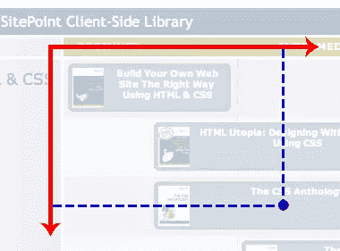
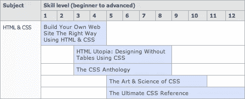
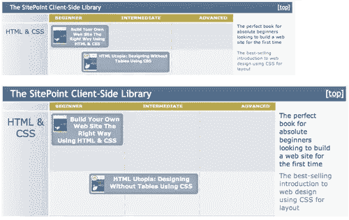

# 构建矩阵——建筑师笔记

> 原文：<https://www.sitepoint.com/building-the-matrix-notes-from-the-architect/>

matt Magain[最近关于构建新的](https://www.sitepoint.com/enter-the-matrix-browse-the-complete-sitepoint-library/) [SitePoint Book Matrix](https://www.sitepoint.com/books/library/) 的博客文章提出了几个有趣的问题，我将尝试回答这些问题，因为是我构建了它。

## 什么时候桌子不是桌子？

当它的数据不是真正的表格时；换句话说，当它表示的数据不是真正的二维时。我们在这里看到的是*视觉上的*二维，因此乍一看，用表格数据来表示它似乎是合理的；但是数据本身根本不是二维的，而是线性的。

二维数据集有两个轴，每个轴代表一个不同的范围或一组值，因此我们应该能够根据数据绘制轴，并能够进行有意义的交叉引用。但是如下图所示，我们不能:

当然，我们可以绘制这些线并创建参考点，但它们没有任何意义，因为 *x* 和 *y* 轴**都代表相同的刻度**(技能水平)。

在实现设计之前，我们需要决定如何标记数据，这就是为什么首先确定数据的自然结构如此重要，以便知道使用哪种元素语义。当考虑语义时，我总是使用的底线是考虑那些使用屏幕阅读器的人将如何理解数据，其中没有视觉线索，只有语义。

在表格中绘制这些数据，我立刻意识到这是错误的组织方式:

结构的一致性如何——我们是否通过遍历列来获得数据的级数？行和列的排序是否意味着表中的某一点可以被交叉引用？或者仅仅是因为我们仍然在视觉上思考它，数据碰巧落入列中？我认为是后者，用这种方式呈现数据是不准确和令人困惑的。

现在让我们线性地表示相同的数据:

很快，它看起来更简单，更连贯，也更容易理解，无论你是看着它，还是听着它线性地读着。

我当时得出的结论是，数据是一个简单的线性结构，只以视觉上的二维方式呈现，因为这样更容易一眼看出模式。

## 为什么这个的 CSS 这么毛？

这并不特别困难或复杂，但也不简单。与所有精确布局一样，这种布局的主要困难是创建它，使其**随字体和窗口大小**而缩放。这个要求意味着所有的大小和位置必须是相对的，所有的框必须是灵活的，这样无论用户如何设置，布局都保持一致和准确:

另一个挑战是，顶部的彩色刻度只对**视觉感兴趣**——当内容被线性化时，这些信息没有任何意义，因此需要以只影响视觉布局的方式创建，而不是作为内容呈现。

右手边的解释文字也同样难以定位。就标记而言，这些内容紧跟在每个书名之后；但从视觉上看，它偏右了。为此，CSS 不仅要创建这个布局，还要确保足够的灵活性——这样，书框的高度和文本的高度就会共同影响整个项目的高度。改变其中任何一个都会影响到他们两个)。

如果你想逛逛的话，可以看看样式表。

当然，我们的[时尚设计师](https://www.sitepoint.com/blog/)坚持使用的无尽渐变和圆角让一切变得更加复杂……我想我只是一个<q>玻璃比它需要的大两倍</q>的家伙！

## 分享这篇文章