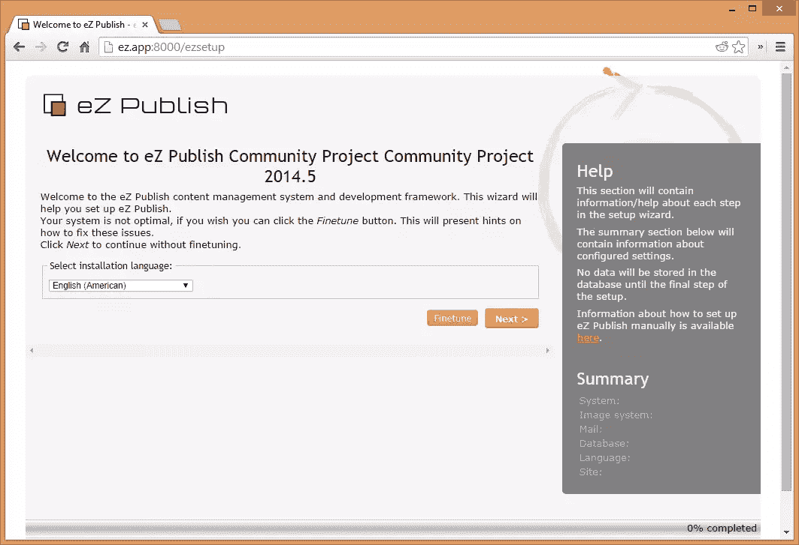
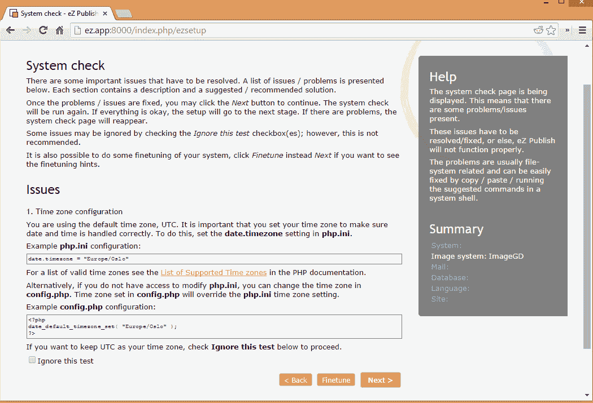
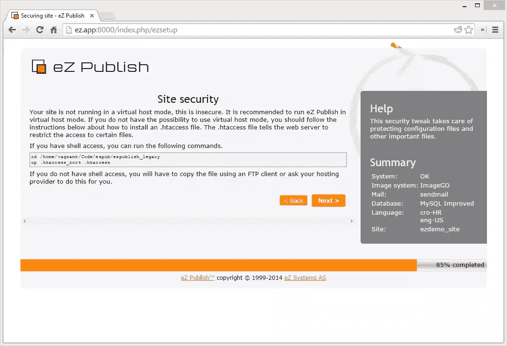
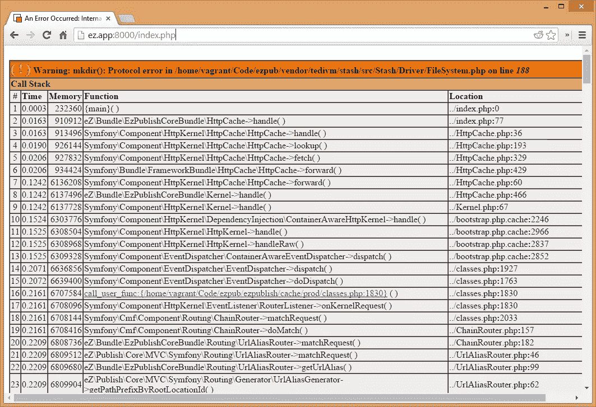
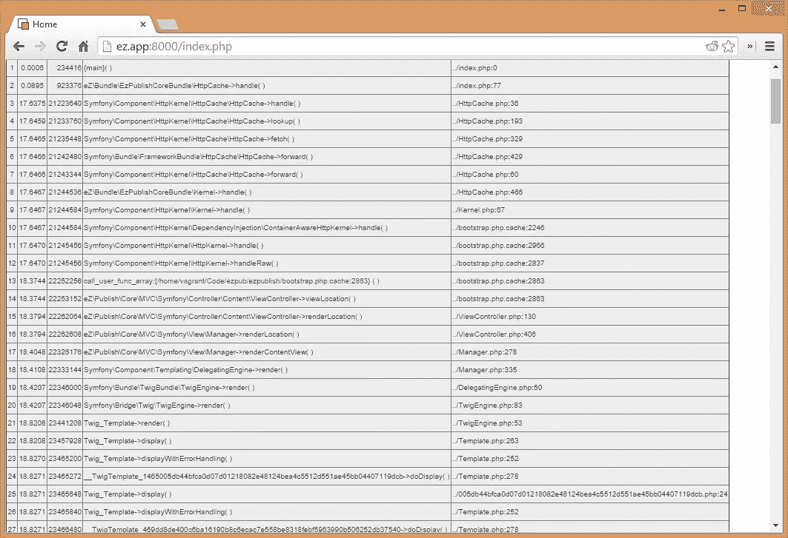
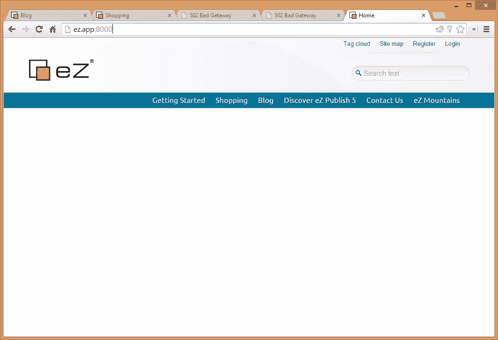

# 让 eZ Publish 5.x 在 Homestead 上工作的 13 个步骤

> 原文：<https://www.sitepoint.com/13-steps-get-ez-publish-5-x-homestead/>

从那以后，我又看了看 eZ Publish(现在的 eZ 平台)，事情有了很大的改善。详情[此处](https://www.sitepoint.com/getting-started-ez-platform-vagrant/)。

* * *

这篇文章最初是关于如何在 Homestead 上安装 eZ Publish 的一个快速提示，只需要几个步骤。然而，当我看到它的建立和从零开始开发一个托管在 Windows 上的流浪盒子需要付出多少努力后，我决定把它写成一篇完整的文章。我吃过苦，你就不用了:)

我希望 eZ 团队能解决我下面陈述的问题，如果他们解决了(如果他们解决了),我会相应地修改这个帖子。当然，我的环境非常特殊:在 Windows 上流浪。然而，这应该无关紧要。我试着用同样的方式启动的每一个 CMS、应用和框架都可以在几分钟内运行。在今天的现代网络世界中，没有理由不在所有事情上以同样的方式工作。

## 流浪友好应用


我们来定义一下流浪的目的。流浪的目的是团队团结，生产/开发对等**而不管主机操作系统**。换句话说，流浪者的目的是双重的:

1.  能够为每个团队成员提供*相同的*开发环境，以避免“它在我的机器上工作”的借口
2.  能够尽可能接近地复制生产环境，而不中断主机或同一台机器上专用于其他客户端的环境

因此，我们使用 Vagrant 为单个项目提供完全相同的虚拟机副本，这些副本可以轻松销毁和重建，而不会影响更轻松、更快速和更具可扩展性的开发、试验和部署。

通过试验下面的安装程序，我发现 eZ Publish 并没有让这变得容易。在 2014 年，大多数拥有多个客户和/或项目的专业开发人员甚至在独自工作时也使用 vagger——当考虑到我们拥有过多的托管选项、工具和这些工具的版本时，为每个项目提供专用、独立、可破坏和可重建的环境是无价的。

我很失望最近没有看到更多的应用程序采用流浪者优先的方法。就像我们在开发前端时需要首先考虑移动设备一样，我们在开发后端库、框架和应用程序时应该首先考虑虚拟机——否则整个世界关注的 Docker/vagger 划分故事就没有意义了，当世界转向 Heroku、GAE、亚马逊和其他公司时，那些无法适应的应用程序将被抛在后面。

让我们现在开始安装程序。

> **重要提示:**如果你不在 Windows 上，第 5 步可能不会发生在你身上。如果您使用的是 Windows，可以通过在“提升的”Gitbash /命令提示符下运行整个过程(以管理员身份运行)来避免第 5 步。管理员用户是唯一有权在 Windows 8 上创建符号链接的用户。有[传言](http://xiankai.wordpress.com/2013/12/26/symlinks-with-vagrant-virtualbox/)这是可以修复的，但没有一个可靠的工作。以管理员身份运行您的开发环境会打开一个全新的蠕虫罐，因此这样做的风险由您自己承担。如果任何人成功地给了一个普通的 Windows 8 用户通过 Gitbash 创建符号链接的权限，请告诉我。

## 第一步:改善家园

有一个[拉勒维尔家园改进的](https://www.sitepoint.com/quick-tip-get-homestead-vagrant-vm-running/)箱子准备好了，正在工作。如果您做了`vagrant up`来查看它是否工作，那么做`vagrant destroy`以便我们可以配置它。

## 步骤 2:添加站点

打开`Homestead.yaml`文件，添加一个新站点:

```
 - map: ez.app
      to:  /home/vagrant/Code/ezpub/web
```

将`ez.app`添加到你的主机的`hosts`文件中，如 [Laravel Homestead 改进](https://www.sitepoint.com/quick-tip-get-homestead-vagrant-vm-running/)快速提示中所述。基本上，确保你的`hosts`文件包含`127.0.0.1 ez.app`。当然，还要映射共享文件夹。

用`vagrant up`引导虚拟机，用`vagrant ssh`进入虚拟机。

## 步骤 3:安装必备组件

该项目需要 PHP 安装`php-intl`和`php-xsl`扩展。在整个设置向导中，它还会要求您输入`sendmail`。在 Homestead 中，您可以通过以下方式安装所有这些软件:

```
sudo apt-get update
sudo apt-get install php5-intl php5-xsl sendmail
```

## 第四步:获取代码

```
cd Code composer create-project ezsystems/ezpublish-community ezpub
```

以上将创建一个 eZ 项目供**使用**，而不是用于开发。要获得开发版本，请参考他们的 Github 页面。

请注意，eZ Publish 非常大，需要一段时间才能完成。几乎可以肯定的是，你将达到“每小时 60 个请求”的未经认证的 GitHub API 速率限制，所以你可能需要在安装过程中输入你的用户名和密码来通过这个障碍。

由于超时和需要下载的大量数据，该过程可能会失败几次。如果发生这种情况，只需用`rm -rf ezpub`删除整个`ezpub`文件夹，并重新运行上面的`create-project`命令——每次都会更快，因为每次下载一个包时，它都会在后续请求时从本地缓存中提供服务，而不是重新下载。

安装程序会在最后询问你一些数据(密码、备用区域设置等)。填写它或只需在每个按钮上按回车键即可使用默认值。

我们之所以不使用从 eZ Publish 网站下载的准备好的`tar`档案，是因为准备好的档案中充满了符号链接——如果你的虚拟机托管在 Windows 机器上，这些就不起作用了。为了保持多平台友好，我选择了`composer create-project`方法。

## 步骤 5:处理安装程序错误[仅适用于 Windows 主机]

就目前情况而言，eZ Publish 并没有真正针对虚拟机或边缘情况进行微调，并且有许多团队没有考虑到的问题，例如，在 Windows 平台上的虚拟机中运行它。由于所有的依赖关系，它肯定会在安装过程中的某个地方出错。对我来说，可能对你也是，这将是安装资产的安装后脚本。Install assets 实际上是 Symfony 的一部分，在执行它的类中，它实际上对窗口和符号链接发出警告，但如果父项目强制使用符号链接，就不会考虑它，就像 eZ Publish 做的那样。

如果发生这种情况(你会得到一个关于符号链接之类的错误)，打开`composer.json`并删除该行:

```
"symfony-assets-install":  "relative",
```

这将迫使安装人员*复制*设计资产，而不是*符号链接*它们。

然后，通过执行以下命令重新运行安装后脚本:

```
composer run-script post-install-cmd
```

您可能仍然会得到一个关于遗留 eZ 版本的错误和某种注释包，但我不确定如何修复它，或者它是否重要。


## 步骤 6:创建数据库

创建一个数据库，我们稍后会馈送到 eZ。用`mysql -u homestead -psecret`登录到虚拟机中的 MySQL 实例。然后，运行:

```
CREATE SCHEMA `ez` DEFAULT CHARACTER SET utf8 COLLATE utf8_general_ci ;
```

## 步骤 7:设置文件夹权限

在 Homestead 上可以跳过这一步，因为服务器已经在“流浪者”用户下运行，该用户拥有 ezpub 文件夹中的所有子文件夹。

## 步骤 8:运行安装向导

关于自动处理第 8 步和第 9 步的一部分的方法，请参见下面 Jerome 的评论。

访问`ez.app:8000`并看到以下屏幕。



这就是超级诡异的地方。[无缘无故，这种情况发生](http://share.ez.no/forums/ez-publish-5-platform/ezsetup-does-nothing)。是的，这是一个两年来一直没有解决的问题——说真的，这是一个 PHP 项目中两年前[未解决的 bug](https://jira.ez.no/browse/EZP-20196) **。在核心中修复它需要 7 秒钟的工作，包括提交和推送(见 8.2)。在我们的情况下，有两种方法可以绕过它。没有一个是令人愉快的，所以由你选择一个。**

### 第 8.1 步:欢乐随之而来

为了绕过它，我是非常认真的，这不是一个笑话——你需要打开开发工具，把`ezsetup`放在表单的`action`属性的末尾，因为默认情况下它只写`index.php`。令人困惑的是，这样的问题怎么会在 2014 年仍然存在，但我们在这里:



如果您不喜欢修改框架的源文件，请选择这种方法。

### 步骤 8.2:侵入内部

第二种方法可能稍微简单一点，就是修改向导本身的形式，并改变它的 action 属性。

进入`ezpub\ezpublish_legacy\kernel\setup\ezsetup.php`，找到该行:

```
$tpl->setVariable(  'script', $script );
```

在它上面，放上这个:

```
$script =  ($script ==  '/index.php')  ?  '/index.php/ezsetup'  : $script;
```

在这之后，动作属性将被固定。

* * *

我不建议你试图跳过向导手动设置 eZ Publish，因为你会让 T2 发疯。客观地说，他们的安装程序和文档是我见过的最糟糕的。如果你试图按照他们的指示去做，你甚至会失去尝试的欲望。我希望 eZ 团队将很快完全删除对其遗留系统的所有依赖和引用，只留下新的核心——我还希望他们很快将他们的文档更新为更具可读性和更像 2014 年的东西:现在越来越多的人在专用虚拟机上开发，简单的安装程序和易于进入是任何想要脱颖而出的 CMS 的最重要的属性。

## 步骤 9:忽略向导错误

eZ Publish 设置已经过时，只能识别一个服务器(Apache ),因此认为它不是在 Vhost 模式下运行:



忽略此警告。继续进入下一个屏幕(如果您使用了 8.1。，不要忘记再次改变表单动作，否则您将重新开始)。

在安装向导结束时，您会得到一个 Nginx 超时错误。这是因为 eZ Publish 是出了名的慢，因为它必须处理糟糕的旧版本和新版本，并且由于运行在 VM 上，所以当这种情况发生时，只需从 URL 中删除任何与`ezsetup`有关的内容并刷新即可。你将会被这种美所迎接:



## 步骤 10:禁用缓存

上面屏幕中的错误发生在 eZ 试图创建 PHP 文件的缓存时，就像这样:`/home/vagrant/Code/ezpub/ezpublish/cache/prod/stash/0fea6a13c52b4d47/25368f24b045ca84/a1e4f174919d040af6d06113d677c9e0/4a1c6be177996f9e/03934ae1c1c02ffc/9a0364b9e99bb480/dd25e1f0284c8555/caf9b6b99962bf5c/2264824231d7a40c/d3d9446802a44259/755d38e6d163e820.php`(唉，不要问…)。

这个缓存引擎不够聪明，无法在失败时自行禁用，所以我们必须手动执行。

在`ezpub\ezpublish\config\ezpublish.yml`中，将`stash`块改为:

```
stash: caches:  default: handlers:  -  BlackHole inMemory:  true registerDoctrineAdapter:  false
```

“在内存中”意味着内存将用于存储缓存，而不是文件系统。用`rm -rf ezpublish/cache/*`清除缓存并刷新。如果需要，以后用比文件系统缓存更好的东西替换缓存引擎。我不知道如何减轻 mkdir 的协议错误——我知道这与 VM 有关，但没有更多的。非常感谢任何建议。

现在，迎接您的可能是另一系列警告，最后是一个 503 错误:



但至少我们得到了渲染的标题！

## 步骤 11: Bootstrap.php.cache 和响应限制

导致所有这些警告的文件实际上是 eZ 加载所需的所有 PHP 文件的汇编。它们已经合并成一个了。！！)并放入`ezpublish`文件夹中，从那里提供。该文件代码混乱，不容易调试，因为除了没有 php 扩展和缺少 IDE 亮点之外，它也不尊重任何类型的编码标准(因此，一个文件中有几十个类，没有缩进，没有可读性)，毕竟它“只是一个缓存文件”。但是当您的整个应用程序依赖于一个缓存文件时，如果能够轻松地调试它就好了。

撇开糟糕的缓存实践不谈，我们可以禁用这一切，只需通过更改`ENVIRONMENT`环境变量，在调试模式下加载 eZ Publish。您可以在`Homestead.yaml`中更改它，这样它就可以在启动时通过添加到“variables”块来自动配置:

```
 - key: ENVIRONMENT
      value: dev
```

或者，你可以只编辑第 8 行`ezpub/web`下的`index.php`文件，把`$environment = 'dev';`放在`$environment = getenv( "ENVIRONMENT" );`下。

在这一点上，如果你已经跟随，第二种方法更容易，因为否则如果你再次`destroy`和`up`你将不得不重新开始整个设置过程。

完成这个，你应该能够得到这个渲染:



由于 eZ Publish 请求响应非常大，我们需要提高 Nginx 的限制:

```
sudo vim /etc/nginx/sites-available/ez.app
```

在 root 指令下，粘贴以下内容:

```
fastcgi_connect_timeout 60; fastcgi_send_timeout 180; fastcgi_read_timeout 180; fastcgi_buffer_size 128k; fastcgi_buffers 4  256k; fastcgi_busy_buffers_size 256k; fastcgi_temp_file_write_size 256k;
```

用`sudo service nginx restart`保存、退出、重启 Nginx。

一些页面可以工作(博客，发现)，其他的，嗯，不太好。然而，调试他们的演示包超出了这篇已经很长的文章的范围。

## 步骤 12:从网址中删除 index.php

默认情况下，出于某种原因，所有 Symfony 应用程序的 URL 中都有“app.php”或 eZ Publish 的“index.php”。我猜有人必须支持那些从 2001 年开始的主机提供商和开发者。让我们通过移除它将这两个项目带入 21 世纪。

```
sudo vim /etc/nginx/sites-available/ez.app
```

根据此处的[说明，在“位置”块上方，添加:](http://wiki.nginx.org/Symfony)

```
rewrite ^/index\.php/?(.*)$ /$1 permanent;
```

用`sudo service nginx restart`保存、退出并重启 nginx。

## 第十三步:欢欣鼓舞

经过艰苦的过程，我们终于完成了。我花了一天多的时间，希望你花了不到 10 分钟(不包括下载时间)。现在你也可以在你自己的家园实例上尝试这个强大的，尽管过于臃肿，过于复杂和过时的 CMS。让我知道它是如何工作的！

## 结论

在我看来，任何需要这么多工作来启动和运行一个流浪盒子的 CMS 都不值得关注。当然，您可能可以轻松地将其安装到主机上并以这种方式运行，但这不是一种专业的方法——开发环境需要封装和隔离，开发人员需要能够随心所欲地破坏和重建实例。CMS 应该有脚本自动执行，检测所有可能的问题(如符号链接不可用，自动切换到硬拷贝模式)，并设置一切(从数据库到文件夹权限，如果必要的话)，只要求 sudo 的方式。

这个过程已经安装了 eZ Publish，但是值得吗？这由你决定。虽然 eZ 肯定是一个强大的 CMS，但进入它的困难充其量是有害的。你现在有了一个测试它的共同起点，我一定会在 [PHP 夏令营](https://www.sitepoint.com/announcing-php-summer-camp/)和其他地方的 eZ 人员那里找到更多关于这些问题的信息。在那之前，让我们在这个盒子上进行一些 eZ 教程，好吗？

请将您的反馈放在下面的评论中，我渴望听到不同的方法，尤其是如果您已经尝试在非 Windows 主机上这样做，并且让演示包工作了！

* * *

**编辑:**这个 Github 回购引起了我的注意。这是一个现成的 eZ Publish 的流浪配置作品。不过，有两点需要注意:

1.  这里一步一步的要点是向您展示，为了开发的目的，在任何机器上建立并运行一个相同的 eZ 实例是多么简单(事实证明这并不简单，这完全是另一回事)。这很重要，因为，举例来说，不是每个人都使用同一个操作系统——上面链接的回购是在 CentOS 上，而 Homestead 是 Ubuntu。在任何操作系统上，安装过程都应该同样简单。
2.  该虚拟机中的 eZ Publish 文件实际上就在其中——没有与外界(主机)共享文件夹，因此不会出现符号链接问题，也没有机会在安装在主机上的 ide 中打开应用程序的文件来入侵它们。这妨碍了有效的开发工作流。

## 分享这篇文章