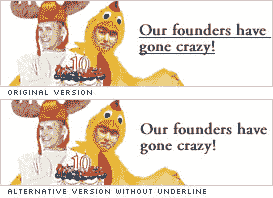
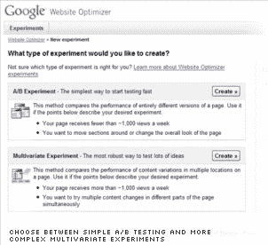
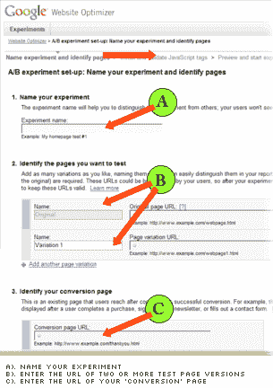
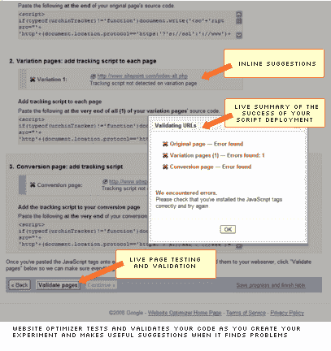
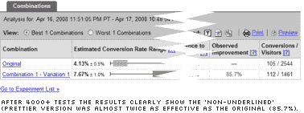

# 谷歌网站优化工具:我告诉过你

> 原文：<https://www.sitepoint.com/web-site-optimizer-tool/>

作为设计师和开发人员，我们每天都要做出设计决策。我们绘制缩略图布局，我们研究热图，我们在屏幕上处理设计，我们试图像用户一样思考，我们询问同事和朋友对一系列复杂问题的看法和见解:

*   我应该在主导航中使用哪些关键词？
*   我应该如何安排布局以防止人们掉下
    呢？
*   我的广告在哪里最有效？
*   人们可以很容易地找到我的搜索框吗？

简而言之，我们都尽最大努力权衡所有变量，选择最佳组合，构建它并将其发布到网上。

但是你能证明这是最好的选择吗？

随着谷歌“我告诉过你”工具(也称为[网站优化工具](http://services.google.com/websiteoptimizer/overview))的正式发布，也许现在你可以做到了。

昨晚我们运行了一个整洁的小测试，给了我们一些很好的结果。我会告诉你我们的审判。

##### 测试:划线还是不划线？

如果你在过去几天访问了 sitepoint.com，你会发现很难避免看到我们的创始人(马克和马特)分别穿着鸡服和驼鹿帽(也许是出于你的真实的“Photoshop 说服”)。

因为我们以前从来没有真正打折过我们的任何套件，所以我的设计概要是确保每个访问网站的人都知道它。我一般不喜欢摆弄我们的网站标题横幅区，但这是一个暂时的例外。

症结在于“我们的创始人疯了！”文字。我们的总经理 Luke 担心用户可能会注意到图片，但不知道它是可以点击的，这是可以理解的。他很想给文本加下划线，以强调这是一个链接。

我个人的观点是，图片和它的定位足够激进，足以激励用户与它互动，下划线会在视觉上分散网站的注意力，而不会有更多的点击。

我的任务是使用[谷歌网站优化器](http://services.google.com/websiteoptimizer/overview)通过简单的 A/B 分割测试来证明这一点。(注意:这项服务是免费的，但是你需要一个 Google AdWords 或者 Google Analytics 账户来运行你自己的测试。然而，你的测试不需要涉及 AdWords。)

##### 该过程

首先，创建一个新的实验:一旦你激活了你的账户上的网站优化器，你将被询问是否要创建一个新的实验。

多变量实验需要更多的设置时间，更多的流量数据才能有效，所以我建议坚持更简单的 A/B 实验选项。

接下来，设置您的测试页面:一旦您创建了您的实验，您需要您想要测试的页面的两个独立版本—可能是`index.html`和`index2.html`。这可能会产生其他问题，但我们稍后会讨论这些问题。

您还需要确定一个转换页面——您的站点中您试图将用户转移到的目标页面。这可以是任何东西，从博客文章或产品页面，到结帐页面或导航标签。您需要将代码放在这个页面上，所以它可能需要是您站点上的一个页面，而不是一个外部目的地。

接下来，你将被要求命名你的实验，并告诉网站优化器你的三个测试页面在哪里。然后会问你是由你来给测试页面添加 JavaScript 标签，还是由一个独立的开发团队来完成这项工作。

我想如果你正在读这篇文章，你可能是一个 D.I.Y 型的人。

不管怎样，添加这些脚本的人并不真的需要任何 JavaScript 知识，他们只需要足够了解他们的 HTML，以便能够准确地将代码片段复制并粘贴到他们的页面中。

将“JavaScript 标签”添加到您的页面中。尽管这是程序中最具技术性的部分，但谷歌做得很好，让它变得很容易。

您将有 4 个 JavaScript 片段添加到您的页面中(为每个新的页面变体再添加一个)。

*   一个在原始页面的顶部
*   一个在原始页面的底部
*   另一页的底部有一个
*   一个在你转换页面的底部

现在，为了验证您的 JavaScript。这是这项服务的一个优点。像这样的大多数服务的最大问题是在这个阶段很容易犯小的剪切-粘贴错误，我相信很多人在找不到问题所在时会迷失方向并放弃。

令人欣慰的是，Google 已经实现了一个漂亮的内嵌检查器，它允许你添加代码，上传页面并测试它们，而无需离开网站优化工具。如果它确实发现了问题，它会指出问题所在，并提供合理的有益建议。

当谷歌给你所有的脚本打上绿勾时，剩下唯一要做的就是等待用户蜂拥而至。该工具将自动分配你的测试页面之间的传入流量，并跟踪用户退出页面时的行为。

##### 结果呢

SitePoint 获得了足够的流量，可以在大约 12 小时内为我们提供有用的数据。在周四晚上设置好测试页面后，我们在周五早上有了一个清晰的结果。

我设置测试的主要动机只是为了证明带下划线的文本版本不会比干净的版本表现得更好——如果它们的表现大致相同，选择更漂亮的版本是显而易见的。

最后，实际结果连我都很惊讶。经过 4000 次测试，漂亮的版本被证明几乎是丑陋的下划线版本的两倍(85.7%)。对于一个看似很小的变化来说，这是一个显著的差异！

这也让你想知道你还可以测试什么…

##### 不利之处

这种技术有几个缺点。

首先，脚本片段破坏了 HTML 验证。更令人恼火的是，当我试图重写它们以使它们有效时——也就是说，我把`<script>`改成了`<script type="text/javascript">`——谷歌再也不能使用它们了。

也许有可能解决这个问题，但这是谷歌的一段草率的代码。

其次，创建一个页面的两个版本并不意味着原始页面的流量将被分割。这意味着在实验期间，你的网页统计数据会显示原始页面的显著下降。

这两种方法都很难证明，但如果你让实验运行很长时间，可能会对你原始页面的 PageRank 产生一些影响。

对我来说，有点令人失望的是，目前谷歌分析或 PageRank 似乎都没有为自己的工具补偿或调整他们的行为。希望这将在未来得到纠正。

当然，我们的想法是尽可能快地确定哪个页面效果最好，并使其成为唯一的页面。这需要多长时间显然很大程度上取决于你的交通水平。我们能够在 12 小时内获得足够多的数据来做出决定，但是基于 10 或 20 个用户的行为做出重要决定是没有好处的。

尽管有一些琐碎的问题，我不得不说这是一个了不起的服务，对几乎所有编写页面的人来说都是一个巨大的好处。

不管你认为你知道多少，这个工具很可能会教你一些新的东西。

## 分享这篇文章