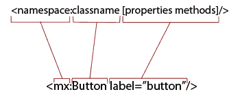
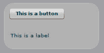

# 关于 Flex 3 的绝对初学者教程文章

> 原文：<https://www.sitepoint.com/beginners-tutorial-flex-3-2/>

要将这个简单的页面作为 Flex 应用程序运行，我们需要使用 Flex SDK 编译我们的 MXML 代码。结果如下所示:


您首先会注意到 MXML 是一种 XML 格式。为了向 Flex 编译器表明我们正在定义一个应用程序，我们使用了`<mx:Application/>`元素，就像我们使用`<html></html>`标签来定义一个网页一样。然后我们可以在`<mx:Application/>`标签中添加其他元素。在上面的例子中，我们添加了一个`<mx:Button/>`标签来创建一个按钮，就像我们在网页表单中使用一个`<input type="button" />`标签一样。

如您所见，这与构建传统的 web 页面非常相似，框架为您提供了 XHTML 中可能用到的一切(按钮、列表等)。)等等。您需要学习的只是框架中组件的属性、方法和名称，所有这些都可以从 Adobe Flex 3 语言参考中获得。

GA_googleFillSlot(“Articles_6_300x250”);

当然，Flex 框架不仅仅由用户界面组件组成；它还包含您的应用程序可以利用的操作。例如，有一个名为 HTTPRequest 的组件，您的应用程序可以使用它来发送和接收来自服务器端服务(PHP、ASP.NET 等)的数据。).当您运行应用程序时，您实际上看不到 HTTPRequest，因为它在后台工作。

Adobe 已经将所有这些组件捆绑在一起形成了 Flex 框架，因此您不必从头开始创建它们。

最终，随着您对 Flex 越来越有经验，您会想要创建自己的组件，并反复使用。一段时间后，您将创建一个自己的小库，它扩展了 Flex core 框架以满足您的个人需求。

##### 我需要什么来开始？

随着 Flex 3 的开源，开始构建 RIA 变得前所未有的简单。要开始，您可以使用两个选项之一:

*   大多数严肃的 Flex 开发者选择的工具是 Adobe 的官方 Flex IDE。Flex Builder 也有专业版，其中包括一个 Flex 图表组件。Flex Builder 3 的零售价约为 376.00 美元，专业版的售价约为 900.00 美元。
*   你还需要自己的编程编辑器，结合免费的 Flex 3 SDK。是的:像啤酒一样免费。

安装 Flex Builder 3 非常简单，因为它附带了一个用户友好的安装程序。

另一方面，Flex SDK 有点棘手。要安装 Flex SDK，请下载 zip 文件并将其解压缩到您选择的文件夹中。诀窍是该文件夹应该在您的路径中(这意味着您应该能够从命令提示符执行该文件夹中的文件，而不管您当前的位置)。

如果您打算认真对待您的 Flex 开发，我建议您购买 Flex Builder 3 IDE。Flex Builder 基于开源的 Eclipse 编辑器，它本身就是一个非常强大的 IDE。如果您想在购买前试用，Flex Builder 3 可以试用 30 天。虽然 Flex 3 SDK 是免费的，但 Flex Builder 3 为 Flex 开发提供的好处比标准文本编辑器多得多。

##### MXML 很容易！

与其他标记语言缩写不同，MXML 实际上并不代表任何特定的东西。(尽管有些人，我也是其中之一，喜欢认为它应该代表神奇的可扩展标记语言。)

Macromedia 于 2004 年 3 月创建了 MXML，之后该组织被 Adobe 收购。MXML 主要用于设计 Flex 应用程序。作为 XML 的一种方言，标准的有效性规则适用:标签必须是封闭的，所有其他 XML 规则都适用。

MXML 的每个组成部分都遵循相同的模式:

1.  您可以声明一个名称空间，告诉 Flex 在哪里可以找到特定的组件。

3.  从该名称空间中声明想要使用的组件类(例如 Button)。

5.  您可以使用属性来修改可用的属性和方法，如下所示。



因为它们是在组件的类结构中定义的，所以可以在每个组件中使用的属性和方法是不同的。

您可以使用 Flex 级联样式表来设计应用程序的可视组件。这些样式可以添加到与组件的属性和方法相同的位置，但是讨论 Flex 级联样式表超出了本文的范围。

MXML 组件可以有子元素(就像 XML 一样)。例如，像 Canvas 这样的容器元素可以有像 Button 或 Label 这样的子元素。下面的代码演示了这一点:

```
 <mx:Canvas x="53" y="64" width="192" height="94"  
      cornerRadius="20" borderStyle="solid"  
      backgroundColor="#A9A9A9" id="mainCanvas">  

    <mx:Button x="10" y="10" id="newButton"  
        label="This is a button"/>  

    <mx:Label x="10" y="57" id="newLabel"  
        text="This is a label"/>  
  </mx:Canvas>
```

如果您编译并运行这段代码，您会看到这个网页:



通过将布局容器(如 Canvas)与其他组件(如按钮和列表)相结合，可以在短时间内创建出色的应用程序设计。

**Go to page:** [1](https://sitepoint.com/beginners-tutorial-flex-3) | [2](https://sitepoint.com/beginners-tutorial-flex-3-2/) | [3](https://sitepoint.com/beginners-tutorial-flex-3-3/)

## 分享这篇文章