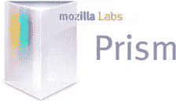

# Mozilla Prism:卡在 UI 中间

> 原文：<https://www.sitepoint.com/mozilla-prism-stuck-in-the-middle-with-ui/>

TechCrunch 上最近的一篇[客座博文重新点燃了我对网络应用和桌面应用之间空间的兴趣。马修·格特纳写道:](http://www.techcrunch.com/2008/03/22/bridging-desktop-and-web-applications-a-look-at-mozilla-prism/)

> 单站点浏览器(SSB)旨在为网络应用带来最好的桌面。不同于在 Firefox 或 Safari 等普通网络浏览器中运行程序，这些程序被夹在《纽约时报》文章和 TechCrunch 帖子之间的标签中，每个应用都有自己的专用浏览器，该浏览器被定制为包括用户熟悉和喜爱的许多桌面功能。

 输入[Mozilla Prism](http://labs.mozilla.com/2007/10/prism/)——一个软件包，允许你创建一个简单的网络浏览器，只为那个应用程序工作。

从最近的 [0.2 发布公告来看:](http://labs.mozilla.com/2008/03/major-update-to-prism-first-prototype-of-browser-integration/)

> Prism 是一个开源的跨平台功能原型，允许用户将 web 应用程序从浏览器中分离出来，直接在桌面上运行。

像 [GMail](http://mail.google.com) 、 [Google Calendar](http://calendar.google.com/) 、 [Zoho](http://www.zoho.com/) 、 [Buzzword](http://buzzword.com/) 、 [Tada List](http://tadalist.com/) 、 [Basecamp](http://basecamphq.com/) 这样的 web 应用程序——几乎任何大量使用 Ajax 且不适合传统浏览器文档模型的应用程序——都是转变为 Prism 应用程序的良好候选。

虽然仍处于早期阶段，但 Prism 等 SSB 应用的优势是显而易见的:

*   一些网络应用更像是“RIA”而不是“web site ”,所以让它们在一个单独的线程中运行非常方便。例如，你可以在你的浏览器和你的 Prism 应用程序之间 **Alt-Tab** ( **Cmd-Tab** )，如果你的浏览器崩溃，那么你的 Prism 应用程序不会受到影响。
*   去掉浏览器 chrome 的杂乱让应用程序的用户界面熠熠生辉。
*   初级用户(嗨妈妈！)可以让他们的开始栏或 OS X dock 预装一堆 Prism 应用程序，他们只需点击就可以使用——不用再教他们浏览器标签、书签之类的东西了。
*   可以从任何网站或网络应用程序创建 Prism 应用程序。如果你想把[的 SitePoint Marketplace](https://marketplace.sitepoint.com/) 作为自己的应用程序来运行，你可以这么做(尽管 Marketplace 可能不是最合适的例子，因为它依赖于浏览器的功能，比如后退按钮)。但是如果你想，你可以——你不需要等待网站所有者为你创建一些东西。

当然，这种方法也有缺点——撇开当前版本的漏洞不谈。高级用户最有可能受到影响。

*   首先，你的常规 Firefox 扩展都不可用。这意味着如果你有任何你依赖的 Greasemonkey 脚本，你将不能在你的 Prism 应用程序中使用它们。 <ins datetime="2008-03-25T11:14:00+00:00">实际上，可以通过应用程序窗口右下角的**工具** > **附加组件**菜单，将 Firefox 扩展安装到 Prism 应用程序中。</ins>
*   默认情况下，Prism 从你的 Prism 应用所基于的网站获取`favicon`。这是非常小的，放大后会像素化，虽然也可以使用你自己定制的更漂亮的图标。
*   由于 HTML、CSS 和 JavaScript 在定义用户界面元素方面的局限性，该应用程序仍然不太像一个原生桌面应用程序。
*   当然，最大的缺点是 Prism 应用不能离线运行(不像平台如 [Adobe AIR](http://www.adobe.com/products/air/) 和 [Google Gears](https://www.sitepoint.com/first-look-google-gears/) )。它真的只是一个精简的浏览器。

**创建一个棱镜应用**

创建 Prism 应用程序非常简单:

1.  下载并安装 Mozilla Prism
2.  启动 Prism 并指定一个网站的 URL、图标和一些其他设置，然后点击 **OK**
3.  你的棱镜应用程序的启动图标将出现在你的开始菜单，OS X 码头或桌面。

*谷歌邮件和谷歌日历应用到达桌面*

此外，如果你运行的是 Firefox 3(仍在测试阶段), Prism 也可以作为 Firefox 的一个[扩展](https://addons.mozilla.org/en-US/firefox/addon/6665),它增加了一个“将网站转换为应用程序”的菜单选项，使得 Prism 应用程序的创建更加简单。

Mozilla Prism 0.2 可供下载，用于桌面化你选择的任何网站。

你怎么看——像 Prism 这样的混合平台有用吗，或者它只是产生了两个世界的最坏结果？

## 分享这篇文章