# 使用 Photoshop 笔刷创建令人眼前一亮的图形

> 原文：<https://www.sitepoint.com/graphics-photoshop-brushes/>

Photoshop 笔刷工具除了制作边缘模糊的形状之外，还能做更多的事情。在本文中，您将学习如何使用 Photoshop 笔刷面板来创建一些在您的网站上使用的令人惊叹的图形效果。我们还将介绍如何通过加载其他人的笔刷甚至制作自己的笔刷来扩展你的笔刷选项！

##### 模仿自然

让我们来看看如何使用 Photoshop 来创建一个美丽的树叶散射。如果你还没有尝试过 Photoshop 笔刷，你可能会想我们会单独创建这些叶子——旋转它们，挤压它们，着色，或者变换它们，直到它们完美而独特地排列。

不是这样的！借助 Photoshop 笔刷的强大功能，创建类似这样的效果只需几分钟，而不是几个小时！

在 Photoshop 中，选择**笔刷**工具(B)。从*选项*栏，点击笔刷旁边的小箭头，显示所有可用的笔刷。寻找叶刷，下面用红色圈出。

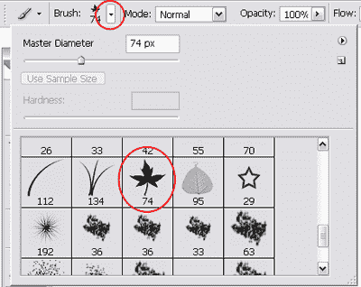

如果您没有看到它(叶子画笔应该在 Photoshop CS2 和更高版本中可用)，您可能需要重置您的画笔。被称为**笔刷预设**选取器的弹出框有另一个小箭头；点击此处显示笔刷选项，然后选择**重置笔刷**。

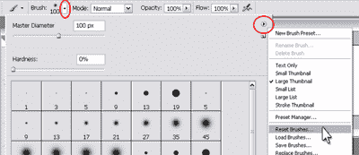

当您在图像画布上单击一次时，画笔本身会绘制一个树叶形状。但是，如果您单击并拖动，您会得到一行叶子，如下所示。它们之间的距离取决于你移动鼠标的速度。

打开**笔刷**调色板，开始玩选项。以下是一些你可以尝试的事情。

在**画笔笔尖形状**下，确保勾选**间距**复选框，并将滑块移动到 80%左右。

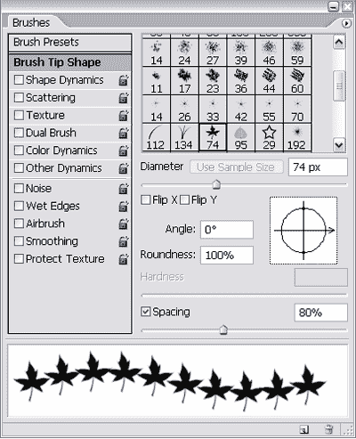

接下来，点击**形状动态**。对于所有与抖动相关的设置(**尺寸抖动**、**角度抖动**和**圆度抖动**)，拖动滑块至 100%。同时检查**翻转 X 抖动**和**翻转 Y 抖动**复选框。您可以在预览框中看到这会如何影响笔刷。

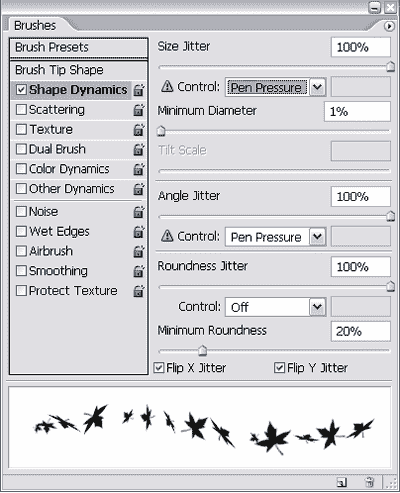

现在点击**散射**，增加**散射**量，选中**两轴**复选框。这个设置决定了树叶可能结束的距离——我把我的设置为 300%左右。如果你愿意，你还可以增加**计数**，它会影响出现的叶子数量，以及**计数抖动**，它会随机化叶子的数量。

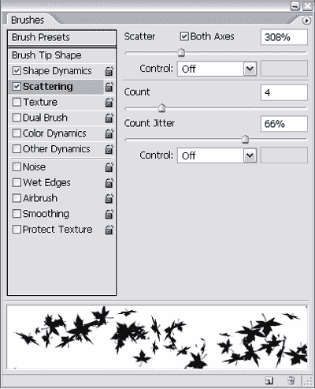

我们要修改的下一组参数会影响笔刷的颜色动态。点击**颜色动态**复选框；此页面允许您控制叶子的颜色，并在每个形状之间提供一些变化。我已经稍微增加了**色调**和**饱和度抖动**的数量。不幸的是，Photoshop 预览功能并不显示这些颜色抖动效果，但如果您希望增加或减少颜色变化，您可以随时返回到此窗口并调整设置。

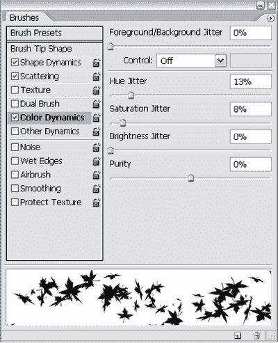

如果你愿意，你也可以尝试改变**其他动态**设置来改变不透明度和流量。对于这个例子，我希望我的叶子是实心的，所以我没有调整这些设置。

现在你已经准备好测试画笔了！在下图中，我已经展示了我将在顶部窗口中使用笔刷工具绘制的粗略路径。底部的窗口显示了我们的新笔刷沿着这条路径的结果:

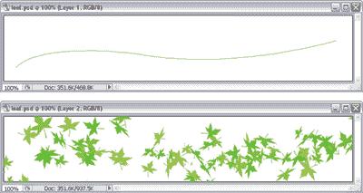

此时，您可以返回到**笔刷**调色板，调整不同的设置，包括笔刷的大小，以尝试不同的效果。每次使用画笔，你都会得到稍微不同的结果，但是当你使用调色板时，你会找到你喜欢的组合。

Photoshop 附带了其他内置画笔，可以提供类似的效果。点击**笔刷预设**选择器中的箭头，就好像你正在重置笔刷一样，你会看到其他可用笔刷库的列表。在**混合笔刷**选项下，尝试雪花或星形笔刷。在**特效**笔刷列表下，你会发现一些花卉形状，一个蝴蝶形状，甚至一只橡皮鸭！

##### 简单垃圾

你可以使用我们刚刚学到的模仿自然的概念，轻松地创造一个成功的垃圾效果。在下面的例子中，我将使用不同的 Photoshop 笔刷来创建一个锈迹斑斑的网站标题图形，如下图所示。

首先重置你的笔刷选项，就像上一个例子中描述的那样。然后，从**笔刷预设**拾取器中选择一个**飞溅**笔刷。

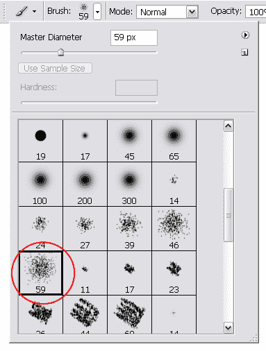

使用**笔刷**调色板中的选项。以下是我修改的确切设置:

*   画笔笔尖形状

*   间距:增加到 14%

*   形状动力学

*   尺寸抖动:100%
*   角度抖动:62%
*   圆度抖动:21%
*   选择翻转 X 抖动和翻转 Y 抖动

*   分散

*   散点图:两个坐标轴，274%
*   计数:2
*   计数抖动:52%

*   其他动态

*   不透明度抖动:35%

接下来，用锈橙色填充背景层(#b26d0a)，点击**图层**面板中的**新建图层**图标，新建一个图层。

将前景色设置为稍暗的阴影(例如#a26103)。使用**笔刷**工具，在你的图像上绘画，这样你就覆盖了大部分的画布。这产生了一个微妙的纹理效果，如下所示。

现在设置前景色为更暗的阴影(我用的是#8b5200)。使用**笔刷**工具创建另一个新层，在不同的区域添加几笔，继续构建你的垃圾效果。

继续添加不同的层和颜色，直到你满意的效果！

你可以尝试的另一件事，而不是使用不同的颜色，是改变选项栏中的**模式**来指定一个不同的选项，例如**乘**、**颜色加深**，或者**颜色减淡**。你需要降低笔刷的不透明度，这样效果不会太明显。直接在你的背景图层上使用笔刷工具；下面是我使用**颜色减淡**模式的一个例子:

下面是我在不同的不透明度下使用**色偏**、**乘**和**屏幕**后得到的结果:

当你创建自己的脏乱或糟糕的效果时，一定要探索 Photoshop 中可用的其他飞溅和艺术类型的笔刷！

##### 加载其他人的画笔

你不局限于标准的内置 Photoshop 笔刷。其他艺术家和设计师也提供许多美妙的——通常是免费的——画笔。在网上搜索“Photoshop 笔刷”这个词会得到很多资源。通常，当你下载画笔时，你会收到一个`.abr`文件。你可以将它移动到你的 Photoshop brush 文件夹位置(通常在 Windows 机器上是`Program FilesAdobeAdobe Photoshop XPresetsBrushes`，在 Mac 上是`Library/Application Support/Adobe/Adobe Photoshop X/Presets/Brushes`，其中`X`是你的 Photoshop 版本)。点击**笔刷**调色板或选项弹出菜单中的小箭头，选择加载笔刷，然后选择那个`.abr`文件。

##### 制作自己的刷子

还是找不到你要找的画笔？Photoshop 允许你制作自己的自定义笔刷。也许你想让你的 logo 标记有一个很酷的散射，或者也许你只是在为你的笔刷效果寻找一个特定的形状——无论哪种方式，你都可以通过自己创建来完全控制你的笔刷的形状！

基本想法很简单:

1.  为你的笔刷创建一个灰度图像。你的图像的实际尺寸将是你的画笔在模糊之前的“最大”尺寸。

3.  选择图像，并将其保存为画笔。

5.  如果需要，可以将笔刷保存到其他笔刷的集合中，以便将来重新加载。

这里有一个具体的例子来说明这些步骤:

***1。创建灰度图像***

您可以通过多种方式创建笔刷:

*   通过在 Photoshop 中创建矢量图像(或使用其他程序，如 Illustrator，并将其作为图像导入 Photoshop)
*   通过使用 Photoshop 中的现有工具绘制自己的图像
*   通过利用部分照片或扫描图像

请记住，图像的纯黑区域会产生纯色，而灰色区域会产生透明。

在这种情况下，我将保持简单，使用 Photoshop 的内置矢量形状之一来创建一个音乐音符形状的层:

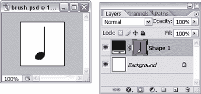

现在，右击形状图层，选择**栅格化图层**。

***2。将形状保存为笔刷***

现在，选择要定义为画笔形状的文档或区域。在下图中，我用选框工具创建了一个矩形来包围音符。

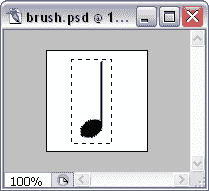

接下来进入**编辑** > **定义笔刷预设**。将显示自定义笔刷的预览(略微压缩),您可以为笔刷命名。

当你查看**笔刷**选项时，你会看到你的新笔刷列在其他笔刷中:

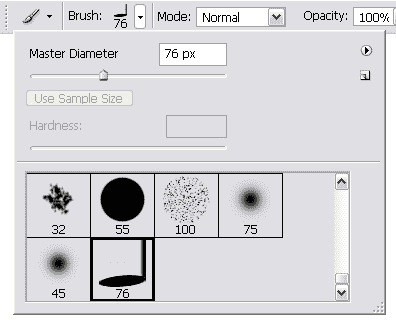

你现在可以像使用其他刷子一样使用你的刷子了！

***3。保存你的画笔设置***

您的画笔将保留在**画笔**拾取器中，直到您下次加载新的画笔，此时您可能会丢失您定制的画笔。

如果你想保存你的画笔，你可以通过保存整套画笔来完成。点击**笔刷**调板中的小箭头或者**笔刷预设**拾取器，选择**保存笔刷**。这将保存一个`.abr`文件，您可以稍后重新加载。(如果您愿意，可以删除预置中不想存储的其他笔刷，以便创建仅包含您自己的自定笔刷的笔刷集。)

一旦你找到保存笔刷的`.abr`文件(它将被保存到上面提到的`Brushes`文件夹中)，你就可以复制你的自定义笔刷并与他人分享。

##### 摘要

使用**笔刷**调色板来调整 Photoshop 渲染笔触的方式是一种强大的技术，可以在几分钟内创建令人惊叹的独特图形效果。一旦你掌握了调整内置笔刷的挑战，你可以扩展这种技术来使用其他笔刷。你甚至可以创建自己定制的笔刷，无限扩展你的笔刷能力。今天就尝试这些技巧并掌握 Photoshop 笔刷吧！

## 分享这篇文章