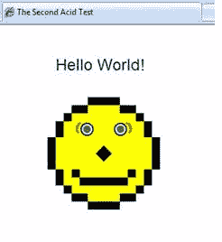

# IE8 通过 Acid2 测试，Web 标准项目震惊而死

> 原文：<https://www.sitepoint.com/ie8-passes-acid2-test-web-standards-project-dies-of-shock/>

尽管他刻意淡化了这一事件的重要性，但从微软总裁哈查莫维奇今天在 [IEBlog](http://blogs.msdn.com/ie/) 上的话中，他的成就感不言而喻:

> 我很高兴地告诉你，12 月 12 日星期三，Internet Explorer 在 IE8 标准模式下正确地显示了 Acid2 页面。

[Acid2 测试](http://www.webstandards.org/action/acid2/guide/)由[网络标准项目](http://www.webstandards.org/) (WaSP)开发，作为对浏览器开发者的挑战。在一个页面中，该测试利用了开发人员一段时间以来一直希望在浏览器中拥有的几种不同 web 标准的广泛功能，并使用它们来显示一个看似简单的笑脸。

第一个支持 Acid2 测试的浏览器是 2005 年 11 月的 Safari 2.0.2。此后， [iCab](http://www.icab.de/) 和 [Konqueror](http://www.konqueror.org/) 纷纷宣布支持。火狐 3 的当前测试版即将推出，但还不是时候。有了这个声明，看起来 Internet Explorer 可能会抢先一步！

在这篇文章发表的时候，web 标准项目的 Web 服务器已经在这个公告产生的流量压力下崩溃了，但是感谢 [Internet Archive](http://web.archive.org/web/20070616062226/http://www.webstandards.org/action/acid2/guide/) 我能够收集到这个新特性的列表，我们现在可以推断这些新特性将在 IE8 中得到支持:

*   **显示带有`<object>`标签**的图像，这使您能够包含比``标签更丰富的替代内容
*   CSS 表格，它让你可以使用基于表格的布局技术，而不会误用 HTML 表格标记
*   **生成的内容**，它允许您使用 CSS 在元素前后插入额外的内容

这些都是非常有用的功能，其他主流浏览器已经支持了一段时间，但由于 Internet Explorer 缺乏对它们的支持，这些功能还没有在现实世界中使用。这一切都将改变。仅支持 CSS 表格就足以彻底改变现实世界中的 CSS 页面布局技术，使它们更容易学习和使用。

微软承诺在 2008 年上半年发布 Internet Explorer 8 的测试版。对于希望迅速采用新浏览器的网页设计师来说，最大的问题是:它能在 Windows XP 上运行，还是需要升级到 Vista？

正如 T2 CSS 禅宗花园的戴夫·谢伊所说，“最好穿得暖和点，今天是地狱里最冷的一天。”

微软发布了一段[精彩的视频记录](http://channel9.msdn.com/showpost.aspx?postid=367207)，记录了过去六个月中 IE8 内部版本中 Acid2 测试的渲染。该视频还包括对迪安·哈查莫维奇和克里斯·威尔逊的深度采访。推荐观看来自微软的一些假日温暖和模糊。

## 分享这篇文章