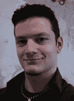
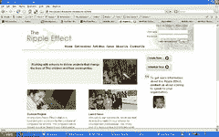
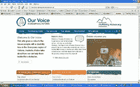

# FullCodePress 设计师分享他们的设计秘密

> 原文：<https://www.sitepoint.com/interview-with-fullcodepress-designers/>

在一天的比赛中， [FullCodePress 国际站点的组织者](http://fullcodepress.com/)要求我[采访一些团队成员](http://www.fullcodepress.com/2007/09/04/the-visual-design-process/)，了解他们的经历和他们遵循的流程，并分享我对这两个站点在这次比赛中如何被评判的一些想法。

我第一次采访的是这两个团队的设计师:来自澳大利亚团队的莎拉·皮克(T1)获得亚军，以及来自获胜的新西兰团队“代码黑”(CodeBlacks)的史蒂夫·丹尼斯(T2)。

## 采访莎拉·皮克(澳大利亚队的设计师)

Matthew Magain: *你是如何在短短几个小时内完成客户视觉形象设计的？*

Sarah Peeke: 我参加这个比赛时，以为这个组织已经有了一个官方标志。一旦我们同意有必要创建一个，它当然提出了进一步的挑战。

我们慈善机构的名字叫“涟漪效应”(一个帮助改变泰国儿童及其社区生活的组织)。我想避开水滴的陈词滥调，客户提到他们想把孩子们的手融入品牌中，所以这就是我关注的焦点。最后，虽然，有许多设计元素和其他收尾工作，我已经准备好实施，不幸的是，我们没有时间来包括。

MM: *你有没有遵循你一贯的设计流程？有没有走捷径？*

我为这次活动做的准备包括分析我能做些什么来变得更有效率。这真的帮助我质疑我正常的设计过程，实际上我已经带着一个更有效的设计策略离开了 FCP。我猜时间限制意味着创作过程是有限的。例如，我通常会在客户的身份/品牌上花更多的时间。

**MM:** *你是如何发现睡眠不足的，你是如何应对的？*

**SP:** 其实，出奇的好。我故意在用餐时间吃新鲜水果和沙拉，这样我就不会感到太懒散，并且避免沉溺于过多的咖啡和巧克力等。只有在活动结束后，我才感觉自己好像是在飞往英国的飞机上。过了几天，我又觉得自己是个人了。

你用什么工具来保持井然有序？

嗯，在活动开始前几天，我开发了一个叫做 myColorizer 的新工具，它将我最喜欢的颜色工具整合到一个基于浏览器的用户界面中。它包括一个颜色混合器，调和器，转换器和模板模拟器。但最重要的是，我可以在同一页面的调色板中存储客户身份颜色和其他要在网站中使用的颜色。还有一个内置的颜色对比分析器，它使用 AERT 颜色对比算法和亮度对比度。我希望在不久的将来能推出“精简版”和“专业版”。除此之外，我制作了一些不同分辨率宽度的模拟 illustrator/photoshop 模板来帮助节省时间。

**MM:** *对你个人来说，最大的障碍是什么，你是如何克服这个障碍的？*

显然，我们不认识客户，也没有见过其他团队成员——我们只有几次聊天/发邮件的机会。否则，我不得不说，从设计/编码的角度来看，试图让我们的“选择的 CMS”高效地输出干净、有效的结果有点令人沮丧。最后，我认为让我们成功的是这样一个事实:我们都真正尊重彼此的专业领域，我们自由交流，灵活变通，真正享受一起工作。我会再做一次吗？既然我已经补觉了，那还用说！

## 《代码块》的设计师史蒂夫·丹尼斯访谈)

 ** Matthew Magain: ** *你是如何在短短几个小时内解决创建客户视觉形象这个难题的？*

Steve Dennis: 公平地说，我们的客户(格兰扁残疾人倡导协会)对他们想从网站中得到什么并没有一个清晰的愿景，或者对什么是可能的并没有真正的欣赏。

我们花了前两个小时研究他们的组织是什么，试图确定网站应该达到的目标。当我们清楚这个网站有三个主要目标受众(残疾人、护理人员和机构)时，我们决定这个网站需要自己的品牌。因为很大一部分观众可能有视力或阅读问题，我们保持这个名字简短，醒目，并使用 Helvetica 纽作为字体易读。

这当然不是一个理想的情况。能够容易地从 GdAA 所做的事情中得出视觉上的相似之处大大加快了速度，因为缺少了客户端的修改。我对标志的唯一要求是色彩鲜艳，非常容易阅读，简单，不显得高人一等。整个事情在当时有点像赌博，因为如果他们不这么做，我就浪费了一个多小时。不过最后还是解决了。

MM: *你有没有遵循你一贯的设计流程？有没有走捷径？*

对于我将要遵循的流程，我没有任何计划。我倾向于以一种非常“敏捷”(无组织)的方式开始工作，因为我发现当我不受组织限制时，我可以提出更多创造性的想法。然后我会采纳这些想法，并根据需求进行调整。我想出的第一个概念几乎就是我们最终运行的概念，所以我不必担心做多个概念，或者在客户端修改和更改方面有太多问题。在这个过程中，他们看了几次我们正在做的事情，但是他们喜欢我们正在做的事情，并且真的没有任何改变。因为这个原因，这实际上是我一年中做过的最简单的设计之一。

**MM:** *你是如何发现睡眠不足的，你是如何应对的？*

实际上，这比我想象的要容易得多。一旦你集中注意力，时间就会过得很快，然后你就会恢复精力。星期天晚上，我直到大约 7 点钟才睡觉。我很早就尝试过能量饮料，但是我想我喝多了，我的舌头开始疼…我一点也不推荐。咖啡和欢笑是成功的关键。

你用什么工具来保持井然有序？

最重要的事情就是始终保持良好的沟通，并且有像 Thomas 这样的优秀项目经理在身边帮助解决我们遇到的任何问题。

**MM:** *对你个人来说，最大的障碍是什么，你是如何克服这个障碍的？*

**SD:** 明确使用现有 GdAA 标识。我认为在创建一个伟大的以社区为中心的网站时，给网站打上不同的品牌是绝对必要的一步。幸运的是，这是我已经习惯的一个障碍——我只是很幸运他们能接受这个想法。

## 我对澳大利亚队网站视觉设计的评价

 涟漪效应设计的最大优势之一是对细节的关注——阴影和渐变很微妙，不会引起注意。手印的重复元素是对团队合作和慈善工作性质的一个很好的提醒。

我的批评与商标和配色方案有关。对我来说，这个标志还没有完全开发出来——单个的手印效果很好，但是这种类型有点太普通了。是否字母之间的字距调整不太正确，或者可能是上下行之间没有足够的对比。我还建议，像 Century Gothic 这样的字体可能更适合不同类型的组织，比如美术馆或时装屋。

我的另一个评论是，绿色/灰色的配色方案导致页面感觉有点冷，很容易被误认为是参与环保运动的慈善机构。对于一个试图吸引想要参与和活跃起来的热情志愿者的网站来说，一些暖色可能更合适(可能会借鉴泰国文化中的一些丰富颜色，特别是考虑到这个标志没有反映出泰国的任何东西)。对我来说，网站的页眉在边缘处消失得无影无踪。这种实心空白旁边的清晰边框给人一种不完整的感觉，尽管这可能是由于时间限制而没有完成的一个元素。

然而，总的来说，对细节和微妙接触的关注仍然使这成为一个真正有效的，干净的设计。

## CodeBlacks 网站视觉设计之我见

 我认为从视觉设计和普遍认同的角度来看，CodeBlacks 无疑面临着更大的挑战。客户有一个现有的标志，嗯，显然不是由平面设计师设计的东西。必须创造一个既新颖又有补充性的标识肯定非常困难和冒险，但标志和配色方案非常好——我喜欢所选颜色中反映的层次，我喜欢这样一个事实，即尽管主色调大胆而明亮，但它们不是默认的 pantones，而是原色中稍微有点模糊的色调。圆角和粗糙的线条相结合，可以有效地将组织描绘成现代的，而不是太俗套的。

我的主要批评是，一旦你离开主页，用户就失去了由配色方案(红色代表残疾人，黄色代表护理人员/家庭，绿色代表机构)创造的层次结构，尽管这可能更像是一个 IA 问题。

## 分享这篇文章