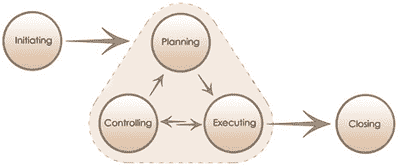
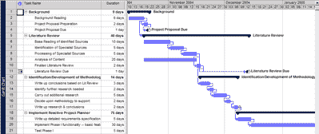
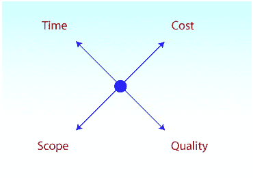
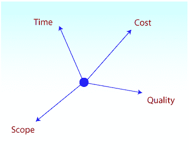
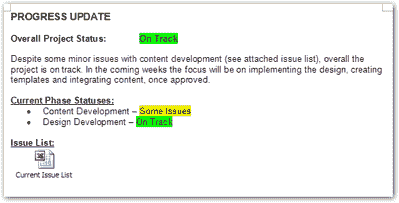

# 网络极客的有效项目管理

> 原文：<https://www.sitepoint.com/project-management-web-geeks/>

“项目管理”一直以来都是一个更容易引起抱怨而不是微笑的术语。然而，项目管理技能的使用往往是一个容易的、成功的项目与一个痛苦的、不令人满意的项目之间的区别。在这个世界上，客户和商业伙伴越来越需要完整的解决方案，而不仅仅是设计和代码的组成部分，至少拥有基本的项目管理技能正迅速成为对 web 专业人员的要求。

在本文中，我将讨论什么是项目管理(PM ),什么不是，向您介绍项目生命周期的基础知识，并为您提供一系列工具，从今天开始，您可以使用这些工具使您的项目运行得更顺畅、更快速、更简单。我还包含了一些方便的文档，你可以[下载，以 zip 文件格式](https://www.sitepoint.com/examples/projectmanagement/projectmanagement.zip)用于你自己的项目。

##### 那么，什么是项目管理呢？

项目管理协会对项目管理的定义是:“……将知识、技能、工具和技术应用于项目活动，以满足项目需求。”(*《PMBOK 指南》，第三版*，宾夕法尼亚州项目管理协会，2004 年。)

这个定义的一个不太抽象的版本是，PM 是使项目按时、在预算内、按要求的范围和质量发生所需要的。

我个人的定义是 PM 是看起来像超级英雄的最简单的方法，不需要任何放射性蜘蛛或可疑的出身。

也有很多事情是 PM 做不到的，最值得注意的是作为个人生产力的替代品。无论你是使用一个简单的 todo.txt 文件，一个时髦的 PDA，还是一个完整的 GTD(代表[把事情做完](http://www.davidco.com/))系统来让自己有条理，你仍然需要使用预防性维护策略。PM 就是让项目发生——如何完成项目所需的工作取决于你。将个人生产力和项目管理混为一谈是我前面提到的那些痛苦反应的主要原因之一:如果你将你的项目管理工具作为你的待办事项列表，那么你显然会比项目中的任何人(包括客户)得到更多的细节！)需要看。这是小型项目中常见的错误，实际上项目经理也做了大量的项目工作，如果不是全部的话。在有专门项目经理的大规模项目中，保持这种区别可能容易得多，但即使在那里，你也会看到错误的证据，项目计划开始看起来更像是个人的头脑风暴，而不是通往未来的道路，包括及时回家看孩子。

既然我们已经谈了一点什么是项目管理，什么不是，让我们继续看项目生命周期。

##### 通用项目生命周期

一般的项目生命周期相当简单——首先你开始项目(启动),然后你继续实际做项目(计划、执行和控制，这形成一个循环，因为期望事情第一次就正确是相当不现实的),最后你让每个人都满意，如果幸运的话，收到付款(结束)。这个过程如图 1 所示。

*图一。项目生命周期([在新窗口中查看大图](https://i2.sitepoint.com/graphics/guerilla_project_cycle_red.png) )*

由于大多数时间和精力通常花在执行(完成任务)和控制(保持一切正常)阶段，许多人认为这些是最重要的。的确，这些应该是你花费大部分时间的地方——毕竟，如果你不这样做，什么都不会完成！—但它们不是最重要的。

最重要的项目阶段是启动、计划和结束。让我们仔细看看这三个阶段，看看为什么。

***入会***

我经常认为最重要的项目阶段是启动阶段。这是你和你的客户签订合同(或者协议，如果你正在做一个组织内部的项目)的地方，弄清楚项目为什么会发生，你想要达到什么，以及什么定义了项目的成功。

设置正确的项目比设置不正确的项目更有可能成功。这意味着从一开始就明确期望和目标是很重要的。这也意味着定义成功是至关重要的。在这一阶段，查看假设(例如，公司的品牌可能在项目期间保持不变)和约束(例如，需要批准设计的人可能整个九月都在度假)也是有用的。

***策划***

在准备战斗中，我一直发现计划是无用的，但计划是必不可少的

—艾森豪威尔

计划是非常重要的，但通常不是因为人们假设的原因。进行规划有几个原因，包括:

*   更好地理解需要实现的目标
*   识别依赖关系(例如设计需要在编码之前完成)
*   与客户沟通
*   与您的团队成员合作，以便每个人都了解整体情况以及遇到延迟时的影响

你会注意到我没有把“这样你就可以盲目地跟随它”列为计划的理由。虽然你可以详细计划明天的工作，但不可能一开始就详细计划整个项目。这也是不必要的:是的，你需要知道需要交付的关键里程碑、依赖关系和粗略的时间表，但是试图在项目开始时计划到一天、一小时或一分钟是徒劳的。没有什么是一成不变的，以至于这种方法没有意义。

对计划阶段同样重要的是确定谁将参与到项目中，包括你这边的(谁将加入你的团队？)和客户端方面(您将与谁打交道并接收来自谁的输入？)术语涉众指的是对你的项目有一些兴趣的任何人；这可能包括希望将您开发的网站用作营销工具的营销人员、被要求添加新内容的管理员，以及可能希望确保网站不会说太多话并且他们仍有足够的谈判空间的销售人员。

在确定利益相关者时，重要的是要记住层级并不能定义你的项目的重要性——如果管理团队发现更新太难，他们缺乏支持就像首席执行官不喜欢配色方案一样具有破坏性。

***封***

网站项目不会在网站上线时就结束。如果你曾经试着只发送一个站点，然后伸手去检查，你会经历我称之为“不死利益相关者”的现象:与项目有利害关系的人一次又一次地回来，带来更多的请求或改进，甚至只是支持查询。现实情况是，在关键涉众同意项目已经完成之前，您的项目还没有完成，这也是为什么在初始阶段定义项目的成功如此重要的另一个原因。

那么在关闭阶段你需要做什么呢？首先，你需要证明你已经达到了成功的标准。其次，你需要获得利益相关者的同意，你已经达到了成功的标准。第三，你需要确保你开发的产品(无论是应用程序还是网站)的未来是有保证的。

通常，这最后一步意味着建立某种支持结构。如果您打算自己处理持续的支持和维护，那么您需要一个服务级别协议，我们很快就会看到。如果您要移交给另一个团队，那么您需要确保他们有他们需要的培训和文档。

***那么这有什么难的？***

当你以这种方式看待项目生命周期时，这似乎都是常识。那么，为什么如此多的项目遭受延迟，超出预算，或者不能交付期望的特性和质量呢？事实是，关注项目的不同阶段并不难，甚至不需要太多时间。然而，不幸的是，有两种看法意味着人们很少给予 PM 它所需要的关注。

第一个是认为项目管理分散了“实际工作”的注意力，不管是设计、编码，还是网络工作的其他方面。然而，不幸的现实是，没有适当的项目管理，所花费的“实际工作”可能都是徒劳的——你构建的东西可能是美丽的，但是如果它是错误的东西，它就没有帮助。

第二个感觉是 PM 需要大量的时间。这肯定是真的:如果你试图做传统项目经理要求的每件事，它肯定会变成一份全职工作。在项目管理的“科学”(你被告知*应该*做的事情)和项目管理的“艺术”(你实际上*需要*做的事情)之间有一个平衡。让我们更关注艺术的极简主义方面。

##### 获得成功的基本工具

我已经断言，在项目管理上取得成功并不难，现在我将向您介绍一套适用于每个 web 项目经理的基本工具。每个工具都有自己的优点和缺点，从最适合沟通、更好地理解需要实现什么、与团队协作的工具，到帮助您控制项目的工具。了解给定工具的优势很重要，这样才能确保正确使用它。

***初始文件***

启动阶段最重要的工具非常简单:它是一个项目启动文档，简要总结了项目为什么会发生。这份文件是对你通常与客户签订的合同的补充(但与合同完全分离)。(如果您的项目是内部项目，本文档将补充项目开始前在您的组织内发生的步骤。启动文档有助于确保每个人从一开始就在项目的目的上保持一致，并且比典型的项目合同要短得多。

项目启动文件需要总结:

*   项目的目标(你试图达到的目标)
*   关键交付成果(你将如何实现目标)
*   项目的总体原理(你为什么要做)

启动文档中应包含的其他内容包括关键假设和约束，以及成功标准。这份文件最多不超过两页。

关于入会文件的另一个要点是，你不应该只是写了它，然后就忘了它。它应该与项目中的关键利益相关者(包括总发起人或主要客户联系人)事先达成一致，并在持续的基础上进行参考。当您在做出关于应该接受什么样的范围或设计变更的艰难决定时，参考项目的原始目标和成功标准是非常宝贵的。

您可以[下载一份样本初始文档](https://www.sitepoint.com/examples/projectmanagement/projectmanagement.zip) (zip 文件格式)。

***项目计划***

根据您在项目中所处的位置，您的项目计划可以(并且可能应该)采取不同的形式。最初，一个简单的文本文档描述主要的可交付成果、大的依赖项、高层次的时间表以及项目所需的关键资源可能就足够了。但是，稍后，您可能会决定需要一个适当的时间表，可能是以甘特图的形式，它显示关键的可交付成果(以行的形式列出)，以时间线的条形图表示(通常以周为列)，如图 2 和图 3 所示:

*图二。一个简单的甘特图，在微软 Excel 中实现*

*图 3。使用 Microsoft Project 实现的更详细的甘特图([在新窗口中查看大图](https://i2.sitepoint.com/graphics/guerilla_traditional-gantt.png) )*

规划的重要准则包括:

*   计划里程碑，而不是任务:很难衡量一项任务的完成程度，而里程碑是二元的:要么完成，要么没完成。
*   将你的里程碑分解成足够小的可交付成果，这样你就可以很好地跟踪:目标是将小里程碑分解成足够小的部分，这样每两到三天就可以交付一个，而不是分解成无意义的小部分。
*   将每个小里程碑分配给一个人(且只能是一个人):明确的责任让事情更容易完成，你的团队会感谢你对他们的信任。
*   **在格式中反映你的计划的权威程度:**有时候人们会在不做背后工作的情况下制定完整的计划和时间表。你可能遇到过这样的情况:你面前有一个计划，告诉你需要在 13.5 天内完成所有的设计或编码，却从来没有问过你需要多长时间。确保你的计划格式反映了你目前拥有的最好的信息，仅此而已。如果这意味着只与关键成员共享流程图或里程碑列表，而不是完整的时间表或甘特图，那么就这样做。

***风险管理计划***

任何努力都有风险，web 项目也不例外。为了管理您的风险，您需要首先确定它们是什么，然后根据可能性和严重性对它们进行排序。由你来决定你的门槛在哪里:你可能想要创建一个计划来处理那些既可能又严重的风险。您还需要确定如何识别风险是否会成为问题，以便知道何时启动应急计划。

除了项目计划，你的风险管理计划也是你应该和你的客户以及主要利益相关者分享的。他们需要了解可能会出什么问题，以及如果这些不测事件发生，你打算怎么做——他们甚至可能有更好的想法来应对某些突发事件！

***问题列表***

问题列表与您可能已经在使用的 bug 列表非常不同。Bug 列表是关于你在产品中发现的技术缺陷；问题列表是关于项目本身的问题。因此，将这两个列表分开是值得的——毕竟，修复 CSS 填充错误的最佳人选不太可能也是在营销和管理部门之间达成妥协以便最终完成设计的最佳人选。

问题列表可以根据需要包含任意多或任意少的字段。您会希望它保持精简，这样它就不会成为保持更新的累赘，但仍然包含有用的信息。通常，我使用一个 Excel 电子表格，任何人都可以更新它，它包含以下字段:

*   输入的日期
*   描述
*   物主
*   状态(开放、进行中、关闭)？解决办法
*   解决日期

您可以[下载一份样本问题清单](https://www.sitepoint.com/examples/projectmanagement/projectmanagement.zip) (zip 文件格式)。

***平衡象限***

当您处理大量变更项目范围的请求时，平衡象限是一个非常有用的工具——例如，添加额外的功能。在任何项目中，有四个因素需要平衡:

*   时间
*   费用
*   质量
*   范围

这些因素之间的关系如图 4 所示。

*图 4。平衡象限*

平衡象限的关键信息是，改变任何一个因素都会影响其他三个因素。例如，如果你想把时间减半，你需要花更多的钱(增加成本)，减少工作量(缩小范围)，或者牺牲质量(降低质量)。这在图 5 中得到了展示，尽管您不应该把这个比喻看得太重——它只是表明象限中一个部分的变化会影响其他三个部分。

*图 5。一个象限的增加会导致其余象限的增加或减少*

实际上，不可能阻止项目中的变化。然而，你能做的是帮助客户和利益相关者理解这些变化的影响。如果这意味着 web 应用程序将在两个月后交付，那么最新的惊人功能要求真的值得吗？他们应该做决定，但是你有责任帮助他们做出明智的决定。

***利益相关者评论***

利益相关者评审是一种识别和探索意见分歧的机制。无论你和你的团队觉得一切都在按计划进行，项目的涉众可能会不同意，无论是他们不喜欢的设计，他们觉得被误解的关键需求，还是缺失的功能。

通过与关键利益相关者进行评审，您可以尽早发现这些问题，并决定是否需要改变方向。你不可能总是期望达成共识，但是你可以把问题记录下来，并就前进的道路达成一致。保持这些评估简短而集中，尽可能面对面进行。

***进度更新***

虽然涉众评审对于确保那些对你正在开发的产品有意见的人被听到是有用的，但是进展更新更多的是让人们了解整个项目的进展。保持简短扼要:一个好的格式在顶部有总体状态，如果你显示几个阶段或里程碑的状态，有时使用交通信号灯(红色表示严重问题，黄色表示偏离轨道，绿色表示在轨道上),随后对具体成就和问题进行更深入的讨论。

这意味着那些只想知道项目进展如何的人可以只阅读顶部的整体更新，并可以自己决定是否要继续阅读以了解细节。

另一件要考虑的事情是，你是要通过电子邮件、文档还是亲自发布进度更新。与您的客户或内部客户讨论这一点，以及所需的频率。您可能会发现，当事情进展顺利时，只需要每月更新一次，但是当遇到问题时，可能需要更频繁的更新。

图 6 显示了一个进度更新报告的例子。

*图 6。进度更新报告*

您可以[下载样本进度更新报告](https://www.sitepoint.com/examples/projectmanagement/projectmanagement.zip) (zip 文件格式)。

当你实际做项目的主要工作时，这是最后一个有用的工具。实际上，你的大部分时间将花在工作(执行)，保持事情在正轨上(控制)，以及根据需要重新规划。一旦所有的工作都完成了，你准备好上线了，那么你需要考虑下一个阶段:结束。

***末次会议***

收尾会议对于确保项目以每个人都满意的方式完成是很重要的。它应该以最初的项目启动文档为中心，审查已经交付的里程碑，并评估是否满足成功标准。如果在过程中(例如，在问题解决或涉众评审过程中)所做的决策已经导致偏离了最初的可交付成果和成功标准，那么这些也应该被评审。

一次成功的收尾会议的结果是，每个人都对项目已经完成并为未来做好了准备感到满意。根据您的特定项目的情况，后者将围绕服务水平协议(SLA)或培训计划。

***服务水平协议***

如果您要为网站或产品提供持续的支持和变更，那么您需要有一个 SLA。本文档列出了对变更和支持的期望，包括您对不同类型问题的响应速度；例如，如果网站不可访问或不可用，那么与简单地添加新页面相比，响应时间会更快。

你需要确保涵盖你或你的客户可能期望你做的所有不同类型的工作；你还需要考虑定价。如果这项正在进行的工作没有包含在您的初始合同中，您需要考虑是否需要新的合同和费用协议。

通常，SLA 将描述不同级别的事件。您可能指定的样本水平是关键的(没有工作！)、大(重要的东西坏了)、小(没那么急，但还是坏了)、请求(有就好)。您还应该就每个问题解决的预期速度达成一致(例如，关键问题通常会在几个小时、主要几天和次要几周内解决)。SLA 还应该详细说明应该联系谁，不同类型的问题是否有不同的联系人(托管还是内容还是设计)，以及应该使用什么样的沟通模式(电子邮件还是电话还是通过电子表单开罚单)。

***训练计划***

如果您将持续的支持和维护工作移交给另一个团队，您需要安排为接管工作的团队提供适当的培训。提供文档通常也是值得的，这样不可避免的人事变动就不会导致新的团队成员在几个月甚至几年后带着问题来找你。

你应该记录下网站未来需要发生的一切，从更新内容到改变设计。您可能还需要详细描述产品最初是如何开发的，底层技术设计是什么样子的，以及应该指导未来更新的设计主题。同样，这是一个与你的客户讨论期望的重要领域；你可能会觉得你已经完成了所有的义务，但是了解到他们认为这个项目是失败的，因为每一个增量的改变都会使你的设计越来越不优雅，因为那些继承了这个网站的人不理解整体的主题。

*关于软件的一个提示:*
*你会注意到，我上面描述的工具更关注业务流程，而不是特定的软件。当然，有无数专门为 PM 过程设计的软件包。它们中的许多都非常严格，强制执行对您自己的项目可能没有用处的过程。*

我建议使用你能使用的最轻便的工具——选择任何对你的团队有用的工具。最好有一个集中存储的 Excel 电子表格，每个人都可以更新，而不是一个除了你没有人愿意登录的只会唱歌、跳舞的 Web 2.0 Ajax 化应用程序。有时候采用比特性更重要！

##### 摘要

在本文中，我们研究了什么是 PM(什么不是 PM)。我们发现了项目生命周期的关键部分，并看到了为什么启动、计划和结束是最重要的阶段，但也是最常被忽略的阶段。然后，我们考虑了每个 web 项目经理应该在工具箱中拥有的基本工具，包括启动文档、项目计划、风险计划、问题列表、平衡象限、利益相关者评审、进度更新、收尾会议以及 SLA 和培训计划。

这实际上只是 PM 的一个尝试，但是我希望它能让你理解关键的过程和一些你可以立即应用的工具。当然，还有更复杂的情况可能需要更多技巧，但是在添加任何额外的过程之前，请确保它将真正解决问题。许多项目问题最好通过改善沟通来解决，而不是在时间表中添加更多细节或在问题列表中添加更多类别。

掌握 PM 的最好方法就是应用它！看看你目前的项目——哪些阶段你做得很好或者完全跳过了？讨论的一些工具会帮助您当前的项目顺利运行吗？或者你想确保为你的下一个项目写一份合适的启动文件？

PM 需要与设计和开发网站完全不同的技能。这可能意味着，当您第一次开始使用我们在这里讨论的工具和过程时，它看起来既奇怪又不寻常。然而，项目管理并不需要天生的才能——只要有一点决心和专注，任何人都可以成为高效的项目经理！

## 分享这篇文章