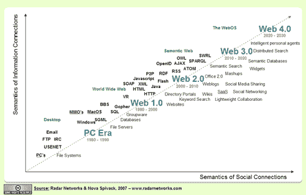

# 你准备好迎接 Web 3.0 了吗？

> 原文：<https://www.sitepoint.com/are-you-ready-for-web-30/>

好吧，我承认——这篇文章的标题确实是为了吸引你。但是在你直接跳到评论栏留下你愤世嫉俗的俏皮话之前，听我说完。

诚然，直到现在我们甚至一直在努力就术语“Web 2.0”的含义达成一致(尽管 SitePoint 自己的[凯文·杨克](https://www.sitepoint.com/blog/)在过去[解释该术语的工作中做得相当令人钦佩](https://www.sitepoint.com/free-video-recognizing-web-20/))。由于过度使用这个对营销友好的术语，现在任何*不*实际从事营销工作的人*无论何时看到或听到这个术语都会退缩。在我看来，这是一种耻辱——一些本可以以积极的方式用于交流网络新阶段的东西反而被用来[取笑科技繁荣](https://www.sitepoint.com/article/application-fluff-hot-air/)(你真诚的，有罪的指控)和[嘲笑那些制造更多旋转而不是实质的人](http://www.alistapart.com/articles/web3point0)。*

那么，如果有一种方法可以更清楚地定义这个术语呢？如果我们认识到网络实际上是一个正在进化的生态系统，并且一个版本号——当应用于网络时——是描述其进化的各个阶段的最佳方式，会怎么样？一个随着网络的每十年而递增的版本号怎么样？

企业家、博客作者和技术梦想家 [Nova Spivack](http://novaspivack.typepad.com/) 认为这是有意义的，最终目标应该是实现一个[语义网](https://www.w3.org/2001/sw/)，在那里数据可以被人类和机器普遍[搜索和理解。上图是他对网络发展方向的看法，他的创业公司](http://novaspivack.typepad.com/nova_spivacks_weblog/2006/11/minding_the_pla.html) [Radar Networks](http://radarnetworks.com/) 一直在开发一个专有平台，供消费者利用这个“下一代”网络。

不管你是否认为语义网完全是炒作，或者这样一个平台实际上是否应该是专有的，不可否认，这是一个值得关注的有趣领域。微格式和标记数据给 Web 带来了更多的语义，在 Web 3.0 之后，事情变得非常有趣。

除非你有更好的名字？

## 分享这篇文章