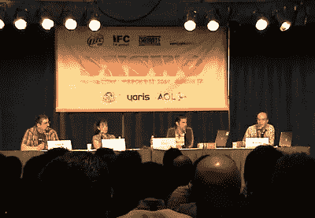
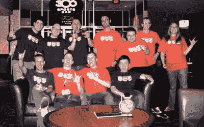

# SXSW 互动 2007:第二天

> 原文：<https://www.sitepoint.com/sxsw-interactive-2007-day-two/>

*(阅读 SitePoint 对 SXSW 节第一天的[报道。)](https://www.sitepoint.com/sxsw-interactive-2007-day-one/)*

经过一个晚上的专门庆祝和联络，你的忠实记者和他的快乐的人们发现及时起床参加清晨会议是一个相当大的挑战。

然而，他们没有被吓倒，他们战胜了疲劳、恶劣的天气，以真正专注的方式继续前进，为 SitePoint 的读者带来了 SXSW Interactive 的最佳表现。以下是我第二天的亮点:

*   [Everything You Always Wanted To Know About The Mobile Web… But Were Afraid To Ask](http://2007.sxsw.com/interactive/programming/panels/?action=show&id=IAP060152)
    This was one of the sessions that I was most looking forward to. The mobile web is fast becoming a reality, and the number of different devices and browsers is eclipsed only by the number of opinions on how best to tackle this brave new world.

    主讲人布莱恩·弗林是蓝色风味公司的战略总监，从他的演示内容中可以立即看出，这些人真的很懂自己的东西。我一直是[基斯·罗宾逊的沉思](http://dkeithrobinson.com/)的粉丝，所以他的同事们聪明且能言善辩也就不足为奇了。

    布莱恩的演讲既实用又吸引人。作为[dotMobi mobile web developer ' s guide](http://pc.dev.mobi/?q=node/197)的作者，他非常适合就如何最好地构建移动网站、管理内容重复以及在用户访问您的网站时为用户提供最佳上下文提供建议和意见。我从演讲中得到的建议包括:

    *   在五部手机中进行测试——大多数其他手机都是这个子集的衍生产品
    *   利用移动访问者可用的不同上下文，例如将电话号码标记为链接
    *   以 200 x 250 像素的设计为目标，因为这是许多不同屏幕尺寸的平均值
    *   考虑到这样一个事实，如果你想满足这些用户的需求，你的网站的专用移动版本——XHTML-MP——是不可避免的。Brian 评论说，Movable Type 使用多个模板生成静态页面的能力是一个很好的例子，说明了如何在不花费精力复制内容的情况下进行管理。

    Brian 演示文稿中的幻灯片可以下载为 PDF 格式。我强烈建议您花几分钟时间浏览一下。即使没有他的评论，这也是对所有 web 开发者都应该知道的移动设备开发所涉及的*现实生活*问题的一个极好的最新总结。

*   [Best Practices For Teaching Web Design](http://2007.sxsw.com/interactive/programming/panels/?action=show&id=IAP060121)
    This was of interest for me because of its relevance in writing books that teach web design, but the focus was more on educators in academia. Panelists Stephanie Troeth and Virginia De Bolt relayed some horrendous stories of university professors who have still yet to embrace the teaching of CSS layouts and semantic markup into their curriculum.

    Stephanie 和 Virginia 强调了关注基础知识的必要性——从 Dreamweaver 中的“设计视图”到考虑语义标记的飞跃是一个巨大的范式转变，因此教育工作者应该在陷入基于标准的设计的更困难的方面(如多栏布局或浏览器兼容性问题)之前，重点关注这些基础知识。

    这是我认为我们在初学者的书[中得到的一件事，用正确的方法建立你自己的网站](https://www.sitepoint.com/books/html1/)，这可能是它如此受欢迎的原因。在书中，Ian Lloyd 只讲述了如何使用绝对定位创建 CSS 布局；他既不讨论基于浮动的布局，也不纠缠于相对定位，而且这些都是在 HTML 的基础得到加强之前完成的。这个小组向我强调了伊恩的方法是正确的。

*   [Uniting The Holy Trinity of Web Design](http://2007.sxsw.com/interactive/programming/panels/?action=show&id=IAP060249)
    The irreverent [Cameron Adams](http://themaninblue.com/) and the flawlessly polite [Jonathan Snook](http://snook.ca/) were just two of the panelists discussing a trinity that relates to people rather than technologies–developers, users and business folks.

    

    这次讨论引发了小组成员的一系列建议，包括团队合作、招聘、管理变革以及让合适的人参与到成功网站的建设过程中。莎莉·卡森建议每天开 15 分钟的会，让每个人都站起来，这听起来是个有价值的主意；如果你站着，你就不太可能舒服地坐在椅子上，开始发呆…

今晚的社交活动是 [Avalonstar 保龄球盛事](http://bowling.avalonstar.com/)，SitePoint 有两支队伍参加，如下图所示:

不幸的是，尽管我们招募了来自密尔沃基的半职业保龄球手和 SitePoint 博客的其他一些有才华的读者，但两支球队都在第一轮被淘汰了(有人可能会怀疑免费饮料是否与此有关)。然而，大家都玩得很开心，许多 SitePoint 书籍和 t 恤衫作为奖品分发。

非常感谢 Bryan 组织了这次活动，并感谢 ring-ins 忍受了我们低于平均水平的保龄球和傲慢的垃圾话(我们明年将获得奖杯团队！).

## 分享这篇文章