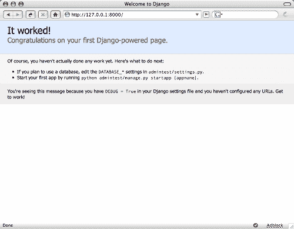
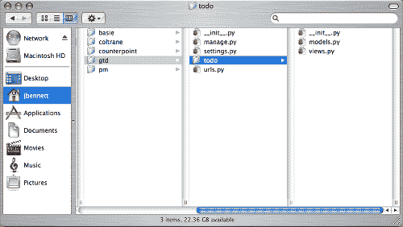
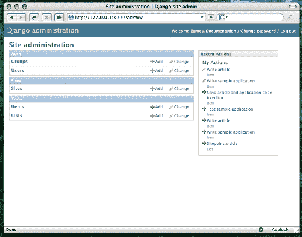
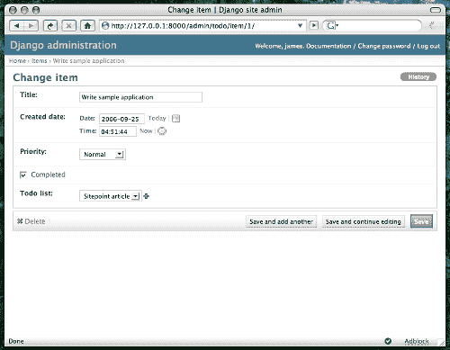
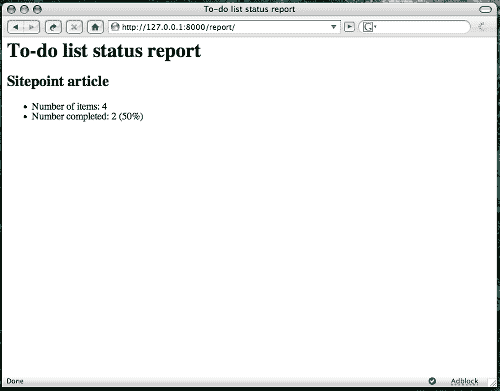

# Django Djumpstart:在 30 分钟内建立一个待办事项清单

> 原文：<https://www.sitepoint.com/build-to-do-list-30-minutes/>

成为一名网络开发人员并不总是令人兴奋的。你最终会一遍又一遍地做许多单调乏味的事情:编写代码与数据库对话，编写代码处理页面模板，编写管理界面……迟早你会希望有人会出现，把所有重复的代码打包成漂亮的、集成的、可重用的包，对吗？今天是你的幸运日，因为终于有人。

向姜戈问好。在本文中，我将介绍用 Django 创建一个简单应用程序的过程——一个待办事项列表；本教程将只涉及 Django 能为您做的事情的一小部分，但这将是一个良好的开端，并且(希望)足以激起您更多的兴趣。

##### 集成的 Web 框架

简而言之，Django 是一个快速的 web 开发框架。就像最近制造新闻的许多其他框架(例如 Ruby on Rails)一样，Django 旨在为您处理繁琐和重复的任务，让您有时间重新编写有趣的代码。然而，与大多数其他框架不同，Django 更进一步，试图提供通用的构建块，您可以将这些构建块组合在一起完成常见的任务(如构建管理界面或 RSS 提要)。每个致力于开发 Django 的人也使用这个框架，所以它能让我们的工作变得更容易的任何东西都是包含的候选。

Django 在《劳伦斯世界日报》开始工作，这是一份为堪萨斯州东北部一个小镇服务的报纸，因为需要开发功能齐全的网络应用程序以满足新闻编辑室的最后期限而成长。2005 年 7 月,《世界日报》在开源许可下发布了 Django，此前它已经在报纸上开发和使用了几年。

Django 是用 Python 写的，Python 是一种现代的、面向对象的编程语言；这意味着用 Django 编写的应用程序也将是 Python 语言。

GA_googleFillSlot(“Articles_6_300x250”);

##### Python:五分钟之旅

如果您习惯于 PHP 或 Perl 之类的语言，Python 可能对您来说看起来有点陌生，但是一旦您熟悉了它，它就会像一股清新的空气。

当您第一次开始使用 Python 时，您会注意到两件大事。

首先，没有任何花括号标记代码块；无论使用哪种语言，您都很有可能在函数、for 循环、if 语句等内部缩进代码，因此 Python 依靠这种缩进来告诉它这些代码块的开始和结束位置。

第二，核心 Python 语言被有意地保持为小型和轻量级的，函数可能被构建到其他语言的核心中(例如:正则表达式),而不是在“模块”中提供，您可以将这些模块导入到您的程序中。Python 附带了一组可靠的标准模块，可以满足程序员最常见的需求。

如果你是 Python 的新手，通读官方教程来感受一下这门语言的基础可能是个好主意。Python 的官方文档还包括所有标准模块的完整[列表以及如何使用它们的解释，所以浏览该列表，看看 Python 可以做什么。](http://docs.python.org/modindex.html)

##### 得到姜戈

因为它是用 Python 写的，所以 Django 要求你在使用它之前安装 Python。如果你用的是 Mac OS X 或者 Linux，你可能已经安装了 Python，但是如果你用的是 Windows 或者(出于某种奇怪的原因)Python 没有预装在你的电脑上，你可以从[python.org](http://www.python.org/download/)下载。在我写这篇文章的时候，Python 的最新版本是 2.4.3，但是 2.5 版本应该随时会发布；这两个版本之间不应该有任何不兼容性，但是如果你打算安装 Python，那么在 2.5 中的任何错误被解决之前，坚持使用 2.4.3 版本可能是最安全的。Django 强加的唯一版本限制是要求您使用 Python 2.3 或更高版本。

一旦你有了 Python，官方的 [Django 安装文档](http://www.djangoproject.com/documentation/install/)会引导你完成下载和安装 Django 的过程。作为这个过程的一部分，您需要为将要使用的数据库下载并安装一个 Python 数据库适配器模块。在本文中，我将使用 MySQL 你可以[直接从 SourceForge](http://sourceforge.net/project/showfiles.php?group_id=22307) 下载适配器(一个名为`mysqldb`的模块)(在发布的时候，这个包在 Python 2.5 下是不能用的；在 SourceForge 项目更新之前，您必须使用 Python 2.4.3)。

Windows 用户应该只需获取`.exe`版本，Mac 用户可以从 PythonMac 网站获取一个[预建的 Mac 安装程序包](http://pythonmac.org/packages/py24-fat/mpkg/MySQL_Python-1.2.1_p2-py2.4-macosx10.4.zip)，Linux 用户应该能够从他们的 Linux 发行商那里获得一个预建的程序包，或者使用从 SourceForge 下载的`.tar.gz`手动构建模块。

如果您喜欢使用不同的数据库，Django 安装文档中有下载 PostgreSQL 和 SQLite 的适配器模块的链接，这是 Django 正式支持的另外两个数据库(对 Oracle 和 Microsoft SQL Server 的支持正在开发中，但目前仍处于试验阶段)。

一旦安装了 Python，就需要设置 Django 本身。Django 的官方文档为 Linux 和 Mac 用户提供了很好的指导，但是 Windows 用户必须对这些指导稍加修改:

为了打开 Django tarball，使用 WinZip 之类的程序，而不是`tar`。

您需要将`C:Python24`添加到`PATH`环境变量中。您可以通过“我的电脑属性”对话框或在命令行输入以下内容来完成此操作:

```
SET PATH=%PATH%;C:Python24
```

当然，这个命令只会影响当前的命令行，所以每次使用 Django 时都必须重新输入。你最好的办法是在我的电脑属性中一次性设置`PATH`变量。

在 Windows 中没有与`sudo`对等的东西。要设置 Django，请输入以下命令:

```
cd *path-to-django* 

setup.py install
```

设置 Django 后，将`django/bin`目录添加到`PATH`环境变量中。同样，您可以通过“我的电脑属性”对话框来执行此操作，或者每次使用 Django 时在命令行输入以下命令:

```
SET PATH=%PATH%;*path-to-django*djangobin
```

##### 潜入水中

让我们通过编写一个简单的应用程序来探索 Django。“把事情做完”是最近流行的一句口头禅，所以我们将建立一个简单的工具来帮助它:待办事项列表管理器。

现在您已经安装了 Django，只需打开一个命令行，导航到您想要保存代码的目录，并键入以下命令:

```
django-admin.py startproject gtd
```

这将为你启动一个新的 Django“项目”;Django 区分了“应用程序”和“项目”，前者通常提供一组特定的功能，后者通常是在同一个网站上一起工作的不同应用程序的集合。

运行`startproject`命令会自动新建一个名为`gtd`的目录，里面放几个文件:一个名为`__init__.py`的空白文件，告诉 Python 这个目录是 Python 模块；一个名为`manage.py`的 Python 脚本，其中包含一些用于处理项目的实用程序；一个名为`settings.py`的设置文件；以及一个名为`urls.py`的 URL 配置文件。


此时，您可以通过键入以下命令来测试所有设置是否正确(从命令行，在“gtd”目录中运行):

```
manage.py runserver
```

Django 包括一个用于测试目的的轻量级 web 服务器，因此您不必仅仅为了项目而设置 Apache。命令`manage.py runserver`将启动它。默认情况下，内置服务器运行在端口 8000 上，所以您应该能够在浏览器中键入`http://127.0.0.1:8000`,然后看到一个漂亮的页面告诉您 Django 正在工作。



要停止内置服务器，请在 Windows 上按 Ctrl+Break，或者在 Mac OS X 或 Linux 上按 Ctrl+C。

现在我们知道 Django 已经设置好了，我们可以开始工作了。键入以下命令:

```
manage.py startapp todo
```

这将创建一个名为`todo`的目录，并自动为您放入几个文件:`__init__.py`，再次告诉 Python 该目录是一个 Python 模块；应用代码两个文件:`models.py`和`views.py`。



##### 编写模型

web 开发中比较单调乏味的部分之一是布置您需要的所有数据库表，确定您需要哪种类型的列，以及如何将数据放入和取出它们。Django 通过让您定义“模型”来解决这些问题 Django 的模型只是继承自 Django 自己的基本模型类的 Python 类，它们允许您在代码中指定特定类型对象的所有属性。Model 类知道如何将其属性转换为存储在数据库中的值，所以大多数时候您不必考虑这些—您只需像在任何其他面向对象语言中一样与对象进行交互。

对于这个应用程序，我们需要两个模型:一个表示列表，一个表示列表中的项目。用数据库术语来说，这些模型最终将成为两个表:一个用于列表，另一个用于列表中的项目。每个列表项都有一个外键来指定它所属的列表。

让我们从列表的模型开始。打开 Django 为您创建的`models.py`文件，在“在此创建您的模型”一行的下面，添加以下代码:

```
class List(models.Model): 

  title = models.CharField(maxlength=250, unique=True) 

  def __str__(self): 

    return self.title 

  class Meta: 

    ordering = ['title'] 

  class Admin: 

    pass
```

稍后，当我们告诉 Django 创建我们的数据库表时，上面的内容将转化为一个名为`list`的表，包含两列:

*   一个名为`id`的整数主键列(Django 自动为您生成；不必明确指定)。
*   名为`title`的 250 字符宽的`VARCHAR`列。此外，该列将创建一个`UNIQUE`约束，确保我们不能创建两个标题相同的待办事项列表。

你会注意到这个类中还有一个叫做`__str__`的方法。这个方法就像 Java 或者。NET——每当 Python 需要显示一个对象的字符串表示时，它就调用该对象的`__str__`方法。我们在这里定义的函数将返回待办事项列表的标题，这可能是将其表示为字符串的最有用的方式。

`class Meta`部分允许我们设置选项，告诉 Django 我们希望模型如何运行。我们可以在这里设置很多选项，但是现在我们只是让 Django 知道我们希望我们的列表按照它们的标题排序。当 Django 在数据库中查询待办事项列表时，它会根据标题列对它们进行排序。

`class Admin`位允许我们为 Django 的自动管理界面设置选项，我们将在后面看到。关键字`pass`告诉 Django 只使用它的默认值。

现在让我们为待办事项列表中的项目编写模型。看起来是这样的:

```
import datetime 

PRIORITY_CHOICES = ( 

  (1, 'Low'), 

  (2, 'Normal'), 

  (3, 'High'), 

) 

class Item(models.Model): 

  title = models.CharField(maxlength=250) 

  created_date = models.DateTimeField(default=datetime.datetime.now) 

  priority = models.IntegerField(choices=PRIORITY_CHOICES, default=2) 

  completed = models.BooleanField(default=False) 

  todo_list = models.ForeignKey(List) 

  def __str__(self): 

    return self.title 

  class Meta: 

    ordering = ['-priority', 'title'] 

  class Admin: 

    pass
```

这个模型稍微复杂一点，但是应该很容易理解。不过，我们在这里使用的一些巧妙的技巧值得一提。

该项的优先级将作为一个整数存储在数据库中，但是使用`choices`参数并传递给它`PRIORITY_CHOICES`列表告诉 Django 只允许我们在`PRIORITY_CHOICES`中指定的值。`PRIORITY_CHOICES`列表还让我们指定对应于每个值的可读名称，Django 将利用这些名称来显示 HTML 表单。

`created_date`将是数据库中的一个`DATETIME`列，`datetime.datetime.now`是一个标准的 Python 函数，顾名思义，它返回当前的日期和时间。要使用这个函数，我们需要在模型定义之前包含行导入日期时间。

我们已经指定列表项应该按两列排序:`priority`和`title`。`priority`前面的`-`告诉 Django 对优先级列使用降序，因此每当 Django 处理列表项时，它都会在查询中包含`ORDER BY priority DESC title ASC`。

既然我们的模型已经完成，是时候让 Django 基于它们创建数据库表了。用 Django 的话说，这叫做安装模型。

##### 安装模型

安装我们的模型的第一步是告诉 Django 我们正在使用哪个数据库，并且我们希望安装我们刚刚创建的模型。为此，打开项目目录中的`settings.py`文件，并更改这些设置。

```
DATABASE_ENGINE should be changed to whatever type of database you're going to use. As I mentioned earlier, I'm using MySQL as I write this, so I'll change the setting like so:

```

```
DATABASE_ENGINE = "mysql"
```

```
DATABASE_NAME should be changed to the name of the actual database you're using:

```

```
DATABASE_NAME = "djangotest"
```

请确保该数据库存在！如果您选择使用 SQLite，Django 可以自动为您创建一个数据库文件，但这在 MySQL 和 PostgreSQL 中是不可能的。

```
DATABASE_USER and DATABASE_PASSWORD should be changed to the username and password of a user who has full access to the database. For example:
GA_googleFillSlot("Articles_6_300x250");

```

```
DATABASE_USER = 'django'  

DATABASE_PASSWORD = 'swordfish'
```

如果您使用的是 SQLite，这些设置不需要填写，因为 SQLite 没有用户/密码系统。

如果您的 MySQL 数据库托管在单独的机器上，您必须设置`DATABASE_HOST`。如果 MySQL 运行在同一台服务器上，您可以将其留空。

如果 MySQL 没有被设置为监听它的默认端口，你需要将`DATABASE_PORT`设置为 MySQL 的端口号。

在设置文件的底部有一个名为`INSTALLED_APPS`的列表，它列出了你正在使用的所有应用程序。默认情况下，这里会列出几个与 Django 捆绑在一起的应用程序。将`gtd.todo`添加到列表中，如下所示:

```
INSTALLED_APPS = (  

  'django.contrib.auth',  

  'django.contrib.contenttypes',  

  'django.contrib.sessions',  

  'django.contrib.sites',  

  'gtd.todo',  

)
```

更改并保存这些设置后，在`gtd`目录中键入以下命令:

```
manage.py syncdb
```

当 Django 设置数据库表时，您会看到一些输出滚动过去。它还会提示你创建一个“超级用户”；Django 的认证系统是默认安装的，此时创建一个超级用户帐户意味着当我们设置好之后，你将能够登录到 Django 的自动管理界面。现在就创建一个超级用户。

##### 自动管理

此时，我们可以编写自己的代码来与已经建立的模型进行交互，但是 Django 提供了一个免费的内置管理应用程序，让我们可以立即开始处理数据。要使用它，您只需要做几件事:

*   在`settings.py`文件中，将`django.contrib.admin`添加到列表`INSTALLED_APPS`中。
*   在项目的`urls.py`文件中，找到“取消对 admin 的注释”这一行，然后从 Python 代码的下一行的开头删除`#`以取消注释。

再次运行`manage.py syncdb`，管理界面将被安装。

现在再次启动测试服务器(通过运行`manage.py runserver`)并在浏览器中加载`http://127.0.0.1:8000/admin/`，这会显示一个登录屏幕。使用您为超级用户指定的用户名和密码登录，您会发现自己在 Django 的管理界面中。



管理系统的主页显示了一个已安装型号的列表，按它们所属的应用程序分类。如果您单击其中一个模型，您将看到该模型的对象列表。在此页面中，您还可以更改现有对象或添加新对象。

让我们创建一个待办事项列表。在主管理页面上，单击“列表”旁边的“添加”链接。为列表标题填入您喜欢的任何值，然后保存它。

返回主管理页面，点击“项目”旁边的“添加”链接，并填写列表第一个项目的详细信息。每个项目都必须与一个待办事项列表相关联，Django 将自动创建一个下拉菜单，显示迄今为止已创建的所有待办事项列表。



这是一个非常好的界面——特别是考虑到设置它所涉及的工作是如此之少——但这只是 Django 提供的默认管理界面。有许多选项(Django 的官方文档中都有介绍)可以调整，以便让管理界面按照您想要的方式运行，并且您永远不必“重建”或重新生成任何文件来使用它们——管理界面是动态生成的，您对配置所做的更改可以立即生效。

如果你想了解更多关于定制这个管理界面的信息，请查看官方文档——该文档包括如何启用一个非常好的就地编辑功能的细节，你可以使用它在一个页面中编辑许多列表项。

##### 钻研观点

现在我们有了一个漂亮的小管理界面，让我们来谈谈视图。尽管管理界面很好，但您可能总是需要至少几个额外的页面来让您的数据完全按照您想要的方式显示。视图是在应用程序中生成这些页面的函数。

例如，在这个应用程序中最好有一个页面，显示我们所有的待办事项列表，以及这些列表中已经完成的项目的百分比。这将是一种“状态报告”,我们可以每隔一段时间检查一次。因此，让我们写一个视图，给我们这个状态报告。

Django 视图在很大程度上只是普通的 Python 函数。URL 配置文件(`urls.py`)决定哪个 URL 去哪个视图；Django 然后调用正确的视图函数，将传入的 HTTP 请求作为参数传递给它。这是我们的“状态报告”视图的代码；它应该放在`todo`目录下的`views.py`文件中:

```
from django.shortcuts import render_to_response  

from gtd.todo.models import List  

def status_report(request):  

  todo_listing = []  

  for todo_list in List.objects.all():  

    todo_dict = {}  

    todo_dict['list_object'] = todo_list  

    todo_dict['item_count'] = todo_list.item_set.count()  

    todo_dict['items_complete'] = todo_list.item_set.filter(completed=True).count()  

    todo_dict['percent_complete'] = int(float(todo_dict['items_complete']) / todo_dict['item_count'] * 100)  

    todo_listing.append(todo_dict)  

  return render_to_response('status_report.html', { 'todo_listing': todo_listing })
```

就 Python 函数而言，这个非常简单，但是它展示了 Django 可以做的一些好事情:

*   正如你可能猜到的，它是一个返回我们所有待办事项列表的方法，这样我们就可以遍历它们。Django 会自动计算出正确的 SQL 并为您执行。
*   每个待办事项列表都有一个`item_set`属性，代表列表中的项目。我们可以使用`item_set.all`方法获取列表中的所有项目，或者我们可以使用`item_set.filter`方法只获取列表中项目的某个子集。我们还可以使用`List.objects.filter`来获取符合特定标准的待办事项列表。
*   函数`render_to_response`处理返回实际网页的业务。它接受要使用的模板的名称(稍后将详细介绍)，以及模板可以访问的变量和值的字典(“dictionary”是 Python 对关联数组的称呼)，并负责呈现模板和发送 HTTP 响应。

这里涉及的实际逻辑并不复杂；我们正在构建一个名为`todo_listing`的列表，其中的每一项都将是一个字典，包含关于一个待办事项列表的信息。唯一真正复杂的部分是计算完成项目的百分比。你会注意到它做了一点类型转换。这是必需的，因为默认情况下，当两个数字都是整数时，Python 执行“整数除法”——整数除法总是返回一个整数。但是我们想要一个可以转换成百分比的十进制数，所以我已经显式地将已完成项目的数量强制转换成浮点数。

##### 编写模板

我们已经告诉视图使用一个名为`status_report.html`的模板，但是我们还没有创建它。幸运的是，为 Django 创建模板非常容易。在 todo 目录中，创建一个名为`templates`的新目录，并在其中创建文件`status_report.html`。下面是模板的代码:

```
<!DOCTYPE html PUBLIC "-//W3C//DTD XHTML 1.0 Strict//EN" "https://www.w3.org/TR/xhtml1/DTD/xhtml1-strict.dtd">  

<html >  

  <head>  

    <meta http-equiv="Content-Type" content="text/html; charset=utf-8" />  

    <title>To-do List Status Report</title>  

  </head>  

  <body>  

    <h1>To-do list status report</h1>  

  

    <h2>{{ list_dict.list_object.title }}</h2>  

    <ul>  

      <li>Number of items: {{ list_dict.item_count }}</li>  

      <li>Number completed: {{ list_dict.items_complete }} ({{ list_dict.percent_complete }}%)</li>  

    </ul>  

  

  </body>  

</html>
```

在很大程度上，Django 模板看起来像 HTML，只是混合了一些额外的东西。有一些“模板标签”，让你在模板中执行一些基本的逻辑，还有一些变量，它们会自动填充传入`render_to_response`的值。标签以``结尾，变量以`{{`开头，以`}}`结尾。

在这个特殊的模板中，我们使用了两个标签:``和``。这些标签告诉 Django 模板系统，我们想要遍历列表中的每一项，并对其进行处理。当我们完成循环中的代码时，我们使用``标签来说明。在循环中，我们检索在视图中设置的值，以便显示待办事项列表的标题、列表中的项目数等等。

##### 让它工作

现在我们已经有了视图和模板，我们只需要给 Django 一些信息，就可以了！首先，我们需要告诉 Django 我们将应用程序的模板存储在哪里；这由`settings.py`文件中的`TEMPLATE_DIRS`设置控制。只需进入并添加一行到放置“status_report.html”模板的位置的路径。在我的例子中，我添加了以下内容:

```
'/Users/jbennett/django-projects/gtd/todo/templates',
```

在这一行的末尾加上逗号是很重要的。

一旦完成，我们只需要为我们的视图设置一个 URL，我们在`urls.py`文件中完成。在您之前取消注释的管理界面 URL 行的正下方，添加以下行:

```
(r'^report/$', 'gtd.todo.views.status_report'),
```

同样，逗号很重要。

现在，启动测试服务器(manage.py runserver)，并访问`http://127.0.0.1:8000/report/`。您应该会看到类似这样的内容:



Django 的 URL 配置非常简单；`urls.py`文件中的每一行至少包含两个内容:

*   指定要匹配的一个或多个 url 的正则表达式
*   在匹配正则表达式的 URL 上使用的视图函数，或者对`include`的调用，它可以获取其他 URL 列表(例如，管理界面有自己的`urls.py`文件，并使用 include 告诉 Django 对任何以`admin`开头的 URL 使用该文件)

##### 从这里去哪里

到目前为止，我们已经写了大约 50 或 60 行代码，我们已经有了一个非常好的小待办事项应用程序的开始:

*   我们设置了数据库表来存储待办事项列表及其项目。
*   我们有一个很好的管理界面来创建和管理列表。
*   我们有一个快速的“状态报告”页面，告诉我们每个列表的项目进展如何。

这一点也不差，但是它仅仅触及了 Django 所能做的事情的表面；Django 已经集成了大量的特性，更多的特性正在开发中。以下是一些亮点:

*   一个全功能的数据库 API
*   用户帐户的内置认证和权限系统
*   “通用视图”，它使您不必为基于日期的内容归档等常见事情编写代码
*   一个内置的缓存系统可以帮助你充分发挥 Django 的性能
*   一个国际化系统，使你的应用程序界面翻译成其他语言变得容易
*   简单，自动生成 RSS 源和谷歌网站地图
*   轻松将数据序列化为 XML 或 JSON，以便与 AJAX 一起使用
*   还有更多

如果你想了解更多关于 Django 的信息，请访问官方网站、[浏览文档](http://www.djangoproject.com/documentation/)(其中包括一个涵盖了 Django 许多有用部分的教程)，并在 [Django 用户邮件列表](http://groups.google.com/group/django-users)或我们的 IRC 频道(irc.freenode.net 上的#django)上自由提问。

## 分享这篇文章