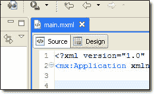
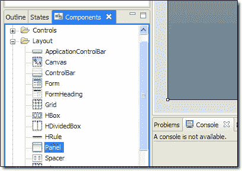
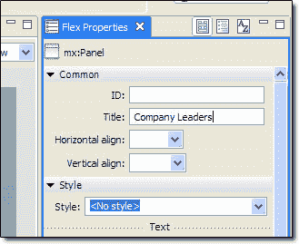
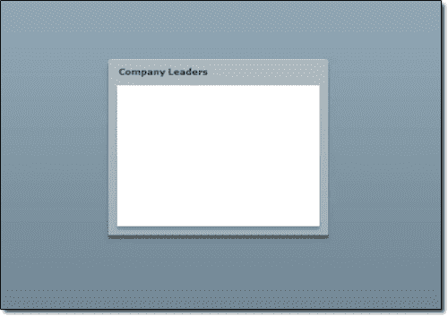
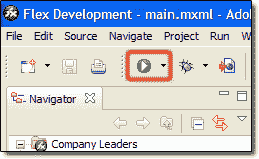
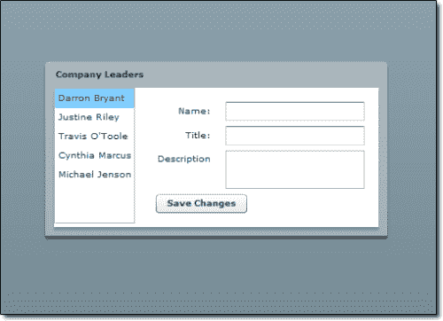
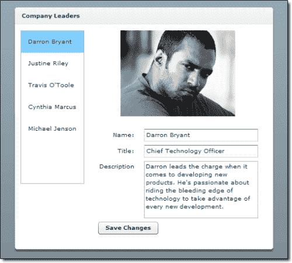

# Flex 2:瞬间丰富的互联网应用！

> 原文：<https://www.sitepoint.com/flex-2-internet-applications/>

你可能已经听说了一些关于 Adobe 发布 Flex 2 的传闻。Flex 是一组技术的集合，这些技术的结合为开发人员提供了一个构建富互联网应用程序的强大框架。您可能已经熟悉其中的一项技术:闪存。

RIA 是轻量级的在线程序，它为用户提供了比普通网页更具动态性和交互性的体验。与使用 AJAX 构建的 web 应用程序一样，Flex 应用程序的响应速度更快，因为不需要在每次用户采取行动时都加载新的网页。然而，与使用 AJAX 不同，Flex 开发人员不需要担心处理 JavaScript 或 CSS 的不同浏览器实现——您可以将所有时间集中在应用程序的开发上，因为该框架运行在 Adobe 的跨平台 Flash Player 上。

今年 6 月，随着 Flash Player 9 的发布，Flex 一炮而红。由于新的内部架构，Flash Player 9 的运行速度比以前的版本快 10 倍。Flash 的编程语言 ActionScript 也获得了广泛的更新，这将有助于从其他语言迁移的开发人员感到更加自在。由于 ECMAScript for XML (E4X)，新特性包括强类型、正则表达式和对 XML 的本机支持。Flash 9 可以在 Windows 和 Mac OS X 上运行，Linux 播放器目前正在开发中。

在其核心，Flex 框架提供了几十个组件，从基本的列表和数据网格到图表、布局系统和媒体播放器。此外，Flex 数据服务(FDS)允许您的 Flex 应用程序与服务器上的 Java 库进行交互。它还为数据同步、消息传递和协作提供了便利。此外，与之前要求开发人员拥有 Flex 数据服务完整版本并花费数千美元的 Flex 版本不同，Flex 2 框架、编译器和命令行调试器都可以免费下载。是的，你没听错:基本的开发者工具可以免费下载！甚至可以免费访问 Flex 数据服务的有限版本。

对于严肃的 Flex 开发，你可能想要使用 [Flex Builder](https://www.adobe.com/cfusion/tdrc/index.cfm?product=flex) 。这个强大的开发环境包括一个拖放式可视化编辑器、增强的调试功能和一个全功能的代码编辑器。它利用了开源的 Eclipse IDE，Java 开发人员应该对此非常熟悉。围绕 Eclipse 已经形成了一个健康的社区，导致了许多很酷的插件的开发，包括一些允许与版本控制系统集成的插件，如 CVS 或 SourceSafe，以及其他为许多其他编程语言提供支持的插件。尽管 Flex Builder 是基于开源工具，但它不是免费的，也不便宜(499 美元，如果包括数据可视化组件，则为 749 美元)。但是，您可以下载 30 天免费试用版(或者 Flex Builder 插件，如果您已经安装了 Eclipse)，或者使用您自己的 IDE。

在我们开始在这个环境中构建我们自己的应用程序之前，让我们后退一步，看看涉及到了什么。

##### Flex 开发如何工作

Flex 为开发人员提供了多种构建应用程序或组件的方法。我们对 Flex 的第一次尝试将介绍 MXML，这是一种专门为应用程序布局而设计的特殊标记语言。在应用程序中创建一个组件的实例不会比在 MXML 中声明它更容易:

```
<mx:Button id="myButton" label="Press Me!"/>
```

如您所见，`Button`的属性就设置在标签内。我们将这个实例命名为`"myButton"`，并给它一个标签，上面写着“按我！”设置`id`允许我们在代码的其他地方引用这个`Button`。可以用类似的方式设置样式，如颜色或皮肤，以及事件处理程序。例如，如果您想监听按钮的点击，您可以调用函数并在`Button`的 click 属性中运行 ActionScript 代码片段。稍后，当我们创建第一个 Flex 应用程序时，我们将看到一个这样的例子。

由于 XML 固有的层次结构，我们可以将组件放在彼此的内部。让我们把我们的`Button`放在一个布局容器中——在本例中是一个`Panel`。

```
<mx:Panel> 

  <mx:Button id="myButton" label="Press Me!"/> 

</mx:Panel>
```

这次我们用两个标签声明了`Panel`组件。MXML 中的容器的工作方式与 XHTML 中的相同，在 XHTML 中，一个元素(如段落)包括一个开始标签和一个结束标签。出现在这两个标签中的其他组件将成为容器的子组件。

当你对 Flex 越来越有经验时，你会想要开始使用纯 ActionScript 3。Flex 的核心组件是用这种语言编写的，Flex 文档包括各种信息，可以帮助您编写使用相同架构的可靠代码。您甚至会发现 Flex 2 编译器附带了核心组件的源代码。在 Adobe 提供的组件中寻找组件开发的最佳实践，还有比这更好的地方吗？

有趣的是，Flex 2 编译器在编译应用程序时，实际上将 MXML 转换为 ActionScript 3。它在幕后处理所有特殊的应用程序引导代码，使开发人员的生活更加轻松。因此，我们上面的部分 MXML 示例可以很容易地转换为 ActionScript:

```
var myPanel:Panel = new Panel(); 

addChild(myPanel); 

var myButton:Button = new Button(); 

myButton.label = "Press Me!"; 

myPanel.addChild(myButton);
```

虽然我们的 MXML 示例只有三行，但 ActionScript 的对等示例却有五行。如果我们想在组件上设置更多的附加属性，它会变得更大。随着您构建更复杂的应用程序，您将体验到使用 MXML 进行布局和初始化的美妙之处。您不仅会发现可视化组件的层次结构更加容易，而且实际上您会在更少的代码行中容纳更多的信息。

##### 把你的脚弄湿

让我们开始吧，组装一个简单的应用程序，展示 Flex 的一些很酷的特性。要在家玩，你可能想从 Adobe 下载免费的 30 天试用版的 [Flex Builder，其中包括 Flex 2 SDK (Flex Builder 目前只适用于 Windows，但一个](http://www.adobe.com/cfusion/tdrc/index.cfm?product=flex) [Mac 版本](http://weblogs.macromedia.com/flexteam/archives/2006/06/flex_builder_on.cfm)将于今年年底推出)。如果你特别喜欢冒险(或者你用的是 Mac，不能等到那个时候)，你当然可以使用你自己的文本编辑器(SDK 可以从同一个页面上单独免费下载，带有命令行编译器)。我假设您在本教程中使用的是 Flex Builder。

我还建议您[下载我为本教程提供的源代码和其他文件](https://www.sitepoint.com/examples/flex2/companyleadersexamplesource.zip)。我将解释我们在这个过程中会遇到的许多主要部分和概念，但我不会覆盖每一行代码，所以您需要下载源代码以便继续学习。

启动 Flex Builder 并选择文件>新建> Flex 项目。新建项目向导首先询问我们打算如何访问应用程序中的数据。选择“基本”,因为我们不会使用 Flex Data Services 或 ColdFusion，然后单击“下一步”按钮。基本选项适用于不需要数据连接的情况，或者您计划通过用 PHP 或 ASP.NET 等服务器端语言编写的自定义数据源来访问数据。

接下来，我们需要输入应用程序的名称。我们将创建一个小页面，让我们可以查看和编辑一家成长中的软件公司的一些经理的传记。该页面可能是公司使用的大型内容管理系统(CMS)的一个模块。姑且称我们的项目为“公司领导”。您不需要更改默认位置，这些文件将保存在您的用户目录下的一个特殊的 Flex Builder 2 文件夹中(在 Windows 上是我的文档)。

单击“完成”退出。如果您要通过单击“下一步”按钮继续执行向导，您可以输入更多高级选项，如附加源代码和库路径(Flex 库允许开发人员包含他们可能已经购买或下载的自定义组件)。对于这个项目，我们不需要这些选项中的任何一个，所以我们将跳过它们。


*在 Flex Builder 中创建新项目*

Flex 应该已经创建了一个空白的应用程序，您应该会看到源代码视图中有几行 MXML 代码。单击源代码视图上方的设计按钮——我们将从尝试设计编辑器开始。

像 Dreamweaver 或其他 WYSIWYG 编辑器一样，Flex 的设计视图允许我们将组件拖放到我们的应用程序中，并可视化地操纵它们。我们还可以设置组件的属性，而不需要编辑任何代码。


*设计视图中可用的 UI 组件*

在 Flex Builder 的左下角，您应该会看到一个组件窗格—如果它没有被选中，请单击它。在内部，您应该会看到几个不同的类别，包括自定义、控件、布局和导航器。图表类别可能也在其中 Flex Builder 试用版还附带了一个试用应用程序，其中包含一些强大的图表组件。展开布局类别，并将面板组件拖到应用程序的设计视图中。


*用属性窗格改变组件的属性*

现在，在 Flex Builder 的右侧，您应该会看到 Flex 属性窗格。我们将使用它来编辑刚刚拖到设计视图中的面板组件。单击面板组件——属性窗格将显示一系列您可以编辑的项目，例如面板的 id、标题、对齐选项、样式、位置和尺寸。在标题字段中键入“公司领导”。您应该会看到它出现在面板的标题栏上。


*我们第一个 Flex 应用的面板*

设计视图是开始一个简单应用程序布局的好方法。点击设计视图上方的 Source 按钮，我们将直接进入编辑一个小 MXML。在 source 视图中，您将看到我们的主应用程序的一些标记和它包含的`Panel`组件:

```
<?xml version="1.0" encoding="utf-8"?> 

<mx:Application xmlns:mx="http://www.adobe.com/2006/mxml" layout="absolute"> 

  <mx:Panel x="140" y="100" width="250" height="200" layout="absolute" title="Company Leaders"> 

  </mx:Panel> 

</mx:Application>
```

如您所见，应用程序就像`Panel`组件一样充当容器。已经为我们添加了一些额外的属性。`Panel`位于您将其拖动到设计视图中的位置，其默认尺寸为 250 像素乘 200 像素。面板和应用程序都使用“绝对”布局。一会儿我们将学习更多关于其他布局模式的知识。

从这里，我们可以向主应用程序添加组件，或者我们可以使用我们的`Panel`中的组件。让我们添加一个我们领导的姓名列表和一个允许我们在`Panel`标签中编辑他们信息的表单。

```
<mx:List id="names"/> 

<mx:Form id="details"> 

  <mx:FormItem label="Name:"> 

    <mx:TextInput id="nameInput"/> 

  </mx:FormItem> 

  <mx:FormItem label="Title:"> 

    <mx:TextInput id="titleInput"/> 

  </mx:FormItem> 

  <mx:FormItem label="Description"> 

    <mx:TextArea id="descInput"/> 

  </mx:FormItem> 

  <mx:Button label="Save Changes"/> 

</mx:Form>
```

如果您看一下设计视图，您会发现有点混乱。`Form`看起来还行，但是我们的`List`藏在后面。我们可以使用 Flex 的布局系统来纠正这个问题。让我们改变一下`Panel`的布局属性:

```
<mx:Panel layout="horizontal" title="Company Leaders">
```

现在`Form`出现在`List`的右边，元素不再重叠。您会注意到我删除了位置和大小参数。这个`Panel`应该能够根据它的内容自动为自己确定一个合适的大小。然而，`Panel`现在出现在应用程序的左上角。让我们更改应用程序的布局参数，将面板放在更好的位置:

```
<mx:Application xmlns:mx="http://www.adobe.com/2006/mxml" horizontalAlign="center" verticalAlign="middle">
```

那看起来更好，不是吗？我们已经移除了绝对布局，应用程序将把`Panel`定位在屏幕的正中央。更好的是，Flex 将始终保持`Panel`居中——即使应用程序改变了大小。

##### 疯狂使用数据

我们已经完成了 Flex 应用程序的总体布局。现在，让我们转到 Flex 提供的最酷的特性之一——我们将把一个数据源绑定到我们的表单，并观察 Flex 自动为我们处理所有细节。

在完成的示例代码中，在我们已经介绍过的主表单标记下，您会发现一个`ArrayCollection`元素。将此部分复制并粘贴到 MXML 代码中。`ArrayCollection`包含了我们需要展示的关于公司领导的所有数据。它很长，所以这里有一个较短的版本，只包含一个人的细节，达隆·布莱恩特。

```
<mx:ArrayCollection id="people">  

  <mx:Object>  

    <mx:image>images/darron.jpg</mx:image>  

    <mx:name>Darron Bryant</mx:name>  

    <mx:title>Chief Technology Officer</mx:title>  

    <mx:description>Darron leads the charge when it comes to developing new products. He's passionate about riding the bleeding edge of technology to take advantage of every new development.</mx:description>  

  </mx:Object>  

</mx:ArrayCollection>
```

MXML 具有将数据源绑定到组件属性的能力。让我们从绑定刚刚添加到我们的`List`组件的`ArrayCollection`的名称开始:

```
<mx:List id="names" dataProvider="{people}" labelField="name" selectedIndex="0"/>
```

您会注意到,`dataProvider`属性包含花括号，它位于“people”集合周围。这就是 Flex 发现我们想要将数据源绑定到我们的`List`的方式。当 Flex 绑定数据时，它会自动生成所有枯燥的事件处理代码，这些代码对于我们用 ActionScript 编写会很麻烦。Flex 可以确定“people”集合中的数据何时发生变化，并通知每个正在监听这些变化的事件监听器。有了这两个括号，我们可以免费获得几十行代码。

下一个属性`labelField`告诉`List`当在`List`上显示文本时，应该显示数据源中的哪个属性。在本例中，我们要查找的是我们要显示其详细信息的人的姓名。我们的第一个人的名字是达隆·布莱恩特，所以他的名字将出现在列表的第一项。我还把`selectedIndex`设置为`0`。这意味着达隆的名字将被默认选中。

到目前为止，对代码的更改首次不会反映在设计视图中——要查看数据绑定的运行情况，我们需要运行我们的应用程序。单击主工具栏上的“运行”按钮(它是一个带白色箭头的绿色圆圈)。


*在 Flex Builder 中运行应用*

当您单击“运行”按钮时，Flex Builder 会打开您的默认 web 浏览器并显示您的应用程序。与设计视图不同，此显示列出了一系列我们可以单击的名称。


*示例应用程序中带有简单的数据绑定*

让我们把绑定向前推进一步，这样当我们从列表中选择一个名字时就会发生一些事情。当用户点击一个名字时，我们希望这个人的附加信息出现在右边的`Form`中。数据绑定非常灵活，所以让我们使用一点内联 ActionScript 来填充`Form`。

```
<mx:TextInput id="nameInput" text="{people.getItemAt(names.selectedIndex).name}"/>
```

我们从`List`中提取了`selectedIndex`，并用它从数据源中检索一个对象。这个物体代表了我们正在与之打交道的一个人。我们可以根据这个索引访问 name 属性。再次运行应用程序，并单击几个名字。多亏了 Flex，我们几乎不费吹灰之力就能更改数据！改变另外两个`TextInput`框——`titleInput`和`descInput`——显示一个人的头衔和对他或她的简短描述。执行此操作的代码应该与检索人名的代码几乎相同。

让我们看最后一个数据绑定的例子。由于我们认识到了这群人的领导能力，我们可能希望向应用程序的用户展示他们的样子。您可能已经注意到了我们的数据源中引用图像的第一个属性。我们将把这个 image 属性绑定到一个`Image`组件，以便在选择一个人时显示一张图片。首先在表单周围添加一些元素:

```
<mx:VBox horizontalAlign="center" width="100%">  

  <mx:Image id="picture"                         source="{people.getItemAt(names.selectedIndex).image}"/>  

  <mx:Form id="details">  

    // removed Form code for brevity //  

  </mx:Form>  

</mx:VBox>
```

在`Form`的正上方，我们添加了`Image`组件。我已经将它的 source 属性绑定到数据源，就像我之前将`TextInput`框绑定到数据源一样。在图像和表单周围，您会看到一个名为`VBox`的组件。盒子是特殊的布局组件，有助于保持我们的应用程序有组织。您会记得我们将面板的布局属性设置为“水平”。我们希望`Image`出现在`Form`的正上方；`VBox`给了我们需要的垂直对齐，它只影响盒子里面的组件。`HBox`做同样的事情，除了它水平对齐它的子节点。

在可下载的源文件中寻找您需要的图像。一旦您将它们包含在项目中，并运行它，您将看到每当您单击列表组件中的一个名称时，图像会随着其余数据而改变。

我们只需要再做一件事来使我们的应用程序完全正常工作。您可能已经注意到了表单上的保存更改按钮。用户更改个人数据后，应该能够保存更新后的个人资料。下次选择该人员时，将显示修改后的数据。

我们希望这发生在用户点击 Save Changes 按钮之后。我们将使用 click 事件属性来触发函数调用:

```
<mx:Button label="Save Changes" click="this.saveChanges();"/>
```

在这一点上，我们将更进一步。我们使用了少量的 ActionScript 来处理事件绑定；现在，我们将在我们的 MXML 文档中编写一个简短的函数来保存数据。让我们向应用程序添加一个脚本元素，并将我们的函数放入其中:

```
<mx:Script>  

  <![CDATA[  

    private function saveChanges():void  

    {  

      var updatedPerson:Object =                       this.people.getItemAt(this.names.selectedIndex);  

      updatedPerson.name = this.nameInput.text;  

      updatedPerson.title = this.titleInput.text;  

      updatedPerson.description = this.descInput.text;  

      this.people.setItemAt(updatedPerson, this.names.selectedIndex);  

      this.people.refresh();  

    }  

  ]]>  

</mx:Script>
```

当调用`saveChanges`函数时，我们使用`getItemAt`从数据源访问概要文件，并手动设置它的每个属性。接下来，`setItemAt`功能会覆盖之前的数据。最后，我们调用 refresh 函数通知`ArrayCollection`我们修改了一些数据，Flex 会处理剩下的部分。

恭喜你！您已经运行了第一个可用的 Flex 应用程序。只要您单击列表中的人名，就会显示相应的数据，并且您可以将对数据所做的任何更改保存回数据源。通过一点数据绑定和一些用于更高级功能的 ActionScript，构建一个 web 应用程序再简单不过了。

##### 增强功能…等等！

如果你想做更多的事情，你可能想添加一个重置按钮，用户可以点击该按钮将该人的数据恢复到以前的状态(例如，如果他们决定不保存他们对简档所做的更改)。您还可以为姓名列表创建一个自定义项目渲染器，在每个人的姓名旁边显示其照片的缩略图。您甚至可以从不同的来源获取数据。


*给我们每个无畏的领袖增加一个形象*

看看我在最终版本的应用程序中添加的一些样式代码(如果你以前编写过 CSS 代码，这看起来会很熟悉):

```
 Panel  

    {  

      borderStyle: solid;  

      headerColors: #e7e7e7, #d9d9d9;  

      backgroundAlpha: 100;  

      paddingTop: 10;  

    }  

    List  

    {  

      paddingLeft: 10;  

      paddingRight: 10;  

      paddingTop: 10;  

      paddingBottom: 10;  

    }
```

Flex 的样式系统包括许多不同的属性，通过在 Flash 或 Photoshop 中创建自己的资源，您可以完全改变应用程序的外观。想象一下，改变皮肤，以配合您公司的品牌和营销材料。只需一点点工作，你甚至可以创建一个皮肤来匹配 Windows 或 Mac OS X 的默认主题。

##### 资源

教您使用 Flex 进行开发的可用资源正在快速增长，其中大部分信息都是由 Adobe 提供的。如果您有兴趣了解有关 Flex 的更多信息，我建议您查看以下资源:

FlexCoders 的邮件列表值得订阅。

要了解更多介绍性材料，只需阅读 [Flex 快速入门指南](http://www.adobe.com/devnet/flex/?tab:quickstart=1)。

您还会想访问 Adobe 的新开发社区网站，[Flex.org](http://www.flex.org/)。它是随着 Flex 2 的发布而推出的，Adobe 计划将其扩展到包括所有与 Flex 相关的优秀社区交互。

Adobe 在网上发布了一个很棒的演示应用，展示了 Flex 中的大部分功能，名为 [JamJar](http://labs.adobe.com/technologies/jamjar/) 。

最后，你应该看看 Adobe 的 Flex 博客列表。这些人分享他们自己发现的各种信息。

##### 摘要

在本文中，我们仅仅触及了构建富互联网应用程序的全新方式的表面。我们简要了解了使用 MXML 和 ActionScript 构建 web 应用程序的 Flex 开发周期，然后了解了如何使用 Flex Builder 的设计视图来创建简单的页面布局。我们添加了一些数据绑定来填充该页面上的列表，然后我们进一步编写了少量 ActionScript 来保存用户对数据所做的更改。最后，我向您介绍了一些可以用来扩展 Flex 开发技能的其他资源。

我希望这已经让您领略了 Flex 2 框架的潜力。现在就看你自己了，开始展示你的肌肉吧！

## 分享这篇文章