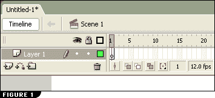
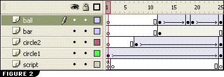

# 你的 Flash 网站的最佳结构

> 原文：<https://www.sitepoint.com/structure-flash-site/>

据他们所说，Adobe(以前是 Macromedia)的 Flash 应用程序是“业界最先进的创作环境，用于创建交互式网站和数字体验。”然而，许多用户很难在 Flash 中有效地构建他们的站点。

当 Flash 打开时，会出现一个空白画布，并显示一个带有多个空白帧的层，等待使用，如下图所示。几乎没有关于如何进行的指导，人们可以选择许多不同的方向。所以很容易理解为什么用户会感到困惑。



在过去的六年里，我一直在使用 Flash 并帮助其他人开发他们自己的 Flash 项目，有一件事对我来说变得很清楚:没有两个 Flash 网站的布局是相同的。可悲的是，我见过的 90%以上的 Flash 网站都没有有效的结构；有些效率低得可怕。虽然可能没有一种构建 Flash 网站的正确方法，但某些方法肯定比其他方法更好。

请记住，当我说“结构”时，我不是在谈论你的网站看起来如何；我们不在乎你的网站看起来怎么样，至少在这篇文章中不在乎。结构是关于用关键帧、ActionScript 和 MovieClips 设置您的 Flash 站点，以及控制 Flash 播放头。良好的结构可以让你的网站加载更快，更容易管理和更新，并防止意外的事情发生。一个糟糕的结构会增加加载时间，使未来的修改变得困难，并导致意想不到的麻烦。本文中解释的原则适用于所有的 Flash 站点设计。

在本文中，我们将开发一个导航系统。虽然这看起来微不足道，但它将作为本文的一个很好的示例，并且这些技术可以应用于您正在进行的任何项目，无论是完整的 Flash 网站、Flash 投票还是 Flash RSS 阅读器。顺便说一句，我在上个月创建了所有这些，所有这些都展示了我们将在这里看到的结构。

现在是继续进行的好时机，下载必要的文件，这样你就可以跟着做了。该代码档案包含一个 Flash FLA 文件、一个 XML 文件、一个 CSS 文件和一个 PNG 图像。

##### 在里面。鞭毛

一旦打开 navigation.fla 文件，您会立即注意到它看起来有多空。该文件仅包含跨越 4 帧的 2 层。几乎我所有的 Flash“作品”都有类似的结构:通常不超过 5 帧和几层。如果你的 Flash 结构看起来像下图所示，那么你做错了——这是一件好事，你正在阅读这篇文章。



先说个小技巧:千万不要用场景。场景可能会导致播放头产生意想不到的结果。播放头并没有真正优雅地从一个场景移到另一个场景。根据您的 Flash 站点，您可能会也可能不会注意到这一点。但是，如果您正在播放一个音乐文件，而您的播放头移到了另一个场景，您可能会在歌曲跳过时看到问题。由于这个原因，你不会在我们的文件中找到一个以上的场景。

让我们逐一检查每一帧。

##### 框架 1

第 1 帧总是——也是唯一的——用于设置全局变量。这很有效，因为播放头首先到达这一帧，设置我们的全局变量，然后移动到下一帧。我们永远不会回到第一帧。始终控制 Flash 播放头并知道它的位置是很重要的。现在，让我们看看代码:

```
var xmlFile:String = "navigation.xml"; 

var cssFile:String = "navigation.css"; 

var nCounter:Number = 0; 

var yPosition:Number = 0; 

var nTotalButtons:Number = 0; 

var astrImages:Array = new Array(); 

var astrText:Array = new Array(); 

var astrLinks:Array = new Array(); 

var image_mcl:MovieClipLoader = new MovieClipLoader(); 

var mclListener:Object = new Object(); 

// Formats our textField 

var my_css = new TextField.StyleSheet(); 

// fun with filters (new in Flash 8) 

import flash.filters.DropShadowFilter; 

var distance:Number = 2; 

var angleInDegrees:Number = 45; 

var color:Number = 0x000000; 

var alpha:Number = .8; 

var blurX:Number = 2; 

var blurY:Number = 2; 

var strength:Number = 1; 

var quality:Number = 3; 

var inner:Boolean = false; 

var knockout:Boolean = false; 

var hideObject:Boolean = false; 

var filter:DropShadowFilter = new DropShadowFilter(distance, angleInDegrees, color, alpha, blurX, blurY, strength, quality, inner, knockout, hideObject); 

var filterArray:Array = new Array(); 

filterArray.push(filter);
```

这里我们看到了我们的全局变量:一些字符串、一些数字和一些数组——你的典型变量。但是等等。还出现了一些不太典型的变量:MovieClipLoader、样式表和过滤器。

MovieClipLoader 类允许我们实现侦听器回调，在 SWF、JPEG、GIF 和 PNG 文件被加载到电影剪辑时提供状态信息。这比过时的 loadMovie()类要方便得多，后者无法向我们提供关于我们的文件已经被下载了多少的任何信息。稍后我们将使用 MovieClipLoader 类来加载我们的按钮图像。

StyleSheet 类允许您创建包含字体大小、颜色和其他样式的文本格式规则的 StyleSheet 对象。我们将在框架 4 中使用这个样式表来格式化导航按钮上的文本。

滤镜是 Flash 8 的新功能；它们允许我们给我们的物体添加一些很酷的效果。例如，我们可以对物体应用投影、模糊、发光和斜面。稍后，我们将对文本字段应用投影滤镜。有人会说，“有什么大不了的。如果我想要一个阴影，我可以使用 Photoshop 或 Fireworks。”你可以，但是那样你的文本将不再是动态的，就像我们的一样。

请记住，构成我们 Flash 站点的所有组件都不在 Flash 中。也许我应该在最后一句中用感叹号而不是句号？让我再说一遍，“组成我们的 Flash 站点的所有组件都不驻留在 Flash 中！”这种方法便于以后修改。例如，如果我不再喜欢为我的按钮选择的图像，我想把它换掉，这没问题。或者我想让按钮显示不同的内容，或者我想以后添加或删除一个按钮。两者都不是问题；事实上，我甚至不必打开 Flash 就可以进行这些更改。这确实非常方便，特别是当你为一个没有 Flash 或者没有太多技术知识的人创建一个项目时。

在我们继续第 2 帧之前，请注意我们的 3 个数组。这些数组将为我们的按钮存储数据。一旦我们的 XML 文件被成功解析，每个数组都将被适当的数据填充。这发生在第 2 帧。

##### 框架 2

概括一下，框架 1 的主要目的是什么？如果你说，“全局变量”，你会得到一个金星。如果没有，去星巴克买些咖啡再回来。

frame 2 的主要目的是收集外部数据——通常是 XML 形式的文字文件。如果您还没有看过我们的导航 XML 文件，现在是时候看一看了。这篇文章并不是要教你 XML，所以只要看看它的结构和里面有什么就行了。我们总共有 4 个按钮；每个按钮都被分配了一个图像、一些文本和一个链接。

所有非 Flash 8 用户请注意:您将无法使用 PNG 图像。您必须使用提供的 JPEG 图像，并在 XML 文件中进行更改。以前版本的 Flash 只能加载 JPEG 文件。

现在，让我们看看第 2 帧中的代码。我会边走边分析。

```
var xmlData:XML = new XML();
```

我们首先实例化一个新的 XML 对象，并将其命名为`xmlData`。XML 对象包含我们在 Flash 中处理 XML 数据所需的所有方法和属性。

```
xmlData.ignoreWhite = true;
```

Flash 将读取 XML 文件中包含的所有空格，包括空文本节点。由于这不是我们想要的结果，我们简单地告诉 Flash 忽略空白。

```
xmlData.load( xmlFile );
```

这一行从指定的 URL 加载一个 XML 文档。请记住，`xmlFile`是在第 1 帧中声明的，并被设置为“navigation.xml”。因为我们的 FLA 文件与 xml 文件驻留在同一个目录中，所以我们只需要给出名称。如果我们的 XML 文件位于存放 FLA 文件的目录之外，我们就会包含一个相对路径。

加载过程是异步的；在执行完`load()`方法后，它不会立即结束。当执行`load()`方法时，加载的 XML 对象属性被设置为 false。当 XML 数据完成下载时，loaded 属性设置为 true，并调用 onLoad 事件处理程序。

```
xmlData.onLoad = loadXML;
```

这里我们设置 onLoad 事件处理程序来调用我们的函数 loadXML。让我们来看看函数:

```
function loadXML(loaded) {  

 if (loaded) { 

  var xnRootNode:XMLNode = this; 

  trace( xnRootNode ); 

  // number on buttons 

  nTotalButtons = xnRootNode.firstChild.childNodes.length; 

  // fill arrays 

  for (var i = 0; i<nTotalButtons; i++) { 

   astrImages.push(xnRootNode.firstChild.childNodes[i] 

.childNodes[0].firstChild.nodeValue); 

   astrText.push(xnRootNode.firstChild.childNodes[i] 

.childNodes[1].firstChild.nodeValue); 

   astrLinks.push(xnRootNode.firstChild.childNodes[i] 

.childNodes[2].firstChild.nodeValue); 

  } 

  //everthing is loaded; we can move on 

  gotoAndStop(3); 

}
```

只有当 XML 文件下载完成并且 loaded 属性设置为 true 时，此函数才会运行。

如果 XML 文件已完成加载，我们将执行以下代码:

```
var xnRootNode:XMLNode = this;
```

我们创建一个 XML 节点变量(`xnRootNode`)并设置它等于*这个*；*这个*是刚刚加载的 XML 数据。

```
nTotalButtons = xnRootNode.firstChild.childNodes.length;
```

此时，我们需要讨论如何搜索 XML 来定位我们需要的值。这是重温我们的导航 XML 文件的好时机。

```
<nav>   

  <button>   

   <image>button1.png</image>   

   <text>Articles</text>   

   <link>articles.swf</link>   

  </button>   

  <button>   

   <image>button1.png</image>   

   <text>Books</text>   

   <link>books.swf</link>   

  </button>   

  <button>   

   <image>button1.png</image>   

   <text>Blog</text>   

   <link>blog.swf</link>   

  </button>   

  <button>   

   <image>button1.png</image>   

   <text>Contact 'company name' today for a free estimate</text>   

   <link>forum.swf</link>   

  </button>   

</nav>
```

为了从 XML 文件中检索值，我们遍历家族树，直到找到所需的值。所以在我们的代码中，`xnRootNode.firstChild.childNodes.length;`，第一个孩子，是`<nav>`，它有 4 个子节点——你猜对了，他们是我们的 4 个`<button>`节点。所以`nTotalButtons`现在等于 4。

接下来，我们使用“for 循环”来收集每个按钮的所有数据，并将其添加到数组中。

```
astrImages.push(xnRootNode.firstChild.childNodes[i]  

.childNodes[0].firstChild.nodeValue);
```

```
astrImages is our array for images; the push method adds our XML value to this array.

```
xnRootNode.firstChild.childNodes[i].childNodes[0].  

firstChild.nodeValue;
```

这可能一开始看起来很吓人，但是让我们来分解一下。

```
xnRootNode.firstChild is <nav>, its first child is the first occurrence of <button> and <button>'s first child is <image>. So far, so good, but what is <image>'s first child? If you said, "button1.png" then pat yourself on the back: that's correct. Even the text value within the node is considered a child node in Flash. Lastly, we use the nodeValue property to retrieve the node value of the XML object, in this case "button1.png." Have a look at the image below, as it may help. 

我们继续填充所有的数组，然后继续前进。只有在我们的 XML 数据完成加载并被推入数组后，我们才准备向前移动播放头。现在，我们进入下一个画面。

框架 3

框架 3 用于加载我们的 CSS 文件。看看我们的 navigation.css 文件:

```
.buttonStyle {  

font-family: tahoma, verdana, arial, helvetica;  

font-size: 16px;  

color: #000000;  

text-align: center;  

}
```

它看起来像任何其他的 CSS 文件。我们使用 CSS 来设置按钮的格式，这与我们保持外部和动态的范式一致。
现在我们的 CSS 已经成功加载，让我们继续到第 4 帧。
框架 4
在我们看第 4 帧的代码之前，让我们回顾一下。当我们的 Flash 文件加载时，它到达第 1 帧，并设置我们整个站点需要的所有变量。接下来，在第 2 帧中，我们收集外部数据。我们得到了一点额外的收获，学会了如何导入 XML 代码，然后解析并存储在 3 个数组中，我们将在第 4 帧中使用这些数组。在框架 3 中，我们导入了将在框架 4 中使用的 CSS。
我想让你注意的是，我们在最后一帧，在这一点上，什么都没有建成。到目前为止，我们只收集到了我们需要的数据。我们现在在第 4 帧，播放头将无限期地停留，我们的 Flash 文件将开始成形。
我们从跟踪数组开始，只是为了让自己确信我们拥有了所需的一切。如果你不熟悉`trace()`函数，那么你在 Flash 中不会走得太远。`Trace()`用于在测试 SWF 文件时在“输出”面板中显示消息。现在按 CTRL + ENTER 键，它应该会弹出输出面板，显示来自数组的数据。

```
for (var i = 0; i<nTotalButtons; i++) {  

 navHolder_mc.createEmptyMovieClip("navButton"+i, i );  

 // make new MovieClip and set to newly created button  

 var navButton:MovieClip = navHolder_mc["navButton"+i];  

 // load images  

 image_mcl.loadClip( astrImages[i], navButton );  

}
```

回想一下`nTotalButtons`设置在第 2 帧，等于 4 个按钮的总数。还要注意的是，`navHolder_mc`已经在我们的画布上的`navHolder`层中。
现在，我们使用“for 循环”来创建 4 个按钮。在`navHolder_mc`中，我们使用`createEmptyMovieClip()`方法创建一个包含按钮的电影剪辑。

```
var navButton:MovieClip = navHolder_mc["navButton"+i];
```

这将创建一个名为`navButton`的电影剪辑，并将其设置为新创建的电影剪辑。这只是让生活变得更容易:我们现在可以简单地提到`navButton`，而不是`navHolder_mc["navButton"+i]`。

```
image_mcl.loadClip( astrImages[i], navButton );
```

我们告诉`loadClip()`方法将按钮图像(从我们的数组中)加载到新创建的电影剪辑中。
现在，请记住`image_mcl`在第 1 帧中被定义为 MovieClipLoader，MovieClipLoader 允许我们实现监听器回调，让我们知道图像何时完成加载。

```
mclListener.onLoadInit = function(target_mc:MovieClip) { 
```

在剪辑的第一帧中的动作执行之后，调用`onLoadInit`处理程序，因此您可以开始操纵加载的剪辑。这个处理程序在`onLoadComplete`处理程序之后被调用。大多数情况下，使用`onLoadInit`处理程序。
此时，我们为按钮创建了一个新的电影剪辑，其中加载了我们的图像。现在让我们设置一些属性。

```
target_mc.linkURL = astrLinks[nCounter]; 
```

这会将名为“linkURL”的变量附加到`target_mc`电影剪辑；`target_mc`自动设置为调用此函数的对象；在这种情况下，这是我们的电影剪辑按钮。不相信我？追踪它！
注意:“自动地”是一个技术术语，指的是不用你做任何事情，事情就会自动发生，而且你无法解释它是如何发生的！请随意在办公室使用它——它将会流行起来。
接下来，我们将`linkURL`设置为数组中的第一个链接。

```
target_mc.onPress = buttonClick; 
```

这将`onPress`事件处理程序附加到我们的按钮上。换句话说，当按钮被点击时，它会调用`buttonClick`函数。

```
var buttonImgHeight:Number = target_mc._height;  

var buttonImgWidth:Number = target_mc._width;
```

我们定义了两个变量:一个存储按钮的高度，另一个存储它的宽度。

```
target_mc._y = Math.round( yPosition );  

yPosition += buttonImgHeight+3;
```

每当我们创建一个新按钮时，我们将按钮的垂直位置(y 位置)下移 3 个像素。

```
target_mc.createTextField( "buttonText", nCounter, 0, 0, buttonImgWidth, buttonImgHeight ); 
```

这在我们的按钮影片剪辑中创建了一个新的空文本字段。`createTextField()`方法有 6 个参数:

```
createTextField(instanceName:String, depth:Number, x:Number, y:Number, width:Number, height:Number); 
```

既然我们已经创建了一个新的文本字段(`buttonText`)，我们将为它分配一些属性。

```
target_mc.buttonText.border = false;  

target_mc.buttonText.selectable = false;  

target_mc.buttonText.wordWrap = true; 
```

文本字段的 border 属性当前设置为 false 然而，在开发过程中，我经常将此设置为 true，因为这使得定位事情变得稍微容易一些。此外，我们希望我们的文本换行，但我们不希望它是可选的。

```
target_mc.buttonText.styleSheet = my_css; 
```

这一行指定了我们已经导入的 CSS 样式。注意下一行:

```
target_mc.buttonText.htmlText = "<.buttonStyle>"+ astrText[nCounter] +"</.buttonStyle>"; 
```

在这里，您可以看到如何实现我们的 CSS 样式。回想一下`.buttonStyle`是在我们的外部 CSS 文件中定义的。还要注意我们使用了`htmlText`属性——不仅仅是文本。

```
target_mc.buttonText.filters = filterArray; 
```

这一行将我们的过滤器分配给文本字段。回想一下，我们在第 1 帧中创建了一个投影滤镜。如果你没有 Flash 8，你就不会使用任何滤镜。
接下来的几行代码非常酷；当试图垂直对齐文本时，它们非常方便。

```
target_mc.buttonText.autoSize = true;  

var nMiddle:Number = ( buttonImgHeight/2 );  

target_mc.buttonText._y = nMiddle - ( target_mc.buttonText._height/2 );
```

我们首先将文本字段的`autoSize`属性设置为 true。这允许文本栏的大小与其中文本的高度和宽度相匹配。接下来，我们找到按钮的中间，并将其存储在`nMiddle`中。如果我们把`buttonImgHeight`除以 2，我们应该找到按钮的中间。现在，我们可以将文本字段的 y 位置设置在按钮的中间。为此，用`nMiddle`减去文本字段的高度除以 2。
现在我们已经动态地垂直对齐了按钮中的文本。

```
nCounter += 1; 
```

对于每个生成的按钮，我们将`nCounter`增加 1。

```
image_mcl.addListener(mclListener);
```

附加到我们的 MovieClipLoader 对象的`addListener`方法允许它在我们的图像完全加载时接收通知。
最后一段代码是我们的按钮点击事件处理程序。

```
function buttonClick():Void {  

  trace( this.linkURL );  

} 
```

当按钮被按下时，该功能执行。我们对之前设置的按钮的`LinkURL`属性进行跟踪。如果您按 CTRL + ENTER 弹出“输出”面板，然后继续单击一些按钮，您应该会在“输出”面板中看到相关的 SWF 文件。
这就是我们在这篇文章中所谈到的。如果我们要继续，下一步将是使用另一个 MovieClipLoader 加载 SWF 文件，就像我们之前对图像文件所做的那样。然而，我们现在已经做了足够的工作来理解这一点。有什么意义？好吧，我们来回顾一下。
大局
我们在这篇文章中取得了很大的成就。我们已经学习了如何将 XML 导入 Flash，然后解析它并将其存储在数组中。我们学习了如何导入 CSS 并将其分配给文本字段以应用格式。我们还学习了如何使用 Flash 8 中的新滤镜功能来应用投影效果。这些都不错，但不是重点。
我想让你从这篇文章中学到的是我们构建 Flash 站点的方式。构成我们的 Flash 站点的所有东西都驻留在 Flash 之外:我们的外部 XML 文件包含用于按钮的文本、用于按钮的图像以及按钮的链接引用。我们的外部 CSS 文件保存了按钮的格式信息。
把所有东西都放在 Flash 之外，可以让我们的网站完全动态化——我们可以在任何时候进行修改，而不必动我们的 Flash 文件。另外，它还使我们的 SWF 文件非常小，加载速度也很快。
此外，我们在整个过程中完全控制着 Flash 播放头。我们按照自己的方式，而不是 Flash 的方式，将 Flash 播放头移动到下一帧，这有助于避免很多挫折。Flash 中的许多错误都是因为开发人员允许播放头自由运行而造成的。我们绝不允许这种情况发生；我们系统地控制了播放头。第 1 帧设置了全局变量，然后我们在第 2 帧停止，在那里我们加载了 XML 数据。完成后，我们在第 3 帧停止并加载 CSS 数据，完成后，我们在第 4 帧停止并构建我们的应用程序。
我希望本文提出的原则能让你更好地构建下一个 Flash 网站。

```

```

## 分享这篇文章