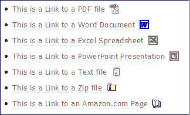

# 使用 DOM 提高可用性

> 原文：<https://www.sitepoint.com/usability-improvements-using-the-dom/>

通常，用户不喜欢惊喜。如果他们期待一件事情发生，而你给了他们其他的东西，他们就会变得暴躁。理应如此。

链接可能是最好的例子。看着 Acrobat 在点击一个看似无辜的链接后突然自发启动自己，你喃喃自语了多少脏话？我最讨厌的宠物。

当然，花时间在视觉上标记你的链接并不是什么新的突破性想法。Matterform 在 2001 年发布了一个 Dreamweaver 扩展(从内存中)，它自动识别外部链接、邮件链接、新窗口、Word、Flash、Quicktime 和几十个非标准链接，并将它们重新编码为美味的小图标。它没有写出最漂亮的代码(什么是<qbullet>标签？)，但这可能是固定的。</qbullet>

事实上，我们发现的最大问题往往是在更大的网站和 CMS 上推广它——你如何让你的客户将一个链接标记为 PDF？

particleTree 公司的克里斯·坎贝尔对这个问题有一个令人满意的答案——冷静下来，让浏览器去做。

在[用不引人注目的 JavaScript](http://particletree.com/features/preview-your-links) 预览你的链接中，Chris 向你展示了如何使用他的 *linkPreview()* 函数来教会聪明、年轻的浏览器进入每个页面，抓取链接，检查它们的文件扩展名，并添加适当的图标。

我想不出很多不使用这个的好理由。它很小，可以无缝地安装在预先存在的系统中(只需在头部加载脚本),并且一举提高了可用性。它不需要太多的技术知识来实现，可以轻松地改装以识别其他文件格式或网站，如 WAV，MP3 甚至维基百科。非 JS 浏览器并不比以前差。

正如一些评论者指出的，CSS3 确实有做这种事情的工具。非常好。魔法森林里的小精灵也有可能用他们神奇的仙尘对网络上的每个链接进行重新分类。

不过，目前来看，DOM 似乎是一个更好的选择。

## 分享这篇文章