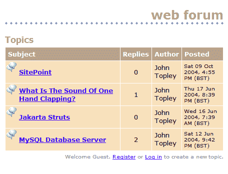
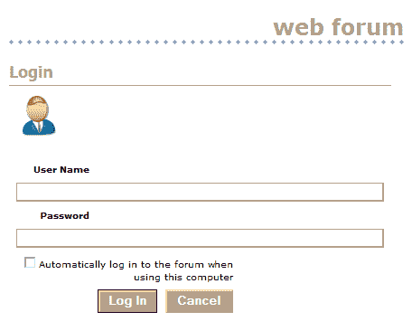
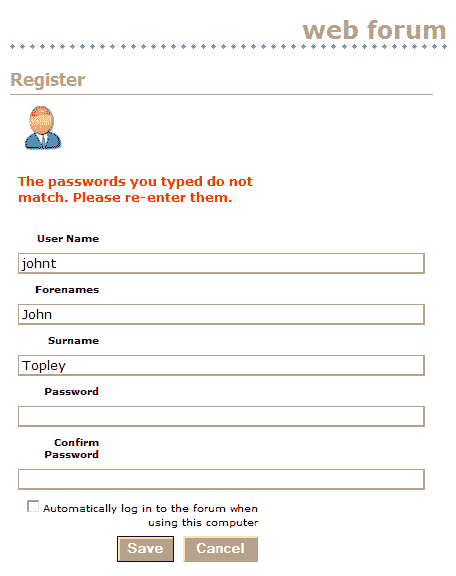
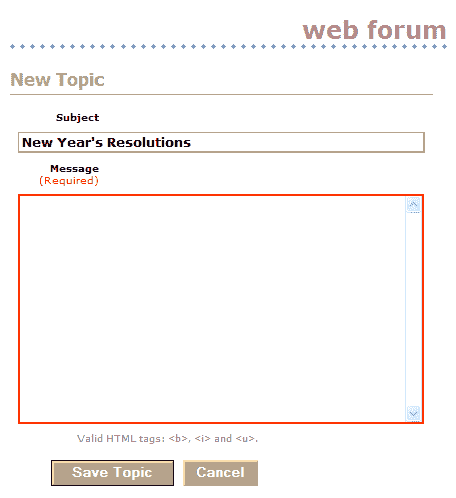
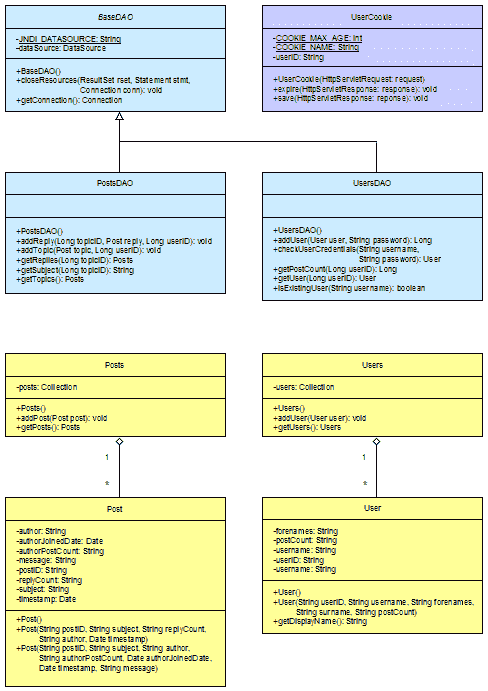
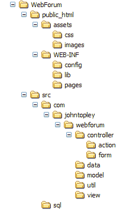

# Jakarta Struts 的第一步

> 原文：<https://www.sitepoint.com/struts-first-steps/>

就在一年多前，我开始学习如何使用 [Jakarta Struts](http://jakarta.apache.org/struts/) J2EE Web 应用框架。在这个过程中，我意识到我发现 Struts 的某些方面一开始令人困惑，许多其他开发人员可能会遇到同样的困难。本文试图解决这个问题。

现在有很多关于框架的好书，在线文档对于一个开源项目来说已经相当成熟了；尽管如此，为了更好地理解 Struts，我经常不得不参考各种各样的资源。仍然有一些领域的文档很少。

然而，本文并不试图提供权威的文档来源。更确切地说，它旨在让 Struts 的新来者立即投入使用，感受一下框架是什么样的，并理解它能做什么和不能做什么。

在我见过的 Struts 示例应用程序中，大多数要么过于琐碎，要么过于复杂，复杂的应用程序有许多外部依赖性，必须在编译和运行示例之前解决这些依赖性。在本教程中，我将尝试在这两个极端之间找到平衡点。我特意创建了一个具有最小外部依赖性的应用程序，因此您应该能够毫无困难地实际运行代码！你需要的一切都是开源的，可以免费下载——这是 J2EE 的优势之一。

我们将要构建的示例应用程序是一个在线论坛，我给它起了一个相当通用的名字“Web 论坛”。我选择了这种类型的应用程序，因为它应该是熟悉的，并且因为您可以创建相当多的功能，而应用程序不会变得太复杂。我们的网络论坛功能齐全，调试良好；希望了解它们是如何组合在一起的会很有趣。

值得注意的是，这段代码不应该被认为是生产质量 J2EE 系统的一个例子。特别是，异常处理非常——也是故意地——简单。这不是关于持久性策略、面向对象设计或 Web 应用程序 GUI 设计的教程；它只是学习 Struts 的一个工具。毫无疑问，我在这里创造的某些方面还可以改进，但现在这并不重要。我们开始吧！

##### 佐料

首先，让我们讨论一下创建应用程序所需的组件。我使用 Oracle JDeveloper 开发了 Web 论坛，因为我熟悉这个 IDE。您可以使用您选择的 Java 工具来编写代码。

除了源代码本身之外，下面是您需要的其他元素的列表:

*   Jakarta Struts 1.1 或更高版本(Web 应用框架)
*   MySQL 4.0.18 或更高版本(数据库服务器)
*   [MySQL 连接器/J 3.0](http://dev.mysql.com/downloads/connector/j/3.0.html)(MySQL 的 JDBC 驱动)
*   [阿帕奇 Tomcat 5 . 0 . 28；](http://jakarta.apache.org/site/binindex.cgi)或更高版本(J2EE 网络容器)

我还使用了 [MySQL 控制中心](http://dev.mysql.com/downloads/mysqlcc.html)来创建数据库并控制数据库服务器，尽管如果您喜欢的话也可以使用 MySQL 命令行。注意，因为这不是 MySQL 教程，所以假设您对 MySQL 有一些了解。至少，您需要知道如何启动和停止数据库服务器，如何创建新的数据库，并且需要能够运行提供的 SQL 脚本来创建表。

##### 源代码下载

这些是我们将在本教程中使用的文件。

*   [下载 struts _ web forum _ jars . zip(855 KB)](https://www.sitepoint.com/examples/struts/struts_webforum_jars.zip)
*   [下载 struts _ web forum _ src . zip(52kb)](https://www.sitepoint.com/examples/struts/struts_webforum_src.zip)
*   [下载 struts _ web forum _ war . zip(1122 KB)](https://www.sitepoint.com/examples/struts/struts_webforum_war.zip)

为了减小下载文件的大小，我将进入`WEB-INF/lib`的 Struts JAR 文件拆分成一个单独的下载文件。预编译的 WAR 文件也是可用的。

##### 应用程序

让我们简单浏览一下网络论坛的功能。在我写一行代码之前，我已经想到了其中的一些，但是当我构建应用程序时，其他方面变得很明显。事实上，有大量的现有论坛作为灵感当然有帮助！

在启动应用程序时，用户会看到一个主题列表，以及关于每个主题的信息，例如:

*   张贴的日期和时间
*   回复的数量
*   主题的作者

显示 16 个最近的主题，从最新到最早排序:


此时，用户可以单击某个主题来查看它，以及任何后续回复:



文章发表的日期和时间会显示出来，还有作者的名字，他们在系统中注册的日期，以及他们发表的文章数量。如果是新用户，用户可以注册；如果是现有用户，用户可以登录。用户必须登录才能创建新主题或新回复。用户可以选择在注册时自动登录，或者在登录屏幕上登录:



自动登录功能使用 30 天后过期的 cookie。在注册过程中，用户必须提供一个唯一的用户名、他或她的真实姓名(或屏幕别名)和密码。除了姓氏之外，所有这些字段都是必填的，用户必须输入两次来确认他或她选择的密码:



注册成功后，用户将返回到主题屏幕，在该屏幕上他或她可以创建一个新主题:



主题和消息字段都是必填的。用户可以在消息字段中使用 HTML `<b>`、`<i>`或`<u>`标签进行基本的文本格式化(粗体、斜体或下划线)。一旦用户创建了一个新主题，他或她将被带回到主题屏幕。

主题超链接确保用户可以看到他们已经阅读过的主题。用户已经阅读过的主题的超链接使用浏览器访问过的链接颜色显示。但是，每个主题链接都包含对该主题的回复数量的编码。因此，对某个主题的新回复会导致该主题的超链接使用浏览器的未访问颜色显示。感谢乔尔·斯波尔斯基这个非常简单的想法。

当查看主题时，用户可以撰写新的回复；同样，消息字段是必需的，并且接受基本的格式标记:


##### 持久层

Web 论坛应用程序中的持久层非常简单。有两个数据库表:一个用于帖子，另一个用于用户。帖子表存储主题及其回复。users 表存储应用程序的注册用户的详细信息。使用数据访问对象(Dao)来访问这些表，Dao 只是执行简单的对象关系映射的 Java 对象。换句话说，它们获取一个 Java 对象并将其内容持久化到一个表中，反之亦然。

Dao 中嵌入了适当的 SQL 语句，尽管这可能不是一个好的实践:数据库管理员喜欢将这些东西外部化，这样就可以对它们进行调优。我还为所有 Dao 创建了一个抽象超类，其中包含从数据源获取 JDBC 连接和关闭数据库资源等实用方法。

这是帖子表的模式:


这个表最有趣的特性是 ParentID 列，它将回复链接回它们的父主题。当帖子是回复而不是主题时，主题列为空。我将每个主题的回复数量存储在 ReplyCount 列中。从技术上讲，这是多余的，因为它可以被计算，但我存储它是因为 MySQL 目前不支持嵌套的 SQL SELECT 语句。

CreationDate 列最初是自动更新的，但我对它进行了更改，因为每当有回复添加到该主题时，原始主题的日期和时间都会更新为当前的日期和时间。

下面是用户表的模式:


创建这些表的 MySQL SQL 脚本在`src/sql/create_tables.sql`中。这个脚本可以在 MySQL 控制中心的查询窗口中运行。注意，它假设名为`webforum`的数据库存在。此外，因为我们在本文中没有构建创建新主题的功能，所以您必须手动插入一些测试数据，以便显示一些主题。

##### 业务对象层

我不需要做太多思考就能在应用程序中提出业务对象:它们非常明显。有针对单个帖子和用户的类，也有帖子和用户的集合。类模型(不包括 Struts 类)如下所示:



其中的一些类，比如 UserCookie，将在本系列的后面讨论。从类模型中可以看出，posts 类在运行时包含一个 Post 对象集合，并提供了检索该集合和添加新 Post 的方法。Post 类本身具有与 posts 表中的列相对应的属性，以及根据帖子是主题还是回复来调用的重载构造函数。类模型中没有显示访问器和赋值器(getters 和 setters)。

Users 类包含运行时用户对象的集合，并提供检索该集合和添加新用户的方法。事实上，在我发现我编写了 getUsers 方法，但实际上并没有从任何地方调用它之后，我就放弃了它！User 类具有镜像 users 表中的列的属性，以及一个方便的 getDisplayName 方法，该方法返回用户的名和姓，中间有一个空格字符。

##### 项目结构

源代码文件夹树的组织如下所示:



Java 源代码文件归在 src 下，Java 包层次结构的根在`com.johntopley.webforum`。`public_html`文件夹对应于 Web 应用程序的根目录。

我总是把 JSP 放在页面下面，因为这允许它们受到使用 J2EE 声明式安全的 Web 容器的保护。`public_html`及其子文件夹中的任何东西都应该被视为公共的。

我也喜欢将 Struts 配置文件分离到一个 config 文件夹中，尽管通常你会看到它们直接存储在`WEB-INF`下。

应用程序入口点是`public_html/index.jsp`，它在`web.xml` Web 应用程序部署描述符中被声明为一个欢迎文件。我们来看看 index.jsp:

```
<%@ taglib uri=http://jakarta.apache.org/struts/tags-logic  

    prefix="logic" %>  

<logic:redirect forward="ViewTopics" />
```

这个页面所做的就是将控制权转移给 Struts 框架，因为如果我们要使用一个框架，我们希望尽快使用它。Struts 附带了许多 JSP 标记库(taglib ),这里我们使用的是`logic` taglib。它处理输出文本的有条件生成，遍历对象集合和应用程序流管理。在这种情况下，`redirect`标记执行一个到 Struts 逻辑 URL 的 HTTP 重定向。稍后会有更多的介绍。

关于 Web 论坛应用程序需要注意的一点是，我们使用 Servlet 2.3 规范语法来引用使用 URIs 的标记库，而不是引用`web.xml`文件中的 TLD 文件。这在 Struts 用户指南的[第 5.4.3 节中有记录。](http://struts.apache.org/userGuide/configuration.html#dd_config_taglib)

##### Struts 的核心

Struts 的核心是`config/struts-config.xml`文件。这个文件定义了应用程序的流程，并告诉 Struts 哪些类用于什么。Struts ActionServlet 是一个控制器类，它读取该文件并接收 Web 应用程序的所有传入请求。ActionServlet 需要在 web.xml 文件中配置为 Servlet:

```
<servlet-name>action</servlet-name>  

  <servlet-class>org.apache.struts.action.ActionServlet</servlet-class>  

  <init-param>  

    <param-name>config</param-name>  

    <param-value>/WEB-INF/config/struts-config.xml</param-value>  

  </init-param>  

  .  

  .  

  .
```

本文涉及的`struts-config.xml`文件的主要部分是:

```
<struts-config>  

  <global-forwards>  

    <forward name="ViewTopics" path="/ViewTopics.do"/>  

  </global-forwards>  

  <action-mappings>  

    <action  

      path="/ViewTopics"  

      type="com.johntopley.webforum.controller.action.ViewTopicsAction"  

      scope="request">  

      <forward  

        name="Topics"  

        path="/WEB-INF/pages/topics.jsp"  

      />  

    </action>  

  </action-mappings>  

</struts-config>
```

Struts 在 Web 应用程序中引入了一个间接层，因为它使用逻辑 URL。这意味着您在浏览器地址栏中看到的地址并不对应于该资源在 Web 服务器上的物理位置。这使得开发人员可以在不破坏东西的情况下轻松地移动资源。逻辑名称与资源关联的 Struts 名称是一个 *ActionForward* ，通常被称为 *Forward* 。Struts 配置文件包含一个`global-forwards`部分，它允许配置在整个 Struts 应用程序中可用的转发。这些是应用程序的入口点。

Struts 的另一个关键概念是 *Action* 类。动作只是 Java servlets，所以 servlet 能做的任何事情，动作类也能做。操作用于处理对特定 URL 的请求。通常，它们应该作为业务对象层周围的一个薄层，完成真正的工作。

动作由 *ActionMappings* 引用，它们也是逻辑 URL。Struts 约定是 ActionMappings 以`.do`结束。需要配置`web.xml`文件，以便使用 Struts ActionServlet 处理任何匹配模式`*.do`的 URL，如下所示:

```
<servlet-mapping>  

  <servlet-name>action</servlet-name>  

  <url-pattern>*.do</url-pattern>  

</servlet-mapping>
```

##### 事件的流程

让我们回顾一下我们到目前为止的进展。`index.jsp`页面重定向到`ViewTopics`全局 ActionForward，这将控制传递给`/ViewTopics`动作。Struts 知道要调用哪个操作类，因为 ActionMapping 中的`type`属性给出了相关 Java 类的全限定名，该类必须从`org.apache.struts.action.Action`继承，并且必须有一个带有以下签名的`execute`方法:

```
public ActionForward execute(ActionMapping mapping,  

                             ActionForm form,  

                             HttpServletRequest request,  

                             HttpServletResponse response)  

  throws Exception
```

`mapping`参数是一个 ActionMapping 对象，表示调用此操作的 ActionMapping。如果 HTML 表单与请求相关联，则使用`form`参数。`request`和`response`参数强调了一个事实，即 Action 类只是 servlet 的一个专门化。

Web 论坛应用程序使用了一个从前面提到的`org.apache.struts.action.Action`类继承而来的`BaseAction`抽象类。应用程序中的其他动作类继承自`BaseAction`，所以它作为一个扩展点，如果需要的话，可以添加所有动作类共有的功能。这应该被认为是良好的做法。

重要提示:动作类不应该使用实例变量，因为它们不是线程安全的。状态应该通过在请求、会话或 servlet 上下文对象中存储值来共享，这取决于它们的作用域。

这是`ViewTopicsAction.java`中的执行方法:

```
public ActionForward execute(ActionMapping mapping,  

                             ActionForm form,  

                             HttpServletRequest request,  

                             HttpServletResponse response)  

  throws Exception  

{  

  request.setAttribute(KeyConstants.POST_LIST_KEY,  

    new PostsDAO().getTopics());  

  return mapping.findForward(ForwardConstants.TOPICS_PAGE);  

}
```

一个新的`PostsDAO`对象被实例化，它的`getTopics`方法被调用。这个方法使用下面的 SQL 语句来查询`posts`表:

```
SELECT p.PostID, p.Subject, p.ReplyCount, p.UserID, p.CreationDate  

FROM Posts p  

WHERE p.ParentID = 0  

ORDER BY p.CreationDate DESC
```

SQL `WHERE`子句确保只选择主题，而不选择回复。`getTopics`方法返回`Posts`类的一个实例，即`Post`对象的有序集合。这个实例存储在 HTTP 请求中由`KeyConstants.POST_LIST_KEY`常量引用的键下。显示主题列表的 JSP 将使用存储在请求中的这个`Posts`对象。最后，调用`ActionMapping`类的`findForward`方法。这将把 Struts Forward 的名称作为字符串参数传递给它。`ForwardConstants`类包含网络论坛中使用的所有转发名称。

除了全局 action forward，Struts 还有本地 action forward。这些只是转发，其范围是单个 ActionMapping 的本地范围。换句话说，它们在应用程序中不是全局可见的。

重要提示:Struts 赋予本地 action forward 比全局 action forward 更高的优先级。

在`/ViewTopics` ActionMapping 中使用本地转发来保存对显示主题列表的 JSP 的引用:

```
<forward name="Topics" path="/WEB-INF/pages/topics.jsp"/>
```

我们终于有了页面的物理路径！topics.jsp 包含在本文的源代码下载中(上面有链接)，所以您可以看到主题列表。

##### 使用 Apache Ant 构建应用程序

如果您不熟悉 Apache Ant 构建工具，花点时间阅读一下 [Apache Ant 揭秘](https://www.sitepoint.com/article/apache-ant-demystified)，这会让您快速上手。Web Forum 应用程序的构建文件应该不会看起来太陌生，尽管它确实使用了更多 Ant 的内置任务。另一个关键区别是，因为这个应用程序不仅仅是一个简单的“Hello World”应用程序，所以我们必须处理类路径。好消息是 Ant 也让这变得简单了！

为了编译应用程序，我们需要在类路径中有 J2EE 库。幸运的是，Apache Tomcat Web 容器已经附带了这些库，所以问题变成了引用。与其将 Tomcat 的安装文件夹硬编码到我们的构建文件中，不如让我们设置一个名为`TOMCAT_HOME`的操作系统环境变量，它引用 Tomcat 安装文件夹的根目录，例如 C:Program files Apache Software foundation Tomcat 5.0。这样做的过程与我们在 [Apache Ant Demystified](https://www.sitepoint.com/article/apache-ant-demystified) 中创建`ANT_HOME`和`JAVA_HOME`环境变量的过程完全相同。

完成后，我们可以在 build.xml 文件的顶部添加几个属性声明:

```
<project name="webforum" default="dist" basedir=".">   

  <description>   

    Build file for the Struts WebForum application.   

  </description>   

  <property environment="env" />   

  <property name="tomcat.dir" location="${env.TOMCAT_HOME}" />
```

第一个属性声明只是说我们希望使用标识符 env 来引用操作系统环境变量。第二个属性将`tomcat.dir`的位置设置为任意值`env.TOMCAT_HOME`。因此，从现在开始，当我们想要引用 Tomcat 的安装文件夹时，我们可以简单地使用`${tomcat.dir}`。

后来，我们设置了一个名为`j2ee.lib.dir`的属性，指向 Tomcat 保存其 J2EE 库的位置:

```
<property name="j2ee.lib.dir" location="${tomcat.dir}/common/lib" />
```

我们现在需要处理设置类路径的问题。Ant 提供了几种方法来实现这一点；我们将设置一个路径结构，并为其分配唯一的类路径 ID:

```
<path id="classpath">   

  <pathelement path="${j2ee.lib.dir}/servlet-api.jar" />   

  <fileset dir="${web.lib.dir}">   

    <include name="**/*.jar" />   

  </fileset>   

</path>
```

上面的代码片段显示了这个路径结构中有两个元素。第一个元素是对`servlet-api.jar`文件的单独引用，使用`pathelement`标签来引用。第二个元素是 Ant 的`fileset`标签，在我们的例子中，它被设置为包含由`${web.lib.dir}`属性表示的文件夹中的所有 JAR 文件。为了澄清，我们设置了一个包含 Tomcat 的`servlet-api.jar`文件和`public_html/WEB-INF/lib`中所有 JAR 文件的类路径。

为了使用这个类路径，我们的构建文件的`compile`目标中的`javac`任务包含一个嵌套的`classpath`标记，它有一个`refid`属性设置为我们上面定义的路径结构的名称:

```
<javac srcdir="${src.dir}" destdir="${classes.dir}">   

  <classpath refid="classpath" />   

</javac>
```

这就是我们如何确保 Java 编译器能够找到编译我们的应用程序所需的所有库。`javadocs`目标也使用这个类路径，我们定义了一次，然后可以在构建文件中的任何地方重用。

下一个任务是将编译后的代码打包到一个 WAR 文件(Web 归档文件)中，以便可以由 Tomcat 运行。我们创建一个看起来像这样的`dist`目标:

```
<target name="dist" depends="compile"   

            description="Create the binary distribution.">   

  <delete dir="${dist.dir}" />   

  <mkdir dir="${dist.dir}" />   

  <war basedir="${web.src.dir}"   

          destfile="${dist.warfile}"   

          compress="true"   

          webxml="${web.src.dir}/WEB-INF/web.xml"   

          excludes="**/web.xml">   

         <classes dir="${classes.dir}" />   

  </war>   

</target>
```

注意这个目标依赖于`compile`目标，它确保我们总是在试图创建包含代码的发行版之前编译代码！在删除并重新创建输出目录之后，我们使用 Ant 的`war`任务来创建 WAR 文件。`basedir`属性指向一个代表`public_html`文件夹的属性——我们应用程序的根。`destfile`属性仅仅指定了将要创建的输出 WAR 文件的名称。我们可以选择是否使用`compress`属性来压缩文件——你猜对了；`webxml`属性告诉`war`任务我们的 Web 应用程序部署描述符的位置。最后一个属性的使用自动确保了`web.xml`文件包含在 WAR 文件中。因此，我们使用`excludes`属性告诉 Ant 不要生成警告，因为它认为我们试图包含`web.xml`两次。最后，一个嵌套的`classes`元素告诉`war`任务我们编译的类在哪里。

如果您运行`dist`目标，然后使用 WinZip 打开`/dist/WebForum.war`(或者从这个站点下载预编译的版本)，您可以看到归档中的布局精确地反映了前面提到的源代码树。编译后的代码放在`WEB-INF/classes`中，Struts 和 MySQL JDBC JAR 文件放在`WEB-INF/lib`中。

##### 使用 Apache Tomcat 运行应用程序

这些说明描述了如何配置 Apache Tomcat Web 容器来使用 MySQL 数据源。他们已经使用 Tomcat 5.0.28 和 MySQL 4.0.18 进行了测试，但是应该也可以使用 Tomcat 4 和 MySQL 的其他版本。注意`TOMCAT_HOME`是指 Tomcat 安装文件夹的根目录，例如 C:Program files Apache Software foundation Tomcat 5.0。

将 MySQL JDBC 驱动程序 JAR 文件复制到`TOMCAT_HOME/common/lib`。
编辑`TOMCAT_HOME/conf/server.xml`文件，使其包含网络论坛应用程序的上下文定义。`server.xml`文件的主要元素如下所示:

```
<Server>   

  <Service>   

    <Engine>   

      <Host>   

        :   

        <Context>   

          <!-- Existing context definitions. -->   

        </Context>   

        :   

        <!--   

         | Paste Web Forum context definition (shown below) here.   

         +-->   

      </Host>   

    </Engine>   

  </Service>   

</Server>
```

将 Web Forum 应用程序的以下上下文定义添加到`server.xml`文件中的适当位置，在斜体部分替换您的 MySQL webforum 数据库用户名和密码:

```
<!--   

 | Begin WebForum context definition.   

 +-->   

<Context path="/WebForum" docBase="WebForum"   

    reloadable="true">   

  <Logger className="org.apache.catalina.logger.FileLogger"   

      prefix="localhost_WebForum." suffix=".txt" timestamp="true"/>   

  <Resource name="jdbc/WebForumDS" auth="Container"   

      type="javax.sql.DataSource"/>   

  <ResourceParams name="jdbc/WebForumDS">   

    <parameter>   

      <name>factory</name>   

      <value>org.apache.commons.dbcp.BasicDataSourceFactory</value>   

    </parameter>   

    <!--   

     | The JDBC connection URL for connecting to your MySQL DB.   

     | The autoReconnect=true argument to the URL makes sure that the   

     | MySQL JDBC Driver will automatically reconnect if mysqld closed   

     | the connection. mysqld by default closes idle connections after   

     | 8 hours.   

     +-->   

    <parameter>   

      <name>url</name>   

      <value>jdbc:mysql://localhost:3306/webforum?   

          autoReconnect=true</value>   

    </parameter>   

    <!--   

     | MySQL username and password for DB connections.   

     +-->   

    <parameter>   

      <name>username</name>   

      <value>*username*</value>   

    </parameter>   

    <parameter>   

      <name>password</name>   

      <value>*password*</value>   

    </parameter>   

    <!--   

      | Class name for MySQL JDBC driver.   

      +-->   

    <parameter>   

      <name>driverClassName</name>   

      <value>com.mysql.jdbc.Driver</value>   

    </parameter>   

    <!--   

     | Maximum number of DB connections in pool. Make sure you   

     | configure your mysqld max_connections large enough to handle   

     | all of your DB connections. Set to 0 for no limit.   

     +-->   

    <parameter>   

      <name>maxActive</name>   

      <value>100</value>   

    </parameter>   

    <!--   

     | Maximum number of idle DB connections to retain in pool.   

     | Set to 0 for no limit.   

     +-->   

    <parameter>   

      <name>maxIdle</name>   

      <value>30</value>   

    </parameter>   

    <!--   

     | Maximum time to wait for a DB connection to become available   

     | in ms, in this example 10 seconds. An exception is thrown if   

     | this timeout is exceeded.   

     | Set to -1 to wait indefinitely.   

     +-->   

    <parameter>   

      <name>maxWait</name>   

      <value>10000</value>   

    </parameter>   

  </ResourceParams>   

</Context>   

<!--   

 | End WebForum context definition.   

 +-->
```

接下来，将我们之前创建的`dist/WebForum.war`复制到`TOMCAT_HOME/webapps`。下次启动 Tomcat 时，这个归档文件将被自动扩展，Web 论坛也将被部署。

启动 MySQL 和 Tomcat 服务器后，可以使用 URL 在 Web 浏览器中访问该应用程序:http://localhost:8080/Web forum/

在这一部分中，我们已经讨论了很多重要的内容。下一次，我们将看看主题页面是如何工作的，并从那里继续。到时候见！

## 分享这篇文章