# 用 eZ publish 构建无表格 CSS 布局

> 原文：<https://www.sitepoint.com/table-less-css-ez-publish/>

最近，每当你阅读关于设计和 HTML 的文章时，你都会看到所谓的无表格 CSS 布局。本文涵盖了如何使用 CSS 的力量来主题化 eZ publish 3.5。在这里，我们将通过使用 CSS 创建一个新的主题所需的每个步骤。

##### 入门指南

为了能够遵循这些步骤，您需要安装 eZ publish。我不会详细说明这是如何实现的，因为在 [www.ez.no](http://www.ez.no/ez_publish/documentation/installation) 已经解释过了。在安装过程中，您需要选择新闻包并关闭左侧菜单。然后，您将拥有我在本文中作为示例使用的相同设置。

此外，您应该已经在 SitePoint 阅读了关于配置 eZ publish 的文章([用 eZ publish 构建一个支持 WebDav 的内部网](https://www.sitepoint.com/article/build-intranet-ez-publish))。在本文中，我将演示如何定制 eZ publish，甚至比本文所解释的还要进一步。

如果你不想在你的系统上安装 eZ publish，你可以在[http://devel.ezpublish.no/](http://devel.ezpublish.no/)使用 eZ publish 的在线演示进行测试。管理界面的相应网站位于 http://admindevel.ezpublish.no/的[。您可以使用登录用户名 admin 和密码 publish 作为管理员登录。](http://admindevel.ezpublish.no/)

##### 修改代码

本文解释了如何在 eZ publish 中修改 CSS 以创建新的 eZ publish 站点样式包。这样一个包可以导入到任何 eZ publish 3.5 安装中，并且会立即改变站点的外观和感觉。这个过程的第一步是获取 CSS 文件。我们需要更改两个 CSS 文件:site-colors.css 和 classes-colors.css。这些是我们稍后将用来创建 eZ publish CSS 包的文件。

我们有两种方法可以修改这些文件。第一种可能是在能够保存包含 HTML 图像和 CSS 的完整页面的浏览器中打开 eZ publish 站点。我在这个例子中使用了 [Opera](http://www.opera.no) 。一旦你加载了默认的 eZ publish 用户网站，你可以选择 Opera 中的“文件- >保存图片”菜单。这将整个页面保存为静态副本，您可以在应用 CSS 时使用它。

Opera 保留了所有的 CSS 文件，但是重命名了这些文件。最初名为 site-colors.css 的文件被重命名为 site-col . CSS；classes-colors.css 被重命名为 classes-. CSS。Opera 这样做是为了确保与 DOS 中要求的旧样式文件名大小兼容，它在点之前有 8 个字母，在点之后有 3 个字母。该文件是页面的离线副本，我将在本文的其余部分使用它来创建 CSS 包。

另一种方法是在安装了 eZ publish 的情况下直接访问 CSS 文件，当然，这需要访问运行 eZ publish 的服务器。在默认安装中，您可以访问 eZ publish 根目录下 packages/styles/t01/files/default/file/design/base/style sheets/t1/中的 CSS 文件。

##### 页面的快速概览

下图显示了默认安装后 eZ publish 安装的样子。所有单个页面元素的布局都在上面提到的两个 CSS 文件中定义。为了让您更容易定制文件，让我解释一下页面的不同部分是如何根据 CSS 命名的。

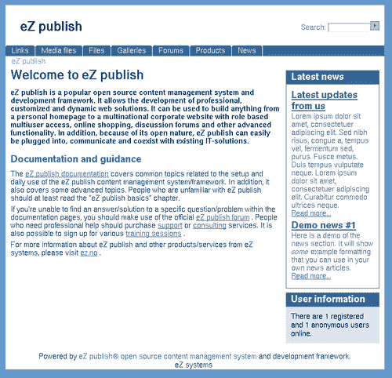

从顶部开始，我们有包含所有主要内容的区域，因此被称为“allcontent”。页面的顶部称为“topcontent”，包含两个元素:“header”和“toolbar-top”。页眉用于显示网站的徽标或标题，而工具栏可以包含各种工具，如搜索框和登录信息。

上层菜单叫“top menu”；eZ publish 可能还会提供一个左侧菜单，但是在这个设置中是隐藏的。正如我上面提到的，你还需要在你的设置中隐藏左边的菜单来跟随这个教程。

导航的面包屑元素称为“路径”。右边的框包含在“右菜单”中，我们称之为“工具列表”和“工具箱”。例如，“工具列表”通常是最新新闻的列表，而“工具箱”包含固定的信息，如当前在线访问者的数量、搜索框和登录用户的详细信息。

在每个页面的底部有另一个叫做“工具栏-底部”的工具栏，它在默认安装中是隐藏的，但是可以在管理界面中打开。页面的最后一部分称为“页脚”，包含版权信息。

##### 洗牌元素

为了演示我们如何简单地通过改变 CSS 文件来改变整体布局，让我们以不同的方式浮动工具栏。这是这部分实验的结果:

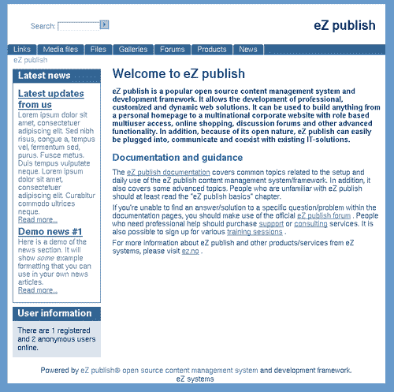

我们可以从标题开始，它分为两部分:左边是徽标，右边是带有搜索框的工具栏。

为了使标题向右浮动，我们需要将下面的 CSS 片段添加到 site-colors.css 中。

```
div#header-design 

{ 

    float: right; 

}
```

然后，我们将顶部工具栏向左浮动，以改变元素的位置。这是通过将以下 CSS 代码添加到 site-colors.css 文件中来实现的。

```
div#toolbar-top 

{ 

    float: left;  

} 

div#toolbar-top ul 

{ 

    float: left; 

}
```

这很简单。我们已经用一种方式定制了布局，如果 HTML 用指定布局的表格结构标记，这是不可能的。

让我们继续右边的菜单，它包含了最新的新闻工具栏，把它移到左边。这与上一个示例类似:我们将如下所示的 CSS 代码添加到 site-colors.css 中。注意，我们需要在左侧添加更多的填充，以在工具栏和主布局的边缘之间创建一个空间。

```
div#rightmenu  

{ 

    float: left; 

} 

div#rightmenu-design 

{ 

    padding-left: 10px; 

}
```

您可以看到主要内容出现在右菜单下。这是因为没有足够的空间，浏览器中断了流动。为了避免破坏设计，我们需要改变主要内容的边距。如果我们在左边添加 16em 的边距，在右边添加 10px 的边距，我们就有了一个有效的 CSS 设置。因此，我们需要更改 site-colors.css 中的 CSS 设置，如下所示。

```
div.maincontent-noleftmenu 

{  

    margin-left: 16em; 

    margin-right: 10px; 

}
```

##### 着色

当我们开始定制时，调整网站的颜色可能是我们许多人考虑的第一件事，因为我们想让设计反映我们公司或组织的形象。这也是最容易做到的，因为它基本上涉及到改变一些我们可以从 Photoshop 中获得的十六进制颜色代码。这是经过一点颜色实验后的页面:

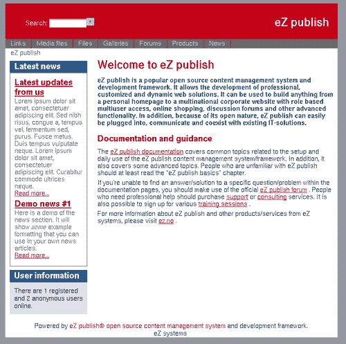

让我们从头开始。我们将页面的背景颜色设置为灰色，页眉的背景颜色设置为红色。这是通过将如下所示的 CSS 添加到 site-colors.css 来实现的。

```
body 

{ 

    background-color: #999; 

} 

div#topcontent  

{ 

    background-color: #c40017; 

}
```

现在我们已经改变了背景颜色，我们需要改变文本的颜色。通过向 site-colors.css 添加以下 CSS，可以将顶部工具栏设置为白色。

```
div#toolbar-top li.toolbar-item, div#toolbar-bottom li.toolbar-item a 

{ 

    color: #fff; 

}
```

顶部菜单的颜色也需要改变。我决定给它们两种不同的灰色。选定的菜单项变为浅灰色，而未选定的菜单项保持深灰色。文本颜色也被设置为浅灰色和深灰色。site-colors.css 的 CSS 代码如下所示。

```
div#topmenu li 

{ 

    background-color: #6a6a6a; 

    border-color: #c40017; 

} 

div#topmenu li.selected 

{ 

    background-color: #d9d9d9; 

} 

div#topmenu li a 

{ 

    color: #ddd; 

} 

div#topmenu li.selected a 

{ 

    color: #555; 

} 

div#submenu 

{ 

    background-color: #d9d9d9; 

    border-color: #d9d9d9; 

} 

div#submenu li a 

{ 

    color: #555; 

}
```

要使面包屑变成灰色，我们只需将如下所示的 CSS 代码添加到 site-colors.css 中。

```
div#path p, div#path p a 

{ 

    color: #555; 

}
```

标题需要变成红色；因此，下面的 CSS 需要添加到 site-colors.css 中。

```
div#maincontent h1, div#maincontent h2, div#maincontent h3 

{  

    color: #c40017; 

}
```

最后，我们改变主题中链接的颜色。这很简单，通过下面截取的 CSS 就可以实现。

```
a  

{   

    color: #c40017;  

}
```

##### 工具列表曲线

作为一个如何在基于 CSS 的设计中使用图像的例子，我将通过在布局中添加背景图像来制作一些边角。第一个弯角是为工具列表的右角定义的，显示最新消息。

下面的截图显示了我们应用了这些 CSS 修改后工具列表的样子。

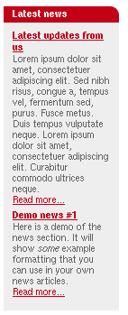

我们创建一个有红色前景色和白色背景色的图像。图像与工具列表标题的右上方对齐。如果我们额外将边框设为白色，并将整个框的背景色设为浅色，那么工具列表的边角将会非常圆润。将如下所示的 CSS 代码添加到 site-colors.css 文件中。该图像需要放在名为 images 的子文件夹中。

```
div.toollist-design  

{   

    background-color: #eee;  

    border-color: #fff;  

}  

div.toollist-design h2  

{   

    color: #ffffff;  

    background-color: #c40017;  

    background-image: url(images/rounded_right.gif);  

    background-repeat: no-repeat;  

    background-position: top right;  

}
```

##### 工具箱曲线

接下来，我们修改工具箱。

下面的 CSS 代码添加边框并将背景色设置为白色。我这样做是为了使工具箱的显示与工具列表略有不同，因为它们包含不同类型的内容。

```
div.toolbox-design  

{   

    background-color: #fff;  

    border: 1px solid #c40017;  

}  

div.toolbox-design h2  

{   

    color: #ffffff;  

    background-color: #c40017;  

}
```

我想在主要内容区的右上角和左下角再加两个圆角。这是用同样的技术完成的:只需用相应的曲线创建一个图像，并将其添加为背景图像。用于设置背景图像的 CSS 语句如下所示。

```
div#topcontent   

{  

    background-image: url(images/rounded_top.gif);  

    background-repeat: no-repeat;  

    background-position: top right;  

}  

div#allcontent  

{  

    background-image: url(images/rounded_bottom.gif);  

    background-repeat: no-repeat;  

    background-position: bottom left;  

}
```

最后，让我们改变搜索按钮的图像。因为它是一个蓝色的位图，我用红色背景上的一个简单的白点来代替它。这个提交按钮也被更改为垂直对齐。

```
input.searchimage  

{  

    width: 17px;  

    height: 17px;  

    vertical-align: middle;  

    margin-left: 5px;      

    background-image: url(images/bullet.gif);  

    background-repeat: no-repeat;  

}
```

##### 结果呢

我们已经实现了一些相当简单的 CSS 变化，并创建了我们自己的主题——结果显示在下面的截图中。如果你是一个网页设计者，你现在可以想象使用 CSS 轻松地为 eZ publish 站点设置主题的可能性。

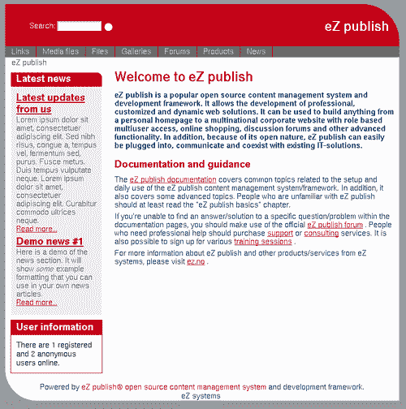

##### 创建包

更改了 CSS 文件后，我们必须将它们包装成一个可重用的站点样式包，以便 eZ publish 使用。这是在管理界面中完成的:单击 setup 选项卡，然后从那里单击 packages。您将看到向导列表。选择站点样式向导，其屏幕截图如下所示。

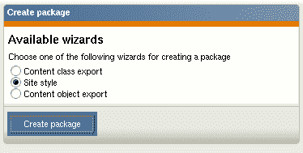

该向导的第二个屏幕要求您提供一个缩略图，它应该是一个屏幕截图或一个描述您的主题的外观和感觉的图标。宽度为 120 像素，高度为 103 像素。

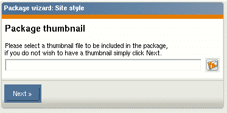

第三个屏幕要求您提供 CSS 文件。在这里，您需要提供 site-colors.css 和 classes-colors.css 文件(注意，这些文件名没有在屏幕截图中显示)。

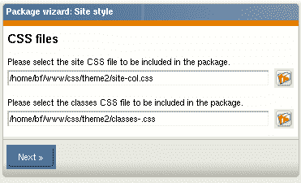

如果您在主题中使用图像，您可以在第四个屏幕中上传它们。在我的主题中，我使用了一些图像，比如那些用于圆角的图像。下面的截图显示了上传的文件。

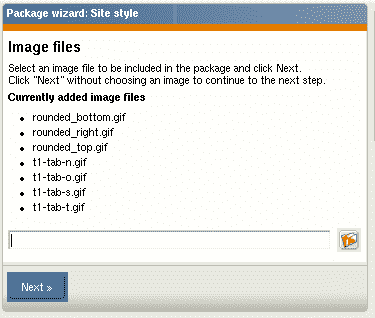

现在，是时候输入一些关于站点样式包的信息了。给它一个名称，并输入一些文本来描述这个包，如下所示。

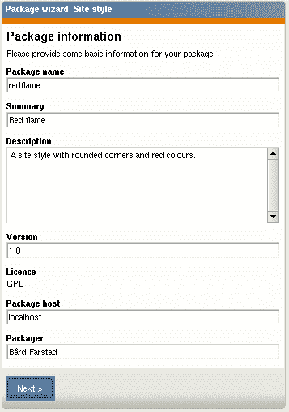

eZ publish 包系统还需要包含一些关于包维护者的信息。在第六个屏幕中输入:

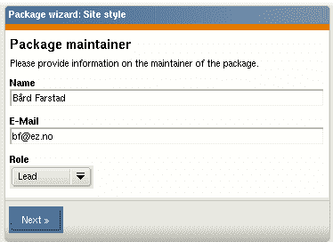

在最后一步中，您可以选择输入一些关于您应用到这个版本的包的更改的信息。

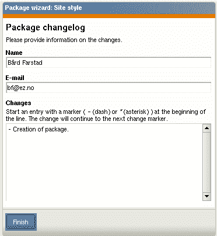

完成后，包的摘要会提示您将包导出到文件中。我已经导出了这个主题，并上传到了 [http://ez.no](http://ez.no) 上的贡献区。你可以从 http://ez.no/community/contributions/site_styles 的[下载这个包。](http://ez.no/community/contributions/site_styles)

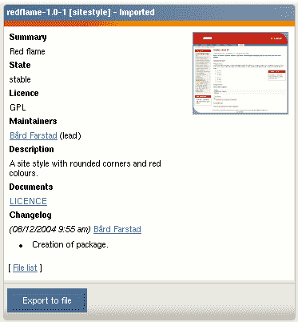

##### 导入包

一旦有了现成的站点样式包，就可以直接导入 eZ publish。这也是通过管理界面实现的。转到设置选项卡，并从左侧菜单中选择包。然后，单击按钮导入新的包。您现在需要做的就是上传软件包文件，并按照屏幕上提供的说明进行操作。

导入包后，您可以直接从 eZ publish 管理界面中 Design 选项卡下的外观设置中选择它。

##### 结论

我们现在已经看到，只需更改一些 CSS 文件，定制 eZ publish CMS 解决方案是多么容易。这个网站风格，或者说主题，也可以很容易地以包的形式分发给其他 eZ publish 用户。

许多演示的 CSS 工作非常简单。本文并不打算作为高级 CSS 的教程，而是解释如何使用一般的 CSS 技巧来安装 eZ publish。

## 分享这篇文章