# CSS 选集:101 个基本提示、技巧和窍门，第 4 章——导航

> 原文：<https://www.sitepoint.com/css-anthology-tips-tricks-4/>

除非你把自己限制在单页网站上，否则你需要设计导航。事实上，导航是任何网页设计中最重要的部分之一，如果访问者想在你的网站上方便地移动，就需要进行大量的思考。

让网站导航变得简单是 CSS 真正发挥作用的一个领域。创建导航的老方法倾向于依赖大量的图像、嵌套表格和 JavaScript——所有这些都会严重影响网站的可用性和可访问性。例如，如果您的网站无法使用不支持 JavaScript 的设备导航，您就有可能阻止关闭 JavaScript 的用户，以及锁定屏幕阅读器和搜索引擎机器人等纯文本设备——它们永远不会穿透您的主页来索引您网站的内容。如果你的设计客户似乎不关心可访问性，告诉他们，他们的笨重的菜单阻止他们实现体面的搜索引擎排名！

CSS 允许你创建吸引人的导航，实际上，它只不过是文本——文本可以通过某种方式标记，以确保所有那些无法实际看到你的设计，但仍然想访问你的内容的人都可以访问和理解它。在这一章中，我们将会看到创建基于 CSS 的导航的各种解决方案。有些适合在现有网站上实现，通过取代老式的基于图像的导航，使其加载更快，并提高其可访问性。其他的更适合合并到一个纯 CSS 布局中。

#### 如何将一个结构列表设计成导航菜单？

导航本质上是网站上要访问的地方的列表，所以将导航菜单标记为列表在语义上是有意义的，我们可以将 CSS 样式与列表元素本身挂钩。然而，我们希望避免我们的导航看起来像一个由浏览器的内部样式表呈现的标准项目符号列表。

##### *解决方案*

下图中的导航被标记为列表，并使用 CSS 进行样式化，正如你在这里看到的。

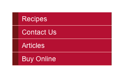

下面是创建导航列表所需的标记:

```
<!DOCTYPE html PUBLIC "-//W3C//DTD XHTML 1.0 Strict//EN"  

    "https://www.w3.org/TR/xhtml1/DTD/xhtml1-strict.dtd"> 

<html  lang="en-US"> 

  <head> 

    <title>Lists as navigation</title> 

    <meta http-equiv="content-type" content="text/html;  

        charset=utf-8" /> 

    <link rel="stylesheet" type="text/css" href="listnav1.css" /> 

  </head> 

  <body> 

    <div id="navigation"> 

      <ul> 

        <li><a href="#">Recipes</a></li> 

        <li><a href="#">Contact Us</a></li> 

        <li><a href="#">Articles</a></li> 

        <li><a href="#">Buy Online</a></li> 

      </ul> 

    </div> 

  </body> 

</html>
```

下面是完整的 CSS，它将我们枯燥的无序列表转换成一个吸引人的菜单:

```
#navigation { 

  width: 200px; 

} 

#navigation ul { 

  list-style: none; 

  margin: 0; 

  padding: 0; 

} 

#navigation li { 

  border-bottom: 1px solid #ED9F9F; 

} 

#navigation li a:link, #navigation li a:visited  { 

  font-size: 90%; 

  display: block; 

  padding: 0.4em 0 0.4em 0.5em; 

  border-left: 12px solid #711515; 

  border-right: 1px solid #711515; 

  background-color: #B51032; 

  color: #FFFFFF; 

  text-decoration: none; 

}
```

##### *讨论*

要创建基于无序列表的导航——首先创建您的列表，将每个导航链接放在`a` `li`元素中:

```
 <ul> 

    <li><a href="#">Recipes</a></li> 

    <li><a href="#">Contact Us</a></li> 

    <li><a href="#">Articles</a></li> 

    <li><a href="#">Buy Online</a></li> 

  </ul>
```

接下来，将列表包装在一个具有适当 ID 的 div 中:

```
<div id="navigation"> 

  <ul> 

    <li><a href="#">Recipes</a></li> 

    <li><a href="#">Contact Us</a></li> 

    <li><a href="#">Articles</a></li> 

    <li><a href="#">Buy Online</a></li> 

  </ul> 

</div>
```

如下图所示，应用了浏览器的默认样式后，该标记看起来相当普通。

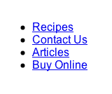

我们需要做的第一件事是设计导航所在的容器的样式——在本例中，导航:

```
#navigation { 

  width: 200px; 

}
```

我给了导航一个宽度。如果这个导航系统是 CSS 页面布局的一部分，我可能也会向这个 ID 添加一些定位信息。

接下来，我们对列表进行样式化:

```
#navigation ul { 

  list-style: none; 

  margin: 0; 

  padding: 0; 

}
```

如下图所示，上述规则删除了默认情况下浏览器在显示列表时应用的列表项目符号和缩进边距。

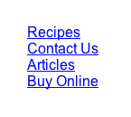

下一步是设计导航中 li 元素的样式，给它们一个底部边框:

```
#navigation li { 

  border-bottom: 1px solid #ED9F9F; 

}
```

最后，我们设计链接本身的样式:

```
#navigation li a:link, #navigation li a:visited  { 

  font-size: 90%; 

  display: block; 

  padding: 0.4em 0 0.4em 0.5em; 

  border-left: 12px solid #711515; 

  border-right: 1px solid #711515; 

  background-color: #B51032; 

  color: #FFFFFF; 

  text-decoration: none; 

}
```

大部分工作都在这里完成，创建 CSS 规则来添加左右边框，删除下划线，等等。此规则中的第一个属性声明将 display 属性设置为 block。这会导致链接显示为一个块元素，这意味着当您将光标移动到它上面时，每个导航“按钮”的整个区域都是活动的——这与您使用图像导航时看到的效果相同。

#### 我如何使用 CSS 创建没有图像或 JavaScript 的滚动导航？

站点导航通常具有翻转效果:当用户将光标放在菜单按钮上时，会显示一个新的按钮图像，从而产生突出显示效果。要使用基于图像的导航实现这种效果，您需要使用两个图像和 JavaScript。

##### *解决方案*

使用 CSS 来构建你的导航比使用图像来创建吸引人的翻转效果要简单得多。CSS 翻转是使用:hover 伪类选择器创建的——您可以使用这个选择器来设置链接的悬停状态。

让我们以上面的列表导航示例为例，添加以下规则来创建翻转效果:

```
#navigation li a:hover { 

  background-color: #711515; 

  color: #FFFFFF; 

}
```

下图显示了当光标位于第一个菜单项上时菜单的外观。

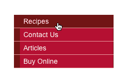

##### *讨论*

我们用来创建这个效果的 CSS 非常简单。您可以像创建标准链接一样，为重度样式的链接创建悬停状态。在这个例子中，我简单地改变了背景颜色，使它和左边的边框一样；但是，您可以改变背景、文本和边框颜色，为导航创建有趣的效果。
 ***悬停在这里？在那里盘旋！***

在包括 Internet Explorer 7 在内的现代浏览器中，您可以将:hover 伪选择器应用于任何您喜欢的元素，但在 Internet Explorer 6 及更低版本中，您只能将其应用于链接。

旧版本的 Internet Explorer 只允许锚文本可点击，因为链接无法扩展以填充其容器(在本例中是列表项)。这意味着用户被迫点击文本，而不是红色背景，来选择菜单项。

纠正这个问题的一个方法是使用 CSS 黑客技术来扩大链接的宽度——但只在 Internet Explorer 版本 6 和更早的版本中。下面是一条规则:

```
* html #navigation li a { 

  width: 100%; 

}
```

当然，你可以决定让链接保持原样，避免黑客攻击，这是一个可以接受的妥协。我们将在第 7 章“跨浏览器技术”中更详细地讨论跨浏览器技术。

#### 我可以使用 CSS 和列表来创建一个带有子导航的导航系统吗？

到目前为止，我们在本章看到的例子都假设你只有一个导航级别可以显示。有时候，不止一个层次是必要的——但是在 CSS 中使用样式化的列表来创建多层次的导航是可能的吗？

##### *解决方案*

在导航系统中显示子导航的最佳方式是在列表中创建一个子列表。以这种方式标记的两级导航将很容易理解——即使在缺乏 CSS 支持的浏览器中。

要生成多级导航，我们可以编辑上图中的示例，添加一个嵌套列表，并设置新列表项目的颜色、边框和链接属性:

```
<!DOCTYPE html PUBLIC "-//W3C//DTD XHTML 1.0 Strict//EN" 

    "https://www.w3.org/TR/xhtml1/DTD/xhtml1-strict.dtd"> 

<html  lang="en-US"> 

<head> 

<title>Lists as navigation</title> 

<meta http-equiv="content-type" 

    content="text/html; charset=utf-8" /> 

<link rel="stylesheet" type="text/css" href="listnav_sub.css" /> 

</head> 

<body> 

<div id="navigation"> 

  <ul> 

    <li><a href="#">Recipes</a> 

      <ul> 

        <li><a href="#">Starters</a></li> 

        <li><a href="#">Main Courses</a></li> 

        <li><a href="#">Desserts</a></li> 

      </ul> 

    </li> 

    <li><a href="#">Contact Us</a></li> 

    <li><a href="#">Articles</a></li> 

    <li><a href="#">Buy Online</a></li> 

  </ul> 

</div> 

</body> 

</html>
```

```
#navigation { 

  width: 200px; 

} 

#navigation ul { 

  list-style: none; 

  margin: 0; 

  padding: 0; 

} 

#navigation li { 

  border-bottom: 1px solid #ED9F9F; 

} 

#navigation li a:link, #navigation li a:visited  { 

  font-size: 90%; 

  display: block; 

  padding: 0.4em 0 0.4em 0.5em; 

  border-left: 12px solid #711515; 

  border-right: 1px solid #711515; 

  background-color: #B51032; 

  color: #FFFFFF; 

  text-decoration: none; 

} 

#navigation li a:hover { 

  background-color: #711515; 

  color: #FFFFFF; 

} 

#navigation ul ul { 

  margin-left: 12px; 

} 

#navigation ul ul li { 

  border-bottom: 1px solid #711515; 

  margin:0; 

} 

#navigation ul ul a:link, #navigation ul ul a:visited { 

  background-color: #ED9F9F; 

  color: #711515; 

} 

#navigation ul ul a:hover { 

  background-color: #711515; 

  color: #FFFFFF; 

}
```

这些相加的结果如下图所示。

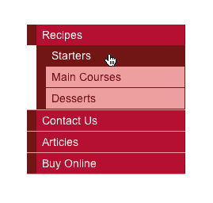

##### *讨论*

嵌套列表是描述我们正在使用的导航系统的完美方式。第一个列表包含网站的主要部分，而菜谱下的子列表显示了菜谱类别中的子部分。即使没有任何 CSS 样式，列表的结构仍然清晰易懂，如下图所示。

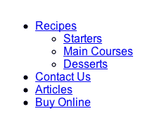

我们用来标记这个列表的 HTML 只是将子列表嵌套在适当的主项目的`li`元素中:

```
<div id="navigation">  

  <ul>  

    <li><a href="#">Recipes</a>  

      <ul>  

        <li><a href="#">Starters</a></li>  

        <li><a href="#">Main Courses</a></li>  

        <li><a href="#">Desserts</a></li>  

      </ul>  

    </li>  

    <li><a href="#">Contact Us</a></li>  

    <li><a href="#">Articles</a></li>  

    <li><a href="#">Buy Online</a></li>  

  </ul>  

</div>
```

有了这个 HTML，不需要对 CSS 做任何修改，菜单将显示如下图左侧所示，其中的`li`元素继承了主菜单的样式。

让我们为嵌套列表添加一个样式规则，从视觉上表明它是一个子菜单，与主导航不同:

```
#navigation ul ul {  

  margin-left: 12px;  

}
```

该规则将缩进嵌套列表，使其与主菜单边框的右边缘对齐，如下图右侧所示。

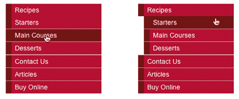

让我们给嵌套列表中的`li`和`a`元素添加一些简单的样式来完成这个效果:

```
#navigation ul ul li {  

  border-bottom: 1px solid #711515;  

  margin: 0;  

}  

#navigation ul ul a:link, #navigation ul ul a:visited {  

  background-color: #ED9F9F;  

  color: #711515;  

}  

#navigation ul ul a:hover {  

  background-color: #711515;  

  color: #FFFFFF;  

}
```

#### 如何使用 CSS 和列表制作一个水平菜单？

我们在这一章看到的所有例子都是关于垂直导航的——这种导航最有可能出现在网站主要内容区域左边或右边的栏目中。然而，站点导航通常也是一个靠近文档顶部的水平菜单。

##### *解决方案*

如下图所示，这种类型的菜单可以使用 CSS 中的样式列表来创建。必须将`li`元素设置为内联显示，以避免列表项之间换行。


下面是创建此显示的 HTML 和 CSS:

```
<!DOCTYPE html PUBLIC "-//W3C//DTD XHTML 1.0 Strict//EN"  

    "https://www.w3.org/TR/xhtml1/DTD/xhtml1-strict.dtd">  

<html  lang="en-US">  

<head>  

<title>Lists as navigation</title>  

<meta http-equiv="content-type"  

    content="text/html; charset=utf-8" />  

<link rel="stylesheet" type="text/css" href="listnav_horiz.css" />  

</head>  

<body>  

<div id="navigation">  

  <ul>  

    <li><a href="#">Recipes</a></li>  

    <li><a href="#">Contact Us</a></li>  

    <li><a href="#">Articles</a></li>  

    <li><a href="#">Buy Online</a></li>  

  </ul>  

</div>  

</body>  

</html>
```

```
body {  

  padding: 1em;  

}  

#navigation {  

  font-size: 90%;  

}  

#navigation ul {  

  list-style: none;  

  margin: 0;  

  padding: 0;  

  padding-top: 1em;  

}  

#navigation li {  

  display: inline;  

}  

#navigation a:link, #navigation a:visited {  

  padding: 0.4em 1em 0.4em 1em;   

  color: #FFFFFF;  

  background-color: #B51032;  

  text-decoration: none;  

  border: 1px solid #711515;  

}  

#navigation a:hover {  

  color: #FFFFFF;  

  background-color: #711515;  

}
```

##### *讨论*

为了创建水平导航，我们从一个与我们为垂直列表菜单创建的列表相同的列表开始:

```
<div id="navigation">  

  <ul>  

    <li><a href="#">Recipes</a></li>  

    <li><a href="#">Contact Us</a></li>  

    <li><a href="#">Articles</a></li>  

    <li><a href="#">Buy Online</a></li>  

  </ul>  

</div>
```

我们设计了#navigation 容器的样式来应用一些基本的字体信息，就像我们处理垂直导航一样。在 CSS 布局中，这个 ID 可能还包含一些决定导航在页面上的位置的附加样式:

```
#navigation {  

  font-size: 90%;  

}
```

在样式化`ul`元素时，我们删除了浏览器应用于列表的列表项目符号和默认缩进:

```
#navigation ul {  

  list-style: none;  

  margin: 0;  

  padding: 0;  

  padding-top: 1em;  

}
```

将列表从垂直显示转换为水平显示的属性应用于 li 元素。将 display 属性设置为 inline 后，列表如下图所示:

```
#navigation li {  

  display: inline;  

}
```


我们剩下要做的就是为我们的导航设置链接样式:

```
#navigation a:link, #navigation a:visited {  

  padding: 0.4em 1em 0.4em 1em;   

  color: #FFFFFF;  

  background-color: #B51032;  

  text-decoration: none;  

  border: 1px solid #711515;  

}  

#navigation a:hover {  

  color: #FFFFFF;  

  background-color: #711515;  

}
```

如果你在每个链接周围创建框——正如我在这里所做的——记住，为了在文本和它的容器边缘之间留出更多的空间，你需要给链接添加更多的左右填充。要在导航项目之间创建更多空间，请为链接添加左右边距。

#### 如何使用 CSS 创建类似按钮的导航？

看起来由可点击按钮组成的导航是许多网站的特征。这种导航通常是使用图像创建的，这些图像应用了一些效果，使边缘看起来有斜面，像按钮一样。通常，一些 JavaScript 代码用于交换另一个图像，所以当用户将光标放在按钮上或单击图像时，按钮看起来是按下的。

这就带来了一个问题:仅仅使用 CSS 有可能创建这样的按钮式导航系统吗？绝对的！

##### *解决方案*

使用 CSS 创建如下所示的按钮效果是可能的，而且相当简单。这个效果的成功取决于你对 CSS 边框属性的使用。


以下是您需要的代码:

```
<!DOCTYPE html PUBLIC "-//W3C//DTD XHTML 1.0 Strict//EN"  

    "https://www.w3.org/TR/xhtml1/DTD/xhtml1-strict.dtd">  

<html  lang="en-US">  

<head>  

<title>Lists as navigation</title>  

<meta http-equiv="content-type"  

    content="text/html; charset=utf-8" />  

<link rel="stylesheet" type="text/css" href="listnav_button.css"  

    />  

</head>  

<body>  

<div id="navigation">  

  <ul>  

    <li><a href="#">Recipes</a></li>  

    <li><a href="#">Contact Us</a></li>  

    <li><a href="#">Articles</a></li>  

    <li><a href="#">Buy Online</a></li>  

  </ul>  

</div>  

</body>  

</html>
```

`#navigation {  
 font-size:90%  
}  
#navigation ul {  
 list-style: none;  
 margin: 0;  
 padding: 0;  
 padding-top: 1em;  
}  
#navigation li {  
 display: inline;  
}  
#navigation a:link, #navigation a:visited {  
 margin-right: 0.2em;  
 padding: 0.2em 0.6em 0.2em 0.6em;  
 color: #A62020;  
 background-color: #FCE6EA;  
 text-decoration: none;  
 border-top: 1px solid #FFFFFF;  
 border-left: 1px solid #FFFFFF;  
 border-bottom: 1px solid #717171;  
 border-right: 1px solid #717171;  
}  
#navigation a:hover {  
 border-top: 1px solid #717171;  
 border-left: 1px solid #717171;  
 border-bottom: 1px solid #FFFFFF;  
 border-right: 1px solid #FFFFFF;  
}`

##### *讨论*

为了创造这种效果，我们将使用“如何使用 CSS 和列表制作水平菜单”一节中描述的水平列表导航。然而，为了创建按钮的外观，我们将在顶部和左侧使用与底部和右侧不同的颜色边框。通过给按钮的上边缘和左边缘赋予比分配给按钮的下边缘和右边缘更浅的颜色，我们创建了一个稍微倾斜的效果:

```
#navigation a:link, #navigation a:visited {  

  margin-right: 0.2em;  

  padding: 0.2em 0.6em 0.2em 0.6em;  

  color: #A62020;  

  background-color: #FCE6EA;  

  text-decoration: none;  

  border-top: 1px solid #FFFFFF;  

  border-left: 1px solid #FFFFFF;  

  border-bottom: 1px solid #717171;  

  border-right: 1px solid #717171;  

}
```

我们反转了悬停状态的边框颜色，这产生了按钮被按下的效果:

```
#navigation a:hover {  

  border-top: 1px solid #717171;  

  border-left: 1px solid #717171;  

  border-bottom: 1px solid #FFFFFF;  

  border-right: 1px solid #FFFFFF;  

}
```

尝试使用较粗的边框并更改链接上的背景图像，以创建适合您的设计的效果。

#### 如何用 CSS 创建选项卡式导航？

以选项卡形式出现在页面顶部的导航是一种流行的导航选择。许多网站使用图像创建标签。但是，如果您的导航是使用内容管理系统创建的，并且该系统的用户能够添加选项卡或更改选项卡中的文本，那么这就不太容易实现，而且还会产生问题。然而，可以通过结合背景图像和 CSS 样式的文本来创建标签效果。
解决方案

下面显示的选项卡式导航可以通过设计一个水平列表来创建。


下面是产生这种效果的 HTML 和 CSS:

```
<!DOCTYPE html PUBLIC "-//W3C//DTD XHTML 1.0 Strict//EN"   

    "https://www.w3.org/TR/xhtml1/DTD/xhtml1-strict.dtd">   

<html  lang="en-US">   

<head>   

<title>Lists as navigation</title>   

<meta http-equiv="content-type"   

    content="text/html; charset=utf-8" />   

<link rel="stylesheet" type="text/css" href="tabs.css" />   

</head>   

<body id="recipes">   

<div id="header">   

<ul>   

  <li class="recipes"><a href="#">Recipes</a></li>   

  <li class="contact"><a href="#">Contact Us</a></li>   

  <li class="articles"><a href="#">Articles</a></li>   

  <li class="buy"><a href="#">Buy Online</a></li>   

</ul>   

</div>   

<div id="content">   

<h1>Recipes</h1>   

<p>Lorem ipsum dolor sit amet, ... </p>   

</div>   

</body>   

</html>
```

```
body {   

  font: .8em/1.8em verdana, arial, sans-serif;   

  background-color: #FFFFFF;   

  color: #000000;   

  margin: 0 10% 0 10%;   

}   

#header {   

  float: left;   

  width: 100%;   

  border-bottom: 1px solid #8DA5FF;   

  margin-bottom: 2em;   

}   

#header ul {   

  margin: 0;   

  padding: 2em 0 0 0;   

  list-style: none;   

}   

#header li {   

  float: left;   

  background-image: url("images/tab_left.gif");   

  background-repeat: no-repeat;   

  margin: 0 1px 0 0;   

  padding: 0 0 0 8px;   

}   

#header a {   

  float: left;   

  display: block;   

  background-image: url("images/tab_right.gif");   

  background-repeat: no-repeat;   

  background-position: right top;   

  padding: 0.2em 10px 0.2em 0;   

  text-decoration: none;   

  font-weight: bold;   

  color: #333366;   

}   

#recipes #header li.recipes,   

#contact #header li.contact,   

#articles #header li.articles,   

#buy #header li.buy {   

  background-image: url("images/tab_active_left.gif");   

}   

#recipes #header li.recipes a,   

#contact #header li.contact a,   

#articles #header li.articles a,   

#buy #header li.buy a {   

  background-image: url("images/tab_active_right.gif");   

  background-color: transparent;   

  color:#FFFFFF;   

} 
```

##### *讨论*

我在这里使用的选项卡式导航方法是 Douglas Bowman 的 CSS 滑动门方法的基本版本，这是一种经过测试的创建选项卡式界面的技术。我给导航菜单的结构和我们在本章中使用的简单无序列表是一样的，只是每个列表项都被赋予了一个 class 属性来描述它所包含的链接。我们还将整个列表包装在一个 id 为 header 的 div 中。这项技术的名字来源于用来实现它的两个图像——一个重叠在另一个上，图像随着文本大小的增加而分开。

您需要四个图像来创建这个效果:两个用于创建常规的选项卡颜色，两个用于当选项卡是当前选中的(突出显示的)选项卡时。我在这个例子中使用的图像如下所示。正如你所看到的，它们比选项卡通常所需的要宽和高得多——如果用户的浏览器被配置为以非常大的尺寸显示文本，这就为选项卡提供了足够的增长空间。

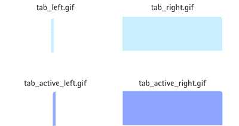

以下是导航项目的基本列表:

```
<div id="header">   

<ul>   

  <li class="recipes"><a href="#">Recipes</a></li>   

  <li class="contact"><a href="#">Contact Us</a></li>   

  <li class="articles"><a href="#">Articles</a></li>   

  <li class="buy"><a href="#">Buy Online</a></li>   

</ul>   

</div>
```

第一步是样式化导航周围的容器。出于本练习的目的，我们将为我们的标题设置一个简单的底部边框，但是在一个真实的、实时的网站上，除了选项卡之外，该容器还可能包含其他元素(如徽标或搜索字段):

```
#header {   

  float: left;   

  width: 100%;   

  border-bottom: 1px solid #8DA5FF;   

  margin-bottom: 2em;   

}
```

正如你已经注意到的，我们将标题浮动到左边。我们还将浮动单个列表项；浮动容纳它们的容器可以确保它们一旦被浮动就保持被包含，并且边框会显示在它们下面。

接下来，我们为标题中的`ul`元素创建一个样式规则:

```
#header ul {   

  margin: 0;   

  padding: 2em 0 0 0;   

  list-style: none;   

}
```

这条规则删除了项目符号并改变了列表的边距和填充——我们在`ul`元素的顶部添加了两个 ems 的填充。下图显示了我们迄今为止的工作成果。


现在我们需要设计列表项的样式:

```
#header li {   

  float: left;   

  background-image: url("images/tab_left.gif");   

  background-repeat: no-repeat;   

  margin: 0 1px 0 0;   

  padding: 0 0 0 8px;   

}
```

此规则使用 float 属性来水平定位列表项，同时保持每个列表项的块级状态。然后，我们添加第一个滑动门图像——标签的薄左侧——作为背景图像。列表项上的单像素右边距在一个选项卡和下一个选项卡之间创建了一个间隙。下图显示了每个选项卡的左侧选项卡图像。


接下来，我们设计链接的样式，完成标签在未选中状态下的外观。形成选项卡右侧的图像应用于每个链接，完成了选项卡效果:

```
#header a {   

  float: left;   

  display: block;   

  background-image: url("images/tab_right.gif");   

  background-repeat: no-repeat;   

  background-position: right top;   

  padding: 0.2em 10px 0.2em 0;   

  text-decoration: none;   

  font-weight: bold;   

  color: #333366;   

}
```

结果如下图所示。


如果你增加浏览器中的文本大小，你可以看到标签的大小也整齐地增加。事实上，他们这样做没有重叠，也没有突出标签的文本——这是因为我们使用了允许大量增长空间的图像。

为了完成选项卡导航，我们需要突出显示对应于当前显示页面的选项卡。您还记得，每个列表项都被分配了一个惟一的类名。如果我们给`body`元素分配一个 ID，它的值等于每个列表项类的值，CSS 可以完成剩下的工作:

```
<body id="recipes">
```

虽然看起来代码很多，但是样式化选项卡以匹配主体 ID 的 CSS 代码相对简单。我使用的图像是我们应用于选项卡的左右图像的精确副本，但它们是不同的颜色，这产生了一个选项卡突出显示的效果。

这是 CSS:

```
#recipes #header li.recipes,   

#contact #header li.contact,   

#articles #header li.articles,   

#buy #header li.buy {   

  background-image: url("images/tab_active_left.gif");   

}   

#recipes #header li.recipes a,   

#contact #header li.contact a,   

#articles #header li.articles a,   

#buy #header li.buy a {   

  background-image: url("images/tab_active_right.gif");   

  background-color: transparent;   

  color: #FFFFFF;   

}
```

有了这些规则，为我们的主体指定一个 recipes ID 将导致 Recipes 选项卡被高亮显示，指定 contact 将导致 Contact Us 选项卡被高亮显示，等等。这项工作的结果如下图所示。

***识别有用的技术***

向 body 元素添加 ID 的技术非常有用。例如，你可以为网站的不同部分使用不同的配色方案来帮助用户识别他们正在使用的部分。您可以简单地将节名添加到 body 元素中，并在样式表中使用它，就像我们在本例中所做的那样。


#### 我如何直观地指出哪些链接是我网站的外部链接？

当链接到其他内容时，向用户直观地展示链接到另一个网站是一种很好的方式。我们可以使用 CSS 做到这一点，而不需要在我们的标记中添加任何东西。

##### *解决方案*

我们可以使用许多现代浏览器都支持的 CSS3 选择器来选择外部链接。下面段落中的第一个链接指向我们自己网站上的一个页面，第二个链接指向外部网站(Google):

```
<!DOCTYPE html PUBLIC "-//W3C//DTD XHTML 1.0 Strict//EN"    

"https://www.w3.org/TR/xhtml1/DTD/xhtml1-strict.dtd">   

<html  lang="en-US">   

  <head>   

    <title>Chapter 4 - Show external links</title>   

    <meta http-equiv="content-type" content="text/html;    

        charset=utf-8" />   

    <link rel="stylesheet" type="text/css"    

        href="external_links.css" />   

  </head>   

  <body>   

  <p>Lorem ipsum dolor sit amet, <a href="page2.html">consectetur    

      adipiscing elit</a>. Aenean porta. Donec eget quam. Morbi    

      libero.Curabitur ut justo vehicula elit feugiat lacinia. Morbi   

      ac quam. <a href="http://www.google.com">Sed venenatis</a>,    

      lectus quis porta viverra, lectus sapien tempus odio, ac    

      volutpat mi dolor ac elit.</p>   

  </body>   

</html>
```

我们可以使用 CSS3 选择器来定位以 http:开头的链接，并向它添加一个图标:

```
a[href ^="http:"] {   

  padding-left: 20px;   

  background-image: url(link_icon_external.gif);   

  background-repeat: no-repeat;   

}
```


我们页面上任何以`http:`开头的链接(应该是外部的，因为没有必要像那样链接到我们自己网站上的页面)都将显示世界图标。

##### *讨论*

这个 CSS3 属性选择器在现代浏览器中被广泛支持，尽管它在 Internet Explorer 6 中将被忽略。在不支持该选择器的浏览器中，链接将正常显示；因此，对于支持的浏览器来说，这是一个很好的增强，但对于那些使用旧浏览器的用户来说，体验并没有改变。

让我们仔细看看那个选择器:`a[href ^="http:"]`。

我们选择的属性是`href`属性，我们希望选择器在属性值的开头找到文本`http:`时进行匹配。`^=`运算符的意思是“始于”。您可以使用类似的选择器来匹配所有的电子邮件链接，例如，`a[href ^="mailto:"]`。

另一个有用的属性选择器是选择链接的文件扩展名。这意味着您可以添加一个小图标来显示文档是 PDF 还是其他文档类型，这取决于扩展名。选择器`a[href $=".pdf"]`将匹配任何文件扩展名为`.pdf`的链接。`$=`操作符的意思是“结束于”，所以当一个`href`属性值以`.pdf`结束时，这个选择器将匹配。下面的例子展示了所有三种类型的作用:

```
<ul class="links">   

  <li><a href="http://www.google.com">Go somewhere else</a></li>   

  <li><a href="/files/example.pdf">Download a PDF</a></li>   

  <li><a href="mailto:info@example.com">Email someone</a></li>   

</ul>
```

```
a[href ^="http:"] {   

  padding-left: 20px;   

  background-image: url(link_icon_external.gif);   

  background-repeat: no-repeat;   

}   

a[href ^="mailto:"] {   

  padding-left: 20px;   

  background-image: url(link_icon_email.gif);   

  background-repeat: no-repeat;   

}   

a[href $=".pdf"] {   

  padding-left: 20px;   

  background-image: url(link_icon_pdf.gif);   

  background-repeat: no-repeat;   

}
```

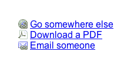

(上面你能看到的图标来自[http://www.famfamfam.com/lab/icons/silk/](http://www.famfamfam.com/lab/icons/silk/)。)

属性选择器是 CSS 的一个非常有用的部分，你可以在这种情况下安全地使用它们，你只需要在你的设计中增加一个增强功能。

#### 如何更改光标类型？

当光标移动到页面任何部分的链接上时，光标通常会变成手形图标。有时，也许是为了适应特定的界面，您可能希望改变光标来表示不同的动作。

##### *解决方案*

我们使用 CSS cursor 属性来改变光标。例如，如果我们想改变链接到帮助文档的锚元素上的光标，我们可以像这样指定样式:

```
a.help {   

  cursor: help;   

}
```

下图标识了 CSS 2.1 中可用的属性，以及它们在 Internet Explorer 8 中的显示方式。

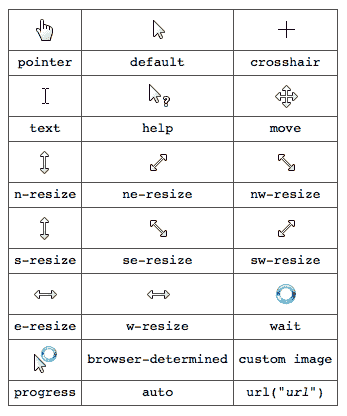

##### *讨论*

cursor 属性可以采用一系列值。对于具有友好界面的 web 应用程序来说，改变光标显示是一种有用的方式，可以提供有价值的用户反馈。例如，您可能决定使用问号光标来指示帮助文本。

***改变光标会造成混乱！***

你应该小心使用这种效果，并且记住人们通常习惯于标准的浏览器行为。例如，当光标悬停在一个链接上时，用户熟悉代表一个指针图标的光标。

CSS 标准中可用的各种属性的上图；大多数现代浏览器都支持这些功能，包括 Internet Explorer 6 及更高版本、Safari、Opera、Firefox 和 Chrome。浏览器对所有值的支持各不相同，因此请务必进行测试。

CSS3 增加了可用光标值的范围，如下所示，但是浏览器对这些值的支持有所不同。Safari、Firefox 和 Chrome 都很好地支持它们，IE8 也支持其中的大部分；然而，截至本文撰写之时，Opera 仅支持 CSS 2.1 光标值。

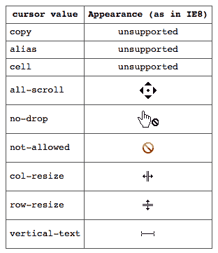

#### 如何在不使用 JavaScript 的情况下在我的导航中创建滚动图像？

基于 CSS 的导航可以提供一些非常有趣的效果，但是仍然有一些效果需要使用图像。有可能在享受基于文本的导航的优势的同时仍然使用图像吗？

##### *解决方案*

将图像和 CSS 结合起来创建无 JavaScript 的翻转是可能的。该解决方案基于在 WellStyled.com 的[所描述的技术。以下是您需要的代码:](http://wellstyled.com/css-nopreload-rollovers.html)

```
<!DOCTYPE html PUBLIC "-//W3C//DTD XHTML 1.0 Strict//EN"    

    "https://www.w3.org/TR/xhtml1/DTD/xhtml1-strict.dtd">    

<html  lang="en-US">    

<head>    

<title>Lists as navigation</title>    

<meta http-equiv="content-type"    

    content="text/html; charset=utf-8" />    

<link rel="stylesheet" type="text/css" href="images.css" />    

</head>    

<body>    

<ul id="nav">    

  <li><a href="#">Recipes</a></li>    

  <li><a href="#">Contact Us</a></li>    

  <li><a href="#">Articles</a></li>    

  <li><a href="#">Buy Online</a></li>    

</ul>    

</body>    

</html>
```

```
ul#nav {    

  list-style-type: none;    

  padding: 0;    

  margin: 0;    

}    

#nav a:link, #nav a:visited {    

  display: block;    

  width: 150px;    

  padding: 10px 0 16px 32px;    

  font: bold 80% Arial, Helvetica, sans-serif;    

  color: #FF9900;    

  background: url("peppers.gif") top left no-repeat;    

  text-decoration: none;    

}    

#nav a:hover {    

  background-position: 0 -69px;    

  color: #B51032;    

}    

#nav a:active {    

  background-position: 0 -138px;    

  color: #006E01;    

}
```

结果可以在下图中看到，但要享受完整的效果，我建议你自己试试。记得点一两个链接！

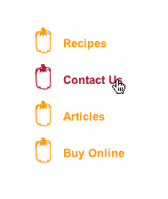

##### *讨论*

这种解决方案提供了一种在导航中使用图像的方法，而无需预先加载大量单独的文件。

导航有三种状态，但是没有必要使用三个单独的图像来描述这些状态。相反，我们使用一个包含所有三个状态的图形的大图像，如下所示。


导航标记为一个简单的列表:

```
<ul id="nav">    

  <li><a href="#">Recipes</a></li>    

  <li><a href="#">Contact Us</a></li>    

  <li><a href="#">Articles</a></li>    

  <li><a href="#">Buy Online</a></li>    

</ul>
```

我们控制导航链接声明块中背景图像的显示。但是，由于图像远远大于该元素所需的区域，我们起初只看到了黄色的辣椒:

```
#nav a:link, #nav a:visited {    

  display: block;    

  width: 150px;    

  padding: 10px 0 16px 32px;    

  font: bold 80% Arial, Helvetica, sans-serif;    

  color: #FF9900;    

  background: url("peppers.gif") top left no-repeat;    

  text-decoration: none;    

}
```

当`:hover`状态被激活时，背景图像向上移动显示红辣椒所需的精确像素数。在这个例子中，我必须将它移动 69 个像素，但是这个数字会根据您使用的图像而变化。你也许可以用数学方法算出来，或者你可以像我一样简单地一次增加几个像素的背景位置，直到它出现在悬停的正确位置:

```
#nav a:hover {    

  background-position: 0 -69px;    

  color: #B51032;    

}
```

当`:active`状态被激活时，背景图像再次移动，这一次是在点击链接时显示青椒:

```
#nav a:active {    

  background-position: 0 -138px;    

  color: #006E01;    

}
```

这就是全部了！如果用户将浏览器中的文本调整为更大的字体，这种效果可能会分崩离析，因为这样可以显示隐藏图像的边缘。你可以在一定程度上预料到这一点，在三张图片之间留出相当大的空间——在准备图片时要记住这一点。

***图片在浏览器中闪烁***

这种技术有时会导致 Internet Explorer 中的导航闪烁。在我的测试中，只有当图像比我们在这里使用的图像大时，这才会成为一个问题；然而，如果你的导航项目闪烁，[一个记录良好的补救措施是可用的](http://wellstyled.com/css-nopreload-rollovers.html)。

#### 我应该如何设计站点地图的样式？

站点地图是网站上列出站点中所有页面的有用页面。它可以帮助那些无法通过导航找到所需内容的人，并提供一种快速查看可用内容的方式，只需一次点击即可访问。
解决方案

站点地图实际上是你的站点上所有可用目的地的列表，所以理想情况下被标记为一组嵌套列表。第一个列表是您的主导航，内部导航嵌套在每个主导航点中。即使您的站点结构有许多级别，列表也是有效的，并且应该很容易从您的内容管理系统中生成。下图显示了以下代码的结果:

```
<ul id="sitemap">    

  <li><a href="/about">About us</a>    

  <ul>    

    <li><a href="/about/team">The team</a></li>    

    <li><a href="/about/history">Our history</a></li>    

  </ul>    

  </li>    

  <li><a href="/products">Our products</a></li>    

  <li><a href="/order">Ordering information</a>    

  <ul>    

    <li><a href="/order/shops">Our shops</a></li>    

    <li><a href="/order/stockists">Other stockists</a></li>    

    <li><a href="/order/onlinestockists">Online stockists</a></li>    

  </ul>    

  </li>    

  <li><a href="/contact">Contact us</a></li>    

</ul>
```

```
ul#sitemap {    

  margin: 0;    

  padding: 0;    

  list-style: none;    

}    

ul#sitemap ul {    

  padding-left: 1em;    

  list-style: none;    

}    

ul#sitemap li {    

  border-bottom: 2px solid #FFFFFF;    

}    

ul#sitemap li a:link, ul#sitemap li a:visited{    

  background-color: #CCCCCC;    

  display: block;    

  padding: 0.4em;    

  text-decoration: none;    

  color: #057FAC;    

}    

ul#sitemap li a:hover {    

  background-color: #999999;    

  color: #FFFFFF;    

}    

ul#sitemap li li a:link, ul#sitemap li li a:visited{    

  background-color: #FFFFFF;    

  display: block;    

  padding: 0.4em;    

}    

ul#sitemap li li a:hover {    

  background-color: #FFFFFF;    

  color: #057FAC;    

}
```

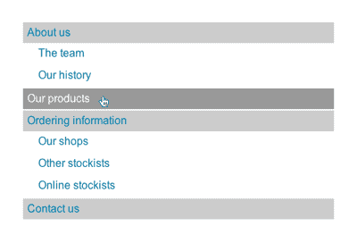

##### *讨论*

网站地图一开始是一个主要导航元素的列表，子菜单嵌套在里面——与本章前面讨论的子导航列表的方式相同。与站点地图的不同之处在于，所有的菜单都会显示它们的子导航。如果站点地图变得更深(有更多的层次)，你可以继续以同样的方式嵌套，子页面是它们的父页面的子列表。

注意要正确嵌套列表项。子菜单需要在父列表的结束`</li>`之前。没有 CSS 的网站地图显示如下图所示。然后我们可以设计父列表和子列表的样式。我去掉了主列表的边距和填充，但是给嵌套列表一个左填充`1em`来缩进它们，并清楚地表明它们嵌套在它们的父列表项中:

图 4.22。没有 CSS 标记的站点地图

```
ul#sitemap {    

  margin: 0;    

  padding: 0;    

  list-style: none;    

}    

ul#sitemap ul {    

  padding-left: 1em;    

  list-style: none;    

}
```

然后，我想给主列表项一个强烈的风格，以显示它们代表了我的网站的主要部分。与导航一样，我将大部分样式放在 a 元素上，并将 display 属性设置为 block，以便使项目的整个宽度都可以点击，而不仅仅是链接文本本身:

```
ul#sitemap li {    

  border-bottom: 2px solid #FFFFFF;    

}    

ul#sitemap li a:link, ul#sitemap li a:visited{    

  background-color: #CCCCCC;    

  display: block;    

  padding: 0.4em;    

  text-decoration: none;    

  color: #057FAC;    

}    

ul#sitemap li a:hover {    

  background-color: #999999;    

  color: #FFFFFF;    

}
```

当我们在站点地图列表中选择元素时，我们也将选择嵌套的 a 元素，它不应该有灰色的背景色。最后，我们需要用一个更具体的选择器来处理这些元素:

```
ul#sitemap li li a:link, ul#sitemap li li a:visited{    

  background-color: #FFFFFF;    

  display: block;    

  padding: 0.4em;    

}    

ul#sitemap li li a:hover {    

  background-color: #FFFFFF;    

  color: #057FAC;    

}
```

这就是使用 CSS 样式化站点地图的全部内容。就像网站导航一样，你可以从这个简单的想法中开发出各种创造性的效果。

#### 我可以只用 CSS 创建一个下拉菜单吗？

这本书的前一个版本包含了一个只有 CSS 的下拉菜单，在这个版本中我已经删除了。

当这本书最初被写出来的时候，我——和许多其他的 web 开发者一样——真的很期待一个乌托邦，在那里我们可以使用 CSS 来做任何事情，不用 JavaScript 就能创建出下拉菜单这样的效果。随着我们对这些技术以及人们使用网络的方式了解得越来越多，我认为在这种情况下，JavaScript 是一个更好的选择。

只用 CSS 就可以创建一个下拉导航。然而，在实践中，用于实现这一点的技术实际上比 JavaScript 驱动的下拉菜单更难实现。例如，可以用键盘导航 JavaScript 菜单，并使用 display: none 确保链接不隐藏；，这使得它们对于屏幕阅读器以及在屏幕上查看站点的人来说是隐藏的。如果你真的需要一个下拉菜单，我建议你看一看优秀的 [UDM4 菜单](http://www.udm4.com/)，它可以使用 CSS 进行样式化，但为你的所有访问者提供良好的体验。

##### 我如何使用 CSS 来保持基于图像的导航的整洁和可访问性？

虽然使用 CSS 样式的基于文本的导航比使用图像有很多好处，但有时您可能需要使用图像来获得特定的效果或使用特定的字体。当这种情况发生时，你可以利用你所知道的关于 CSS 的一切来确保图像以尽可能没有问题的方式被使用。这个解决方案将几种不同的技术结合在一起，创建了一个基于图像的流畅导航。
解决方案

这个解决方案从基于文本的导航开始，并使用 CSS 和单个图像替换为基于图像的导航。下图向我们展示了最终产品，代码如下:

```
<ul id="nav">    

  <li class="recipes"><a href="#"><span>Recipes</span></a></li>    

  <li class="contact"><a href="#"><span>Contact Us</span></a></li>    

  <li class="articles"><a href="#"><span>Articles</span></a></li>    

  <li class="buy"><a href="#"><span>Buy Online</span></a></li>    

</ul>
```

```
ul#nav {    

  width: 360px;    

  height: 30px;    

  overflow:hidden;    

  margin: 0;    

  padding: 0;    

  list-style: none;    

}    

ul#nav li {    

  float: left;    

}    

ul#nav li a span {    

  margin-left: -5000px;    

}    

ul#nav li a {    

  background-image: url(reflectonav.gif);    

  background-repeat: no-repeat;    

  display: block;    

  width: 75px;    

  overflow:hidden;    

}    

ul#nav li.recipes a {    

  background-position: 0 0;    

}    

ul#nav li.recipes a:hover {    

  background-position: 0 -42px;    

}    

ul#nav li.contact a {    

  background-position: -75px 0;    

  width: 105px;    

}    

ul#nav li.contact a:hover {    

  background-position: -75px -42px;    

}    

ul#nav li.articles a {    

  background-position: -180px 0;    

  width: 85px;    

}    

ul#nav li.articles a:hover {    

  background-position: -180px -42px;    

}    

ul#nav li.buy a {    

  background-position: -265px 0;    

  width: 85px;    

}    

ul#nav li.buy a:hover {    

  background-position: -265px -42px;    

}
```


##### *讨论*

在这个解决方案中，我们希望确保任何纯文本设备，如屏幕阅读器和搜索引擎，仍然能够理解我们的导航，即使我们使用的是图像。因此，我们像往常一样，首先创建一个无序的导航项目列表。唯一增加的是一个 span 元素，它包裹着元素内部的文本:

```
<ul id="nav">    

  <li class="recipes"><a href="#"><span>Recipes</span></a></li>    

  <li class="contact"><a href="#"><span>Contact Us</span></a></li>    

  <li class="articles"><a href="#"><span>Articles</span></a></li>    

  <li class="buy"><a href="#"><span>Buy Online</span></a></li>    

</ul>
```

我们的导航现在只是一个结构化的列表。接下来，我们需要为导航创建图像。与上面的鼠标悬停导航图像一样，我们将使用一个包含多个图像状态的合成图像，在这种情况下，所有导航图像及其鼠标悬停状态都在一个图像中，如下所示。


使用一个图像节省了对服务器的多次请求，并且我们的一个大图像的文件大小将小于我们将八个图像分割的文件大小。现在我们已经有了标记和图像，我们可以开始使用 CSS 样式导航。首先，我们移除了`ul`元素上的默认浏览器样式，并将列表项向左浮动，形成一个水平导航栏。

我们也给出了导航的宽度和高度值。由于导航是由图像组成的，我们知道它有多高，指定高度可以确保没有背景部分显露出来:

```
ul#nav {    

  width: 360px;    

  height: 30px;    

  overflow:hidden;    

  margin: 0;    

  padding: 0;    

  list-style: none;    

}    

ul#nav li {    

  float: left;    

}
```

我们现在想在支持图像和 CSS 的浏览器中隐藏文本。我们通过在列表项的跨度上设置一个大的负边距来实现这一点，将它们从屏幕的左侧抛出:

```
ul#nav li a span {    

  margin-left: -5000px;    

}
```

我们现在可以用背景图像替换文本。为将显示设置为块的元素创建一个规则，使其占据 li 的整个区域，然后添加背景图像:

```
ul#nav li a {    

  display: block;    

  background-image: url(reflectonav.gif);    

  background-repeat: no-repeat;    

  width: 75px;    

  overflow:hidden;    

}
```

添加上述规则后，如果你在浏览器中查看你的导航，你会看到“食谱”项显示了 4 次。这是因为您已经为导航栏中的每个链接添加了背景图像，并且显示的图像位于该项目的左上角，如下图所示。


为了纠正这种情况，我们需要为每个导航项目放置不同的背景图像。与上面的鼠标经过图像一样，最简单的方法通常是一个像素一个像素地调整位置，直到它出现在正确的位置。下面的 CSS 显示了我们如何定位每个链接的背景，下图显示了结果:

```
ul#nav li.recipes a {    

  background-position: 0 0;    

}    

ul#nav li.contact a {    

  background-position: -75px 0;    

  width: 105px;    

}    

ul#nav li.articles a {    

  background-position: -180px 0;    

  width: 85px;    

}    

ul#nav li.buy a {    

  background-position: -265px 0;    

  width: 85px;    

}
```


我们需要做的最后一项任务是添加我们的悬停状态。这与前面示例中的翻转背景图像的创建方式非常相似。使用 CSS，我们可以在悬停时移动背景图像，以便滚动状态出现在视图中:

```
ul#nav li.recipes a:hover {    

  background-position: 0 -42px;    

}    

ul#nav li.contact a:hover {    

  background-position: -75px -42px;    

}    

ul#nav li.articles a:hover {    

  background-position: -180px -42px;    

}    

ul#nav li.buy a:hover {    

  background-position: -265px -42px;    

}
```

#### 摘要

本章讨论了一系列使用结构合理的标记创建导航的不同方法，并提供了一些例子，可以作为您自己实验的起点。

在完全重新设计不可行的现有网站上，引入基于 CSS 的导航系统是提高网站可访问性和性能的好方法，而不会对网站的外观和感觉产生很大影响。

这篇文章是第 4 章，来自 SitePoint 的书*[《CSS 选集:101 个基本技巧，窍门& Hacks，第 3 版](https://www.sitepoint.com/books/cssant3/)* ，作者 Rachel Andrew。如果你喜欢它，为什么不下载样本 PDF 文件，其中[包括了本书](https://www.sitepoint.com/books/cssant3/samplechapters.php)中的 3 个章节。

## 分享这篇文章