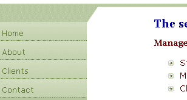
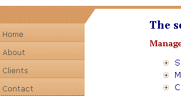

# 在 CSS 中构建一个简单的风格切换器

> 原文：<https://www.sitepoint.com/css-simple-style-switcher/>

如果像许多 SitePoint 读者一样，你的网站依赖于 CSS，那么这篇文章就是为你而写的。在这篇文章中，我将向你展示一个简单的技术，它将允许你的访问者选择他们浏览你的站点的方式。

以及添加一个强有力的“哇！”因素，这种技术还可以为您的站点提供更好的可访问性。虽然我将使用 PHP 来说明这种技术，但是这些概念非常简单，可以应用于其他语言，如 ASP、Java 甚至客户端 JavaScript。

##### 一个样式表来管理它们

通常，我们有一个主样式表来控制(X)HTML 的外观。

```
<link rel="stylesheet" type="text/css" href="/style/default.css" media="screen" />
```

在这个样式表中，我们通常为页面中的标题、段落、导航菜单和其他元素的外观和布局设置规则。

我们甚至可以使用单独的样式表进行打印:

```
<link rel="stylesheet" type="text/css" media="print" href="style/print.css" />
```

##### 彩虹的颜色

为什么不给你的访客选择风格呢？当然，我们已经有了一个很好的方法来提供替代的样式表:

```
<link rel="alternate stylesheet" type="text/css" media="screen" href="style/green.css" title="green"/> 

<link rel="alternate stylesheet" type="text/css" media="screen" href="style/white.css" title="white"/> 

<link rel="alternate stylesheet" type="text/css" media="screen" href="style/orange.css" title="orange" />
```

然而，这种技术有一些已知的缺点:

*   许多现代浏览器(包括 Internet Explorer)无法访问替代样式表。
*   风格选择是无状态的:访问者的选择不会从一次访问到下一次访问被记住，也不会从一页到另一页被记住。

##### 另一种方法

替代解决方案包括三个步骤:

1.  用户选择他们喜欢的风格——他们点击一个超链接或从下拉列表中选择一个选项。

3.  服务器端脚本读取访问者的选择，并在他们的机器上设置一个 cookie 来记录该选择。

5.  在随后的每次访问中，我们的服务器端脚本都会调用这个 cookie，并相应地选择首选样式表。

让我们详细看一下这些步骤。

1.  Choose the Preferred Style

    

    我们使用以下链接来反映每个样式表选项。

    *   `<a href="https://www.sitepoint.com/stylechanger.php?style=green"></a>`
    *   `<a href="https://www.sitepoint.com/stylechanger.php?style=white"> "></a>`
    *   `<a href="https://www.sitepoint.com/stylechanger.php?style=orange"> "></a>`
2.  Yummy, Cookies!

    stylechanger.php 文件包含以下代码:

    ```
    <?php 

    $theStyle    = $HTTP_GET_VARS["style"]; /* querystring */ 

    setcookie("style", $theStyle, time()+36000, "/", ""); 

    header("Location: $HTTP_REFERER"); 

    exit; 

    ?>
    ```

    上面的代码所做的就是获取在`querystring` ( `style=green/white/orange`)中传递的所选样式，并将该选择写入访问者 PC 上的 cookie 中。轻松点。

4.  Trend-Setting

    从现在开始，我们需要将下面的代码添加到我们想要实现访问者样式选择的任何页面中:

    ```
    <?php 

    $styleCookie = $HTTP_COOKIE_VARS["style"]; 

    switch($styleCookie) 

      { 

       case "white": 

       case "orange":          

            break; 

       case "green": 

       case "": 

             $styleCookie = "default"; 

            break;       

      } 

      $styleSheet   = "<link rel="stylesheet" type="text/css" href="/style/$styleCookie.css" media="screen" />n"; 

    echo $styleSheet; 

    ?>
    ```

    这段代码读取存储在用户浏览器中的 cookie。如果是“白色”或“橙色”，我们将把样式表硬编码到标题中。另一方面，如果 cookie 是空白的(即没有 cookie)或绿色的，我们将使用默认的样式表——在本例中是绿色的。

    默认的绿色样式表将页面呈现如下:

    

    就这样…差不多了！

我们的`'default.css'`样式表包含描述页面外观的默认规则集，而我们的替代样式表，顾名思义，包含产生这些页面的替代视图的规则。真的有必要在每个替换样式表中重复所有这些默认规则吗？

##### 冒着重复的风险

不，我们不需要在每个样式表中重复所有的默认规则。CSS 提供了`@import`指令，我们现在可以很好地利用它。

我们将在备选样式表的顶部添加以下内容:

```
@import url("default.css");
```

这将在替代样式表中包含默认样式表，因此我们只需要覆盖我们想要更改的特定页面元素。

例如，为了将标记有`'menu'`类的页面元素设置为漂亮的橙色，我们将在样式表中添加以下内容。

```
@import url("default.css"); 

.menu  

{ 

background: #E5B786 /* nice orange */ 

}
```

本质上，这个页面将显示默认的样式，除了任何标有`'menu'`类的元素。

我们的替代橙色样式表使菜单显示如下:



我们可以覆盖默认 CSS 中的任何元素，并完全改变它的外观——这只是一个选择的问题。

##### 其他用途

到目前为止，许多开发人员都倾向于将这种技术用于奇特的用途，但是它可以在可访问性方面带来真正的好处。

例如，我们的默认 CSS 可以包含以下内容:

```
body{ font-size: 100%;}
```

然后，我们可以为那些视力不好的人添加一个增加了文本大小的替代样式表，如下所示:

*Plus20.css* 可能包含:
`@import url("default.css");
body{ font-size: 120%;}
}`

简单！

## 分享这篇文章