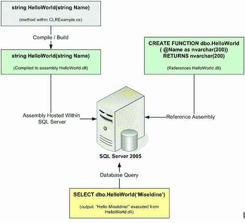
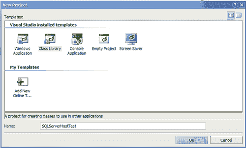
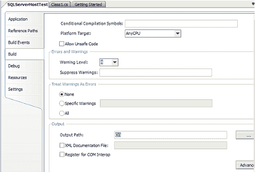
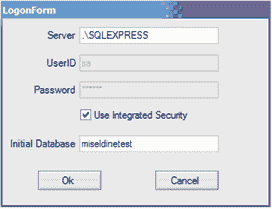
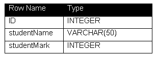

# 主持人。NET 在 SQL Server 2005 Express

> 原文：<https://www.sitepoint.com/host-net-sql-server-2005/>

SQL Server 的最大优势之一是它通过存储过程、用户函数和触发器对数据库内部逻辑定义的强大支持。这允许开发人员从他们的业务逻辑层到数据库创建公认的、适应性强的接口。

在这一层中编写的特殊 SQL 查询很容易被数据库的小改动破坏。然而，使用存储过程意味着所需的功能和逻辑可以封装在该过程中，从而产生更加可靠和透明的访问。执行存储过程的权限也可以在每个过程的基础上单独设置，这允许您阻止某些用户访问特定的功能。

在 SQL Server 2000 中，存储过程是用 T-SQL 语言编写的。这是一种用于变量求值、条件语句和输出赋值的丰富的过程化语言，允许在我们的过程中操作和求值数据。

然而，SQL Server 2005 超越了 T-SQL，为我们提供了从。NET 框架。这是通过在存储过程和用户函数中承载符合 CLR 的代码来实现的。

##### SQL Server 2005 Express

好消息是不需要等到 2005 年才能体验 SQL Server 的下一个版本。SQL Server 2005 Express Beta 2 可以免费下载、评估和测试。这是一个很棒的产品，几乎包含了其更强大的同类产品的所有强大功能，完整的 SQL Server 2005，恰当地命名为“Yukon”。两者之间最显著的区别是 SQL Server 2005 Express 不附带 GUI 管理工具。虽然这可能会使产品难以管理和测试，但 XM (SQL Server Express Manager) 将在年底前推出，以填补这一开发空白。

本文将指导您完成构建承载 CLR 代码的存储过程的过程。您需要下载并安装以下组件，然后才能使用上面列出的任何代码和技术:

1.  [安装。NET Framework 2.0 测试版](http://download.microsoft.com/download/9/6/6/9666067a-660f-48e0-a755-a83a81036b67/dotnetfx.exe)
    别担心，你可以将该框架的测试版与你已经安装的任何其他版本一起使用。

3.  [安装 SQL Server 2005 Beta 2](http://lab.msdn.microsoft.com/express/sql/default.aspx)
    如果您安装了 SQL Server 2005 的任何早期版本(包括 Yukon betas 版),请先删除它们。

5.  安装 C# Express 2005
    虽然我们在本文中承担的每一项任务都可以在没有 IDE 工具的情况下完成，但当这样一个强大的 IDE 可以免费下载时，还是值得一试的！

7.  安装 QA 替换应用程序
    这是一个很棒的免费工具，它为你的 Express 数据库提供了一个 GUI。

##### 您的第一个 CLR 存储过程

安装完所有软件后，我们现在可以开始创建 CLR 托管的存储过程，或者更准确地说，创建一个用户函数。

您可以用任何具有生成可验证 IL(中间语言)的编译器的语言编写在 SQL Server 2005 中使用的代码。虽然本文使用 C#，但是您可以轻松地用 VB.NET、J#甚至 Eiffel 编写 SQL Server。这也是真实的。您的代码被编译到的. NET framework 版本:您并不局限于 2.0 版本的框架。

那么，它是如何工作的呢？第一步是生成一个包含类的. NET 程序集，这些类包含您希望从 SQL Server 过程中调用的方法。然后在 SQL Server 中注册此程序集，并创建特定的过程来链接程序集中的特定方法。需要注意的是，要调用的方法和要链接的存储过程的签名必须相同。

然后，数据库用户可以像查询任何其他表单一样查询这些新过程；但是，SQL Server 执行。NET 方法并输出其结果。

下图概述了这个过程，其中方法“HelloWorld”将一个字符串作为参数，并在它前面加上前缀“Hello”来产生它的字符串输出。



因此，编写此类程序的工作计划如下:

1.  创建希望在 SQL Server 2005 中承载的方法。

3.  编译此类以创建程序集。

5.  在 SQL Server 2005 中注册此程序集。

7.  创建一个引用您希望调用的方法的新函数。

##### 步骤 1:创建希望在 SQL Server 2005 中承载的方法

打开 Visual C# Express 2005，从菜单中选择“新建”->“项目”。您应该会看到以下对话框:



类库允许我们创建一个程序集而不是一个可执行的应用程序。确定已选择此项，并键入项目的名称。在这里，我称之为“SQLServerHostTest”，但我相信您可以想到一个更好的标题！

现在，您将在一个新的程序集中拥有一个新的、干净的类，您可以向其中添加以下要承载的方法:

```
using System; 

using System.Collections.Generic; 

using System.Text; 

#endregion 

namespace SQLServerHostTest 

{ 

  public class HostFunctions 

  { 

    public static string HelloWorld(string Name) 

    { 

      //prefix the Name variable with Hello 

      return "Hello" + Name; 

    } 

  } 

}
```

应该注意的是，您希望在 SQL Server 2005 中承载的任何方法都必须标记为 public 和 static(或者在 VB 中标记为 public shared)。NET)，因为将只使用该方法的一个实例。

##### 步骤 2:编译以创建程序集

我们现在可以编译类库来创建一个程序集。单击 F6 或单击构建->构建解决方案菜单来实现这一点。由于程序集是通过文件位置在 SQL Server 2005 中注册的，因此您需要知道输出的程序集的确切位置。要手动设置输出路径，请单击菜单“项目-> SQLServerHostTest 属性”..，”选择“构建”选项卡，并在“输出路径”文本框中输入路径。



##### 步骤 3:在 SQL Server 2005 中注册此程序集

虽然您可以在 C#中手动编写 SQL 语句的执行代码，但是您也可以使用 QA 替换应用程序连接到您的 SQL Server 并非常轻松地执行语句，获得有关您可能收到的任何错误的更多信息，并查看输出结果。

向 SQL Server 2005 注册程序集的实际命令是:

```
CREATE ASSEMBLY [ASSEMBLYNAME] FROM '[ASSEMBLYLOCATION]'
```

`[ASSEMBLYNAME]`可以是您希望的任何名称，但是最好给这些定义加上前缀“`asm`”，就像主键对象应该加上前缀“`pk`”一样。`[ASSEMBLYLOCATION]`是您希望引用的程序集的完整文件路径。

因此，我们需要执行以下 SQL 语句:

```
CREATE ASSEMBLY asmHelloWorld FROM 'c:SqlServerHostTest.dll'
```

使用 QA，输入数据库的详细信息(注意:您的 SQL Server 是通过`YOURCOMPUTERNAMESQLSERVERINSTANCE`符号访问的，而不仅仅是“localhost”)。



现在，您可以输入 SQL 语句并单击“执行文本”按钮在 SQL Server 2005 上执行该语句。


注意:您可能会收到如下错误:

```
"CREATE ASSEMBLY failed because method 'get_Value' on type 'SQLServerHostTest.Properties.Settings' in safe assembly 'SQLServerHostTest' is storing to a static field. Storing to a static field is not allowed in safe assemblies."
```

通常，C# Express 会向您的库添加与 SQL Server 托管不兼容的类。如果您收到此错误，请使用以下命令行将您的类手动编译为程序集:

```
 csc /out:c:SqlServerHostTest.dll /t:library Class1.cs
```

##### 步骤 4:创建一个新函数，它引用了您希望调用的方法

现在，该程序集已注册到 SQL Server，我们可以创建一个新函数来包装对程序集中“HelloWorld”方法的调用。

实现这一点的命令是标准的`CREATE FUNCTION`命令，SQL Server 的用户应该已经很熟悉了。然而，我们现在需要在宣言的结尾增加一个对我们大会的提及:

```
CREATE FUNCTION dbo.clrHelloWorld 

( 

  @name as nvarchar(200) 

) 

RETURNS nvarchar(200) 

AS EXTERNAL NAME [asmHelloWorld].[SQLServerHostTest.HostFunctions].[HelloWorld]
```

在 SQL Server 2005 的 Beta 2 中，用于引用程序集的语法发生了变化，因此它不再使用冒号，而是使用更传统的点标记法。`AS EXTERNAL NAME`最初采用我们注册的程序集的名称(在本例中为`asmHelloWorld`)，后跟完整的类名，包括名称空间(在本例中为`SQLServerHostTest.HostFunctions`)，并以我们希望调用的方法结束:“HelloWorld”

此外，请注意函数的签名如何与“HelloWorld”方法的签名相对应。`NVARCHAR`类型用于关联我们的字符串类型。

##### 测试程序

现在我们的新函数已经创建好了，我们可以测试我们的进度了。由于我们的函数返回一个字符串类型，我们可以使用一个简单的 Select 语句来检索我们的结果。

```
 SELECT dbo.clrHelloWorld('miseldine')
```

这将返回预期的结果:

```
 Hello miseldine
```

##### `SqlPipes`和`SqlContexts`

然而，功能并不止于此。ADO.NET 引入了`SqlPipe`和`SqlContext`，它们公开调用数据库实例供您查询，并为您的过程提供结构化输出。

先来看`SqlContext`。您可以将`SqlContext`视为调用 CLR 存储过程的数据库的`SqlConnection`对象。由此，您的过程可以查询同一个数据库。

默认情况下，这些新对象所在的名称空间`System.Data.SqlServer`没有注册。您可以添加对程序集“`sqlaccess.dll`”的引用，该程序集位于 SQL Server 2005 安装的 bin/文件夹中。

以下示例使用了一个存储学生姓名及其最后一年考试成绩的表:



```
CREATE TABLE tblResults 

  (ID INTEGER CONSTRAINT pkKeyMyId PRIMARY KEY,  

  studentName VARCHAR(50),  

  studentMark INTEGER)
```

使用`SqlContext`，我们可以生成一个名为`getAverageMark`的方法，该方法查询调用我们的过程的数据库，并返回学生获得的平均分数:

```
using System; 

using System.Collections.Generic; 

using System.Text; 

using System.Data.SqlServer; 

using System.Data.Sql; 

using System.Data; 

namespace SitePoint.Yukon 

{ 

  public class HostFunctions 

  { 

    [SqlFunction(DataAccess=DataAccessKind.Read)] 

    public static int getAverageMark() 

    { 

      SqlCommand currentCommand = SqlContext.GetCommand(); 

      currentCommand.CommandType = CommandType.Text; 

      currentCommand.CommandText = "select AVG('studentMark') from tblResults"; 

      return (int)currentCommand.ExecuteScalar(); 

    } 

  } 

}
```

类似地，我们可以在我们的过程中访问其他数据库和资源，就像任何一样。NET 应用程序可以。但是，默认情况下，SQL Server 2005 不允许 CLR 存储过程访问外部资源。当注册包含访问外部资源的方法的程序集时，将`WITH PERMISSION_SET = EXTERNAL_ACCESS`添加到`CREATE ASSEMBLY`命令中是至关重要的。

但是，我们如何从我们的方法返回结构呢？这就是`SqlPipe`介入的地方。它提供了一个返回调用数据库的管道，我们可以沿着这个管道发送结果。使用`SqlPipe`对象，我们可以返回实现`ISqlReader`或`ISqlRecord`接口的任何类型的数据。这意味着我们可以很容易地返回任何包含行和列的数据。

下面的例子从外部数据库获取一组记录，并使用`SqlPipe`将它们推回我们的数据库。

```
using System; 

using System.Collections.Generic; 

using System.Text; 

using System.Data.SqlServer; 

using System.Data.Sql; 

using System.Data; 

#endregion 

namespace SitePoint.Yukon 

{ 

  public class HostFunctions 

  { 

    [SqlMethod] 

    public static void getMarksExternal() 

    { 

      System.Data.SqlClient.SqlConnection conn = new System.Data.SqlClient.SqlConnection("connectionstring"); 

      System.Data.SqlClient.SqlCommand cmd = new System.Data.SqlClient.SqlCommand("select * from students", conn); 

      conn.Open(); 

      System.Data.SqlClient.SqlDataReader dr = cmd.ExecuteReader(); 

      //grab our SqlPipe from the current database instance 

      SqlPipe pipe = SqlContext.GetPipe(); 

      pipe.Send(dr); 

      conn.Close(); 

    } 

  } 

}
```

因为这是一个过程而不是一个函数(我们并不返回值)，所以我们需要以一种与我们之前看到的稍微不同的方式将它注册到 SQL Server 2005。鉴于前面的例子是使用`CREATE FUNCTION`注册的，我们现在需要使用`CREATE PROCEDURE`:

```
CREATE PROCEDURE clrGetMarksExternal() 

AS EXTERNAL NAME [asmStudent].[SitePoint.Yukon.HostFunctions].[getMarksExternal]

To execute it, we just enter the procedure name:

```
clrGetMarksExternal 

GO
```

摘要
正如您所看到的，SQL Server 2005 提供了一系列单独通过 T-SQL 无法获得的功能。您可以执行的代码更加可靠、可伸缩和易于管理。此外，它还使您能够充分利用。NET framework，这样您就可以为数据访问生成干净且可扩展的方法。使用 SqlPipe，您可以将注册表字符串列表、active directory 结果或日志文件直接返回到 SQL Server。
可能性几乎是无限的...而这只是测试版！

```

## 分享这篇文章