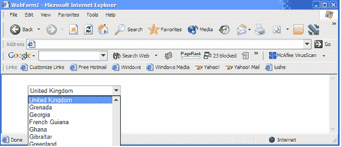

# 使用 GeoIP 和。网

> 原文：<https://www.sitepoint.com/geoip-targetting/>

虽然互联网是一种全球现象，将不同国家的不同人联系在一起，但许多网站未能将其内容或功能定位于说英语以外语言的访问者，或居住在拥有最大互联网用户群的国家(如美国)以外的访问者。但是，随着像中国这样的国家越来越多地使用互联网，只说英语不再是一个明智的决定。

是时候变聪明了。如果你认为用另一种语言提供你的网站会是一个巨大的麻烦，请三思。

GeoIP API，结合您的。NET Web 应用程序可以根据用户的地理位置创建内容特别适合用户的页面——本文将展示如何做到这一点。完成后，您将能够使用 GeoIP API 和。NET 来提高访问者的满意度，并有可能为您的网站增加广告收入。

##### GeoIP

GeoIP 是 MaxMind 公司的产品，它将给定的 IP 地址映射到存储在 IP 地址数据库中的特定位置。

GeoIP 有不同的版本，但您可以使用国家数据库的免费版本在您的应用程序中获得 93%的准确映射。务必检查许可信息，以确保您的特定应用程序适合免费使用选项。

MaxMind 还提供了一个 C# API，我们将在本文中使用它。您需要下载 API 和自由国家数据库，以便能够使用本文中的代码:

*   [在此下载 API](http://www.maxmind.com/download/geoip/api/csharp/GeoIP-CSharp.zip)

。

*   [在此下载国家数据库](http://www.maxmind.com/download/geoip/database/GeoIP.dat.gz)。

##### 国际化。网

ASP.NET 有一些很棒的国际化特征。日期、时间和货币格式取决于应用程序中任何时候使用的“文化”。例如，对于具有英国文化(由 RFC 1766 国家代码“en-gb”定义)的用户，日期将以以下形式显示:

日/月/年

将区域性设置为美国英语(“en-us”)后，表单将如下所示:

年/月/日

ASP.NET 展示了一种用户界面文化。这个`UICulture`值用于确定在 Web 表单上显示哪些资源，例如，来自数据库的资源字符串，或者特定文化的特定图像。

有许多方法可以为应用程序或特定页面设置这些区域性。一种方法是使用应用程序的配置文件(web.config ),如下所示:

```
<configuration>   

  <system.web> 

    <globalization fileEncoding="utf-8" requestEncoding="utf-8" responseEncoding="utf-8" culture="en-US" uiCulture="de-DE" />   

  </system.web> 

</configuration>
```

全球化条目定义了对页面进行编码的各种方式(对于显示非英语字符的语言很有用)以及前面谈到的`Culture`和`UICulture`值。

在上面的示例中，应用程序区域性设置为美国英语(“en-US”)，而用户界面区域性设置为德语(“de-DE”)。例如，这在电子商务网站中特别有用，因为这意味着你可以用美元显示价格信息，但页面输出是为德国观众量身定制的。

您还可以在其页面指令中设置特定窗体的区域性:

```
<%@ Page UICulture="de-DE" Culture="en-US" %>
```

但是，请注意，这两种方法都将为表单的所有查看者设置区域性。在本教程中，我们将通过查询 GeoIP 数据库找到访问者的文化，然后为该访问者使用适当的文化。

##### 动态全球化

ASP.NET 应用程序为每个请求创建一个新线程。我们可以改变线程的属性，为给定用户定制应用程序的行为，而不改变它对其他访问者的行为。

ASP.NET 应用程序的入口点是`global.asax`文件中的`Application_BeginRequest()`方法。一旦我们在这里确定并设置了访问者的文化，显示的内容就会根据他们的具体情况而定制。

在代码中指定文化是通过将线程的`CurrentCulture`和`CurrentUICulture`属性设置为一个`CultureInfo`对象来完成的，该对象表示我们希望使用的文化。在此示例中，区域性设置为德语(“de-DE”):

```
CultureInfo userCulture = new CultureInfo.CreateSpecificCulture("de-DE"); 

System.Threading.CurrentThread.CurrentCulture = userCulture; 

System.Threading.CurrentThread.CurrentUICulture = userCulture;
```

我们需要从 GeoIP 获取的信息是`RFC 1766`代码。这将让我们创建正确的`CultureInfo`对象。

##### 使用 GeoIP

GeoIP C# API 公开了一种从 IP 地址的`lookupCountryCode`中查找国家信息的方法。可以通过`Request.UserHostAddress`中的值查找当前用户的 IP 地址，该值将传递给该方法以接收国家代码:

```
//import the geoip API 

using CountryLookupProj; 

protected void Application_BeginRequest(Object sender, EventArgs e) 

{ 

   string strCulture;   

   try 

   { 

     CountryLookup cl = new CountryLookup(Server.MapPath("GeoIP.dat")); 

     strCulture = cl.lookupCountryCode(Request.UserHostAddress); 

   } 

   catch 

   {  

      //this is our default culture if GeoIP fails to make a match 

      strCulture = "en-US"; 

   } 

   CultureInfo userCulture = new CultureInfo.CreateSpecificCulture(strCulture); 

   System.Threading.CurrentThread.CurrentCulture = userCulture; 

   System.Threading.CurrentThread.CurrentUICulture = userCulture; 

   Session["userCulture"] = strCulture; 

}
```

上面的代码从 GeoIP 中定位国家代码，创建一个`CultureInfo`对象将其表示为一个区域性，然后将当前应用程序线程设置为这个新的区域性。最后一行将这个国家代码添加到用户的会话 cookie 中，以便以后快速引用。

##### 下拉国家选择器

确定了文化之后，我们就可以开始为用户定制页面了。一种方法是创建一个下拉列表，自动突出显示用户的国家。

首先，我们需要在下拉框中填入 GeoIP 认可的所有国家。我们可以通过解析由`countryLookUp`(`countryLookUp.cs`)类中的 API 提供的两个数组`countryName`和`countryCode`，并根据它们的值创建`ListItem`对象来添加到下拉列表中。

请注意，默认情况下，API 不会公开这两个数组(它们被标记为私有)。您可以将数组公开或复制到您希望使用下拉框的表单中。

第一种方法是更改`countryLookUp`类，通过访问器公开数组。将下列粗体行添加到该类中:

```
public class CountryLookup 

{ 

  private FileStream fileInput; 

  private static long COUNTRY_BEGIN = 16776960; 

  public static string[] CountryCode 

  { 

    get 

    { 

      return countryCode; 

    } 

  } 

  public static string[] CountryName 

  { 

    get 

    { 

      return countryName; 

    } 

  }
```

既然我们已经向应用程序公开了 API 中的数组，我们可以解析它们来填充我们的下拉列表框:

```
//import the geoip API 

using CountryLookupProj; 

private void Form1_Load(object sender, System.EventArgs e) 

{ 

  for (int i = 0; i < countryLookup.CountryName.Length; i++) 

  { 

    ListItem l = new ListItem(countryLookup.CountryName[i], 

        countryLookup.CountryCode[i]); 

    DropDownList1.Items.Add(l); 

  }     

}
```

我们现在可以从用户的会话缓存中自动选择具有我们的文化国家代码值的项目:

```
DropDownList1.Items.FindByValue(Session["userCulture"]).Selected = true;
```

执行应用程序时，下拉列表会自动找到用户的位置，并使用他或她的 IP 地址在下拉列表中选择正确的条目:



##### 定向广告

您可以扩展这一想法，根据用户的位置创建有针对性的广告。例如，德国用户更有可能点击展示德国产品的广告，而不是为美国观众设计的广告。

这项任务可以通过多种方式实现。本节将概述一种方法，通过这种方法，我们可以从数据库中随机选择一个适当的广告，每个广告都分配有国家代码，以反映它应该显示给哪些用户。

我们将使用一个非常简单的数据库表来存储图像位置和相关的国家代码。这可以扩展为允许两个表，一个包含图像 URL，另一个包含相关的国家代码，通过外键链接。

我们的表格是这样的:

```
CREATE TABLE Adverts 

{ 

      ID int IDENTITY (1,1) NOT NULL, 

      ImageLocation varchar(200) NOT NULL, 

      CountryCode varchar(2) NOT NULL 

}
```

当我们开始显示我们的广告时，我们可以使用以下 SQL 语句选择所有与我们的国家代码对应的广告:

```
SELECT TOP 1 ImageLocation FROM Adverts WHERE CountryCode = "GB" ORDER BY NEWID()
```

注意`ORDER BY NEWID()`的用法。在 SQL Server 中，它以伪随机顺序列出记录。通过只选择`TOP 1`，我们有效地选择了单个随机记录。

因此，在我们的表单上使用图像 web 控件(Image1 ),我们可以这样查询数据库:

`string sqlConn = "connectionstring";
 string sqlCmd = "SELECT TOP 1 ImageLocation FROM Adverts WHERE CountryCode = '"+Session["userCulture"]+"' ORDER BY NEWID()";
 SqlConnection myConnection = new SqlConnection(sqlConn);
 SqlCommand cmdRandomQuote = new SqlCommand(sqlCmd, myConnection);
 myConnection.Open();
 SqlDataReader myReader = cmdRandomQuote.ExecuteReader();
 myReader.Read();
 //Set the advert
 Image1.Location = myReader["ImageLocation"].ToString();
 myConnection.Close();`

##### 摘要

通过了解说不同语言的不同国籍的用户，并使用本文中概述的技术，您可以用最少的努力创建真正的全球应用程序。

## 分享这篇文章