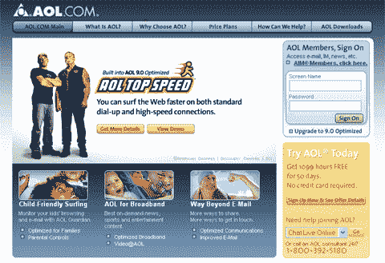
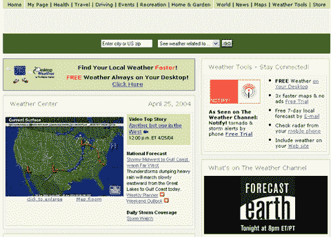

# 大玩家的 10 个可访问性错误

> 原文：<https://www.sitepoint.com/blunders-big-player-2/>

**[网页可访问性](https://www.sitepoint.com/accessible-web-design/)就是让所有互联网用户(包括残障人士和非残障人士)都能访问你的网站，不管他们使用的是什么浏览技术。**

越来越多的国家已经通过法律规定网站必须对盲人和残疾人开放。有了这种法律压力，以及可访问性的许多[好处](https://www.sitepoint.com/sell-web-accessibility/)，网络上的大玩家肯定有可访问的网站，对吗？

让我们来看看…

##### 错误分配的替代文本

***有罪方:[亚马逊](http://www.amazon.com/)***

屏幕阅读器、车载浏览器和通过慢速拨号连接连接并关闭图像的用户依赖 ALT 文本代替图像。有两种类型的图像:信息和装饰。信息图像应该有一个充分描述图像的 ALT 描述。另一方面，装饰图像应该分配有 ALT= " "。通过分配这个空值，浏览器简单地忽略图像。

亚马逊上的大多数图片都没有任何替代文本——考虑到分配它是多么的不耗时，这是非常不寻常的。更奇怪的是，一些信息图像，如亚马逊标志，被指定为 ALT= " "。

##### 不可调整大小的文本

***有罪方: [CNN](http://www.cnn.com/)***

为了充分利用互联网，视力不佳的用户需要能够放大网页上的文本(如果你不确定，请阅读如何[调整文本](http://www2.tec.govt.nz/home/accessibility.htm#text))。为了使用户能够做到这一点，您需要用% em 或一个相对值(小、中等)来指定字体大小。).CNN 已经指定正文的大小为 12px。

##### 不是通过标记创建的文本

***有罪方: [AOL](http://www.aol.com/)***

如果图像用于显示文本，那么文本显然是不可调整大小的。此外，对于使用屏幕放大镜的用户来说，图像中嵌入的文本看起来像素化且模糊。W3C Priority 2 guidelines (第 3.1 点)涵盖了这一点，因此，如果你的网站使用图像来显示文本，它就不符合 AA 或 AAA 可访问性。

看看下面 AOL 主页的截图。除了底部的蓝色背景区域，你看到的几乎所有东西都是通过图像创建的——甚至是他们的电话号码(在截图的最右下角)！如果我想将该号码复制并粘贴到我的地址簿中，该怎么办？



##### 不可访问的表单

***有罪方:大部分主要网站(除 [AOL](http://www.aol.com/) )***

为了使表单具有可访问性，提示文本应该正确定位并分配给表单项。有关可访问表单的更多信息，请阅读[构建可访问的在线表单](https://www.sitepoint.com/accessible-online-forms/)。

要检查一个文本框是否可访问，只需点击它旁边的文本(提示文本)，一个闪烁的光标应该出现在框中。当您单击单选按钮或复选框的提示文本时，该项应该被选中。

##### 无效的 HTML

***有罪方:***

有这么多不同的浏览器和浏览技术可用，无效的 HTML 代码可能会产生不可预知的结果。你可以使用非常方便的 [W3C HTML 验证器](http://validator.w3.org/)来检查你自己的 HTML。

##### 脱离上下文，链接文本没有意义

***有罪方:[气象频道](http://www.weather.com/)***

盲人互联网用户经常通过从一个链接跳转到下一个链接来浏览网站，所以所有链接文本脱离上下文有意义是很重要的。“点击这里”和“更多”是非描述性链接文本的两个常见例子。描述性链接文本也有可用性和搜索引擎优化的好处。

看看这个天气频道的截屏。除了页面中间的“点击这里”之外，最右边的链接没有一个是脱离上下文的。例如，“在你的桌面上”和“免费试用”本身实际上意味着什么？



##### 使用 HTML 改变字体大小/颜色

***有罪方:[谷歌](http://www.google.com/)***

有特殊需求的网络用户在浏览网页时可能会使用特定的字体和颜色。他们可以利用自己的 CSS 文档来覆盖您在 CSS 文档中指定的字体和颜色，但不能覆盖在 HTML 文档中指定的字体和颜色。因此，所有格式都应该通过 CSS 文档调用，而不应该放在 HTML 文档中。

不要像谷歌那样使用`<font>`或`<body>`标签来改变文本的颜色和大小。例如，谷歌的`<body>`标签是这样的:

```
<body bgcolor=#ffffff text=#000000 link=#0000cc vlink=#551a8b alink=#ff0000>
```

##### 用于布局的表格

***有罪方:几乎每个主要站点(除了)***

表格是结构元素，因此任何使用表格布局的网站都自动不符合 W3C AA 或 AAA 可访问性标准(参见 W3C 指南[第 3.3 点](https://www.w3.org/TR/WAI-WEBCONTENT/full-checklist.html))。

使用 CSS 而不是表格来布局意味着你的网站将兼容所有“未来”技术:手持设备、车载浏览器和网络电视。你可以使用 [Wapalizer](http://www.gelon.net/) 测试你的网站在手持设备上的外观；为什么不下载免费的[网络电视浏览器](http://developer.msntv.com/TOOLS/webtvvwr.asp)来测试你的网站呢？使用 CSS 布局有额外的搜索引擎好处，通常允许更快的下载。

##### 网站依赖于 JavaScript

***有罪方:***

大约 6%的互联网用户的浏览器[不支持 JavaScript](http://www.thecounter.com/stats/2004/March/javas.php) ，所以应该提供替代方案，比如用`<noscript>`标签。

关闭浏览器中的 JavaScript，然后转到 Expedia。像 Expedia 这样大的网站如果没有 JavaScript 就无法运行，这真的很了不起。单击屏幕顶部的任何选项卡，您将看到以下内容:


他们甚至懒得像网站的其他部分那样设计它！

##### 单独的“可访问”版本

***有罪一方:[曼联](http://www.manutd.com/)***

W3C 表示，“如果所有其他方法都失败了”，你应该只求助于一个单独的可访问版本。强烈建议不要使用单独的可访问版本，因为:

*   它们提供的功能往往不如主网站。
*   它们通常不会像常规网站那样保持最新。
*   它们可以被视为将残疾人排除在正常社会之外的又一种方式。
*   非残疾人可能仍然无法访问正规网站。

曼联的网站在可访问性方面太差了，以至于它可以被命名为这篇文章中十点中每一点的罪魁祸首！曼联完全忽略了这一点:网页可访问性就是遵循设计标准，然后添加一些简单的可访问性功能。这不仅仅是残疾用户能够访问您的网站，而是每个人都能够访问您的网站，包括那些使用手持设备、网络电视和车载浏览器的人。

##### 最后…

总而言之，在可访问性方面，看起来大公司并没有以身作则。这真的很令人惊讶，因为如果案件开始诉诸法庭，他们无疑会是第一个被起诉的人。

来吧，伙计们，解决它。网页可访问性不是火箭科学。任何具有基本 HTML 和 CSS 设计知识的 Web 开发人员，只要有一点时间，都可以轻松地学习和实现 Web 可访问性。

## 分享这篇文章