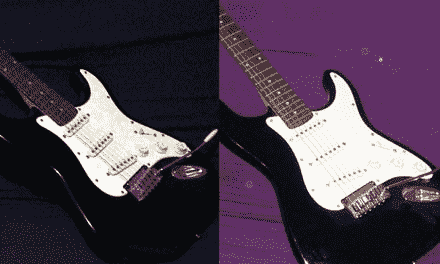
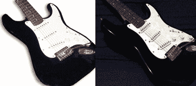
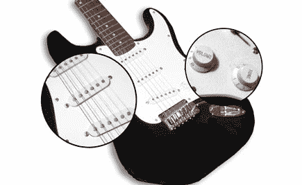

# 凭借出色的产品照片销售更多产品

> 原文：<https://www.sitepoint.com/ecommerce-product-shots/>

想象一下，你正开车行驶在一条偏僻的乡村道路上，你看到两个苹果摊。它们看起来一样，但是其中一个比它的竞争对手要贵几美元。你决定买些苹果，在一个便宜的摊位前停下来。当你往他们的垃圾箱里看的时候，你会看到里面装满了半满的碰伤的烂苹果。你决定试试另一个摊位，那里有满满一袋成熟、闪亮的红苹果，看起来多汁，足以让你咬一口。

作为消费者，如果你真的想要新鲜的苹果，你会在第二个摊位为看起来更健康的苹果支付额外的钱。第一个摊位上那些又老又破的苹果不会促使你掏出钱包把它们带回家。

类似地，一个知道自己想在网上购买特定产品的消费者可能会在两个不同的网上零售商之间犹豫不决。两家公司可能都在搜索引擎优化和网站设计上投入了大量的营销预算，试图抓住这个特定的产品购买市场。两者的区别很可能在于产品摄影。

这是大多数网站转向库存摄影的地方。而且，如果你有一家服务企业(技术支持、设计)或者一个社区网站，库存摄影可能是一个不错的选择。但是，如果你卖一个产品，你需要伟大的产品照片。

那么，你如何从一张普通的旧数码照片变成一张吸引顾客购买的优秀产品照片呢？有几个因素你应该考虑。让我们在真实世界示例的上下文中依次看一下每一个。

##### 质量

如果你用数码相机工作，使用最高的质量和分辨率设置是非常必要的。至少 300 万像素的相机是最好的，因为大多数网络图片都相当小——它们不需要高端数码相机提供的质量。

如果你从胶片上的照片开始，你需要使用扫描仪。如果你有鼓形扫描仪，那就太好了；如果没有，就用高 DPI 在平板上扫描 300 dpi 左右通常是最佳的。扫描前开始模糊、有划痕和/或布满灰尘的照片将更难变成真正迫使人们购买的产品照片。下面的图片展示了我开始拍摄的照片——一张吉他的照片，是用 310 万像素的柯达数码相机拍摄的，没有使用任何特殊的灯光。

##### 照明设备

无论你的产品有多好，如果你的原始照片曝光过度或光线不足，再多的编辑也救不了它。为了拍出真正好的产品照片，你需要从好的开始。微妙、自然的正面照明与对比鲜明的素色背景相映衬，是最佳的开始方式。如果你在卖青椒，不要在一块绿色的布料上拍照。尝试红色或橙色——如果你决定保留背景，这种颜色不仅会让产品流行起来，而且以后也更容易去掉。

在上图中，吉他与紫色布料形成了很好的对比——比黑色更好。这种对比让顾客更容易看到产品本身的颜色——对顾客来说，产品更生动、更鲜活、更真实。

##### 背景

有没有想过为什么目录中的产品总是没有背景？即使是服装模特也通常以纯白色展示。

产品背后没有令人分心的元素，顾客可以自由地看到产品本身。注意下图中左边的吉他是如何比右边的更引人注目的？您的客户的眼睛会立即被直接吸引到产品上，这正是您想要它去的地方。产品看起来更干净，尤其是没有背景的干扰噪音。此外，请注意轻微的阴影(在最终图像增强中了解更多)。

##### 细节

通常，顾客会选择线下购买，因为他们无法像在零售店那样清楚地看到产品。允许多个视图是解决这个问题的一种方法，但是它迫使客户继续加载图像。另一种方法是使用特写气泡，让顾客“近距离接触”产品，即使他们只是在 2D 观看。下图展示了一个特写气泡到底能做什么。

##### 染色

使用 Photoshop 或类似的编辑工具，您可以增强产品的颜色，以弥补原始照片的不足之处。要记住的一件重要的事情是诚实对待你的颜色——如果你只卖紫色，不要因为你有一个色调/饱和度工具栏(Photoshop:Image > Adjustments > Hue/Saturation)就把你的毛衣换成绿色。这样做只会迷惑你的客户。此外，对于更精细的颜色调整，色彩平衡调板是更精确的工具(“图像”>“调整”>“色彩平衡”)。

##### 最终图像增强

亮度和对比度以及自动色阶等工具对于快速和肮脏的产品拍摄非常方便。他们不仅可以立即完成手动需要一些时间才能完成的工作，还可以让 Photoshop 业余爱好者轻松增强他们的照片。

***要牢记的工具:***

*   **亮度/对比度**:注意不要过多地改变照明，尤其是如果你一开始就有良好的照明。不仅很明显你编辑了你的照片，而且很容易越界过度编辑。你可以在 Photoshop 中通过图像>调整>亮度/对比度来访问这个调色板
*   **自动色阶**:这个工具的使用暗示了 Photoshop 使用的一个更高级的主题，但是幸运的是，任何熟悉 Photoshop 的人都可以使用这个工具(图像>调整>自动色阶)

为了让你的图像从背景中显现出来，你也可以尝试添加一个微妙的阴影。这不仅增加了你的图像的深度，还创造了二维产品照片实际上是三维图像的错觉，反过来，这是一个真实的产品，类似于他们在零售店可以体验到的东西。你可以在上图中看到一个微妙的阴影能做什么。

##### 网页优化

为了把你的产品照片带给你的客户，你应该采取最后一步，为网络优化它们。记住许多客户的带宽限制和其他不希望等待图像加载的人的有限耐心，调整大小和优化应该是你的最后一步——也许是最重要的一步。

图像尺寸通常应保持在 400 像素乘 400 像素以下。如果客户想要更大的图像，并因此同意等待图像，您可以提供一个更大版本的链接。这允许非常感兴趣的或高带宽的客户深入调查您的产品，而不会妨碍其他可能使用较慢连接的客户。虽然这确实与产品照片本身无关，但它却是增加销售的一个关键因素。

##### 结论

永远记住，你是在推销产品。如果你因为图像质量(或缺乏图像质量)而不从自己的网站上购买东西，那么有些事情需要改变。

视觉上吸引你的东西可能同样吸引你的顾客——或者可能恰恰相反。总是对朋友、家人或同事测试产品照片，看看他们怎么想。如果你不知道如何展示你的产品，看看其他成功的零售网站，看看他们是怎么做的。他们成功的一个被忽视的原因可能是他们的产品照片。

请记住，没有人想要旧的、碰伤的苹果，所以请确保你的苹果是闪亮的、新的、值得购买的。

## 分享这篇文章