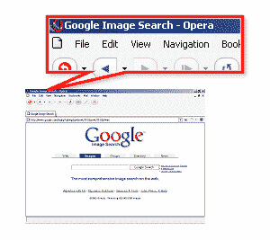
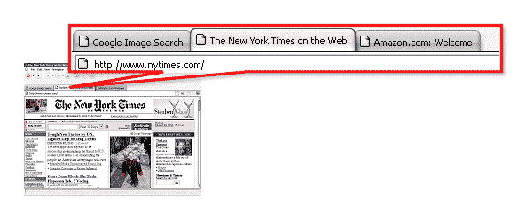
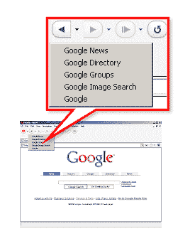
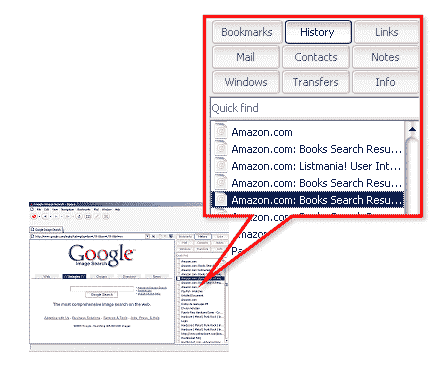

# 超文本文档标题的重要性

> 原文：<https://www.sitepoint.com/html-title/>

标题是全局标识文档内容的元素。对于一个网站的访问者来说，这是积极的用户体验的最重要的贡献者之一。具有讽刺意味的是，标题通常被忽略，或者不被考虑，可能是因为浏览器不在文档正文中使用标题。

这篇文章解释了在什么地方使用文档标题，以及如何通过遵循一些指导方针来创建有用的标题。

##### 在哪里使用标题

浏览器界面中的许多地方都会用到标题，因此正确定义标题非常重要。使用该标题的一些领域包括:

1.  **书签:**书签允许用户保存互联网资源的 URL。用户可以在将来通过选择标题来访问参考资源，而不需要向浏览器提供 URL。

3.  标题栏:大多数图形浏览器在用户界面的上部区域显示超文本文档标题。

5.  **导航标签:**用户可以通过一个浏览器实例访问多个资源。这种类型的界面设计被称为多文档界面(MDI)。浏览器使用各种导航选项卡中的标题来标识给定会话中访问的不同资源。

7.  **会话历史:**浏览器提供了至少两个按钮，允许用户在会话中访问的资源之间来回移动。除了提供顺序访问，这些按钮还显示与所访问的资源相对应的标题列表。用户可以选择这些来重新访问不同的资源。

9.  **导航历史:**浏览器存储用户访问过的资源和文档的 URL。标题用于标识导航历史中维护的 URL。

11.  **任务栏:**标题显示在操作系统的任务列表中，以标识用户在给定时间可能正在执行的不同浏览器实例。

除了浏览器界面使用标题的不同方式之外，搜索引擎还通过读取标题标签并在标题和文档正文中查找关键字来执行搜索操作。在大多数情况下，搜索结果使用标题作为超文本文档的链接来显示。

在回顾了标题如何为用户提供更好的浏览体验后，您应该理解仔细定义文档标题的重要性。标题应该在所有显示它的上下文中提供更好的可用性。

##### 如何创建有用的标题

为了开发有用的标题，你需要运用逻辑思维并遵循一些信息设计指南。

***短暂而意味深长***

标题长度不得超过 64 个字符。考虑到可接受的标题长度没有规则，而且大多数浏览器都会截断标题。使用短标题将有助于用户阅读和理解标题的含义。

***建立标题结构***

你应该建立一个结构来定义标题，并一致地使用它。以下是结构定义的三个示例:

1.  **首页:**一个公司的网站首页应该包含公司名称。此外，你可以包括一个网站内容的简要描述。

示例:

*   个人电脑和电子产品
*   个人电脑和电子产品—打折出售的电脑和电子设备。

*   **产品类别文档:**在给产品类别文档命名时，您应该在类别名称后加上公司名称。产品名称的每个单词都应该以大写字母开头。

示例:

*   便携式计算机——个人电脑和电子产品

*   **产品描述文档:**产品描述文档应包括产品名称，后跟公司名称。产品名称的每个单词都应该以大写字母开头，描述中使用的所有单词都应该以小写字母开头。

示例:

*   东芝卫星 15 英寸屏幕—电脑和电子设备

标题中描述文档内容的部分可以放在开头，遵循正常的阅读流程(从左到右)。在视觉受损的用户的情况下，这将允许用户在阅读或听觉时快速获得描述。

建立标题定义结构的主要目的是在通过浏览器访问网站和访问其他资源时促进更好的浏览体验。

##### 要避免什么

上述指南并不保证不会出现错误。以下是你应该避免在标题中出现的内容:

1.  **特殊字符:**特殊字符影响关键词搜索过程。此外，针对视障用户的辅助技术将逐字阅读标题内容。如果文档包含标题:–::PC 和电子设备::–用户代理将读取“破折号冒号 PC 和电子设备冒号破折号。”这对用户来说没有意义。
2.  **对所有文档使用相同的名称:**每次用户创建书签时，浏览器都会使用标题作为书签的名称。如果你对所有的网络文档使用相同的标题，用户将很难识别他想要使用的特定书签。此外，搜索引擎会在你网站的不同页面多次显示相同的链接文本，给用户造成更多的困惑。请记住，使用框架作为设计机制会将浏览器限制为框架组文档的标题。浏览器不会使用单个文档的标题。
3.  使用“无标题文档”标题:我不认为人们有意使用这个标题，因为有大量的在线文档使用它。只要用你最喜欢的搜索引擎搜索关键词“无标题文档”，你会被返回的文档数量惊呆。“无标题文档”是许多用于创建超文本文档的工具的默认标题。您应该在发布文档之前更改默认标题。这是一个很好的例子，说明了文档标题的重要性。

##### 如何考你的职称

您应该测试文档的标题来确定它们的效率。下面是一个简单而有效的方法来测试标题是否符合它们的目的:

1.  为每个超文本文档创建一个书签。浏览器将允许修改书签的名称。浏览器将在上下文中显示文档的标题，作为书签的默认名称。如果您需要在创建书签时更改名称，这意味着标题没有正确定义。检查标题，直到它清楚地描述了文档的内容。
2.  让一组用户访问您在上一步中创建的书签。在他们实际访问书签之前，让他们阅读快捷方式的名称，并告诉你他们访问快捷方式后期望找到什么样的信息。密切关注并记下用户告诉你的内容。
3.  用户访问文档后，询问他们信息是否符合他们的预期。记下用户的意见。
4.  查看结果和注释。如果结果显示访问的信息与用户期望的不匹配，您需要重新定义标题并重复测试，直到获得满意的结果。

这个迭代过程将帮助你理解用户在访问网站时的思维过程。可能你认为是描述性的标题对用户来说并不是那么描述性的。通过在真实用户中测试游戏，你会开始使用一种不同的方法进行设计，即以用户为中心的设计。

##### 结论

尽管浏览器不将标题作为内容的一部分显示，但它在可视界面中被广泛使用。

标题是唯一的标识符；因此，在定义它时应该非常小心。如果你打开一本书的目录，发现所有章节的名称都一样，尽管引用的是不同的页面，你会有什么印象？如果它们都有相同的标题，你怎么能选择你正在寻找的章节呢？

使用模棱两可或多余的标题会给用户造成混乱，使他们更难访问网站上的资源。利用这里提供的建议，确保你的网站用户知道如何随时获得他们想要的信息！

## 分享这篇文章