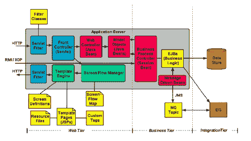
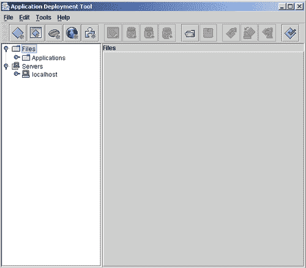

# Enterprise JavaBeans，入门:第 3 部分，Java 宠物商店之旅

> 原文：<https://www.sitepoint.com/primer-3-tour-java-pet-store/>

J2EE 平台是围绕一个为开发分布式多层系统而设计的架构构建的。

正如我们在本系列的[第 1 部分](https://www.sitepoint.com/blog/)和[第 2 部分](https://www.sitepoint.com/blog/)中看到的，这样的系统通常是围绕以下内容实现的:

*   Web 层，通过请求处理和用户界面生成来实现
*   业务层，公开业务逻辑、服务和流程
*   集成层，提供数据访问和企业集成系统(EIS)访问

下图说明了构成典型 J2EE 环境的各种组件。



如图所示，业务层将业务逻辑公开为 Enterprise JavaBean s(EJB)。EJB 架构允许业务逻辑开发人员专注于业务逻辑，将分布式组件基础设施的复杂性留给 EJB 容器。

EJB 架构是 J2EE 编程模型中的焦点。EJB 规范通过以下方式简化了业务逻辑开发人员的工作:

*   展示了开发人员可以用来实现业务逻辑组件的一组全面的 API
*   定义一个分布式容器环境，在该环境中，EJB 的构造、调用、持久化、恢复和退出都无需业务逻辑开发人员的干预

Pet Store 应用程序是分布式环境供应商用来测试和演示其产品特性和性能的典型示例应用程序。这个应用程序演示了如何使用 J2EE 平台的技术，包括 EJB，来开发全功能的企业应用程序。

Pet Store 应用程序是 Sun 提供的企业蓝图的具体体现。蓝图的这个工作示例通过充当大多数典型企业应用程序的完整端到端解决方案的起点，使开发人员能够缩短 J2EE 平台的学习曲线。这里，我们将把注意力集中在宠物店对 EJB 的使用上。首先，我们必须安装所需的环境。

##### 安装宠物店应用程序

Pet Store 应用程序必须在应用服务器环境中运行。参考实现应用服务器可以在[这里](http://java.sun.com/j2ee/sdk_1.3/)下载。宠物店的应用可以在[这里](http://developer.java.sun.com/developer/releases/petstore/)下载。

下载参考实现和 Pet Store 应用程序后，运行参考实现的安装程序，然后解压缩 Pet Store 应用程序，并将其内容提取到所需的目录中。请注意这两种产品的安装目录和任何其他信息。

本文的其余部分将参考实现安装目录称为`<J2EE_HOME>`，将宠物店安装目录称为`<PETSTORE_INSTALL_DIR>`。

从`<PETSTORE_INSTALL_DIR>`的 bin 目录，运行设置脚本。在 UNIX 或 Linux 系统上，打开一个 shell 窗口并键入:

```
cd <PETSTORE_INSTALL_DIR> 

sh setup.sh
```

在 Windows 系统上，打开命令窗口并键入:

```
cd <PETSTORE_INSTALL_DIR> 

setup.bat
```

##### 启动数据库

宠物店需要安装和填充一个数据库。参考实现提供了一个名为 Cloudscape 的免费数据库。在部署 Pet Store 应用程序之前，必须启动 Cloudscape 数据库。在 UNIX 或 Linux 系统上，打开一个 shell 窗口并键入:

```
cd <J2EE_HOME>/bin  

cloudscape -start
```

在 Windows 系统上，打开命令窗口并键入:

```
cd <J2EE_HOME>bin  

cloudscape.bat –start
```

##### 启动应用服务器

现在，您必须启动参考实现提供的应用服务器。这也将启动参考实现提供的 EJB 容器。在 UNIX 或 Linux 系统上，打开一个 shell 窗口并键入:

```
cd <J2EE_HOME>/bin  

j2ee -verbose
```

在 Windows 系统上，打开命令窗口并键入:

```
cd <J2EE_HOME>bin  

j2ee.bat -verbose
```

##### 构建和部署应用程序

一旦安装好了所有的东西，启动了数据库和应用服务器，就必须构建和部署 Pet Store 应用程序。要在 UNIX 或 Linux 系统上构建应用程序，请打开一个 shell 窗口并键入:

```
cd <PETSTORE_INSTALL_DIR>/src/apps/admin/src  

sh build.sh  

cd <PETSTORE_INSTALL_DIR>/src/apps/opc/src  

sh build.sh  

cd <PETSTORE_INSTALL_DIR>/src/apps/petstore/src  

sh build.sh  

cd <PETSTORE_INSTALL_DIR>/src/apps/supplier/src  

sh build.sh
```

在 Windows 系统上，打开命令窗口并键入:

```
cd <PETSTORE_INSTALL_DIR>srcappsadminsrc  

build.bat  

cd <PETSTORE_INSTALL_DIR>srcappsopcsrc  

build.bat  

cd <PETSTORE_INSTALL_DIR>srcappspetstoresrc  

build.bat  

cd <PETSTORE_INSTALL_DIR>srcappssuppliersrc  

build.bat
```

构建应用程序后，您将在以下每个目录中找到一个. ear 文件:

*   `<PETSTORE_INSTALL_DIR>/src/apps/admin/build`
*   `<PETSTORE_INSTALL_DIR>/src/apps/opc/build`
*   `<PETSTORE_INSTALL_DIR>/src/apps/petstore/build`
*   `<PETSTORE_INSTALL_DIR>/src/apps/supplier/build`

现在您必须部署。宠物店应用程序的 ear 文件。您可以使用部署工具来部署。ear 文件。部署应用程序。使用 deploytool 的 ear 文件。在 UNIX 或 Linux 系统上，打开一个 shell 窗口并键入:

```
cd <J2EE_HOME>/bin  

sh deploytool.sh
```

在 Windows 系统上，打开命令窗口并键入:

```
cd <J2EE_HOME>bin  

deploytool.bat
```

部署工具运行后，您将看到一个类似如下的窗口:



在 deploytool 中，为每个选项选择 File -> Open 菜单项。宠物店应用程序的 ear 文件。将在 deploytool 的导航(左侧)窗格中为每个节点创建一个新节点。你打开的 ear 文件。现在，在导航窗格中选择节点，并单击“部署…”菜单项。接受部署向导每个窗格的默认选项，并选择“Next”按钮，直到看到“Finish”按钮。当“完成”按钮出现时，单击它。将出现一个诊断窗口，显示部署过程的进度。部署过程完成后，关闭对话框并打开下一个。ear 文件。

构建和部署应用程序后，您就可以开始使用它了。
运行宠物店应用程序

使用浏览器，转到以下 URL:

http://localhost:8000/petstore

第一次经营宠物店时，您需要在购买之前创建一个新用户。

1.  单击主页上的登录链接。
2.  填写标题为“我想注册一个帐户”的表格，然后单击“创建新帐户”。
3.  输入您的帐户信息，然后单击提交。

##### 下订单

例如，要购买一只斗牛犬，请遵循以下步骤:

1.  在主页上，选择狗。
2.  点击斗牛犬。
3.  在雄性成年斗牛犬所在的行中，单击“添加到购物车”。
4.  单击签出。将出现一个包含您的帐单和运输信息的表单，其中包含预先填写的信息。
5.  单击提交。

当您完成订单时，店面将订单信息异步发送到订单处理中心(OPC)。

##### 使用管理客户端

要运行管理模块，请转到 http://localhost:8000/admin/。启动 administrator，查看“未决订单”和“非未决订单”选项卡。bulldog 订单将是非待定的，因为它少于 500 美元，并且所有低于 500 美元的订单都被自动批准。

##### 使用供应商客户端

供应商及其库存通过一个简单的 Web 界面进行管理。在使用供应商之前，请确保先注销管理客户端。

要管理供应商及其库存，请访问 http://localhost:8000/supplier/。看看周围的存货；单击主屏幕上的显示清单。一张表格显示了库存中每一项的数量。

##### 浅析宠物店的应用

让我们深入了解一下 Pet Store 应用程序的架构，并展示它的结构，这样我们就可以了解它是如何组装的。如果我们能够获得足够的知识和经验，我们也许能够将该应用程序作为一个平台，对 J2EE 进行一些自我导向的学习。

Java Pet Store 演示由以下高级模块组成:

*   首页(店面)是 Web 应用程序的典型用户界面。顾客通过店面订购宠物。
*   订单处理中心(OPC)模块从店面接收订单。
*   供应商模块履行来自 OPC 库存的订单，并向 OPC 开具发票。
*   管理模块在 JFC/Swing 前端提供一个管理员界面。管理员使用管理模块来检查未决订单并批准或拒绝它们。

现在，让我们来看看宠物商店应用程序所使用的 EJB 的类型以及它们所扮演的角色。

***无状态会话豆***

*   `ShoppingClientFacadeLocal`为与购物客户端相关的所有 EJB 提供外观
*   `OrderFulfillmentFacade`由供应商订单 MDB 使用的外观—每次供应商获得采购订单时调用，并且将保存采购订单，尝试履行订单，为发货订单创建发票，以及当采购订单到达时履行订单所需的任何其他活动
*   `AsyncSender`将购物车内容和客户数据转换为代表订单的 XML 消息，并将该消息发送到订单处理中心
*   `OrderProcessingCenterAdminFacade`OPC 用来处理管理客户端请求的外观
*   `ProcessManager`提供查看和修改特定订单工作流程信息的方法
*   `Catalog`提供目录的编程接口
*   `SignOn`创建并验证系统用户
*   `UniqueIdGenerator`创建全局唯一的对象标识符

***有状态会话 bean***

*   `ShoppingController`控制特定客户端会话中发生的所有购物活动
*   `ShoppingClientFacade`充当购物客户端和任何业务逻辑对象之间的中介
*   `ShoppingCart`维护单个用户虚拟购物车的内容

***实体豆***

*   `Inventory`代表给定项目的库存
*   `CreditCard`跟踪卡号、卡类型和到期日期
*   `Address`跟踪两行街道地址、州、邮政编码和国家
*   `ContactInfo`跟踪家庭和名字、电话、电子邮件和地址
*   `LineItem`代表发票中的行项目
*   `PurchaseOrder`代表客户的采购订单
*   `Customer`跟踪客户 ID(主键)、帐户和配置文件
*   `Account`跟踪帐户状态、信用卡和联系信息
*   `Profile`跟踪首选语言、类别、列表首选项和横幅首选项
*   `User`代表可以登录系统的用户；跟踪用户名和密码
*   `Counter`表示具有特定前缀的计数器；仅由`UniqueIdGenerator`用于管理一系列唯一号码
*   `SupplierOrder`代表供应商发送的订单

***消息驱动的豆子***

*   `SupplierOrder`处理来自 Java 宠物商店的`PurchaseOrders`
*   `PurchaseOrder`处理来自 Java 宠物商店的购买订单
*   `Invoice`处理来自供应商的发票
*   `OrderApproval`来自管理员的进程`OrderApprovals`
*   `MailInvoice`处理从供应商处收到的发票
*   `MailOrderApproval`接收订单批准的流程
*   `MailCompletedOrder`处理已完成的订单
*   `Mailer`从邮件服务接收邮件消息
*   `OPCAdminFacade`从 OPC 暴露管理客户端的界面
*   `Manager`提供查看和修改特定经理的登录信息的功能

每个 ejb 的源代码位于每个模块的 src 目录下的 EJB 目录中，如下所示:

*   `<PETSTORE_INSTALL_DIR>/src/apps/opc/src/com/sun/j2ee/blueprints/opc /ejb`
*   `<PETSTORE_INSTALL_DIR>/src/apps/opc/src/com/sun/j2ee/blueprints/opc/admin/ejb`
*   `<PETSTORE_INSTALL_DIR>/src/apps/petstore/src/com/sun/j2ee/blueprints/petstore/controller/ejb`
*   `<PETSTORE_INSTALL_DIR>/src/apps/supplier/src/com/sun/j2ee/blueprints/supplier/inventory/ejb`

浏览每个 EJB 的源代码，注意接口的使用和重用方式。

##### 摘要

Pet Store 应用程序提供了 J2EE 平台的全功能演示，并提供了构建任何典型的 Web 应用程序或分布式应用程序的快速入门。宠物店对 EJB 的广泛使用使业务逻辑开发人员有机会查看多种类型的交互和 EJB 体系结构功能的使用。

## 分享这篇文章