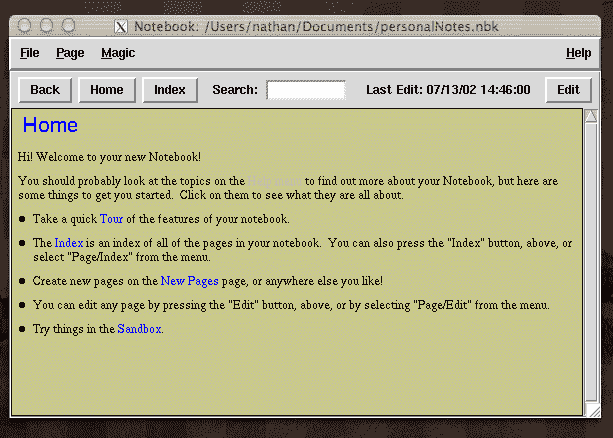

# 什么是维基？文章

> 原文：<https://www.sitepoint.com/what-is-a-wiki/>

****可能工作的最简单的在线数据库。**
*——沃德·坎宁安***

 **不同的人对维基有不同的理解，但是无论你从哪个角度看，维基都是用简单的解决方案处理复杂问题的软件。

坎宁安和[博·勒夫](http://www.leuf.com/)设计了 [WikiWikiWeb](http://c2.com/cgi/wiki) ，1995 年[的第一个 wiki](http://c2.com/cgi/wiki?WikiHistory)，成为一个开放、协作的社区网站[，任何人都可以在这里投稿](http://www.awprofessional.com/catalog/article.asp?product_id={F987EB8F-3240-4BFE-BA8A-76B99DDDD807} )。从那以后，程序员们创造了许多受维基启发的程序和维基网站。大多数都忠于简单的目标。Wikis 可用于多种任务，从个人笔记到在线协作、创建内部知识库、组建在线社区和管理传统网站。这种可能性可能会使维基看起来像一个令人生畏的系统，但是对简单性的承诺使维基工具变得轻而易举。

##### 维基有什么好的？

*   wiki 简化了网站的编辑:wiki 上的每个页面都有一个编辑链接。如果您想更改页面上的某些内容，单击链接，wiki 将显示一个简单的编辑屏幕。当你完成修改后，点击一个按钮提交它们，瞧！您的更改会显示在网站上。
*   维基使用简单的标记:即使对于像我这样的极客来说，考虑 HTML 和格式也会妨碍好的、清晰的写作。Wikis 通过为您编写 HTML 来解决这个问题——您只需要学习一些简单的标记规则。这些规则旨在使 wiki 标记易于被真实的人编写和阅读。
*   维基记录文档历史:如果你犯了错误，不要担心。一个好的维基会保存大量你的页面的旧拷贝，并让你恢复到页面的旧版本。事实上，许多 Wikis 会显示一个比较，称为 diff，它向您显示一段时间以来您对页面所做的确切更改。
*   使用 wiki 创建链接很简单:wiki 将您网站的所有内容存储在一个内部超文本数据库中。维基知道你的每一页和每一个链接。如果你使用 wiki，你不必担心文件的位置或标签的格式。只要给页面命名，维基就会自动为你创建一个链接。
*   使用 wiki 创建新页面很简单:wiki 允许您链接到尚不存在的页面。点击一个指向一个不存在的页面的链接，维基会要求你输入初始内容。如果您提交一些初始内容，wiki 将创建页面。该页面的所有链接(不仅仅是您单击的那个)现在都将指向新创建的页面。
*   wiki 简化了网站组织:由于 wiki 的工作方式类似于超文本数据库，因此您可以随心所欲地组织您的页面。许多内容管理系统要求您在实际创建内容之前规划内容的分类。这可能会有所帮助，但前提是你要传达的内容符合刻板的模式。有了 wiki，如果你愿意，你可以将你的页面组织成不同的类别，但是你也可以尝试其他的事情。许多维基网站的创建者并没有设计网站结构，而是让结构随着内容和内容中的链接一起成长。但你不一定要两者兼得。我在自己的网站上做这三件事。访问者可以通过遵循故事情节、深入层次结构来浏览网站，或者他们可以通过内部链接的自然流动来浏览。没有维基，这样的复杂性将是一场噩梦。现在我使用 wiki，我也发现我的站点结构比我使用模板系统和一组类别时更容易管理。
*   维基记录你所有的东西:因为维基把所有的东西都存储在一个内部超文本数据库中，它知道你所有的链接和页面。所以 wiki 很容易显示返回链接，即链接到当前页面的所有页面的列表。由于 wiki 存储您的文档历史，它还可以列出最近的更改。像[维基百科](http://www.wikipedia.org/)这样的高级维基甚至可以显示链接到当前页面的页面最近更改的列表。
*   许多 wiki 是协作社区:原始 wiki 允许任何人点击编辑按钮并更改网站。虽然这看起来很奇怪，但许多维基人能够成功地做到这一点，而没有恶意破坏方面的重大问题。记住，维基存储了每个页面的历史。对于每一个破坏者，可能有十个人真正需要之前存在的信息，他们会花时间点击按钮并将页面重置为之前的内容。许多维基以不同的方式处理这一挑战。一些完全开放，一些限制访问，一个甚至有一个民主的错误/破坏报告系统。正如我们将要看到的，你如何应对这个挑战取决于你打算用维基做什么。
*   维基鼓励好的超文本:在我最近的文章[中，我写道维基是当今网络上最纯粹的超文本形式。许多 wiki 都有让超文本爱好者流口水的功能，但是这些功能并不是 wiki 成为伟大的超文本工具的真正原因。他们之所以成功，是因为他们让编写超文本变得优雅而简单。有效的维基作者不一定是极客。他们只需要会打字。](https://www.sitepoint.com/blog/)

很难想象一个简单的产品能做我描述的所有事情。那么为什么不自己尝试一下呢？从你自己的电脑开始；你甚至不需要安装网络服务器来玩维基。笔记本(Notebook)就像一个记录笔记和其他想法的个人维基，作为一个常规的计算机应用程序运行，可以在多种操作系统上使用。这对管理你的大脑很有好处。

##### 通过维基管理你的大脑

自 1900 年以来，数据库就一直存在，当时美国政府委托建立了一个机械的人口普查数据库。这台机器的创造者[几年后创立了 IBM](http://www-1.ibm.com/ibm/history/history/decade_1890.html)。但是在[发明关系数据库](http://www-3.ibm.com/software/data/db2/innovation/#1970 )之前，Vannevar Bush 提出了一个更疯狂、更自由的东西:超文本数据库。

“memex 是一种设备，个人在其中存储他所有的书籍、记录和通信，它是机械化的，以便可以以超快的速度和灵活性查阅。这是对他记忆的放大的亲密补充。”

"将两件物品绑在一起的过程是非常重要的."
*——万尼瓦尔·布什，载于[《如我们所想》，大西洋月刊，1945 年](http://www.theatlantic.com/unbound/flashbks/computer/bushf.htm)*

超文本理论是由那些想用它来跟踪自己大脑的人开发的。泰德·纳尔逊受到万尼瓦尔·布什的未来愿景的启发，在试图建立“保存他的每一个想法的笔记程序”时创造了“超文本”一词(《经济学人》大胆的提议，伦敦，1986 年 8 月 23 日)。

正如蒂姆-伯纳斯-李的在线传记所指出的，互联网的诞生也是如此:

“他[蒂姆·伯纳斯·李，1980 年]为自己的私人用途编写了第一个存储信息的程序，包括使用随机联想。这个名为“Enquire”的程序从未发表过，它构成了万维网未来发展的概念基础。

*[——W3.org 蒂姆·伯纳斯·李传](https://www.w3.org/People/Berners-Lee/Longer.html)*

Wikis 可以被认为是超文本数据库的简单接口，可以很好地记录笔记和链接信息。事实上，我第一次接触维基是在研究生院为我父亲做课堂笔记寻找帮助的时候。他选择使用个人维基[笔记本](http://www.wjduquette.com/notebook/index.html)来完成这项工作。

##### 笔记本:个人超文本管理器

虽然不是面向网络出版，但 Notebook 是 wiki 技术如何在其他环境中良好工作的一个完美例子。其作者将其描述为“个人网站”。Notebook 是我的第一个 wiki，我建议你用它来熟悉创建页面、格式化页面和链接页面的技巧。有了笔记本，玩转超文本的可能性是很有趣的。笔记本也是一种严肃的工具；我现在用笔记本来记录研究、想法和待办事项。

笔记本运行在 GNU/Linux、MacOS X、Windows 以及任何其他支持[TCL/TK](http://wiki.tcl.tk/)的平台上。Windows 和 MacOS X 安装轻而易举，只需下载程序并运行即可。在 GNU/Linux 上，事情并不那么顺利。从 1.1 版本开始，Notebook 依赖于 [Starkit 软件包](http://www.equi4.com/starkit.html)，大多数 GNU/Linux 发行版都不包含这个软件包。虽然我不得不在我的 iBook 上编译 Starkit for GNU/Linux，但是安装 Starkit 的[独立 tclKit 二进制](http://www.equi4.com/tclkit.html)要容易得多。

当你运行笔记本时，你会看到一个不可编辑的空白页面。这一开始让我很困惑，直到我阅读了文档。要开始使用笔记本，您需要从“文件”菜单中选择“新建笔记本”。然后会出现一个对话框，提示您输入文件名，这样它就可以创建您的 wiki 文件。

在 Notebook 中，新的 wikis 自动包含帮助信息和一个很棒的教程(您可以稍后在首选项对话框中关闭它)。创建 wiki 文件后，您会看到笔记本的主页:

笔记本，个人维基

Notebook 的旅游功能提供了一个关于如何使用 wiki 的极好的交互式教程。它详细描述了笔记本的许多功能，并指导您有效地使用笔记本。

笔记本的工作方式很像网络浏览器，有一些不错的功能。要关注某个链接，只需点击它。如果你想知道哪些页面链接到你所在的页面，点击标题。笔记本电脑上的“循环”功能与“后退”功能相反。它可以让你跳回主页并循环浏览，沿着你点击“循环”时的路径如果您想在任何时候编辑页面，只需单击“编辑”按钮，笔记本将弹出一个可编辑的页面内容文本框。

与所有维基一样，格式规则比大多数 HTML 更容易，让您专注于您的主要任务:内容创建。与大多数维基不同，Notebook 确实借鉴了 HTML 的一些思想。粗体、斜体、下划线和删除线用类似 HTML 的标签`<b>`、`<i>`、`<u>`和`<x>`标记。

Notebook 格式系统的其余部分与 wikis 的其余部分保持紧密联系。

##### 维基格式化

尽管 HTML 喜欢把你的文字揉成一团，不管这些行是如何分开的，但是在维基格式中，行更重要。要创建一个新段落，只需在段落之间放置一个空行。例如，如果您在编辑窗口中键入以下文本…

`In another moment down went Alice after it, never once
considering how in the world she was to get out again.`

`The rabbit-hole went straight on like a tunnel for some way,
and then dipped suddenly down, so suddenly that Alice had not a
moment to think about stopping herself before she found herself
falling down a very deep well.`

…这在维基中显示为:

”过了一会儿，爱丽丝跟在它后面下去了，从来没有想过她究竟怎样才能出去。

兔子洞笔直地向前延伸，像一条隧道，然后突然向下倾斜，如此突然以至于爱丽丝在发现自己掉进一口很深的井之前没有时间考虑停下来。"

正如你所看到的，空白对于段落的流动很重要，但是你在哪里结束你的行对于笔记本来说并不重要。Wiki 格式的简单性也体现在项目列表的创建上。

##### 在 Wiki 中创建链接和页面

当创建链接和页面时，Notebook 的工作方式就像 wiki 一样，只是它是离线工作的。要链接到该页面，只需将页面标题放在括号中。这使得 wiki 标记非常易读:

`The [rabbit-hole] went straight on like a [tunnel] for some way,
and then dipped suddenly down, so suddenly that [Alice] had not a
moment to think about stopping herself before she found herself
falling down a very deep [well].`

在前面的例子中，单词“兔子洞”将链接到标题为“兔子洞”的页面，“隧道”将链接到标题为“隧道”的页面，等等。许多在线维基，如[维基百科](http://www.wikipedia.org/)，也支持链接格式的扩展版本。扩展版本(`[[pagename text]]`)允许编辑者指定链接文本。这里有一个例子:

`The [[rabbit-hole]] went straight on like a [[rabbit-hole tunnel]] for some way,
and then dipped suddenly down, so suddenly that [[characterlist Alice]] had not a
moment to think about stopping herself before she found herself
falling down a very deep [[rabbit-hole well]].`

在这种情况下，单词“兔子洞”、“隧道”和“井”都指向“兔子洞”页面，这是正确的。都是指兔子洞。单词“Alice”现在链接到一个中心字符列表。Notebook 不支持的扩展标记在其他 wikis 上很方便。

最初的维基使用一种不同的方法来链接页面，称为 [JoinCapitalizedWords](http://c2.com/cgi/wiki?JoinCapitalizedWords) 或 [CamelCase](http://www.usemod.com/cgi-bin/mb.pl?CamelCase) ，并且仍然在许多维基中使用。这消除了对括号的需要，但是阅读有许多 JoinCapitalizedWords 的页面会很累。

如果您创建了一个链接，而该页面尚不存在，单击该链接将自动创建该页面，并为新页面打开一个编辑窗口。当您单击指向不存在的页面的链接时，笔记本中会发生以下情况:

点击不存在页面的链接，在笔记本中创建新页面

由于它是一个离线应用程序，Notebook 还拥有许多普通维基中没有的高级功能，例如可嵌入的 TCL 代码，可以从其他页面收集信息，执行统计分析，或自动生成信息。这些“神奇”的特性也允许用户创建方便的插件。

不幸的是，笔记本还不能发布到在线维基。如果你想要这个功能，你可以试试 Tcl'ers Wiki 的 [WiKit](http://mini.net/tcl/1) 。它支持网络接口和类似于笔记本的独立于操作系统的客户端应用程序。虽然 Tcl'ers wiki 的客户端应用程序不如 Notebook 好，但它可以发布到在线 Wiki，这使它成为一个非常有用的 Wiki 接口应用程序。

笔记本是一个很好的记录笔记、想法和其他信息的应用程序。我的父亲并不特别讨厌，他用它来记录他的研究生笔记。但是当你把它们放到网上时，维基是最强大的。

##### 作为网络社区软件的维基

沃德·坎宁安和 T2【博·勒夫设计了[第一个维基](http://c2.com/cgi/wiki)，因为他们想让他们的超文本数据库协同工作。

从一开始，他们就决定任何人都应该能够从一个简单的 Web 表单中编辑任何页面。虽然这可能会招致恶意破坏，但他们通过存储每个文档的历史克服了这个问题。如果破坏行为确实发生，任何人都可以将网站恢复到破坏前的状态。

使网站易于编辑有很多好处。首先，它鼓励许多人一起参与创建网站，这就是为什么[wiki 会成为伟大的知识库](http://mini.net/tcl/)。在公共和内部网站上，维基允许作者和编辑直接访问网站，减轻了 IT 人员的负担。以下是一些公共维基知识库的列表:

*   维基百科:一个广泛的在线百科全书。维基百科是最大的知识库之一。它现在隶属于一个非盈利组织，T2 维基媒体基金会。维基百科是一个很好的例子，它保持非常专业，非常专注于它的专业目标，即使贡献者是来自世界各地的随机志愿者。它有许多非常有趣的特点。维基百科:/
    *   [民主处理破坏行为](http://en.wikipedia.org/wiki/Wikipedia:Vandalism_in_progress)
    *   [列出对当前页面相关文档的所有更改](http://en.wikipedia.org/wiki/Talk:Philosophy)
    *   [列出注册用户的贡献](http://en.wikipedia.org/wiki/User:Jtdirl)
*   Tcl'ers Wiki: 关于 Tcl 编程语言的一站式商店。这也是一个可公开编辑的维基，设法提供了大量令人兴奋的有用信息。然而，它比维基百科更有社区的感觉。维基的这种更加悠闲的风格丝毫没有降低其内容的质量。他们的“欢迎访客”页面让[很好地洞察了](http://mini.net/tcl/31)Tcl ' ers Wiki 的特别之处。
*   Emacs Wiki: 和 Tcl’ers Wiki 一样，Emacs Wiki 面向特定软件的用户。在 Emacs Wiki 上，Emacs 的用户可以互相交换想法、文档和插件代码。虽然本质上很严肃，但 Emacs Wiki 也建立了一个享受[一点幽默](http://www.emacswiki.org/cgi-bin/wiki.pl/CategoryHumor)的社区。

许多公司和大学使用 wiki 软件创建内部知识库，连接他们的员工/学生，并为员工/学生提供一个分享想法和集思广益的场所:

*   [英国电信:](http://twiki.org/cgi-bin/view/Main/TWikiSuccessStoryOfBritishTelecommunications)英国电信在内部维护了大量维基来帮助员工协作。他们还建立了 [TWiki](http://www.twiki.org/) 作为[的 B2B 网站](http://www.telcob2b.org.uk/)来提供关于信息标准的文档并促进与客户的讨论。
*   [美国科罗拉多州立大学:](https://home.cs.colorado.edu/phpwiki/)为学生维护大量常见问题。如果有人遇到并解决了一个问题，他们可以轻松地发布解决方案。IT 人员只需要一个浏览器来编辑页面。这个 wiki 为大学节省了时间和金钱，因为他们不需要专门的软件来维护内部计算机服务网站。
*   许多顶级公司都使用 TWiki 来联系员工和管理信息。[迪士尼](http://twiki.org/cgi-bin/view/Main/TWikiSuccessStoryOfDisney)、[摩托罗拉](http://twiki.org/cgi-bin/view/Main/TWikiSuccessStoryOfMotorola)、 [SAP](http://twiki.org/cgi-bin/view/Main/TWikiSuccessStoryOfSAP) 、 [Secure Works](http://twiki.org/cgi-bin/view/Main/TWikiSuccessStoryOfSecureWorks) 、[风河](http://twiki.org/cgi-bin/view/Main/TWikiSuccessStoryOfWindRiver)都用 TWiki。TWiki 甚至在[Hammarskjold Information](http://twiki.org/cgi-bin/view/Main/TWikiSuccessStoryOfMagazinePublishing)的一个关键任务中被用来管理双月刊杂志的创建。更多[成功案例](http://twiki.org/cgi-bin/view/Main/TWikiSuccessStories)可在 TWiki 网站上获得。

维基也是很棒的社区网站。许多 wiki 软件包允许用户注册用户名，为某个特定的人所做的所有改变提供一张面孔。肉丸维基是这类在线社区的中心。来自世界各地的维基人使用肉丸维基来聚集在一起，把他们的维基互相连接起来。肉丸维基成员甚至为维基们创造了一个聪明、有创意的[旅游巴士之旅。另一个很棒的社区维基是](http://www.usemod.com/cgi-bin/mb.pl?TourBus ) [GreenCheese](http://www.greencheese.org/FrontPage) ，这是一个致力于幽默写作的维基。更多想法可以在[实用维基应用常见问题解答](http://www.c2.com/cgi/wiki?PracticalWikiApplications)中找到。一位作者使用 wiki[与其他几位作者](http://www.c2.com/cgi/wiki?VlissidesOnBeck)合作，在三天内写了一本 120 页的书(阅读底部)。创建社区维基时，要有创意！

##### 选择维基软件

我特意把这个讨论留到现在，因为有这么多不同的软件可供使用。以下是我尝试过的一些程序:

*   [Wiki Wiki Web](http://www.c2.com/cgi/wiki?WikiWikiWeb) *(很好听)*:原来的 Wiki，这个很朴素简单。WikiWikiWeb 是用 Perl 编写的，不需要您的 Web 主机上的特殊数据库功能。这个 wiki 的一个很大的特点是能够自动生成与周围页面相互链接的的[地图。你可以从](http://www.c2.com/cgi/tour?w2.d3/WelcomeVisitors )[运行你自己的 Wiki FAQ](http://www.c2.com/cgi/wiki?RunningYourOwnWikiFaq) 和 [WikiBase](http://www.c2.com/cgi/wiki?WikiBase) 页面获得 WikiWikiWeb。
*   [UseMod](http://www.usemod.com/cgi-bin/wiki.pl?UseModWiki) *(简单，优秀)*:一个非常易于安装的 Wiki——整个程序只是一个 Perl 脚本。虽然将整个 Web 应用程序放在一个脚本中似乎有些过分，但是 UseMod 非常紧凑，而且非常强大。[肉丸维基](http://www.usemod.com/cgi-bin/mb.pl?MeatballWiki)使用了 UseMod。通过一个方便的配置文件进行配置。UseMod 有许多[功能](http://www.usemod.com/cgi-bin/wiki.pl?UseModWiki/Features)，包括一个 [RSS feed](http://www.usemod.com/cgi-bin/wiki.pl?UseModWiki/NewFeatures) ，但它设法保持简单易用。UseMod 包含了尽可能多的可以在网络上简单实现的纯超文本概念，包括包含来自其他页面的维基内容的便利能力，这种技术被称为 [Transclusion](http://www.usemod.com/cgi-bin/mb.pl?TransClusion) 。
*   *【TWiki】*(许多功能，但有些混乱):我建立的最复杂的维基。Twiki 很棒，因为它有如此多的功能，但同时，惊人的功能数量也让它感到困惑。如果你有很多时间，Twiki 是非常值得的；如果你不这样做，你很可能会迷路。Twiki 经常被公司和工作组使用，因为它有权限系统、分类功能，甚至待办事项列表上的进度条。Twiki 也是用 Perl 编写的；你可以从 Twiki 的[发布页面](http://twiki.org/cgi-bin/view/Codev/TWikiReleases)下载。
*   [莫因莫因](http://moin.sourceforge.net/) *(非常好，如果你有 Python 的话)*:一个设置简单，功能强大的维基，如果你的网络主机有 [Python 支持](http://www.python.org/)。MoinMoin 也有用户管理支持。 [MoinMoin Wiki](http://twistedmatrix.com/users/jh.twistd/moin/moin.cgi/) 在[安装文档](http://twistedmatrix.com/users/jh.twistd/moin/moin.cgi/MoinMoin_2fInstallDocs)页面上有更多关于安装 MoinMoin 的信息。
*   [PHP Wiki](http://phpwiki.sourceforge.net/) *(不错，如果你有数据库服务器，但是很复杂)*:如果你想要一个 PHP Wiki，那么 PHP Wiki 可能就是你想要的。它需要像 MySQL 或 PostgreSQL 这样的基于 SQL 的关系数据库服务器来运行。它有许多功能，包括用户认证。像 TWiki 一样，PHP Wiki 有许多特性，如果你只是想要一个简单的 Wiki，它可能看起来有点复杂。与大多数 Wiki 不同，PHP Wiki 有模板支持。模板很难创建，需要很好地理解 PHP 面向对象编程。
*   [PHP Wiki 处理器](http://www.net-assistant.de/wiki/static/StartPage.html) *(我能说什么呢？我用它！)*:为什么不用维基作为常规的内容管理系统呢？我决定尝试一下，并且对结果非常满意。PHP Wiki 处理器跟踪我网站上的页面和链接。因为这是我的个人网站，我想成为唯一的创建者——例如，我不能让任何人修改我的简历。所以我设置了 PHP Wiki 处理器来从我所有的 Wiki 页面生成一组静态 PHP 页面。我仍然可以通过安全连接在线编辑我的页面，但我决定谁可以更改网站上的内容。当我加载网站时，我看到一个管理维基界面。其他人看到的只是一个网站，这就是我想要的。PHP Wiki 处理器具有简单易用的模板支持，我可以轻松地转移我以前的网站页眉和页脚。我的 PHP 知识确实有所帮助，因为我倾向于无休止地修改东西。然而，要有效地使用 PHP Wiki 处理器，并不一定要有全面的 PHP 知识。

##### 结论

维基是伟大的超文本工具，让一个人或一群人轻松管理内容。它们被用来创建静态网站，管理在线社区，将企业与客户联系起来，甚至撰写杂志和书籍。请记住，维基是“可能工作的最简单的在线数据库。”可能性是无限的！** 

## **分享这篇文章**