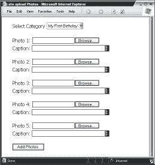
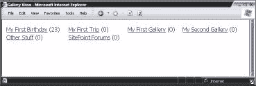
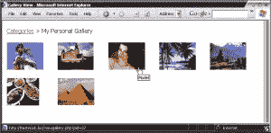
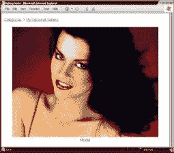

# 在几分钟内建立一个自动化的 PHP 图库系统

> 原文：<https://www.sitepoint.com/php-gallery-system-minutes/>

无论你拥有一家企业还是一个个人网站，你都会使用 html 图片网页来展示你的产品，或者与朋友分享你上次度假的照片；无论是哪种情况，构建这些网页都需要大量的手工工作。如果你尝试过为每张照片分别制作缩略图，然后为它们维护单独页面的艰苦过程，你就会完全明白我的意思。

在本文中，我们将构建一个简单而有效的图库系统，易于维护和更新。我们将使用 PHP 和 MySQL，在 GD 或 ImageMagick 的帮助下构建这个自动化图库系统。本文的重点是介绍文件上传的概念，并利用它来构建一个自动图库系统；因此，我假设你有 PHP 编码的基础知识。

##### 入门指南

任何像样的画廊系统都应该有两个主要功能:

1.  基于类别的图像列表
2.  基于浏览器的图像上传系统

除此之外，我们需要的另一个功能，以自动化这个画廊系统是能够建立自动缩略图，一旦图像上传。为了实现这一点，我们将使用 GD 或 ImageMagick——您的服务器上可用的任何一个。通常情况下，GD 与 PHP 本身捆绑在一起，但不同版本的功能不同。例如，GD 2 . x . x 之前的版本最多只能支持 256 色图像的创建。这个限制在 ImageMagick 中不存在，在 GD 的更高版本中也不存在。要识别您拥有的 GD 版本，您可以使用函数 phpinfo()列出所有已安装的 DLL 及其版本详细信息。

下面是一个简单的程序，我们将使用它来建立画廊:

*   设计数据库模式(使用相同的结构，您也可以使用平面文件)
*   构建基于浏览器的上传系统
    *   表格内的索引
    *   存储文件
    *   构建自动缩略图
*   查看类别及其图像

##### 设计数据库模式

在本文中，我将使用 MySql 数据库的例子，但是，如果您希望使用平面文件，您可以使用类似的结构来实现相同的输出。我们将把图库中的每张图片归入特定的类别；为此，我们需要一个单独的表来列出所有类别，以及一个单独的表来列出上传图像的条目。

类别表:姑且称之为`gallery_category`。


图像表:我们把它命名为`gallery_photos`。


以下是这两个表的 MySql 查询:

```
CREATE TABLE gallery_category ( 
  category_id bigint(20) unsigned NOT NULL auto_increment, 
  category_name varchar(50) NOT NULL default '0', 
  PRIMARY KEY  (category_id), 
  KEY category_id (category_id) 
) TYPE=MyISAM; 

CREATE TABLE gallery_photos ( 
  photo_id bigint(20) unsigned NOT NULL auto_increment, 
  photo_filename varchar(25), 
  photo_caption text, 
  photo_category bigint(20) unsigned NOT NULL default '0', 
  PRIMARY KEY  (photo_id), 
  KEY photo_id (photo_id) 
) TYPE=MyISAM;
```

您可以使用简单的`INSERT`查询将初始记录添加到类别表中，例如:

```
INSERT INTO gallery_category(`category_name`) VALUES('My First Gallery');
```

在上传图像之前，我们需要一个目录来存储它们。因此，我们新建一个目录，命名为“photos”(对于*nix 服务器，使用 chmod 设置该目录的写权限，例如 777)。

现在，让我们构建我们的第一个脚本。这个脚本将作为我们的数据库连接文件，并将保存我们将存储上传图像的目录的名称。在下面的代码中，您会注意到目录的名称被定义为变量$images_dir。如果您希望将存储目录命名为其他名称，请确保在代码中反映出来。

我们把这个脚本命名为“config.inc.php”。

```
<?php 

  $mysql_link = mysql_connect('localhost', 'root', 'root'); 
  mysql_select_db('sitepoint') or die('Could not select database'); 

  $images_dir = 'photos'; 

?>
```

上面的代码还与名为“sitepoint”的 MySql 数据库建立了连接。在实现这段代码之前，您应该插入自己的用户名、密码和数据库名称值。

##### 基于浏览器的上传系统

对于我们上传的每个图像，我们需要两个基本的输入字段:一个存储图像的文件名，另一个存储图像的标题。为了简化问题，我们希望一次上传多张图片，而不是一张一张地上传。我们现在要构建的代码必须能够按照管理员的指示生成任意数量的字段。这将消除大量手工工作，否则将需要添加额外的表单字段。

让我们构建一个自动上传表单。我们将其命名为“preupload.php”。

```
<?php  
  include 'config.inc.php';  

  // initialization  
  $photo_upload_fields = '';  
  $counter = 1;  

  // If we want more fields, then use, preupload.php?number_of_fields=20  
  $number_of_fields = (isset($_GET['number_of_fields'])) ?  
    (int)($_GET['number_of_fields']) : 5;  

  // Firstly Lets build the Category List  
  $result = mysql_query('SELECT category_id,category_name FROM gallery_category');  
  while($row = mysql_fetch_array($result)) {  
    $photo_category_list .= <<<__HTML_END  
<option value="$row[0]">$row[1]</option>n  
__HTML_END;  
  }  
  mysql_free_result( $result );    

  // Lets build the Image Uploading fields  
  while($counter <= $number_of_fields) {  
    $photo_upload_fields .= <<<__HTML_END  
<tr><td>  
  Photo {$counter}:  
  <input name="photo_filename[]"  
type="file" />  
</td></tr>  
<tr><td>  
  Caption:  
  <textarea name="photo_caption[]" cols="30"  
    rows="1"></textarea>  
</td></tr>  
__HTML_END;  
    $counter++;  
  }  

  // Final Output  
  echo <<<__HTML_END  
<html>  
<head>  
<title>Lets upload Photos</title>  
</head>  
<body>  
<form enctype="multipart/form-data"  
  action="upload.php" method="post"  
  name="upload_form">  
  <table width="90%" border="0"  
    align="center" style="width: 90%;">  
    <tr><td>  
      Select Category  
      <select name="category">  
      $photo_category_list  
      </select>  
    </td></tr>  
    <! - Insert the image fields here -->  
    $photo_upload_fields  
    <tr><td>  
      <input type="submit" name="submit"  
        value="Add Photos" />  
    </td></tr>  
  </table>  
</form>  
</body>  
</html>  
__HTML_END;  
?>
```



上面的代码产生了一个非常简单的 html 表单；然而，有几件事需要注意。

***`enctype``<form>`***中的属性

通过将`enctype`属性的值指定为`"multipart/form-data"`，每个图像的内容将被打包，以便在多部分文档的单独部分中提交。这个文档将被发送到目标脚本，在我们的例子中是`upload.php`。

***添加额外字段***

字段数量的默认值设置为 5，但是您可能需要一次上传更多文件。这可以使用上面的代码来实现，它允许我们通过 GET 方法指定字段的数量。例如，如果您想要 25 个字段，您可以简单地插入行`preupload.php?number_of_fields=25`。

注意:在您的`php.ini`文件中，您必须关闭`safe_mode`，并将`file_uploads`属性设置为允许上传。运行`phpinfo()`查看您当前的设置。

##### 真实的部分:upload.php

我们现在将构建`upload.php`，它被用作上述预上传表单的目标。大多数神奇的事情都发生在这一页！

1.  我们会变聪明，检查上传的文件是否确实是一个图像
2.  我们将对数据库中的图像条目进行索引
3.  我们将存储上传的图像
4.  最后，我们将创建自动缩略图

每当我们上传任何文件时，PHP 都会创建一个名为`$_FILES`的源数组。在开始处理上传的文件之前，我们需要获取一些关于这些图像的信息。该数组包含任何上传文件的以下详细信息:

*   真实文件名，例如 my_birthday.jpg
*   文件的 mime 类型，例如 image/pjpeg
*   文件在服务器上的临时位置
*   文件的大小(字节)

我们将创建自己的数组来获取这些值。让我们借此机会获取图像的标题，并将它们分配给一个数组。

```
// Fetch the image array sent by preupload.php  

$photos_uploaded = $_FILES['photo_filename'];  

// Fetch the image caption array  

$photo_captions = $_POST['photo_captions'];
```

***上传的文件是真实图像吗？***

我们如何检查以确保上传的文件实际上是一个图像？每次我们上传一个文件，PHP 都会生成一个数组，包含上传文件的细节，包括它的 mime 类型。因此，要使文件成为真实的图像，它应该与已知的图像 mime 类型之一相匹配。例如，为了检查图像是 jpeg、gif、bmp 还是 png，我们将比较获取的 mime 类型值和已知的图像类型。我们在下面的列表中列出了其中的一些:

```
$photo_types = array(    
  'image/pjpeg' => 'jpg',   
  'image/jpeg' => 'jpg',   
  'image/gif' => 'gif',   
  'image/bmp' => 'bmp',   
  'image/x-png' => 'png'   
);
```

上面的数组包含我们的图库将接受的可能图像类型的列表，以及对应于这些文件类型的扩展名列表。在将文件存储到库中之前，将在重命名文件时使用这些扩展名。重命名文件消除了覆盖与新上传文件同名的现有文件的可能性。它还允许我们为特定图像类型的文件添加正确的扩展名，但扩展名不正确或缺失。

例如，如果有人上传扩展名为`jpg`的 GIF 图像，我们将使用正确的`.gif`扩展名存储该图像。有人可能会质疑这种验证的必要性，但话又说回来，稍微谨慎一点没有错——尤其是如果你打算允许公众提交到你的画廊。

下面的代码执行两个功能:

1.  如果上传的文件大小不超过 0 字节，则拒绝上传的文件；这些条目通常来自预上传表单中留空的字段。
2.  更重要的是，它从`photo_types`数组中验证文件的类型。

```
while($counter <= count($photos_uploaded)) {   
  if($photos_uploaded['size'][$counter] > 0) {   
    if(!array_key_exists($photos_uploaded['type'][$counter], $photo_types)) {   
      $result_final .= 'File ' . ($counter + 1) .   
        ' is not a photo<br />';   
    } else {   
      // Great the file is an image, we will add this file   
    }   
  }   
}
```

需要重复解析数组`photos_uploaded`来索引所有上传的文件。

***表中的索引***

一旦我们收到上传图像的有效信息，我们必须在我们的表中对其进行索引。这将为图像生成一个唯一的 ID，在此基础上，我们将生成一个新的名称来保存文件。在我们向表中添加新条目之前，我们不知道新的文件名可能是什么。因此，我们将使用初始查询添加一个新记录，该记录带有一个虚拟文件名，稍后将被更新为正确的文件名。

下面的代码将新条目添加到`gallery_photo`表中，并获取一个唯一的 ID:

```
mysql_query("   
  INSERT INTO gallery_photos (   
    photo_filename,   
    photo_caption,   
    photo_category   
  ) VALUES (   
    '0',   
    '" . $photo_captions[$counter]) . "',   
    '" . $_POST['category'] . "'   
  )   
");   

$new_id = mysql_insert_id(); // New Id generated
```

我们现在可以生成新的文件名:

```
// Get the filetype of the uploaded file   
$filetype = $photos_uploaded['type'][$counter];    

// Get the extension for the new name   
$extension = $known_photo_types[$filetype];    

// Generate a new name   
$filename = "$new_id.$extension";    

// let's update the filename now   
mysql_query("   
  UPDATE gallery_photos SET   
    photo_filename = '$filename'   
  WHERE photo_id = '$new_id'   
");
```

使用的命名约定是`new_id.extension`。

到目前为止，我们已经检查了图像的有效性，为图像生成了唯一的名称，并将其添加到数据库中。

***存储图像***

是时候将上传的图像存储到我们之前创建的目录中了。我们将使用复制功能将图像从其临时位置复制到我们的照片目录中。

```
copy($photos_uploaded['tmp_name'][$counter],    
  $images_dir . '/' . $filename);
```

我们也可以使用 PHP 4 特有的函数:

```
move_uploaded_file($photos_uploaded['tmp_name'][$counter],    
  $images_dir . '/' . $filename);
```

上面代码中需要注意的重要一点是`$photos_uploaded['tmp_name'][$counter]`。如前所述，PHP 为我们提供了上传文件的临时位置；键`tmp_name`保存该值。

##### 自动缩略图

现在最有趣的部分来了:构建自动缩略图。为了构建这些缩略图，我们需要一个图像处理程序，例如图形开发(GD)库、ImageMagick 或 NetPbm，所有这些都可以免费在线获得。

在构建缩略图之前，我们需要确定图像的尺寸。为了确保我们创建成比例的缩略图，我们将所有图像分为两大类:

1.  宽图像，宽度大于高度
2.  高图像，高度大于宽度

现在我们需要找出上传的图像是宽的还是高的。为此，我们使用`GetImageSize`函数获取上传图像的尺寸，使用这些值，我们决定缩略图的适当大小:

```
$size = GetImageSize($images_dir . "/" . $filename);    

// Wide Image    
if($size[0] > $size[1])    
{     
 $thumbnail_width = 100;     
 $thumbnail_height = (int)(100 * $size[1] / $size[0]);     
}     

// Tall Image    
else    
{    
  $thumbnail_width = (int)(100 * $size[0] / $size[1]);    
  $thumbnail_height = 100;    
}
```

这里，我们使用原始图像尺寸的纵横比来计算缩略图的大小。我已经根据原始图像的大小，将缩略图的宽度或高度预设为 100 像素。

用于计算长宽比的公式如下。

对于宽图像:

```
$thumbnail_width = <Preset Width>     
$thumbnail_height = <Preset Width> * <height_dimension_of_original_image> /     
                   <width_dimension_of_original_image>
```

对于高个子图像:

```
$thumbnail_width = <Preset Height> * <width_dimension_of_original_image> /    
                         <height_dimension_of_original_image>    
$thumbnail_height = <Preset Height>
```

##### 使用 ImageMagick

ImageMagick 是一组工具，允许我们使用命令行参数创建和操作图像。ImageMagick 支持一系列图像格式，包括 JPEG、GIF、BMP、PNG、TIFF 等。所有流行操作系统的二进制文件都有，可以从 www.ImageMagick.org 下载。

在使用 ImageMagick 之前，您需要知道它在服务器上的绝对位置路径:

```
$imagemagickPath = "/usr/local/bin";
```

为了创建缩略图，我们使用 ImageMagick 的 convert 实用程序来调整原始图像的大小，从而指示它修改其几何形状。以下代码使用命令行参数向 ImageMagick 发送值:

```
exec("$imagemagickPath/convert -geometry " .    
  "{$thumbnail_width}x{$thumbnail_height} " .    
  "$images_dir/$filename $images_dir/tb_$filename");
```

convert 实用程序需要以下格式的参数:

```
convert –geometry <width>x<height> <source_path> <destination_path>
```

这里，`<source_path>`是原始上传文件的路径，`<desitnation_path>`是要创建缩略图的路径。缩略图的命名约定是“`tb_filename.extension`”。

或者，您也可以结合使用 Perl 和 PerlMagick 来与 ImageMagick 通信。

##### 使用 GD 库

图形开发库或 GD 库也为我们提供了创建和修改图像的能力。它支持 JPEG，BMP 和 PNG 的标准格式；虽然 GD 的一些版本也支持 GIF 和 TIFF。GD 库的最新版本可以从[www.Boutell.com/gd](http://www.Boutell.com/gd)下载。

PHP 为我们提供了特定于 GD 的函数，用于创建和修改特定类型的图像。因此，在为上传的图像创建缩略图之前，我们需要准确地找出要使用的功能。

要制作这些缩略图，我们需要:

1.  创建一个图像句柄来读取上传的图像
2.  创建另一个将用于创建缩略图的图像句柄
3.  通过手柄调整原始图像的大小
4.  用缩略图手柄保存调整大小的图像

步骤 1 和 4 中所需的函数是图像类型相关的，并且它们的命名约定使得它们易于识别，例如 ImageJPEG、ImageGIF。每个函数名中的后缀对应于该函数可以处理的图像类型。下面的数组列出了我们将用来调用这些特定函数的后缀:

```
$gd_function_suffix = array(      
  'image/pjpeg' => 'JPEG',     
  'image/jpeg' => 'JPEG',     
  'image/gif' => 'GIF',     
  'image/bmp' => 'WBMP',     
  'image/x-png' => 'PNG'     
);
```

为了调用 ImageJPEG，我们将在调用它之前动态创建它的名称:

```
// Get the Name Suffix on basis of the mime type     
$function_suffix = $gd_function_suffix[$filetype];     

// Build Function name for ImageCreateFromSUFFIX     
$function_to_read = 'ImageCreateFrom' . $function_suffix;     

// Build Function name for ImageSUFFIX     
$function_to_write = 'Image' . $function_suffix;
```

在上传 JPEG 文件的情况下，上述代码将为变量分配以下值:

*   `$function_to_read => ImageCreateFromJPEG`
*   `$function_to_write => ImageJPEG`

***版本 1.x.x***

1.x.x 版本有其局限性；它最多只能创建 256 色的新图像。因此，在整理上面给出的代码片段时，我们将使用 GD 1.x.x 特定的调整大小函数。这些功能是:

*   `ImageCreate`
*   `ImageCopyResized`

**用 GD 1.x.x 调整大小**

```
$function_suffix = $gd_function_suffix[$filetype];     
$function_to_read = 'ImageCreateFrom' . $function_suffix;     
$function_to_write = 'Image' . $function_suffix;     

// Read the source file     
$source_handle = $function_to_read($images_dir . '/' . $filename );      

if ($source_handle) {     
  // Let's create a blank image for the thumbnail     
  $destination_handle = ImageCreate($thumbnail_width, $thumbnail_height);     

  // Now we resize it     
  ImageCopyResized($destination_handle, $source_handle,     
    0, 0, 0, 0, $thumbnail_width, $thumbnail_height,     
    $size[0], $size[1]);     
}     

// Let's save the thumbnail     

$function_to_write($destination_handle, $images_dir . '/tb_' . $filename);     
ImageDestroy($destination_handle);
```

上面代码中最有趣的地方是如何使用`ImageCopyResized`函数调整图像的大小。该函数需要 10 个参数；我来一一列举:

*   `$destination_handle`保存我们创建的空白图像的信息，相当于缩略图的大小。
*   `$source_handle`保存与源文件相关的信息，即最初上传的图像。
*   参数 3 到 6 保存了调整图像大小的起始坐标。因为我们需要一个缩略图，而缩略图只是一个全尺寸图像的缩小版，所以我们使用 0，0 作为起始坐标。
*   参数 7 和 8 保存目标图像的尺寸，也就是我们例子中缩略图的尺寸。
*   参数 9 和 10 保存源图像的尺寸，在我们的例子中是原始图像的尺寸。

***版本 2.x.x***

版本 2.x.x 并不局限于使用 256 种颜色，但是所采用的过程与针对版本 1.x.x 代码描述的过程并没有太大的不同。只是在这里，我们必须使用 GD 2.x.x 特定的调整大小函数来代替。这些功能是:

*   `ImageCreateTrueColor`
*   `ImageCopyResampled`

**用 GD 2.x.x 调整大小**

```
$function_suffix = $gd_function_suffix[$filetype];     
$function_to_read = 'ImageCreateFrom' . $function_suffix;     
$function_to_write = 'Image' . $function_suffix;     

// Read the source file     
$source_handle = $function_to_read($images_dir . '/' . $filename);     

if ($source_handle) {     
  // Let's create a blank image for the thumbnail     
  $destination_handle =     
    ImageCreateTrueColor($thumbnail_width, $thumbnail_height);     

  // Now we resize it     
  ImageCopyResampled($destination_handle, $source_handle,     
    0, 0, 0, 0, $thumbnail_width, $thumbnail_height, $size[0], $size[1]);     
}     

// Let's save the thumbnail     
$function_to_write($destination_handle, $images_dir . '/tb_' . $filename);
```

除了使用的两个不同的函数之外，所有内容都与 1.x.x 版代码相同:

*   我们用`ImageCreateTrueColor`代替了`ImageCreate`。
*   我们用`ImageCopyResampled`代替了`ImageCopyResized`。

你可以在[www.php.net/gd](http://www.php.net/gd)阅读 PHP 手册中更多关于 GD 函数的内容。

现在，把所有这些放在一起，你就会得到`upload.php`。该文件是[档案的一部分，你可以在这里](https://www.sitepoint.com/examples/phpgallery/program_code.zip)下载。

##### 查看类别列表及其图片

现在我们已经成功上传了我们的图片，并创建了它们的自动缩略图，我们到了展示的部分。我们需要一个系统来显示我们的类别和这些类别中的图像列表。首先，让我们将我们的新脚本命名为`viewgallery.php`。使用这个脚本，我们将能够显示 3 种类型的屏幕:

1.  类别列表
2.  类别的缩略图列表
3.  全尺寸图像

因此，我们需要将这个脚本分为 3 个部分:

1.  当没有输入时，我们显示类别列表
2.  当类别 id 作为单个输入时，我们会显示该类别的缩略图
3.  当我们将图像 id 和类别 id 作为输入时，我们显示全尺寸的图像

***画面一:类别列表***

为了显示类别列表，我们需要构建一个系统，为任意数量的类别自动创建 html 行。

下面的代码执行非常简单的任务。我们简单地列出了数据库中所有当前的类别，以及它们所包含的图像数量。使用这段代码，我们可以控制出现在给定行中的类别链接的数量。存储在`$number_of_categories_in_row`中的值允许我们实现这一点。

程序是:

1.  获取所有类别的列表，以及每个类别包含的图片数量
2.  由数值控制的行中的链接数量被分配给`$number_of_categories_in_row`
3.  通过表格创建显示

```
if(empty($cid) && empty($pid)) {      
  $number_of_categories_in_row = 4;      

  $result = mysql_query("      
    SELECT      
      c.category_id,      
      c.category_name,      
      COUNT(photo_id)      
    FROM      
      gallery_category AS c LEFT JOIN      
      gallery_photos AS p ON      
      p.photo_category = c.category_id      
    GROUP BY c.category_id      
  ");      
  while ($row = mysql_fetch_array($result)) {      
    $result_array[] =      
      '<a href="viewgallery.php?cid=' . $row[0] . '">' .      
      $row[1] . '</a> (' . $row[2] . ')';      
  }      
  mysql_free_result($result);      

  $result_final = '<tr>n';      
  foreach ($result_array as $category_link) {      
    if ($counter == $number_of_categories_in_row) {      
      $counter = 1;      
      $result_final .= "n</tr>n<tr>n";      
    } else $counter++;      
    $result_final .= "t<td>" . $category_link . "</td>n";      
  }      

  if ($counter) {      
    if ($number_of_categories_in_row - $counter)      
      $result_final .= "t<td colspan='" .      
        ($number_of_categories_in_row - $counter) . "'>&nbsp;</td>n";      

    $result_final .= "</tr>";      
  }      
}
```

我们的输出将如下所示:



***屏幕 2:类别*** 的缩略图列表

该屏幕需要通过输入变量`cid`输入类别 id 的值，例如`viewgallery.php?cid=1`

在这个屏幕中，我们必须列出一个给定类别的缩略图，我们通过输入接收类别 id。这个屏幕的代码非常类似于类别列表代码，但是输出结构有很大的不同。该代码获取给定类别中所有图像的文件名，然后使用命名约定 tb_filename，列出所有缩略图及其相应的链接。除此之外，变量`$number_of_thumbs_in_row`用于设置将在给定行中列出的缩略图链接的数量。

```
else if ($cid && empty($pid)) {      
  $number_of_thumbs_in_row = 5;      

  $result = mysql_query("      
    SELECT      
      photo_id,      
      photo_caption,      
      photo_filename      
    FROM gallery_photos      
    WHERE photo_category = '" . addslashes($cid) . "'      
  ");      
  $nr = mysql_num_rows($result);      

  if (empty($nr))      
    $result_final = "t<tr><td>No Category found</td></tr>n";      
  else {      
    while ($row = mysql_fetch_array($result)) {      
      $result_array[] =      
        "<a href='viewgallery.php?cid=$cid&pid=" . $row[0] .      
        "'></a>";      
    }      
    mysql_free_result($result);        

    $result_final = "<tr>n";      

    foreach ($result_array as $thumbnail_link) {      
      if ($counter == $number_of_thumbs_in_row) {        
        $counter = 1;      
        $result_final .= "n</tr>n<tr>n";      
      } else $counter++;      
      $result_final .= "t<td>" . $thumbnail_link . "</td>n";      
    }      

    if ($counter) {      
      if ($number_of_photos_in_row - $counter)      
        $result_final .= "t<td colspan='" .      
          ($number_of_photos_in_row - $counter) .      
          "'>&nbsp;</td>n";      
    }      

    $result_final .= "</tr>";      
  }      
}
```

我们的输出将如下所示:



***画面三:全尺寸图像***

通过输入变量 cid 输入的类别 id 值和通过输入变量 pid 输入的照片 id 值是该屏幕出现所必需的(即`viewgallery.php?cid=1&pid=2`)。

在这最后一步，我们需要以全尺寸显示上传的图像。下面的代码非常简单；它根据提供的图像 id 在`gallery_photo`表中查找文件名，然后显示它及其标题。

```
else if ($pid) {       
  $result = mysql_query("       
    SELECT       
      photo_caption,       
      photo_filename       
    FROM gallery_photos       
    WHERE photo_id = '" . addslashes($pid) . "'       
  ");       
  list($photo_caption, $photo_filename) = mysql_fetch_array($result);       
  $nr = mysql_num_rows($result);       
  mysql_free_result($result);       

  if (empty($nr)) {       
    $result_final = "t<tr><td>No Photo found</td></tr>n";       
  } else {       
    $result = mysql_query("       
      SELECT category_name       
      FROM gallery_category       
      WHERE category_id = '" . addslashes($cid) . "'       
    ");       
    list($category_name) = mysql_fetch_array($result);       
    mysql_free_result($result);       

    $result_final .= "<tr>nt<td>       
      <a href='viewgallery.php'>Categories</a> &gt;        
      <a href='viewgallery.php?cid=$cid'>$category_name</a></td>n</tr>n";       

    $result_final .= "<tr>nt<td align='center'>       
      <br />       
             
      <br />       
      $photo_caption       
      </td></tr>";       
  }       
}
```

我们的输出将如下所示:



将所有这些放在一起后，您应该使用适当的 html 标签打印出`$result_final`中的值，并将文件保存为 viewgallery.php。同样，这个文件是[档案的一部分，你可以从这里](https://www.sitepoint.com/examples/phpgallery/program_code.zip)下载。

***创建类别和图片的直接链接***

要创建从我们网站的其他页面到类别的直接链接，我们只需要知道类别 Id。例如，要链接到类别 Id = 1，您可以使用以下 URL:

http://www.yoursite.com/gallery/viewgallery.php?cid=1

要链接图像，您需要知道它的照片 Id 和类别 Id:

http://www.yoursite.com/gallery/viewgallery.php?cid=1&pid=1

上面的链接将打开照片 Id = 1，如果它存在于类别 Id 1 中。

***创建子类别***

我们中的一些人可能喜欢在我们的类别中有子类别，这将为我们的画廊系统提供更多的深度。为了允许子类别，我们将向类别表中添加另一个字段，以保存父类别的 ID。然后，这个 ID 必须用于设计类别列表代码，以产生子类别列表。

需要一个单独的部分来处理父类别中任何子类别的显示。

##### 更多功能

上述解决方案创建了图库系统的基本功能，尽管将来您可能希望能够编辑和/或删除数据库中的照片。您可能还希望能够从基于浏览器的界面添加、编辑和删除图库的类别。

嗯，这听起来可能需要做很多工作，但实际上并不是这样——这里唯一的问题在于构建这个脚本时要阻止未经授权的用户篡改你的图库。一个简单的身份验证表单应该足以实现这一点。

以下是一些您可以使用的功能:

***编辑照片细节并将照片移至新类别***

```
function edit_photo( $photo_id, $new_caption, $new_category )        
{        
  mysql_query( "UPDATE gallery_photo SET photo_caption='".addslashes( $new_caption )."', photo_category='".addslashes( $new_category )."' WHERE photo_id='".addslashes( $photo_id )."'"  );        
}
```

通话:`edit_photo( PHOTO_ID, "New Caption", NEW_CATEGORY_ID );`

***删除照片***

```
function delete_photo($photo_id)        
{        
  $result = mysql_query("        
    SELECT photo_filename        
    FROM gallery_photo        
    WHERE photo_id = '" . addslashes($photo_id) . "'        
  ");          
  list($filename) = mysql_fetch_array($result);        
  mysql_free_result($result);        

  unlink($images_dir . '/' . $filename);        

  mysql_query("        
    DELETE FROM gallery_photo        
    WHERE photo_id='" . addslashes($photo_id) . "'        
  ");        
}
```

通话:`delete_photo(PHOTO_ID);`

***添加类别***

```
function add_category( $category_name )        
{        
  mysql_query( "INSERT INTO gallery_category(`category_name`) VALUES('".addslashes( $category_name )."' )" );        
}
```

通话:`add_category( "Category Name" );`

***编辑类别明细***

```
function edit_category( $category_id, $new_name )        
{        
  mysql_query( "UPDATE gallery_category SET category_name='".addslashes( $new_name )."' WHERE category_id='".addslashes( $category_id )."'" );        
}
```

通话:`edit_category( CATEGORY_ID, "New Name" );`

***删除类别***

```
function delete_category( $category_id )        
{        
  global $images_dir;        
  $result = mysql_query( "SELECT photo_filename FROM gallery_photo WHERE photo_category='".addslashes( $category_id )."'" );          
  while( $row = @mysql_fetch_array( $result ))        
  {        
    unlink($images_dir."/".$row[0]);        
  }        
  mysql_query( "DELETE FROM gallery_photo WHERE photo_category='".addslashes( $category_id )."'" );        
  mysql_query( "DELETE FROM gallery_category WHERE category_id='".addslashes( $category_id )."'" );        
}
```

通话:`delete_category( CATEGORY_ID );`

##### 整合你的网站设计

在你完成并测试了你的图库系统之后，你一定会想“少了点什么！当我将图库上传到我的 Web 服务器时，它不适合我当前的设计！”没问题！我有一个小窍门给你。

在我们制作的所有脚本中(不包括 config.inc.php ),在开始任何编码之前，我们已经包含了数据库连接文件。因此，为了包含我们的设计结构，我们也需要添加我们自己的设计文件。因此，您需要在包含数据库连接文件后添加以下代码:

```
include 'design.inc.php';
```

您的`design.inc.php`可能是这样的:

```
$design_header = <<<__HTML_END        

<!-- Add your site's header here -->        

__HTML_END;        

$design_footer = <<<__HTML_END        

<!-- Add your site's footer here -->        

__HTML_END;
```

通过将 HTML 设计分解为页眉和页脚块，可以很容易地在上面的代码中添加 HTML 设计。然后，在所有 3 个脚本中找到`<html>`标签(参考可下载档案中[包含的文件)，并在适当的位置添加变量`$design_header`和`$design_footer`。](https://www.sitepoint.com/examples/phpgallery/program_code.zip)

##### 那都是乡亲们！

现在你已经有了一个不错的供你个人使用的图库，你可以把它改造成一个可以接受来自你网站访问者的公开提交的图库。上面的代码起初看起来工作量很大，但实际上它将消除未来的大量手工工作，特别是如果你经常在网站上添加图片。

作为结束语，我想说，多年来，我已经开发了类似但相当复杂的图库解决方案，并且我看到了可以集成到这样一个多功能应用程序中的无数功能。

虽然在这篇文章中，我只描述了一个像样的画廊系统的必需品，但实际上可以开发的东西是没有限制的。例如，将来你可能想给你的图片添加一个水印，或者自动调整大图片到一个预设的大小，或者甚至用你的图库图片制作电子贺卡；可能性是无限的，真正重要的是你需要什么…

注:对于 4.1.0 之前的版本，与`_GET`、`_POST`、`_FILES`等价的是数组`HTTP_GET_VARS`、`HTTP_POST_VARS`、`HTTP_POST_FILES`。

## 分享这篇文章