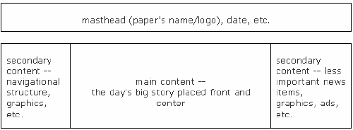
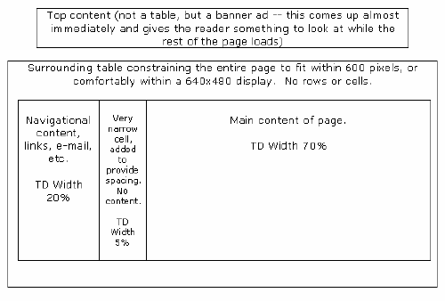

# 实用网页设计——表格介绍，第 1 部分

> 原文：<https://www.sitepoint.com/design-introduction-tables-1/>

如果你去我这一带的贫困社区转转，你会发现很多单宽拖车。它们不适合居住——它们丑陋、拥挤、漏雨、毫无风格——但作为住所，它们很实用。他们工作。你可以住在其中，保持身体和灵魂在一起。

朝任何方向开几百码，你会发现附近有一些小而古老的房子，与街道上的拖车场惊人地相似。这里的老人称之为“猎枪屋”，命名的原因很简单，你可以从前门开枪，子弹会穿过房子的每个房间，然后从后门射出。两个房间的基本平面图都很简单:一个房间“堆叠”在另一个房间旁边，就像一排字母块首尾相连。

业余爱好者学做网页就像这些鸟枪房，只不过鸟枪房是横着建的，网页是竖着建的。这些元素一个叠一个，就像同一行字母块垂直叠放一样。这是因为大多数人在学习任何关于网页设计的知识之前就学习了 HTML，而基本的 HTML 只是带标记的文本:取一大块文本，做上标记，到处插入图形和水平分隔线，然后就完成了！你有一个网站。

对于很多人来说，这就足够了。但对我们其他人来说，这只是一个开始。我们不想永远设计拖车场网站；我们想设计大教堂(或者至少是一个漂亮的带小阳光房和早餐角的两居室平房)！

[SitePoint](https://www.sitepoint.com) 正准备发布丹·谢弗斯的新书 [HTML 乌托邦:使用 CSS 设计无表格](https://www.sitepoint.com/books/css1/signoff.php)。SitePoint 上有很多其他的[前沿文章，关于使用高级表格设计、设计“超越”表格等等。如果你准备好进入这样一个稀薄的环境，我强烈推荐它们。](https://www.sitepoint.com/subcat/90)

然而，我的“实用网页设计”系列是针对我们这些普通人的——那些不是真正的网站管理员(不管我们的名片上写着什么)和还没有准备好进行无表格网页设计的人。带着这个想法，我创建了这个专栏。希望在您阅读了本专栏并实现了其中的一些内容后，您将为更复杂的内容做好准备。当那辉煌的一天到来时，SitePoint 将为您做好准备。直到那一天到来… SitePoint 将帮助您实现这一目标。

资深网页设计师注意:这篇文章涵盖了你已经非常熟悉的领域。除非你发现自己需要复习，否则你可能会想跳过它，读一些更有挑战性的东西。然而，你可能会发现它在教别人如何设计表格时很有用。

##### 桌子设计的基础

让我们先了解一下基本情况。有数百个网站可以帮助你理解表格布局的基础；下面列出了其中一些，还有很多其他的和我列出的一样好，甚至更好。不要忘记当地书店书架上的无数书籍，从面向傻瓜的 HTML 到最前沿的设计标题。我不想重复这些资源中的信息，但是我将快速浏览一下基本表格布局的各种标签和设计属性。我建议您访问下面列出的一些站点，以获得关于理解表构造的更多帮助。

同样值得注意的是:Marc Gugliuzza 在他的 SitePoint 文章中提醒我们，手工设计表格可能是 HTML 中最难完成的任务。如果你不打算设计很多网页，那么使用所见即所得的代码编辑器，比如 [Dreamweaver](http://www.macromedia.com/) (价格昂贵但非常好)或 [Arachnophilia](http://www.arachnoid.com/arachnophilia/) (免费且非常有用)来制作你的表格布局可能是值得的。理解表格的来龙去脉需要一些脑力劳动——如果不值得你花时间，那就让程序来做这些繁重的工作吧。但是引用马克的话，

“…对于那些从事网站创建工作的人来说，如果你亲自编写代码，你会比那些使用所见即所得编辑器编写代码的人更好，更有优势。”

使用程序的网页设计者受他们的程序支配。学习手工编码可以让你完全控制和掌握代码。

好了，回到正题！一旦你步入奇妙的、令人恼火的表格世界，你就已经把网页设计的“猎枪屋”范式抛在了身后。你正在进入一个更高层次的布局和设计。

看看你当地报纸的布局。忽略内容，只看它的结构。它可能看起来像这样:



这种带有页眉的三栏设计可能是大多数网页最流行的设计风格。巧合吗？一点也不。对于大多数用户来说，这是非常熟悉的，他们觉得这种熟悉的设计风格很舒服，也很容易操作。这行得通，也说得通。还有很多其他的设计风格，包括更简单的 2 列设计(去掉了窄的右列)，以及更复杂的“嵌套浮动”风格，等等，但是我们不要超越自己。

我敢打赌，你们报纸的网站是用同样的 2 栏或 3 栏风格设计的。事实上，我敢打赌，你访问的 10 个网站中有 9 个使用 2 列或 3 列设计布局的一种或另一种变体，如果他们不只是使用“散弹枪屋”风格，将一个内容项目无限地堆积在另一个内容项目之上的话。如果它工作得这么好，为什么还要摆弄它呢？

##### 垂直与水平方向

我不知道你，但我喜欢垂直方向。电话簿对我来说有天生的意义，因为它们的结构适合我。如果我在看一群高楼，我倾向于先向上看，然后上下看下一栋，以此类推。

当你第一次构建网页时，你的页面结构天生就是垂直的——你把一个东西堆在另一个上面，就像一个分层蛋糕。但是当你开始考虑用表格设计时，你必须打破垂直模式，开始考虑行，而不是列。横跨而不是向下。你很快就会明白我的意思。

##### 表 101

正如我之前所说的，有无数的网站可以帮助你建立表格结构。为了便于参考，我使用了 SitePoint 自己的[初学者 HTML，第 3 部分](https://www.sitepoint.com/beginners-html-3/)James Ussher-Smith 的文章，以保持诚实。如果你想要一些真正用户友好的东西，试试 [Lissa 解释这一切:表格](http://www.lissaexplains.com/tables.shtml)中对表格构造的很好的解释。Lissa 的网站看起来像是 Ashley 和 Mary Kate 设计的，但信息是有效的，并且呈现得非常好。我建议你打开这两页中的一页，与本文同时阅读。Lissa 为她的技巧提供了一些非常好的可视化示例。

一切都从基本的`<TABLE></TABLE>`标签开始。这些简单的标签包含了一个表格结构，并告诉 Web 浏览器注意，表格内容即将出现。

您现在应该意识到，浏览器在显示表格的任何内容之前，必须先解开表格的整个结构，所以过于花哨或负载过重的表格结构将需要一些时间来下载和显示。这就是为什么你点击进入一个页面，等待，等待，等待，而没有任何东西加载，突然砰！整个页面立刻出现。这是因为在显示任何内容之前，浏览器必须遍历表格布局。像这样的表结构会激怒普通的站点访问者，他们可能会在表完成加载之前就点击到其他地方。不要强迫一个表格承载太多的内容，不要强迫它过于复杂，也不要在一个包含页面的大表格中嵌套太多的子表格。最好使用较小的表格，并将它们一个接一个地“堆叠”起来。

像许多其他 HTML 标签一样，`<TABLE></TABLE>`标签充当表格内容的“书挡”。很简单。

下一个标签是`<TR></TR>`标签。这代表“表格行”行，而不是列。当我第一次尝试理解表结构时，我一直遇到可视化表结构的问题，因为我想纵向思考，而不是横向。掌握表结构的基本概念花费了我过多的时间，因为我不想按照行来考虑。我想设计“上下”，而不是水平。根据我和其他新兴网页设计师的经验，我不是唯一一个因为这种模式转变而陷入困境的人。相信我:一旦你从垂直思考转变为水平思考，表格就会变得非常非常简单。对于那些天生水平思考的人来说，你有权嘲笑我们。

无论如何，`<TR>`标记表明正在创建一行。最简单的表格形式如下(您可能希望将代码复制到记事本中，在一个单独的浏览器窗口中打开它，并观察我们在此过程中会发生什么):

```
<TABLE>  

  <TR></TR>  

<TABLE>
```

嘿，我刚刚构造的行怎么了？什么都没出现！好吧，我们还没有把任何东西放进去。一个表格需要存储实际内容的单元格或隔间。想想日历。典型的日历有四行或五行，每行有七个单元格。您可能认为表格单元格的代码应该是`<TC>`，但是您错了。代码为`<TD>`，用于表格数据。现在让我们再次尝试这个表结构:

```
<TABLE>  

  <TR>  

    <TD></TD>  

  </TR>  

<TABLE>
```

啊！还是一无所获！不完全是。结构是存在的，但是因为没有内容，所以表格不会显示。让我们在单元格中放一些内容:

```
<TABLE>  

  <TR>  

    <TD>Bleah!</TD>  

  </TR>  

<TABLE>
```

现在我们有了一些东西…很多代码来显示一个无意义的单词。再说一次，不是真的。你是在为一些更复杂的事情打基础。让我们再添加一些单元格:

```
<TABLE>  

  <TR>  

    <TD>Bleah!</TD>  

    <TD>Bleah!</TD>  

    <TD>Bleah!</TD>  

    <TD>Bleah!</TD>  

    <TD>Bleah!</TD>  

  </TR>  

<TABLE>
```

除了有点孩子气，我们还成功地让一个单词连续出现了五次。不，我们做得更多。您可能没有意识到，在 HTML 中，表结构本身在默认情况下是不可见的。换句话说，你看不到边界。就像某些自觉的现代日历一样，你只能看到数据。好吧，让我们通过给`<TABLE>`标签添加一个属性来显示边框本身。将边界值设置为 1，如下所示:

```
<TABLE border="1">
```

现在我们有线索了。我们不仅看到了数据，还看到了包含数据的表结构。在你继续下一步之前，先改变一下边框的值。试试 2，10，20，任何适合你的，看看你能做多大的边界。当你在这个小练习中玩够了之后，将值返回到 1，并准备下一步。

基本设计注意事项:在构建表格时，布局表格以保持边框可见会使工作变得更加简单。在开香槟之前，你的最后一步可以是关闭边框。

你当然想要多行。所以让我们开始吧。哇哦！

```
<TABLE border="1">  

  <TR>  

    <TD>Bleah!</TD>  

    <TD>Bleah!</TD>  

    <TD>Bleah!</TD>  

    <TD>Bleah!</TD>  

    <TD>Bleah!</TD>  

  </TR>  

  <TR>  

    <TD>Bleah!</TD>  

    <TD>Bleah!</TD>  

    <TD>Bleah!</TD>  

    <TD>Bleah!</TD>  

    <TD>Bleah!</TD>  

  </TR>  

  <TR>  

    <TD>Bleah!</TD>  

    <TD>Bleah!</TD>  

    <TD>Bleah!</TD>  

    <TD>Bleah!</TD>  

    <TD>Bleah!</TD>  

  </TR>  

<TABLE>
```

好玩吧。现在我们有三行结构均匀的“bleahs”沿着页面行进。再添加几行和几个单元格，你就有了一个不错的日历结构。五分钟的工作还不错。

让我们在漂亮、整洁(但有限)的表格结构中加入一些活动扳手。首先，我们会注意到单元格的大小与内容一致——换句话说，单元格会自动调整以适应内容，不会浪费空间。由于所有单元格中的内容都是相同的，所以表格具有漂亮、均匀的结构。让我们改变这一点。

在第二行第三个单元格中，将内容改为:

`<TD>Abracadabra!</TD>`

注意发生了什么。该单元格会自我延长以容纳更长的单词，但该特定单元格正上方和正下方的单元格也会如此。

如果您使用换行符将这个神奇的单词分成两部分:

`<TD>Abra<BR>Cadabra!</TD>`

细胞会变得两倍高或两倍深，这取决于你如何看待它。整行中的单元也是如此。习惯表格如何自动调整自己，你可以节省很多时间和麻烦来设计和重新设计同一个表格，让它以你想要的方式出现。

##### 对齐单元格内容

您还会注意到，中间一行中的文本会自动与单元格的左侧对齐。这是默认的。让我们使用 align 属性来更改它。用“凯西·卡达布拉”单元格左边的单元格试试:

`<TD align="center">Bleah!</TD>`

现在，单词在单元格中居中。希望该行中的每个单词都居中对齐吗？不需要费力地对齐每个单元格的内容，只需将属性添加到行中即可:

`<TR align="center">`

它看起来和以前一样，但是相信我，如果并且当那一行的剩余单元格的内容得到一些空间时，它们都将自己居中，而不是默认向左。

还有一个`VALIGN`属性，看起来非常相似，但行为完全不同。首先，它是一个适用于整个表格的属性(即`<TABLE>`标签)，而不是行或单元格。默认情况下，将信息放在中间，上下间隔相等。大多数人学习严重依赖`<TABLE valign="top">`属性，这迫使内容从顶部垂直排列。如果您有两个包含不同数量内容的垂直列，您不希望“较短”的列的内容被推到列的中间，在顶部留下难看的空白。用`VALIGN`属性把内容强制顶上，让列的底部有空的地方。

##### 单元格边距和单元格间距

让我们回到我们的废话表。我们可能希望给这些单元格中的内容留出空间——换句话说，用一些空白隔开，这样它就不会被表格边框限制住。使用`CELLPADDING`属性给你的内容一些空间。在您的`<TABLE>`标签中试试这个:

```
<TABLE cellpadding="5">
```

啊，呼吸的空间！您可以随意调整填充值，根据自己的喜好在单元格中留出或多或少的空间，但请记住，填充是无差别的，换句话说，在使用填充时，您不能将一个单元格的内容与左边界对齐，因为填充不会让步。

现在，让我们使用`CELLSPACING`属性在单元格之间添加一些空间:

```
<TABLE cellpadding="5" cellspacing="5">
```

注意边框本身是如何变大的？这给出了一个不同于使用`BORDER`属性使边框变大的外观，并且即使在`BORDER`属性被设置为 0 时也提供了空白。

##### `COLSPAN`和`ROWSPAN`

目前还好吗？很好，现在我们开始吧。到目前为止，我们已经创建了一组相同的单元格，它们一个接一个地在页面上滚动，没有任何变化。这一切都很好，但我们可以做得更多。满足`COLSPAN`和`ROWSPAN`属性。这些是相当明显的——它们会导致单元格“跨越”一列或一行。

让我们给无意义表的第一个`<TD>`行添加一个`COLSPAN`属性:

`<TD colspan="2">Bleah!</TD>`

嗯，这让事情变得很混乱。您的第一个单元格“跨越”或伸展到第二行的前两个单元格，其他所有内容都会移动以适应伸展的单元格。一个可怜的家伙独自被困在一根柱子里。本质上，您所做的是让一个单元格占据两个单元格的空间，因此表格会将其视为两个单元格。

让我们将`COLSPAN`属性添加到其他行中进行补偿，看看我们是否可以稍微整理一下:

```
<TABLE border="1" cellpadding="5" cellspacing="5">   

  <TR>   

    <TD colspan="2">Bleah!</TD>   

    <TD>Bleah!</TD>   

    <TD>Bleah!</TD>   

    <TD>Bleah!</TD>   

    <TD>Bleah!</TD>   

  </TR>   

  <TR>   

    <TD>Bleah!</TD>   

    <TD colspan="2">Bleah!</TD>   

    <TD>Bleah!</TD>   

    <TD>Bleah!</TD>   

    <TD>Bleah!</TD>   

  </TR>   

  <TR>   

    <TD>Bleah!</TD>   

    <TD>Bleah!</TD>   

    <TD colspan="2">Bleah!</TD>   

    <TD>Bleah!</TD>   

    <TD>Bleah!</TD>   

  </TR>   

<TABLE>
```

嗯，这就更对称了。看到他们如何定位自己了吗？

现在，让我们看看`ROWSPAN`属性会发生什么。去掉所有的`COLSPAN`属性，将第一行`<TD>`改为:

`<TD rowspan="2">Bleah!</TD>`

正如您所料，第一个细胞向下延伸了两行，其他所有细胞都移动以进行补偿…再一次，只剩下一个细胞滞留。

花些时间单独或组合试验这两种属性。你可以把你的桌子弄得乱七八糟，但是你也可以感受一下它们是如何工作的。

##### 给你的桌子上色

给你的表格结构添加颜色非常简单。您可以给表格边框本身着色，或者给单元格添加颜色。

用`BORDERCOLOR`属性给边框本身上色:

```
<TABLE border="1" cellpadding="5" cellspacing="5" bordercolor="#ff00ff">
```

这将使边框线条变成漂亮的……洋红色？更改边框的粗细，使整个表格的边框更粗:

```
<TABLE border="5" cellpadding="5" cellspacing="5" bordercolor="#ff00ff">
```

在单元格中使用熟悉的`BGCOLOR`属性来改变单元格本身的颜色:

`<TD bgcolor="#3366ff">Bleah!</TD>`

尝试不同的颜色组合，看看有什么吸引力。

您还可以使用`BACKGROUND`属性将背景图像放入您的表格中，或者放入整个表格中:

```
<TABLE border="5" cellpadding="5" cellspacing="5" background="image.gif">
```

或者在特定的单元格中:

`<TD background="image.gif">Bleah!</TD>`

Lissa 建议，表格的一个巧妙用途是用彩色边框框住图形:

```
<TABLE border="5" bordercolor="9966ff">   

<TR>   

<TD>   

   

</TD>   

</TR>   

</TABLE>
```

您甚至可以使用两个表格，一个在另一个里面，来制作双边框:

```
<TABLE border="5" bordercolor="00ff00">   

<TR>   

<TD>   

<TABLE border="5" bordercolor="9966ff">   

<TR>   

<TD>   

   

</TD>   

</TR>   

</TABLE>   

</TD>   

</TR>   

</TABLE>
```

看到内部表格如何适合外部表格的单个单元格了吗？这是“嵌套”表格的一个例子。在这个例子中，嵌套的或者内部的表格仅仅是用来提供一个边框，但是使用嵌套表格是处理更复杂的页面布局的一个很好的方法。说到页面布局…

##### 使用表格制作基本页面布局

除非您以不同的方式告诉它们，否则表格会约束自己以适合它们所包含的内容。用`<TABLE>`标签的`HEIGHT`和`WIDTH`属性可以很简单地做到这一点。`HEIGHT`和`WIDTH`有两种味道:绝对和相对。第一个创建一个以像素为单位的绝对宽度的表格，如下所示:

```
<TABLE width="744" height="410">
```

这是为普通的 800×600 屏幕显示优化的。它将很好地适应显示器的水平和垂直方向，只留下一点“骗子”的空间给尺寸稍小的显示器。不幸的是，这正是它所说的——一个绝对值。因此，那些使用其他显示器的人将看不到充满他们屏幕的漂亮的表格。拥有 1024×768 显示器的人会在屏幕上看到一张桌子，但周围会有大量未使用的空间；那些仍在使用 640×480 显示器的少数人将看不到整个表格，必须水平和垂直滚动才能看到所有内容。不太好。

对于普通的表格设计者来说，更好的选择是使用相对的表格高度和宽度。这些使用百分比而不是像素值，即:

```
<TABLE width="95%" height="95%">
```

这在水平和垂直方向上占据了 95%的可用显示空间。去掉一个属性(通常是`HEIGHT`属性)，表格会自动调整大小，在水平方向占据屏幕的 95%,但在垂直方向会自动调整以适应内容。这最后一个选择，使用`WIDTH`百分比，但是让`HEIGHT`自己处理，通常是一个不错的选择。

这是我自己网站的基本表格布局。我没有做任何花哨或开创性的事情——事实上，当我最初设计页面时，我对如何使用表格来布局页面只有最模糊的概念。所以我选择了一些简单的，我能记住的，用户友好和熟悉的东西。所以这就是我所做的(模仿谁知道还有多少其他网页):



下面是代码，没有内容。请注意，我已经将整个内部或嵌套的表格居中:

```
<TABLE width="600">    

<DIV ALIGN="center">    

<TABLE>    

    <TR>    

      <TD width="20%"></TD>    

    <TD width="5%"></TD>    

      <TD width="70%"></TD>    

  </TR>    

</TABLE>    

</DIV>    

</TABLE>
```

请注意，`<TD>`宽度相加为 95%。这给了我 5%的显示宽度来“欺骗”,在显示的左侧和右侧提供了一个细长的空白边。

此页面布局存在一些问题。我最初选择使用 600 像素宽的“框架”表格，因为在我设计它的时候(大约在 2001 年)，我的许多用户让我知道他们仍然在使用 640×480 的显示器，我希望我的页面适合他们的显示器，而没有烦人的水平滚动条。我问过我的时事通讯订阅者他们用的是什么，他们中的足够多的人仍然使用较小的显示器，以使我保持 600 的宽度合理化。如果我现在设计页面，我会把像素宽度设置在 740 左右。

此外，页面的全部内容都包含在框架表中，迫使用户的浏览器在显示任何内容之前下载所有的内容、图形、文本、JavaScript 等等。这是一个典型的问题，它导致一些网速较慢的用户在页面“弹出”之前不得不坐下来盯着看一会儿。

让我重申一下，我所使用的页面布局没有什么特别精彩或不同的地方。我用它作为例子只是因为它是一个我熟悉的方案。像安迪·金和雅各布·尼尔森这样的可用性专家会忙着把我的页面分门别类。然而，这是一个起点。你可以给自己设定一个练习:改进它！

我决定，与其用不同的表格布局重新设计页面，不如等到我掌握了足够的 CSS 知识后，用更现代的样式表驱动的无表格设计方法重新设计页面。由于我还没有很好地掌握 CSS 来做到这一点，并且由于我的大部分观众继续使用老式的 PC 和浏览器，它们被现代的 CSS 所窒息，所以我的页面现在仍然植根于千禧年之前的表格设计。但是，嘿，它的工作，目前，这是足够好的懒惰的老我。

本文的第二部分将关注较少使用的`TABLE`属性，它们中的许多是在 HTML 4.0 中引入的，还有一些与表格相关的有趣的事情。下次见！

## 分享这篇文章