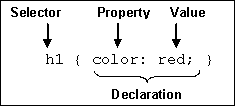

# CSS 速记介绍

> 原文：<https://www.sitepoint.com/introduction-css-shorthand/>

CSS 中有许多很好的可能性，其中之一就是使用简写属性，它让你只使用一个属性就可以指定几个属性。如果您已经开始学习 CSS 并在您的 Web 页面上实现它，您将立即看到使用这些速记属性的好处。CSS 速记使您更容易对标记应用样式，并使您的 CSS 代码更加简洁。

为了让你从这篇文章中获得任何价值，你需要知道常见的 CSS 属性和它们的值(见 Kevin Yank 的[“CSS 很简单！”](http://webmasterbase.com/article/309))。这里会用到它们，但不会详细解释。

这里为每个简写属性指出的浏览器支持通常只给出了实际兼容性的一般概念。有关特定属性在某些浏览器下有问题或部分受支持的本质的更多详细信息，请查看本文末尾的链接。

##### 回归基础

让我们快速浏览一个 CSS 规则的例子，来刷新我们对 CSS 不同部分的记忆，以及它们的名称:



一个 CSS 规则通常包含许多属性声明。CSS 速记让我们可以使用一个速记属性来声明几个属性。让我们看一个例子来获得更好的想法。

要将 CSS 样式添加到 HTML 的 body 标签中，您可以这样写:

```
body{  

  background: url("bg.gif");  

  background-color: #fff;  

  background-repeat: repeat-x;  

} 
```

上面的代码是一种常见的应用 CSS 的方式，全世界快乐的编码员都在用。现在让我们看看如果我们尝试定义相同的样式会发生什么，这一次使用一个快捷方式。

我们将使用`background`属性，它允许我们更有效地设置上述所有属性的值。事实上，我们已经接近将代码量减半:

```
body { 

  background: url("bg.gif") #fff repeat-x; 

}
```

如你所见，如果你知道如何使用简写属性，你的 CSS 还有很大的空间来提高效率。

现在让我们来看看一些更常用的速记属性，您可以在自己的站点上轻松实现它们。首先，我将指出速记可用的浏览器支持，然后是速记使用的语法，最后是一个带有快速解释的例子。

##### 公共属性

***`font`速记属性***


**语法**

```
font: font-style | font-variant | font-weight |  

font-size | line-height | font-family
```

**例子**

```
p {  

  font: x-large/110% "new century schoolbook", serif;  

}
```

在这个例子中，你会注意到我们没有定义`font-variant`和`font-weight;` ，因此它们将使用它们现有的值。值`x-large/110%`是指`font-size`和`line-height`。因为两者都使用大小作为值，所以它们可以像这样捆绑在一起，用一个斜杠，`font-size`总是第一个定义的值。由于该值的名称中包含空格，所以在`font-family`值周围使用引号。

Eric Meyer 建议严格保持不同字体属性的定义顺序。然而，O'Reilly 的 CSS 参考建议您可以按任何顺序设置这些。

***`margin``padding`速记属性***


**语法**

```
margin: margin-top | margin-right | margin-bottom | margin-left 

padding: padding-top | padding-right | padding-bottom | padding-left
```

**例题**

```
p {  

  margin: 2em;  

}
```

在第一个示例中，所有边距都设置为 2em。当只定义一个值时，它适用于页面的所有边(水平和垂直边距)。

```
p {  

  margin: 1em 2em; 

}
```

在本例中，定义了 2 个值。CSS 将第一个值解释为页面顶部和底部的水平边距值，而第二个值定义了左右边距的大小。

```
p {  

  margin: 1em 2em 3em;  

}
```

在最后一个示例中，定义了 3 个值。`Margin-top`由第一个值设置，`margin-left`和`margin-right`由第二个值设置，`margin-bottom`由第三个值设置。

当定义了 4 个值时，首先定义顶部，然后其他值自动应用于沿顺时针方向在页面周围移动的边框(即顶部、右侧、底部、左侧)。

速记填充的规则与这里为边距提供的规则相同。

***`border`速记属性***


**语法**

```
border: border-width | border-style | color
```

**例题**

```
p {   

  border: solid red;   

}
```

这将把`p`的边框设置为红色实线。

```
p {   

  border: 1px dotted #369;   

}
```

这将在段落周围显示一条细小的蓝色虚线。

***`border-top``border-right``border-bottom``border-left`速记属性***


**语法**

```
border-top: border-width | border-style | color
```

这些属性的工作原理与上面描述的`border`相同。但是由于`border`不区分四边，这些属性将允许您为特定的边框设置样式。

**例子**

```
p {   

  border-right: 4px groove blue;  

}
```

***`list-style`速记属性***


**语法**

```
list-style: list-style-type | list-style-position | list-style-image
```

**例题**

```
ul {   

  list-style: url("dot.gif") disc inside;  

}
```

在本例中，列表将使用名为 `dot.gif.`的图形文件。如果该文件不可用，列表将使用“disc”。

***`background`速记属性***


**语法**

```
background: background-color | background-image |   

background-repeat | background-attachment | background-position
```

在本文的介绍中，我们使用了 `background`作为例子。

**例子**

```
p {  

  background: url("bg.gif") gray 50% repeat fixed;   

}
```

如你所见， `background`-图像设置为`bg.gif`，`background-color` 为`gray`。 `background`将 `repeat`，但停留`fixed`。仅给出一个位置，因此值 `50%`将水平应用。

##### 应用 CSS 速记

我们已经知道，在许多情况下，CSS 速记属性比标准 CSS 使用起来更快、更有效。但是我们也看到，对这些 CSS 属性的支持在不同的浏览器之间会有所不同，所以在你的网站上实现 CSS 速记之前，一定要检查你的目标受众使用的是什么技术。使用速记时要小心，当然，要确保你的风格能在旧的和不兼容的浏览器上优雅地降级。

***参考文献***

站点点 CSS 参考

[https://reference.sitepoint.com/css/](https://reference.sitepoint.com/css/)

W3C 关于 CSS2 的规范

/# l #/https://www . w3 . org/TR/REC-CSS2//# lt #/https://www . w3 . org/TR/REC-CSS2//# nl #/

Webreview 的样式表部分

[http://www.webreview.com/style/index.shtml](http://www.webreview.com/style/index.shtml)

style master–CSS 兼容性图表

[http://www . west civ . com/style _ master/academy/browser _ support/text . html](http://www.westciv.com/style_master/academy/browser_support/text.html)

## 分享这篇文章