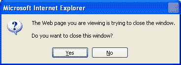

# 完美的弹出窗口

> 原文：<https://www.sitepoint.com/perfect-pop-up/>

 **如果你相信雅各布·尼尔森和他的支持者之流，[没有什么比弹出窗口](http://www.useit.com/alertbox/990530.html)更邪恶的了。从很多方面来说，这是正确的。为什么？好吧，我们很快就会列出原因，但简单地说，这是因为它们几乎总是执行得很差或者根本不需要。本教程将向你展示，只要有正确的想法，弹出窗口可以在不打扰任何人的情况下使用——尤其是浏览你网站的人。**

##### 弹出窗口的问题

弹出窗口的常见故障有:

*   如果脚本被禁用，或者如果浏览器不支持 JavaScript，弹出窗口将不起作用
*   搜索引擎不能跟踪弹出窗口的链接(脚本元素总是被忽略)
*   弹出窗口存在可访问性问题
*   如果您将目标页面移动到站点的另一部分，站点管理工具(例如 DreamWeaver)将无法更新弹出窗口的链接
*   许多人都运行了弹出窗口杀手，在窗口打开的一瞬间关闭窗口
*   在 Mozilla 中，有一个首先阻止弹出窗口打开的选项

唷。这是一个很长的列表…你可以把你自己的添加到这个列表中。那么，我们如何解决这些问题呢？

##### 脚本已禁用

禁用脚本后，弹出窗口不执行任何操作。就这么简单。但是如果你用了一个标准的`<a href>`，就不会有这个问题了。因此，不使用:

```
<a href="#" onclick="window.open('file.htm');"> 
```

您可以使用:

```
<a href="file.htm" onclick="window.open('file.htm');return false;">
```

这样，如果脚本被禁用，标准链接仍然有效。

然而，也许有一个很好的理由让窗口在当前窗口的顶部打开。如果是这样，只需添加一个目标属性，如下所示:

```
<a href="file.htm" onclick="window.open('file.htm'); 

return false;" target="newWin">
```

答对了。问题解决了。但是我们可以做更多的事情！

##### 搜索引擎

有了上面修改的代码，搜索引擎就有了一个标准的 href 可以遵循，所以这是我们问题列表中的另一个问题。

##### 无障碍问题

弹出窗口的最大缺点是它们将焦点从主浏览器窗口移开，这可能会令人不安。除了可访问性之外，它们还存在一般的可用性问题。你有多经常看到有人启动了一个弹出窗口，然后无意中点击了启动器窗口上的返回，认为什么都没发生，再次点击链接没有结果？当然窗口已经打开了，但是现在它在启动窗口下面，只有移动到任务栏并从那里选择窗口才能解决这个问题。

诀窍是通知用户链接将在新窗口中打开。有许多方法可以解决这个问题:

*   将说明作为链接本身的一部分
*   在标题属性中添加一些说明
*   使用适当的图标表示弹出窗口即将出现

这样，如果焦点丢失，用户可以建立连接，例如:

[打开我的测试页面(在弹出窗口中打开)](http://www.accessify.com/tutorials/my-pop-up-window.htm)

 [打开我的测试页面](http://www.accessify.com/tutorials/my-pop-up-window.htm)

为了解决主窗口失去焦点的问题，您可以使用 JavaScript 来重新设置焦点。本文末尾给出了一个建议的脚本。

##### 网站链接管理工具

如果你习惯于使用 DreamWeaver 或内容管理系统之类的工具来移动页面，你会希望链接得到维护。对于标准的 hrefs，通常是这样的(取决于您使用的工具)，但是对于 JavaScript 就不太可能了。暂时回到我们的代码:

```
<a href="file.htm" onclick="window.open('file.htm');  

return false;">
```

上面的链接会被很好地维护…几乎。一半会 href 部分。但是 onclick 部分可能会被忽略。这是个大问题。您可能认为您的链接已经更新，但实际上启用了 JavaScript 的人会被发送到一个丢失的页面。因此，您可能会发现您的代码将被更改为:

```
<a href="newlocation/newfile.htm" onclick="window.open('file.htm');  

return false;">
```

如果你在启动页面上运行一个链接验证器，看起来你的链接确实是有效的。那么，我们如何解决这个问题呢？像这样:

```
<a href="file.htm" onclick="window.open(this.href);  

return false;" target="newWin">
```

只需要维护一个链接，正确的 href 将用于 window.open 方法。太好了—现在我们有所进展了！

##### 弹出窗口杀手/Mozilla 禁用弹出窗口

就像 JavaScript 被禁用的问题一样，仅仅提供一个标准的 href 意味着链接仍然可以工作。现在我们只需要解决哪个窗口有焦点的问题…

##### 完美的弹出脚本

我们建议使用一个可以放在一些共享的 JavaScript 代码中的函数(就像我们在这个网站上所做的那样)，并且可以很容易地从网站的任何地方调用它。这比每次费力地写出 window.open 函数要好得多。除了 URL 之外，您可能希望包括高度和宽度等参数，以及选择哪种类型的弹出样式(这取决于您定义的样式)。

以下是我推荐的代码:

```
var newWin = null;  

function popUp(strURL, strType, strHeight, strWidth) {  

  if (newWin != null && !newWin.closed)  

    newWin.close();  

  var strOptions="";  

  if (strType=="console")  

    strOptions="resizable,height="+  

      strHeight+",width="+strWidth;  

  if (strType=="fixed")  

    strOptions="status,height="+  

      strHeight+",width="+strWidth;  

  if (strType=="elastic")  

    strOptions="toolbar,menubar,scrollbars,"+  

      "resizable,location,height="+  

      strHeight+",width="+strWidth;  

  newWin = window.open(strURL, 'newWin', strOptions);  

  newWin.focus();  

}
```

函数中的附加代码处理焦点方面。如果您单击调用此函数的链接，然后单击页面上的 back 以隐藏弹出窗口，然后单击另一个弹出链接，代码将评估弹出窗口的状态，然后关闭弹出窗口并用新的维度重新打开它。

要调用该函数，您可以使用以下代码:

```
<a href="my-pop-up-window.htm"  

  onclick="popUp(this.href,'console',400,200);return false;"  

  target="_blank">This is my link</a>
```

或者，用一些实际的例子:

[这个
是我弹出的链接(控制台模式)](http://www.accessify.com/tutorials/my-pop-up-window.htm)
[这个
是我弹出的(固定模式)](http://www.accessify.com/tutorials/my-pop-up-window.htm)
[这个
是我的(弹性模式)](http://www.accessify.com/tutorials/my-pop-up-window.htm)

注意:“返回 false”部分实际上取消了 href 的默认操作，所以它不会打开弹出窗口和普通的 HTML 窗口——它会打开其中的一个。在启用和不启用 JavaScript 的情况下，尝试上面的链接，亲自查看。

你还能要求什么？嗯……这块蛋糕上还有最后一块糖霜。

##### 关闭弹出窗口

一旦弹出窗口打开，我们可能会依赖人们使用浏览器/操作系统控件来关闭新打开的窗口。

但是人们并不总是这样做！所以我们应该在弹出窗口中提供一个链接(或者按钮，如果你喜欢的话)来允许用户关闭它。然而，让我们假设我们的用户禁用了脚本，并且弹出窗口是通过标准 href 路径打开的。你深思熟虑地提供的“关闭此窗口”链接将提示一个不太友好的对话，如下所示:



为了解决这个问题，您应该使用 JavaScript 编写网页的关闭链接，并检查窗口是否作为`window.open()`方法的一部分打开。这样，如果是真正的弹出窗口，链接就会出现，`close()`方法就会起作用；如果不是真正的弹出窗口，链接就不会出现。

下面是执行此操作的代码:

```
<script language="JavaScript">  

<!--  

if (window.opener)  

  document.write('<strong><a href="#" onclick="self.close();">' +  

    'Close this window</a></strong>');  

//-->  

</script>
```

再次尝试链接，亲自查看:

[这个
是我弹出的(固定模式)](http://www.accessify.com/tutorials/my-pop-up-window2.htm)

##### 结论

希望本教程已经证明了弹出链接是可访问的、搜索引擎友好的和非侵入性的。然而，即使你遵循了所有这些建议，你还是应该问问自己是否真的需要打开一个新窗口。

最后要注意的一点是，弹出窗口应该是人们选择使用的，所以不要使用 window.onload 或 window.onunload 事件将弹出窗口强加给用户。这总是让人们很恼火…除非他们想买一个 X10 的相机或者去参观“世界上最大的网上赌场”,但是他们不知道！

## 分享这篇文章