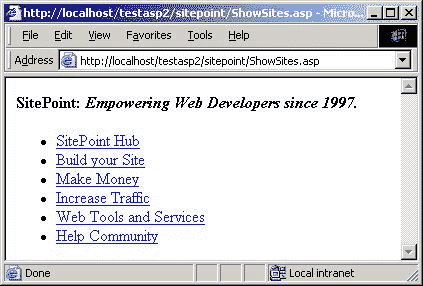
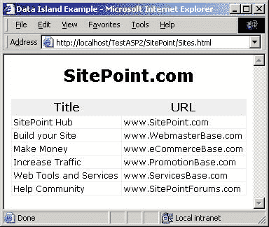

# 面向微软开发人员的 XML 和 Web 服务—第 1 部分

> 原文：<https://www.sitepoint.com/microsoft-developers-1/>

微软的 Internet Explorer 版是第一个支持 XML 的网络浏览器。从那以后，XML 支持被引入到各种微软产品中，如 Office XP 和 SQL Server 2000。微软通过在。NET 框架。

为了跟上 XML 系列标准的发展，微软产品支持各种其他规范，如 XPath、XSLT、XML 模式、DOM、SAX、SOAP 和 Web 服务。这篇[最近的 ZDNet 报道](http://news.zdnet.co.uk/story/0,,t269-s2126007,00.html)宣称微软是 Web 服务市场的赢家之一，并提到“微软正在发展中的 Web 服务市场建立强大的地位”。

考虑到这些事实，如果您是在 Microsoft 平台上开发 Web 或 Windows 应用程序的开发人员，那么了解 XML 的用法和应用程序，并了解各种 Microsoft 产品和 SDK 中提供的 XML 支持级别是至关重要的。

本教程的目标是为您提供各种 Microsoft 产品中可用的 XML 和 Web 服务支持的完整描述。更具体地说，我们将讨论以下产品:

*   MSXML 或 Microsoft XML 核心服务
*   XML 和 Internet Explorer
*   SQL Server 2000 XML 或 SQLXML
*   SOAP 工具包
*   。NET 框架
*   Web 服务工具包(Office XP 和 Exchange Server)
*   BizTalk Server
*   其他工具和 SDK

在第一部分中，我们将探索 MSXML、数据岛、SQLXML 和 SOAP 工具包。在本教程的第二部分，我们将重点关注。NET 框架和 Web 服务。

本教程假设您熟悉 XML 标准系列。如果你不是，请阅读 SitePoint 的[XML 介绍](http://www.webmasterbase.com/article/930)。

让我们开始讨论什么是 MSXML，以及如何在您的 Web 和/或桌面应用程序中使用它。

##### Microsoft XML 核心服务

如前所述，Internet Explorer 4.0 是第一个支持 XML 的浏览器。在 IE 4.0 中，微软提供了一个名为 msxml.dll 的 COM DLL，这是一个基本的 DOM(文档对象模型)实现，允许创建和解析 XML 文档。多年来，微软极大地增强了这个基于 COM 的免费 XML 解析 API，并增加了对各种其他 XML 标准的支持。

MSXML，现在称为 Microsoft XML 核心服务，是 Microsoft 平台上最重要的 XML 处理 API。除了 DOM 解析之外，它还支持各种其他标准，如 SAX、XPath、XSLT、XML 模式和 XML 名称空间。MSXML SDK 随各种产品一起提供，如 Internet Explorer、Office XP 等。，也可以在[http://msdn.microsoft.com/xml](http://msdn.microsoft.com/xml)从 MSDN 网站下载。当前的 Internet Explorer 6.0 版本发布了 MSXML 版 SP2。最新的 MSXML 版本是 MSXML 4.0 SP1，可以从前面提到的 MSDN 站点下载。

MSXML 可用于:

*   使用 DOM 或 SAX API 创建、解析、导航和更新 XML 文档，
*   转换 XML 文档(XSLT)，
*   提取数据(XPath)，
*   使用 DTD、XDR、XML 模式(XSD)和
*   HTTP 数据访问(XMLHTTP 和 ServerXMLHTTP)

微软网站也有关于 MSXML 支持的标准的完整细节。

在下一节中，我们将查看如何在 ASP 页面的服务器端和 Visual Basic 应用程序的客户端使用 MSXML 的示例。让我们从一个 ASP 页面示例开始。

##### 在服务器端使用 MSXML

MSXML 是基于 COM 的 API，因此可以在 VBScript、ECMAScript 和 Perl 等脚本语言中使用。在本例中，我们将在 ASP 页面中编写 VBScript 代码，使用 MSXML DOM 加载 XML 文档，并创建要发送到客户端浏览器的 HTML 响应。

假设您在与 ASP 页面相同的 IIS 虚拟目录下有以下作为 sites.xml 的 XML 文档:

```
<?xml version='1.0' encoding='utf-8'?>  

<Sites>  

<Site>  

<URL>www.SitePoint.com</URL>  

<Title>SitePoint Hub</Title>  

</Site>  

<Site>  

<URL>www.WebmasterBase.com</URL>  

<Title>Build your Site</Title>  

</Site>  

<Site>  

<URL>www.eCommerceBase.com</URL>  

<Title>Make Money</Title>  

</Site>  

<Site>  

<URL>www.PromotionBase.com</URL>  

<Title>Increase Traffic</Title>  

</Site>  

<Site>  

<URL>www.ServicesBase.com</URL>  

<Title>Web Tools and Services</Title>  

</Site>  

<Site>  

<URL>www.SitePointForums.com</URL>  

<Title>Help Community</Title>  

</Site>  

</Sites>
```

以下 ASP 代码使用 MSXML 4.0 DOM 加载 sites.xml，对其进行处理并生成 HTML 输出。如果您还没有安装 MSXML 4.0，[从 MSDN 网站](http://msdn.microsoft.com/downloads/default.asp?url=/downloads/sample.asp?url=/msdn-files/027/001/766/msdncompositedoc.xml)下载并安装它。

```
ShowSites.asp  

<%@ Language=VBScript %>  

<%  

Option Explicit  

Response.Expires = -1  

'Create MSXML 4.0 DOMDocument instance  

Dim objXMLDoc  

Set objXMLDoc = Server.CreateObject("MSXML2.DOMDocument.4.0")  

'Load sites.xml file present in the same directory as this ASP page  

objXMLDoc.async = False  

objXMLDoc.validateOnParse = False  

objXMLDoc.resolveExternals = False  

Dim bLoadResult  

bLoadResult = objXMLDoc.load(Server.MapPath("sites.xml"))  

'If Load successful  

If bLoadResult Then  

'Generate HTML Output  

'Select Site Nodes  

Dim siteNodes  

Set siteNodes = objXMLDoc.selectNodes("/Sites/Site")  

Response.Write "<b>SitePoint: <i>Empowering Web   

Developers since 1997.</i></b><ul>"  

'For each Site node  

Dim aSiteNode  

For Each aSiteNode in siteNodes  

With Response  

.Write "<li><a href='http://"  

.Write aSiteNode.selectSingleNode("URL").nodeTypedValue  

.Write "'>" & aSiteNode.selectSingleNode("Title").nodeTypedValue  

.Write "</a></li>"  

End With  

Next  

Response.Write "</ul>"  

Else  

'Load Unsuccessful, print error  

Response.Write "<font color='red'>" &   

objXMLDoc.parseError.reason & "</font>"  

End If  

%>
```

上面的 ASP 页面首先使用 MSXML 4.0 版本相关 ProgID MSXML2.DOMDocument.4.0 创建 DOMDocument 类的实例。接下来，我们设置某些属性以同步加载 XML 文档，并告诉 MSXML 不要验证 XML 文档并跳过解析 XML 文档中的任何外部引用。

因为文档是从外部文件加载的，所以我们使用 load 方法，而不是 loadXML，后者用于从字符串加载 XML 文档。如果文档加载成功，我们使用 DOM selectNodes 方法并向它传递 XPath 表达式`/Sites/Site`，该表达式从源 XML 文档中选择所有的 `<Site>`节点。最后，对于每个 `<Site>` 节点，我们假设它包含`<URL>`和`<Title>` 子节点，我们选择这些节点值来生成 HTML 输出。

如果文件加载失败，使用`parseError`界面生成错误信息字符串。

下载本文的源代码，将包含的 XML (sites.xml)和 ASP 页面(ShowSites.asp)保存在 IIS 虚拟目录下，浏览到 ShowSites.asp，您应该会看到类似以下屏幕的输出:



*图一。使用 MSXML DOM 的 ASP 页面生成的 HTML 输出*

在本例中，您了解了如何在服务器端的 ASP 页面中使用 MSXML DOM。现在让我们看一个在客户端运行的 Visual Basic 应用程序中使用 MSXML 的示例。

##### 在客户端使用 MSXML

假设您正在使用一个 Windows 应用程序，该应用程序需要定期连接到 Web 服务器，下载一些配置细节，并在客户端刷新这些细节。我们还假设这些配置设置在服务器上保存为 XML 文档。因此，当前的任务是从服务器下载这个 XML 文档，并在客户端将其保存为磁盘文件。下面的 Visual Basic 应用程序执行完全相同的工作:

启动 Visual Basic 6.0，创建一个新的标准 EXE 项目，并添加对 Microsoft XML，v4.0 (msxml4.dll)的引用(Project | References…)。双击表单，在`Form_Load()` 方法中编写以下代码:

```
Const strURL = "http://www.PerfectXML.com/books.xml"   

'Create MSXML DOMDocument instance   

Dim objXMLDoc As New MSXML2.DOMDocument40   

'Set Properties   

objXMLDoc.async = False   

objXMLDoc.validateOnParse = False   

objXMLDoc.resolveExternals = False   

'Since loading over HTTP from a remote server   

objXMLDoc.setProperty "ServerHTTPRequest", True   

If objXMLDoc.Load(strURL) Then   

    objXMLDoc.save "c:books.xml"   

    MsgBox "Remote XML document saved as c:books.xml."   

Else   

    MsgBox "Error: " & objXMLDoc.parseError.reason   

End If   

Unload Me
```

上面的 Visual Basic 代码与 ASP 页面示例一样，使用 MSXML DOM 加载 XML 文档。需要注意的重要一点是，当我们通过 HTTP 加载远程 XML 文档时，我们必须将 ServerHTTPRequest 属性设置为 True。如果文档加载成功，则调用 save 方法在客户端将加载的 XML 文档保存为 c:books.xml。

我们刚刚看到了一个在 Visual Basic 应用程序的客户端使用 MSXML 的例子。现在让我们关注在浏览器客户端中使用 XML。

##### XML 和 Internet Explorer

从 Internet Explorer 5.0 开始，微软引入了 XML 数据岛的概念，这是指在 HTML 网页中包含大量 XML 数据的能力。然后，网页中的这些 XML 数据孤岛可以绑定到 HTML 控件(如表格),或者使用客户端 JScript 或 VBScript 进行处理。Internet Explorer 浏览器在内部使用 MSXML 来提供数据岛功能。

现在让我们看一个例子，它利用了 Internet Explorer 的 XML 数据岛特性。为了让这个例子工作，你需要 IE 5.0 或更高版本。

```
<html>    

<head>    

  <title>Data Island Example</title>    

  <style>    

    BODY, A, LI, TD  {    

      font-family: 'Verdana', 'Arial', sans-serif;     

      font-size: 9pt;     

      color : black;    

    }    

  </style>    

<XML ID="SITES">    

<Sites>    

  <Site>    

    <URL>www.SitePoint.com</URL>    

    <Title>SitePoint Hub</Title>    

  </Site>    

  <Site>    

    <URL>www.WebmasterBase.com</URL>    

    <Title>Build your Site</Title>    

  </Site>    

  <Site>    

    <URL>www.eCommerceBase.com</URL>    

    <Title>Make Money</Title>    

  </Site>    

  <Site>    

    <URL>www.PromotionBase.com</URL>    

    <Title>Increase Traffic</Title>    

  </Site>    

  <Site>    

    <URL>www.ServicesBase.com</URL>    

    <Title>Web Tools and Services</Title>    

  </Site>    

  <Site>    

    <URL>www.SitePointForums.com</URL>    

    <Title>Help Community</Title>    

  </Site>    

</Sites>    

</XML>    

</head>    

<body>    

  <div align="center">    

  <h2>SitePoint.com</h2>    

  <table width="100%" cellpadding="2"     

     cellspacing="1" border="0" bgcolor="#EEEEEE"    

     DATASRC="#SITES">    

    <thead>    

      <th>Title</th>    

      <th>URL</th>    

    </thead>    

    <tr>    

      <td bgcolor="#FFFFFF"><div DATAFLD="Title"></div></td>    

      <td bgcolor="#FFFFFF"><div DATAFLD="URL"></div></td>     

    </tr>    

  </table>    

  </div>    

</body>    

</html>
```

在 HTML 网页中，我们可以使用`<XML></XML>`标签来包含 XML 数据。上面的 HTML 页面包含名为`SITES` 的 XML 数据岛，然后使用`DATASRC`和`DATAFLD`属性将该数据绑定到一个表。

浏览到上面的 HTML 页面，您将看到类似于以下屏幕所示的输出:



*图 2 绑定到 HTML 页面内的表格控件的 XML 数据岛*

我们对 MSXML 的讨论到此结束。现在让我们探索一下 SQL Server 2000 中的 XML 特性。

##### XML 和数据库

HTML 的主要问题是它将数据和表示结合在一起。另一方面，XML 完全是关于数据的。XML 已经成为可移植数据的事实上的格式。数据的主要来源之一仍然是关系数据库。考虑到这些事实，微软在其关系数据库管理系统 SQL Server 2000 中引入了对 XML 的支持。

SQL Server 2000 允许以 XML 形式检索关系数据，并将 XML 直接导入关系数据库。

引入 FOR XML 子句是为了与标准的`SELECT` Transact SQL 语句一起使用。该子句允许以 XML 形式检索关系数据。尝试以下示例:

启动 SQL Server 查询分析器工具，选择 Northwind 示例数据库并执行以下查询:

```
SELECT * FROM [Customers] FOR XML AUTO
```

您会注意到数据是作为 XML 节点返回的，而不是返回标准的关系行集。

为了补充 FOR XML 子句，引入了`OPENXML`函数。这允许 XML 数据被用作关系行集，它可以被`SELECT` ed、`INSERT` ed 或用于关系`UPDATE`语句。使用`OPENXML`有三个步骤。第一个是加载 XML 文档并获取文档句柄。然后使用`OPENXML`将 XML 文档转换成关系行集。最后，释放 XML 文档句柄。两个系统存储过程`sp_xml_removedocument`和`sp_xml_preparedocument` 用于处理句柄。

```
DECLARE @idoc int     

DECLARE @doc varchar (1000)     

SET @doc ='     

<ROOT>     

<ShipperRec Company="ABC Shippers" Ph="(503) 555-9191" />     

</ROOT>'     

--Create an internal representation of the XML document     

EXEC sp_xml_preparedocument @idoc OUTPUT, @doc     

-- Execute a SELECT statement that uses the OPENXML rowset provider     

SELECT *     

FROM OPENXML (@idoc, '/ROOT/ShipperRec',1)     

WITH (Company varchar(80),     

Ph varchar(48)     

)     

-- Clear the XML document from memory     

EXEC sp_xml_removedocument @idoc
```

在 Query Analyzer 中运行上面的命令，您应该会在输出窗口中看到一条记录，其中的列名和数据值来自上面的`@doc` 变量定义的 XML 文档。

SQL Server 2000 还引入了通过 HTTP 以 XML 形式访问关系数据的能力。在 IIS 中添加了一个名为 Configure SQL XML Support 的工具，它允许配置映射到关系数据库的 IIS 虚拟目录。然后，可以使用这个虚拟目录通过 HTTP 访问数据库。

有关 SQL Server 2000 中本机 XML 支持的详细信息，请参阅 SQL Server 2000 联机丛书(开始|程序| Microsoft SQL Server |联机丛书)。

为了跟上快速发展的 XML 标准，并增强 SQL Server 2000 中的 XML 支持，微软遵循 Web 发布模型(像 MSXML 一样),经常通过 MSDN 网站发布 SQLXML 扩展。当前的 SQLXML 3.0 版本支持使用 XML(updategram)通过 HTTP 更新数据库、XML 批量导入、将 SQL Server 存储过程和函数作为 Web 服务方法公开等等。请访问[http://msdn.microsoft.com/sqlxml](http://msdn.microsoft.com/sqlxml)了解更多详情。

##### XML 和 ADO

ActiveX 数据对象(ADO)是微软平台上主要的数据访问 API。它是 OLE-DB 上基于 COM 的自动化包装器。从 ADO 2.5 开始，微软增加了将关系记录集保存为 XML 的功能。记录集保存方法可用于此目的。类似地，XML 数据可以加载到关系记录集中。

让我们看一个 Visual Basic 示例，该示例连接到 SQL Server Northwind 数据库并将 Orders 表保存为 XML 文件。

启动 Visual Basic 6.0，创建一个新的标准 EXE 项目，添加对 Microsoft ActiveX 数据对象的引用，在`Form_Load()`方法中编写以下代码:

```
Dim objRS As New ADODB.Recordset      

objRS.Open "SELECT * FROM [ORDERS]", _      

   "PROVIDER=SQLOLEDB.1;SERVER=.;UID=sa;PWD=;DATABASE=Northwind;"      

objRS.Save "c:NWOrders.xml", adPersistXML      

objRS.Close      

MsgBox "Order data saved as c:NWOrders.xml."      

Set objRS = Nothing      

Unload Me
```

上面的 ADO 代码连接到一个关系数据库，打开记录集并以 XML 格式保存到一个名为 c:NWOrders.xml 的文件中。您可以修改上面的示例以连接到任何其他数据源，如 Microsoft Access 或 Oracle，只需更新记录集 Open 方法中的连接字符串。

##### 使用 Microsoft SOAP 工具包的 XML 消息传递

在最近的一次 Web 服务会议上，一位演示者[问五个人如何定义 Web 服务，得到了六个不同的答案]( http://www.computerworld.com/developmenttopics/development/webdev/story/0,10801,73923,00.html)！

XML Web services 是当今业界最热门的话题。XML Web services 的概念允许两个应用程序在互联网上无缝通信，而无需担心任何平台和编程语言。这意味着，例如，运行在 Linux 机器上的 Perl 脚本现在可以很容易地调用。NET 代码运行在 Windows 2000 上，通过互联网。这是通过两个非常成功的标准 XML 和 HTTP 实现的。

通过 HTTP，一个应用程序将 XML 请求包发送给另一个应用程序(主要通过 Internet ),并接收 XML 响应包作为 Web 方法的结果。

Web 服务的主要支柱之一是 SOAP，它是一个 W3C 规范，定义了 XML 和 Web 协议(比如 HTTP)在 XML 消息传递中的使用。使用 Web 服务可以粗略地称为发送 SOAP 请求和接收返回的 SOAP 响应。有许多工具包可以简化发送和接收 SOAP 包的过程，以及处理生成的 XML。微软 SOAP 工具包就是其中之一。

微软 SOAP 工具包可以在 http://msdn.microsoft.com/soap 的 MSDN 网站下载。当前的 3.0 版本提供的不仅仅是基本的 SOAP 工具包功能。它允许 COM 对象被用作 XML Web 服务，发送和检索附件，等等。查看 MSDN 网站，了解工具包产品的完整详细信息。

让我们看一个如何使用 SOAP 工具包来调用 Web 服务的例子。如果您没有安装 SOAP Toolkit 3.0，[在运行下面的示例之前，从 MSDN 网站](http://msdn.microsoft.com/downloads/default.asp?URL=/downloads/sample.asp?url=/msdn-files/027/001/948/msdncompositedoc.xml)下载并安装它。

在这个例子中，我们将编写在 [XMethods 网站](http://www.xmethods.com/ve2/ViewListing.po;jsessionid=1KQ3gKWT2HvzVT_cK1HvwwPS(QhxieSRM)?serviceid=8)上可用的天气-温度 Web 服务的客户端。给定美国邮政编码，该 Web 服务返回该地区的当前温度信息。

启动 Visual Basic 6.0，创建一个新的标准`EXE`项目，添加对 Microsoft SOAP 类型库 v3.0 的引用，并在`Form_Load()` 方法中编写以下代码:

```
Dim objWebSvcClient As New MSSOAPLib30.SoapClient30      

Dim dTemp As Double      

objWebSvcClient.MSSoapInit _      

  "http://www.xmethods.net/sd/2001/TemperatureService.wsdl"      

dTemp = objWebSvcClient.getTemp("60195")      

MsgBox dTemp      

Unload Me
```

从上面的 Visual Basic 代码可以看出，使用 Microsoft SOAP Toolkit 调用 Web 服务是多么容易。您不必担心打包和解包 SOAP 请求/响应结构。

上面的代码创建了一个`SOAPClient30`类的实例，通过传递 Web 服务 WSDL URL (WSDL 可以被认为是 DCOM/CORBA 的 IDL 的同义词)初始化它，然后调用实际的 Web 服务方法(`getTemp`)，并获得结果。

在诸如 [XMethods](http://www.xmethods.net/) 、 [BindingPoint](http://www.bindingpoint.com/ ) 、 [SalCentral](http://www.salcentral.com/ ) 等网站上列出了数百个示例 Web 服务。继续尝试更多使用 SOAP 工具包调用 Web 服务的例子。

##### 摘要

越来越多的开发人员在他们的应用程序中使用 XML，因为 Web 和桌面应用程序开发人员都在探索 XML 和 Web 服务带来的新的可能性。各种微软产品，如 SQL Server 2000 和。NET 本身支持 XML，各种工具包(如 MSXML 和 SOAP 工具包)简化了 XML 的使用。

在这个由两部分组成的教程中，您将了解面向 Microsoft 平台开发人员的 XML 产品。在第一部分中，您了解了 MSXML、SQLXML 和 SOAP 工具包。在第二部分，我们将关注。NET 框架和 Web 服务。敬请期待！

## 分享这篇文章