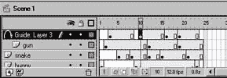
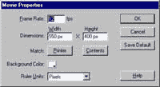
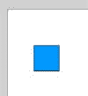

# 闪光灯 101–第二部分:灯光、相机、闪光灯！

> 原文：<https://www.sitepoint.com/lights-camera-flash/>

 ****##### 接下来…** 

[上次在](http://www.webmasterbase.com/article/707)中，我带您参观了 Flash 工具箱，并向您展示了如何使用 Flash 5.0 中可用的各种绘图和绘画工具。这一次，我将近距离接触一些你在开始制作动画之前需要知道的东西，比如符号、框架和库。我还将解释 Flash 中可用的各种类型的动画，并引导您完成创建电影并将其导出到网站的过程。

翻译:哪儿也别去！

##### 整理时间表

现在，这可能会让你们这些刚接触动画世界的人感到惊讶，但是动画并不是凭空出现的。动画序列是通过将多个静态图像串在一起，并快速连续地显示它们而创建的。如果它们显示得足够快，运动的错觉足以愚弄人眼。

Flash 动画的工作方式大致相同。Flash 电影由多个帧(跨不同的“层”组织)组成，您可以查看、编辑、删除这些帧，或者对其内容进行其他操作。这种操作通过时间轴进行，时间轴是 Flash 工作区中最常用的组件之一。



当你第一次启动 Flash up 时，时间线通常出现在主工作区的上方(如果你愿意，你可以改变它的位置，尽管你为什么要这样做对我来说是一个谜。)如果你仔细观察，你会发现它实际上是由两种不同的东西组成的——层和框架。层沿时间轴的左侧垂直运行，而每个层中的帧沿时间轴从左到右水平运行。

##### 一份巨无霸和薯条，带走！

Flash 中的图层可以被最好地描述为一种组织元素的方法…不，放弃它。为了理解闪存层的概念，您只需简单地看一下您的普通巨无霸。巨无霸由几层组成——一层是肉，接着是一片生菜，接着是一层西红柿和洋葱，接着是一片奶酪，然后是……哦，你懂了。

每一层都可以独立于其他层进行移除和操作。闪存层和巨无霸都是如此。

新的 Flash 电影包含一个层；你想加多少就加多少。您还可以复制、重命名和删除层。为了修改一个层，您需要首先通过单击它来激活它(一个铅笔图标将出现在层上)。一旦该层处于活动状态，您就可以在其上绘制、绘制和操纵对象。

默认情况下，图层是透明的，您可以使用每个图层上的三个控制按钮来改变图层的可见性，“锁定”图层以防止对其进行更改，并将图层上的元素显示为轮廓(而不是填充)对象。


时间轴左下方的图标用于插入新层和删除现有层。


版权所有[梅龙菲尔](http://www.melonfire.com/)，2000 年。保留所有权利。

##### 诬陷！

每一层都由一个或多个帧组成，这些帧有两种类型——“常规”类型和“关键帧”类型。关键帧是动画中发生某些变化的帧，例如，对象从一点移动到另一点，或形状变形。

您可以通过出现在每个关键帧底部的黑点来区分关键帧和常规帧。


通过快捷菜单上的插入->关键帧命令，可以在时间轴的任何位置添加关键帧。关键帧之后的常规帧插入->将与该关键帧相同。

就像层一样，您可以复制、移动和删除帧和关键帧。删除关键帧时，它周围的帧保持不变。通过单击出现的快捷菜单上的清除关键帧选项，可以将关键帧转换为常规帧。

##### 用符号说话

Flash 最有趣的一点是它对“符号”的使用。

在 Flash 行话中，符号是可以在电影中的不同点反复使用的对象。元件的每个“实例”都可以独立于原始元件和电影中同一元件的其他实例进行操作，但是，由于您反复使用同一元件的实例，因此 Flash 文件的大小不会受到影响。

换句话说，符号是个好东西，应该尽可能地使用——尤其是当你发现自己在一部电影中一遍又一遍地使用同一个物体的时候。

符号可以有三种类型——图形、按钮或电影剪辑。目前，我将只处理图形符号——其他的将在本教程中讨论。

一旦创建了一个元件(稍后我将向您展示如何操作)，您就可以像编辑任何其他对象一样编辑它，或者创建它的多个实例以在您的电影中使用。您可以在不影响父符号的情况下操作特定符号的实例；但是，对父符号所做的更改将影响子实例。

您可以为单个 Flash 电影创建任意数量的符号，Flash 甚至为您提供了一种机制，通过其库工具来存储和查看当前电影中可用的所有符号。可以通过“窗口”->“库”菜单或键盘快捷键 Ctrl-L 来激活该库。


该库允许您预览每个符号，并可为您提供有关符号名称和类型、到目前为止符号的使用次数以及上次编辑日期的信息。它还允许您将符号分类到文件夹中以便于访问，其方式类似于 Windows 资源管理器。可以在不同的 Flash 电影之间共享库，Flash 还附带了许多包含常用符号的内置库。

版权所有[梅龙菲尔](http://www.melonfire.com/)，2000 年。保留所有权利。

##### 灯光，摄像机，开拍！

既然你知道了理论，是时候把它付诸实践了。在接下来的几页中，我将带您完成创建一个简单的 Flash 电影、导出它并将其嵌入到网页中的过程。除了用于创建动画的技术之外，这是用于创建任何 Flash 电影的典型过程。

如果您还没有这样做，请用一部新电影启动 Flash。Pop 打开修改->电影框，定义你要创建的电影的属性；这包括电影宽度和高度、背景颜色和帧速率等属性。



对于下一个示例，选择 300×300 像素的宽度和高度。让其他一切保持原样。

回到舞台上。选择第 1 层的第 1 帧，然后在工作区画一个方形框。用油漆桶工具填充你喜欢的颜色。



接下来，选择第 2 帧，并通过快捷菜单插入一个新的关键帧。

请注意播放头(时间线顶行的红色条)如何移动到第 2 帧，这表明第 2 帧现在是活跃帧。


选择你刚刚画的方框，向右移动几个像素。

对帧#3 到帧#5 重复此过程。

现在，在第 6 帧，插入一个新的关键帧，并将正方形向下移动几个像素。对第 7 帧到第 10 帧重复此过程。

此时，你已经创建了你的第一个动画序列——只是你还不知道而已。要测试它，选择控制->播放，或点击回车键。Flash 将通过连续显示每一帧来播放动画剪辑，您应该会看到类似这样的内容:

 <object classid="clsid:D27CDB6E-AE6D-11cf-96B8-444553540000" codebase="http://download.macromedia.com/pub/shockwave/cabs/flash/swflash.cab#version=5,0,0,0" align="center" width="300" height="300"><param name="movie" value="https://www.sitepoint.com/graphics/713x1.swf"><param name="loop" value="true"><param name="quality" value="high"><param name="bgcolor" value="#FFFFFF"><embed src="https://i2.sitepoint.com/graphics/713x1.swf" loop="" quality="high" bgcolor="#FFFFFF" align="center" width="300" height="300" type="application/x-shockwave-flash" pluginspage="http://www.macromedia.com/shockwave/download/index.cgi?P1_Prod_Version=ShockwaveFlash"></object> 

请注意，您可以通过“控制->循环回放”命令来循环播放片段。

此时，您应该知道您刚刚创建的是一个传统的逐帧动画，其中每一帧都是一个关键帧。这种技术您不会经常使用，因为 Flash 附带了强大的“补间”功能，可以自动生成动画剪辑的许多中间帧。补间动画，以及其他动画技巧和窍门，将在以后的文章中介绍。

现在，让我们给这部电影添加一些其他的东西。通过插入层按钮(时间轴的右下方)创建一个新层，双击铅笔图标命名为“点”(当你在它的时候，把层 1 的名字也改成“正方形”)。在新图层上选择第 1 帧，用圆形工具在右上角画一个圆。


接下来，选择第 2 帧，选择刚刚用箭头工具创建的圆，并将其移动到舞台上的另一个随机位置。对图层“dot”上的帧#3 到帧#10 重复此过程。当您播放该剪辑时，您将会看到类似这样的内容:

 <object classid="clsid:D27CDB6E-AE6D-11cf-96B8-444553540000" codebase="http://download.macromedia.com/pub/shockwave/cabs/flash/swflash.cab#version=5,0,0,0" align="center" width="300" height="300"><param name="movie" value="https://www.sitepoint.com/graphics/713x2.swf"><param name="loop" value="true"><param name="quality" value="high"><param name="bgcolor" value="#FFFFFF"><embed src="https://i2.sitepoint.com/graphics/713x2.swf" loop="" quality="high" bgcolor="#FFFFFF" align="center" width="300" height="300" type="application/x-shockwave-flash" pluginspage="http://www.macromedia.com/shockwave/download/index.cgi?P1_Prod_Version=ShockwaveFlash"></object> 

是的，如果你看太久，它会让你头疼。

版权所有[梅龙菲尔](http://www.melonfire.com/)，2000 年。保留所有权利。

##### 后期制作

这就是你的基本动画。这不是太令人印象深刻-但不要担心，我们会解决这个问题，因为我们继续前进，你学习新的动画技术。现在，让我们快速浏览一下当您的 Flash 电影完成并希望将其嵌入到网页中时会发生什么。

一旦您完成了对电影的处理，您需要将其导出为 SWF 文件。你可以通过文件->导出电影对话框来完成。


现在，让一切保持原样——默认设置在大多数情况下都可以——然后点击 OK。Flash 会将您的电影保存为. SWF 文件，以便嵌入到您的网页中。

现在，将以下代码行插入 HTML 页面:

```
<OBJECT classid="clsid:D27CDB6E-AE6D-11cf-96B8-444553540000"    

codebase="http://download.macromedia.com/pub/shockwave/cabs/flash/    

swflash.ca    

b#version=5,0,0,0"    

WIDTH=300 HEIGHT=300>    

<PARAM NAME=movie VALUE="x2.swf">    

<PARAM NAME=quality VALUE=high>    

<PARAM NAME=bgcolor VALUE=#FFFFFF>    

<EMBED src="x2.swf" quality=high bgcolor=#FFFFFF WIDTH=300 HEIGHT=300     

TYPE="application/x-shockwave-flash"    

PLUGINSPAGE="http://www.macromedia.com/shockwave/download/index.cg    

i?P1_Prod_    

Version=ShockwaveFlash"></EMBED>    

</OBJECT>
```

或者，您可以让 Flash 自动执行上述过程—选择“文件”->“发布”菜单命令，Flash 将创建一个包含您需要的代码的 HTML 模板。

“发布”菜单命令可以让你做更多的事情，而不仅仅是创建 HTML 模板——你应该使用它来看看你可以使用的各种选项。

##### 三角测量

最后，快速演示如何创建和使用符号。打开一个新的 Flash 电影，使用线条工具创建一个三角形。用颜色填充它。


现在选择它，并使用插入->转换为符号命令转换你的三角形为一个符号(或点击 F8 键)。您将被要求输入您的符号的名称和行为；由于该符号将被用作静态对象，选择“图形”作为行为，并将其命名为“三角形”。现在你应该可以在库中看到你的符号了——你可以通过点击 Ctrl-L 来检查。


现在，在库窗口处于活动状态时，将您的符号从库中拖放到您的工作区中。这样做，直到您的工作区域看起来像这样:


版权所有[梅龙菲尔](http://www.melonfire.com/)，2000 年。保留所有权利。

您看到的每个对象都是该元件的一个“实例”,这些实例可以在不影响父元件的情况下进行修改。要修改实例，请选择它并使用修改->实例菜单项来显示实例工具面板。在此面板中，您可以修改该符号特定实例的某些特征，特别是，效果面板允许您更改所选实例的颜色、透明度和亮度。您还可以使用“修改”->“变换”菜单项来缩放、旋转、倾斜和翻转对象实例。

在你完成了各种各样的三角形之后，你可能会得到这样的结果:


同样，如果你看一下这个库，你会发现原来的符号没有被改动——只有实例发生了变化。

但是，如果您希望将更改应用到元件的每个实例，则需要对元件本身进行更改。您可以通过右键单击库中的符号并选择编辑选项，或者通过单击屏幕右上角的编辑符号按钮来完成此操作。


Flash 将使您进入符号编辑模式，在该模式下，您可以编辑符号的形状、大小和其他属性。完成后，您可以通过单击屏幕右上角的编辑场景按钮返回工作区。

如果您在元件编辑模式下对元件进行了任何更改，这些更改将立即反映在舞台上的元件实例中。例如，尝试将您的三角形缩放到两倍大小，然后返回到舞台，您会看到元件实例的大小也增加了一倍。


请注意，实例的某些属性可能不会更改，您对特定实例所做的更改将尽可能保留。在上面的示例中，虽然每个实例的大小会随着元件大小的变化而变化，但每个实例的颜色和形状设置保持不变。

这就是本周的全部内容。在下一篇文章中，我将向您展示如何使用 Flash 的补间功能以及符号和实例来创建简单的运动和形状变形。

到时候见！

*注意:本文中的所有示例都已经在 Macromedia Flash 5.0 上测试过。这些示例仅用于说明，并不适用于生产环境。YMMV！*
<font size="1" color="#aaaaaa" face="Verdana,Arial,Helvetica">版权所有[梅龙菲尔](http://www.melonfire.com/)，2000 年。保留所有权利。</font>

## 分享这篇文章**