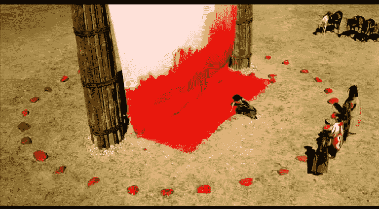
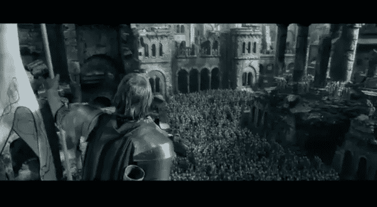
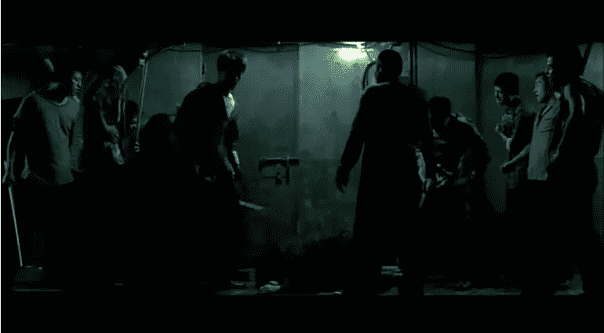

# 让你的静态图像惊艳的 3 种电影技巧

> 原文：<https://www.sitepoint.com/3-film-techniques-that-make-stunning-still-images/>

我们已经强调了一些设计师可以从他们观看的电影中学习的方法，但是摄影师呢？“电影”与摄影有明显的相似之处，影像专业人士可以从大屏幕上的影像中学到一两件事。

对于那些渴望磨练摄影技术的人来说，仔细研究你最喜欢的电影会有意想不到的结果。幸运的是，你不需要一个电影学位来获取一些线索。当试图了解是什么让一部电影拥有伟大的摄影技术时，分解特定的场景，甚至抓住静止的画面都是很好的练习。

对于那些没有意识到的人来说，电影摄影本质上是由几个基本元素组成的。这些包括有效的照明技术，颜色，焦点(或故意缺乏)，镜头构图，当然还有相机的运动，这里仅举几例。我不会依赖任何特定的电影术语，但我会给出基本的指导，告诉你如何运用电影技术让你成为更好的摄影师。你可能会注意到其中一些技术也可以应用到网页设计和插图中。

### 有意义的颜色

色彩在任何美学应用中都起着至关重要的作用，电影也不例外。动感和活力的引入并不能取代或替代谨慎、深思熟虑的色彩选择，这一概念在应用于摄影时并无不同。照片中的色彩量(或缺乏色彩)和活力激发了观众的情感反应和他们所观看的东西之间的关系。后期制作中使用的颜色数量和编辑方式会影响图像的意义和感觉。从电影到摄影的一个很好的例子是塔森·辛格的《秋天》(2006)。

毫无疑问，这部电影是电影般的美丽，具有引人入胜的故事情节，将黑暗的主题与孩子般的好奇融合在一起。地点、服装和其他视觉效果的使用完美地表达了这一点。这个特殊的场景(上图)只是几个非常强调色彩的镜头中的一个。

在故事的这一点上，主角揭示了他的另一个自我，“红色土匪”，他发现他的对手——“蓝色土匪”——被邪恶的“欧迪亚斯”谋杀了然后他开始立下血誓，发誓要消灭欧迪亚斯。红色(代表蓝色强盗的血)在大的风景背景下非常突出，并通过它在白色画布上的对比和流血得到进一步强调。红色在电影中可能会出现几次，但它并不是唯一出现的颜色。赤匪同伴的服装都是五颜六色的，在背景的映衬下，十分醒目。

当你拍摄彩色照片时，尽量使用充足的光线来突出你的色彩。突出的颜色引人注目，可以突出照片的各个方面，即使你使用较暗的颜色。如果你的颜色不像你希望的那样明亮，你可以在后期制作中纠正这一点，但是注意不要过分渲染颜色，否则这个过程会导致难看的结果。

### 动态角度

正面拍摄的照片和从倾斜角度拍摄的照片之间的差异，对于这样一个小小的美学选择来说，可以产生巨大的影响。如果你避免典型的、标准的姿势，观众可能会重复拍摄或看你的照片更久。你的主体也可以帮助你决定是否应该或不应该使用动态角度来增强图像。《指环王》三部曲中有数百个镜头是由动态角度组成的，所以让我们来看看彼得·杰克逊导演的《指环王:双塔》(2002)中的一个场景。

你们中的大多数人可能已经熟悉了无处不在的托尔金故事情节，以及创作这三部电影所付出的巨大复杂性和努力。在没有倾斜的平面上拍摄的标准镜头不足以捕捉这部史诗般的三部曲。

上面的场景可以在加长版中找到，因为它是从原版电影中剪下来的。在这里，博罗米尔(肖恩·宾)刚从奥斯吉力亚斯的胜利中走出来，在一个建筑物的顶上讲话。这个场景本质上是一个充满情感话语的胜利演讲，而相机的角度定位非常合适，不仅可以让你看到博罗米尔，还可以看到他的胜利军队的广角镜头。这个镜头是广阔的，它增加了情感场景的活力和深度。

如果你能够(从字面上)拍摄更多动态角度的照片，尝试一下，并考虑从彼得·杰克逊的书中吸取教训，为你的图像增加景深。如果你拍摄的风景和建筑照片已经在视觉上令人惊叹，那么它们会有特别大的好处。更抽象、艺术的人像也可以用一些非传统的角度来拔高。如果你工作的空间过于狭窄，无法进行实验，试着降低或升高视角来弥补。

### 强烈的对比

无论你的作品是色彩鲜明还是没有色彩，你的照片都应该有强烈的对比。对比度可以作为光线或颜色的差异，但这两种技术都可以在图像中实现相同的特征区分。使用对比强烈的灯光和/或色彩可以将你的照片从平淡简单变成深邃、迷人的视觉效果。最基本的是，良好的对比可以将主体从前景和背景中分离出来。导演朴赞郁的《老男孩》(2003)是一部对比鲜明的好电影。

作为一部涉及黑暗主题的韩国悬疑惊悚片，《老男孩》采用鲜明的色彩和突出的对比是恰当的，这给了这部电影一种坚韧不拔的原始品质。虽然有些场景有时显得太暗，但这并不妨碍电影的美感。

这部电影中最值得注意的场景之一，走廊场景(花了三天时间拍摄了 17 个镜头才完成)是由一个未经编辑的镜头组成的。在这个场景中，主角吴大修(崔民硕)面对一群愤怒的暴徒，他们只有一把锤子作为唯一的武器。唯一的照明来自墙上的灯，这使得大部分走廊都笼罩在阴影中。尽管灯光刻意调暗，但每个演员都可以从其他演员和背景中分辨出来。

应该注意的是，在争吵的开始，一切都显得黑暗和沉重，但随着吴大修在走廊上稳步前进，同时与雇佣的匪徒作战，额外的光线逐渐开始使风景更加突出。这象征着吴大修即将取得胜利，并发现了他被监禁的原因。灯光和镜头组合让这个场景看起来像 2D——很像一部漫画小说——而且这个场景是用横向移动的手推车拍摄的，这表明了格斗视频游戏的影响，这种游戏在韩国非常流行。

请记住，你可以在自己的图片中同时使用光的对比和颜色的对比。尝试各种照明水平，不要害怕重新定位你的主题或相机来探索不同的照明。更改照片的曝光或 ISO 设置也有助于提高图像的对比度。使用对比色和照明可以很容易地改变最终图像的情绪。

### 结论

当你开始把电影元素分解成基本的技术时，你会发现它们可以多么容易地应用到其他媒体上，包括摄影和插图。下次你看一部对你有意义的电影时，试着回去看看那些你最喜欢的场景的剧照。解构这个镜头，思考是什么让这个场景如此伟大，然后尝试将它应用到你自己的图像作品中。你可能会发现这些技巧正在提高你的技能，帮助你定义自己的风格。

## 分享这篇文章