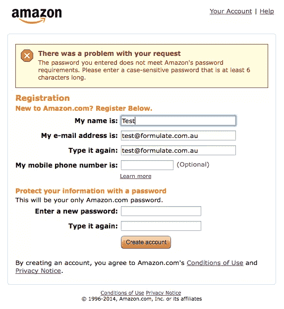
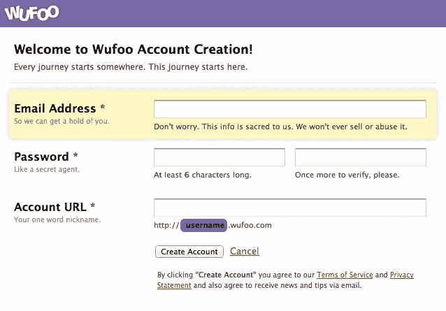
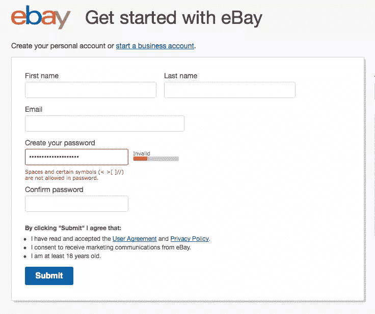
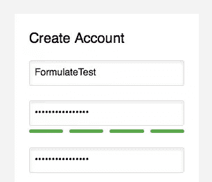
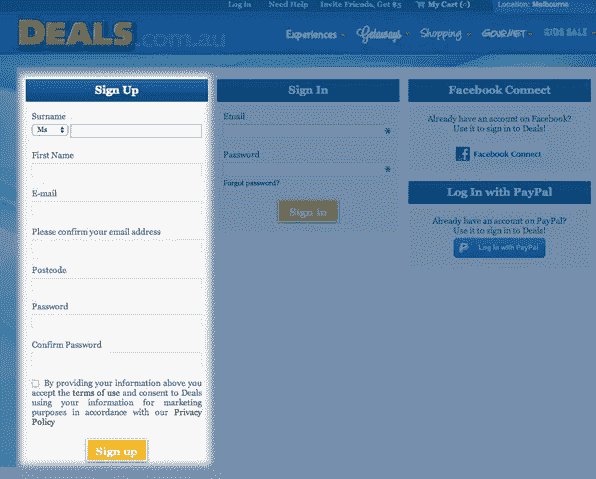
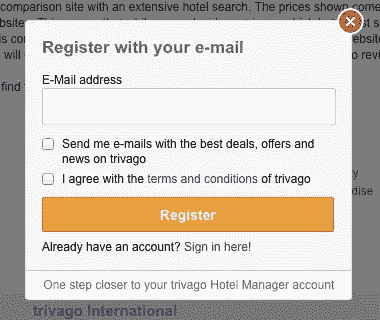

# 无痛账户 UX 的 3 条规则

> 原文：<https://www.sitepoint.com/3-rules-painless-account-ux/>

照片:汤姆·辛普森

在线账户给用户隐私、控制和个性化的体验(想象一下没有账户的脸书！).因此，帐户管理——注册和登录——是不可避免的。除了出错的时候，没有用户喜欢或者关心账户管理，他们只想访问服务。

你可以通过遵循三个小规则来减少账户管理的危害:

[1\. Don’t make the user guess](#dont-make-the-user-guess "Jump to: Don't make the user guess")

Almost every service on the web handles account management slightly differently. As a result, you have to be explicit about the requirements for your service. Otherwise, you’re just being cruel.

[2\. Balance security with usability](#balance-security-with-usability "Jump to: Balance security with usability")

Often, security folk will insist on an approach that compromises the user experience. This is foolish, because poor usability will lead to workarounds, and workarounds in turn lead to weakened security. Instead, aim for a design that is both secure and usable.

[3\. Keep it simple](#keep-it-simple "Jump to: Keep it simple")

Account management is one of your biggest potential barriers to usage. Make the barrier practically invisible through a simple, seamless, pain-free design.

让我们看看这三个规则如何应用于注册和登录。我们在下面讨论注册；登录将在随后的第二篇文章中讨论。

## 用户注册过程

### 规则 1:不要让用户猜测

*   如果用户必须在创建帐户之前进行验证，最好在开始之前警告用户。
*   让用户知道用户名是否是由服务自动设置的。
*   允许——但不要坚持——登录脸书或 Twitter 等第三方服务。
*   在需要输入这些信息之前，请说明对用户名或密码的任何要求[【1】](#footnote-1 "Jump to footnote.")。特别是，让用户知道:
    1.  对长度、字符、单词或短语有限制
    2.  空格和密码都是允许的
    3.  此类字段区分大小写。

#### 例子:做什么*不做什么*。

亚马逊直到提交表单后的*才解释其密码要求，并且选择的密码失败。写“区分大小写，最少 6 个字符”有多难在第一个密码栏下面？*

#### 示例:更好的方法。

Wufoo 在密码要求方面是公开透明的。

### 规则 2:平衡安全性和可用性

*   避免对用户名设置限制。
*   避免复杂的密码要求；这只会导致用户记下他们的密码和/或在多个服务中使用相同的密码。
*   如果你有一个密码强度表，确保它反映了最新的做法，否则根本没有。

#### 例子:做什么*不做什么*。

Ebay 最近遭遇了一次大规模数据泄露，其回应令人尴尬的糟糕——不允许使用密码短语(由空格分隔的几个单词)。然而，许多人认为密码短语是最实用、安全和可用的密码方法(例如，参见[【2】](#footnote-2 "Better passphrase technique")和[【3】](#footnote-3 "More on password strength"))。

#### 示例:更好的方法。

Envato 允许密码短语。我输入的口令是“这是一个短语”。

### 规则 3:保持简单

*   避免重复的字段(例如，要求输入两次密码)，而是提供一种简单(但安全)的方式来重置此类数据。(关于重复字段的更多信息，请参见[【4】](#footnote-4 "More about avoiding repeated fields"))。
*   询问创建帐户所需的信息；你可以以后再问其他的事情。
*   除非你真的需要，否则不要询问个人信息(如出生日期)。
*   内联验证很好，但是不要在用户有足够的时间输入数据之前进行。

#### 例子:做什么*不做什么*。

Deals.com.au 要求双重输入电子邮件*和*密码！

#### 示例:更好的方法。

Trivago 让事情变得非常简单。

* * *

请关注这篇文章的第二部分，登录，即将发表！

* * *

1.  Some security experts argue that you should not reveal password requirements to users, because it gives black-hat hackers clues. The problem with this argument, as I see it, is that requirements have to be revealed if the submitted password is invalid, so a black-hat hacker could expose the requirements simply by entering “p” or something equally unsatisfactory, submitting the form, and triggering the validation failure message.

    除此之外，我认为仅仅为了(温和地)挫败一小撮黑帽黑客而让大多数合法用户无法使用这种体验是疯狂的。最好通过其他方式实现安全。

2.  [密码的可用性](http://www.baekdal.com/insights/password-security-usability)
3.  [密码强度](http://xkcd.com/936/)
4.  [表单域的双重输入](http://formulate.com.au/articles/double-entry-form-fields/)

## 分享这篇文章