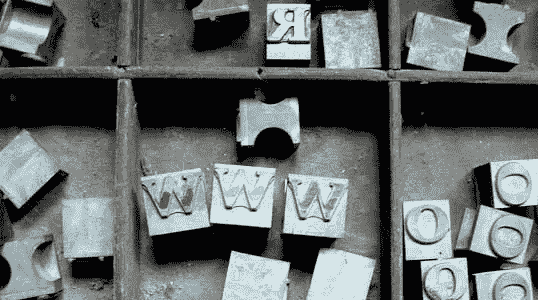
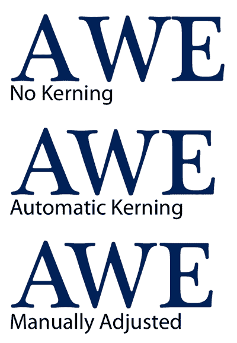
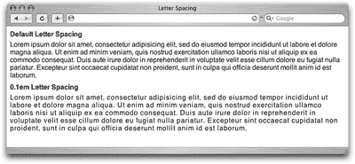
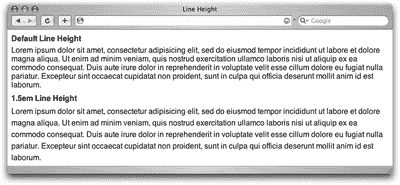
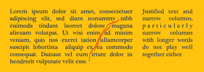

# 每个设计师都需要知道的 3 个文本间距原则

> 原文：<https://www.sitepoint.com/3-text-spacing-principles-every-designer-needs-to-know/>

许多排版决策都是基于间距。对于印刷字体来说，这一直是正确的，随着 CSS 的出现，它也适用于 web 字体。不管我们谈论的是使用印刷字体还是网页字体，有两个方向可以控制间距——水平方向和垂直方向。

### 水平间隔

**字距调整**和**字距调整**是你在关于水平字母间距的对话中经常听到的两个术语。字距调整是调整单个字母之间的间距的过程。通常，当您在打字时，您会注意到成对的字母看起来靠得太近或离得太远。大多数字体都有一套确定特定字符间距的规则。例如，字母“Wa”之间的字距应该比“WV”之间的字距窄得多大多数时候，字体规则足以使文本可读。如果没有，您可以在您选择的图像创建软件中调整单个字母对。

对于网页中的文本，不可能逐字母调整字距。您可以做的是调整`[letter-spacing](https://reference.sitepoint.com/css/letter-spacing "Look up the letter-spacing property in the SitePoint CSS Reference.")` CSS 属性，这在印刷界被称为调整字体的跟踪。像字距调整一样，字距调整字体之间的水平间距，但适用于每个字母之间的间距。如果您想让文字看起来更开阔、更自然，请尝试在字距值中增加一两个像素。图 4.9 显示了间距效应的一个例子。网页中的文本通常很紧凑，如图 4.9 所示，所以在这里指定一个负值可能会降低文本的可读性。

CSS 中的另一个水平间距选项由`[word-spacing](https://reference.sitepoint.com/css/word-spacing "Look up the word-spacing property in the SitePoint CSS Reference.")`属性提供。该属性可以采用正或负的长度，或者关键字`normal`。正如您所料，这个属性会影响单词之间的空格数量。

### 垂直线间距离

在印刷设计语言中，文本行之间的垂直空间被称为**前导**(发音与“铺垫”押韵)。这个术语来自活版印刷的早期，当时空白的铅条被用来分隔金属活字的线条。当没有额外的间隔时，这些线条被称为“实心的”增加了垂直间距的文本更容易阅读，但是正如你在图 4.10 的第一段中看到的，文本行之间的默认间距非常小。在图 4.10 的第二段中，我们调整了 CSS `line-height`属性:

`line-height: 1.5em;`

em 是一个 CSS 单位，它测量字体的大小，从字体的顶部高度到其最低下行线的底部。最初，em 等于大写字母 M 的宽度，这就是它的名字的由来。

### 文本对齐

你有没有注意到你在书籍和杂志中看到的文本经常是沿着页面或栏目的左右两边对齐的？这种类型的文本对齐被称为**对齐**。当文本对齐时，字母和单词的间距会自动调整，以便每行文本都有一个单词或字母与文本区域的左右边缘对齐。许多印刷设计师会对任何超过两行且不太窄的文本块使用对齐文本。通过将`text-alignment`属性设置为`justify`，可以用 CSS 对 Web 进行同样的文本处理。不过，在你开始为整个互联网辩护之前，让我给你两条关于文字辩护的警告:

一条河流穿过这里。

偶尔，一行中较宽的间距产生的间隙会与下一行中的间隙排成一行，下一行，下一行…最后你会得到你要的类型的峡谷或河流，如图 4.11 所示。这可能会分散读者的注意力。印刷设计师可以做出调整来解决这类问题，但在网络上，很难预测也不可能解决。

**什么？是吗？你呢。说什么？**

狭窄的柱子使河流问题变得更加严重。单词通常会被左右页边隔开，或者延伸到整个列的宽度。大多数文字处理程序通过在必要的地方用连字符连接单词来解决这个问题。浏览器不能做这种自动断字，所以网页设计者应该避免在狭窄的空间里使用两端对齐的文本。

如果您不想更改文本的文本对齐方式来调整，您的其他选项是左对齐、右对齐或居中对齐。当文本沿页面或栏的左边缘或右边缘居中或对齐时，字符和单词之间的间距保持不变。任何文本块都可能出现河流问题，但在居中或仅在一侧对齐的文本中，不太可能出现易读性问题。

如果你想看看一些 HTML 文本在应用了不同的行距、字距和对齐设置后会是什么样子，Marko Dugonji 的 [Typetester](http://typetester.maratz.com/) 是一个很好的工具。

Typetester 为您提供了一个界面，您可以将任何可以想到的文本选项应用于三列文本；然后，您可以并排比较这些显示器。一旦你有了一些你喜欢的设置，你可以点击工具标签来获得创建效果的 CSS。

你用什么样的文字间距技巧来提高你的设计？请在评论中分享它们。

## 分享这篇文章